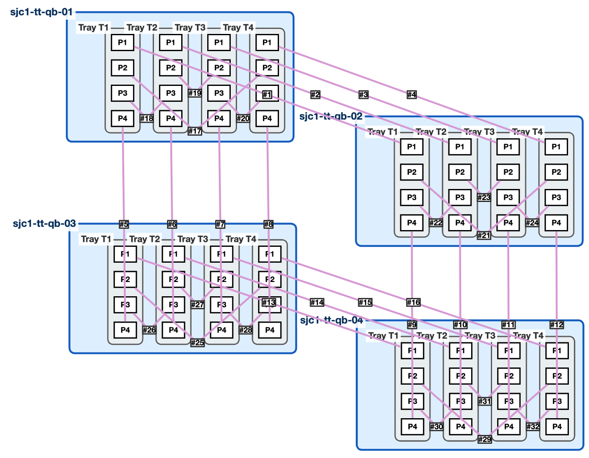
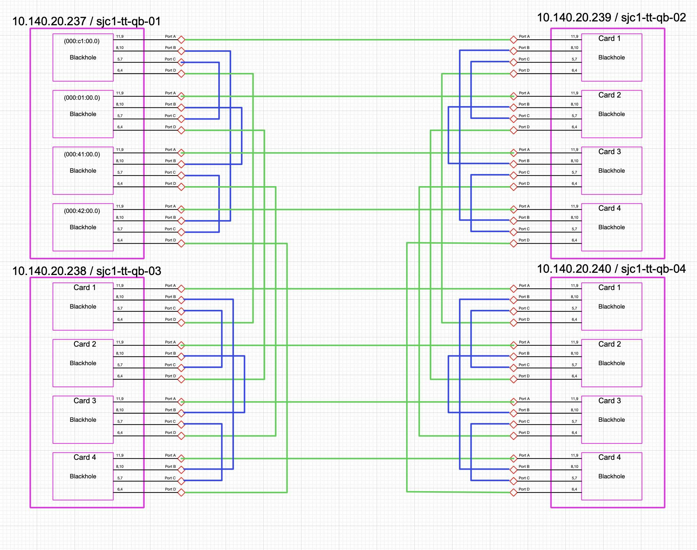
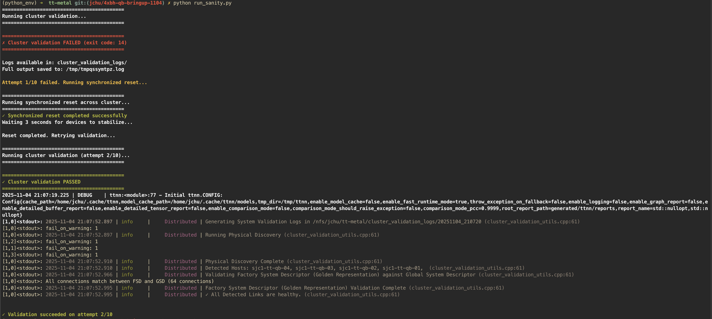

# 4x Multi-Node BH Quietbox System Cluster Bring-Up

This directory contains configuration files, test utilities, and documentation for bringing up and validating a 4x Blackhole (BH) Quietbox system cluster composed into a 4x4 mesh topology.

## Overview

### System Architecture

The cluster consists of:
- **4 BH Quietbox hosts**: `sjc1-tt-qb-01` through `sjc1-tt-qb-04`
- **16 P150 boards total**: 4 P150 boards per Quietbox (Tray IDs 1-4)
- **16 ASICs total**: 1 Blackhole ASIC per P150 board

### Physical Topology

Each P150 board has **4 QSFP ports** for internal/external connectivity:
- **Ports 1 & 4**: External connections between P150 boards on different hosts.
- **Ports 2 & 3**: Internal connections between P150 boards on same host.

Each QSFP port is connected to a pair of ethernet channels.

### Cabling Diagrams

#### ttCableGen Output


#### Cluster Cabling Diagram


### Host Mapping

The system maps MPI ranks to physical hosts as follows (from [`rankfile/4x4.txt`](rankfile/4x4.txt)):
- **Rank 0** → `sjc1-tt-qb-01`
- **Rank 1** → `sjc1-tt-qb-02`
- **Rank 2** → `sjc1-tt-qb-03`
- **Rank 3** → `sjc1-tt-qb-04`


### Mesh Graph Descriptors

Define logical mesh topologies for workload execution. Located in [`mesh_graph_descriptors/`](mesh_graph_descriptors/):

| File | Topology | Description |
|------|----------|-------------|
| `4x4_bh_mesh_graph_descriptor.textproto` | 4x4 Mesh | 16 devices, 2x2 hosts, basic 2D mesh |
| `4x4_bh_torus_xy_mesh_graph_descriptor.textproto` | 4x4 Torus-XY | 16 devices, 2x2 hosts, full torus with RING topology in both dimensions |
| `2x4_bh_mesh_graph_descriptor.textproto` | 2x4 Mesh | 8 devices, 1x2 hosts |
| `2x4_bh_torus_x_mesh_graph_descriptor.textproto` | 2x4 Torus-X | 8 devices, 1x2 hosts, torus in X dimension |
| `2x2_bh_mesh_graph_descriptor.textproto` | 2x2 Mesh | 4 devices, 1x2 hosts |

## Directory Structure

```
tests/scale_out/4x_bh_quietbox/
├── README.md                          # This file
├── CMakeLists.txt                     # Build configuration
├── test_sanity.cpp                    # System health tests
├── cabling_descriptors/               # Physical cabling topology
│   └── 4x_bh_quietbox.textproto
├── deployment_descriptors/            # Host deployment information
│   └── 4x_bh_qb_p150_deployment.textproto
├── factory_system_descriptors/        # Generated system configuration
│   └── factory_system_descriptor_4x_bh_quietbox.textproto
├── global_system_descriptors/         # Discovered physical system state
│   └── 4x_bh_quietbox_physical_desc.yaml
├── mesh_graph_descriptors/            # Logical mesh topologies
│   ├── 2x2_bh_mesh_graph_descriptor.textproto
│   ├── 2x4_bh_mesh_graph_descriptor.textproto
│   ├── 2x4_bh_torus_x_mesh_graph_descriptor.textproto
│   ├── 4x4_bh_mesh_graph_descriptor.textproto
│   └── 4x4_bh_torus_xy_mesh_graph_descriptor.textproto
├── rank_bindings/                     # MPI rank to mesh mappings
│   ├── 2x4.yaml
│   └── 4x4.yaml
├── rankfile/                          # MPI rankfile configurations
│   ├── 2x4.txt
│   └── 4x4.txt
└── images/                            # Documentation images
    └── cablegen.png                   # Emitted cabling visualization from ttCableGen tool
    └── port-cabling.png               # Physical cabling diagram
```

## Getting Started

Let's make sure we have a healthy 4xBH QB system with all connected ethernet links trained.

The following command will validate the cluster health and report any issues. If any issues are reported, the script will attempt to reset the system and retry the validation.

If you need to reset the system because of a failure, the same command should also be run to issue a distributed reset across all hosts.
```
python tests/scale_out/4x_bh_quietbox/validate_cluster_health.py
```

An example output of the validate_cluster_health.py script is shown below:


Once the system is healthy, you can run the following sanity test which executes a 4x4 big-mesh sanity test.
This test will instantiate a 4x4 mesh with 2D-torus topology and perform a sanity test on the mesh.
```
./tests/scale_out/run_tests.sh
```
