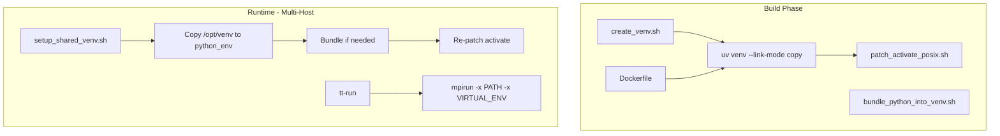

# Hermetic Virtual Environment for Multi-Host

This document describes the hermetic Python virtual environment design used for NFS, OpenMPI, and shared workspace scenarios in TT-Metal/TTNN multi-host clustering.

## Overview

The hermetic venv design enables:

- **Relocatable venvs** that work when copied from `/opt/venv` (Docker) to `./python_env` (shared NFS)
- **POSIX sh compatibility** for `activate` (Docker/CI often use `/bin/sh`)
- **Multi-host consistency** when multiple nodes access the same workspace via NFS

## Architecture



## When to Use `--bundle-python` vs `--link-mode copy`

| Scenario | Recommendation |
|----------|----------------|
| **CI/Docker** | `--link-mode copy` in Docker build. `setup_shared_venv.sh` invokes `bundle_python_into_venv.sh`, which skips if Python is already a real binary (not a symlink). |
| **Release models, NFS-only** | Use `--bundle-python` when creating the venv if the venv will be copied to NFS and hosts do not share the same Python installation path. |
| **SLURM multi-host** | Typically `--link-mode copy` is sufficient when `UV_PYTHON_INSTALL_DIR` points to a shared path (e.g., `/usr/local/share/uv`) accessible from all nodes. |

## Venv Activation for Multi-Host

### The `eval` Pattern

To activate the shared venv in the caller's shell:

```bash
eval "$(./tests/scripts/multihost/setup_shared_venv.sh --activate)"
```

**Why `eval`?** Environment changes made in a subshell (e.g., `source activate`) do not propagate to the parent. The `--activate` flag outputs shell commands that, when evaluated in the current shell, set `VIRTUAL_ENV` and `PATH` correctly.

### Correct Usage

```bash
eval "$(./tests/scripts/multihost/setup_shared_venv.sh --activate)"
# Now PATH and VIRTUAL_ENV are set in this shell
tt-run ... pytest ...
```

When `--activate` is used, diagnostics go to stderr so stdout remains clean for `eval`.

## CI Bundling Note

CI uses `--link-mode copy` in Docker and does not run `--bundle-python`. The behavior depends on uv's implementation: with `--link-mode copy`, uv may create real copies of the Python interpreter. `setup_shared_venv.sh` invokes `bundle_python_into_venv.sh`, which skips bundling if Python is already a real binary. For release artifacts or NFS-only setups where hosts lack a shared Python path, use `--bundle-python` when creating the venv.

## UV_PYTHON_INSTALL_DIR

For system installs of uv, set `UV_PYTHON_INSTALL_DIR` to a shared path (e.g., `/usr/local/share/uv`) so Python is accessible when the venv is copied to NFS:

```bash
export UV_PYTHON_INSTALL_DIR=/usr/local/share/uv
uv python install 3.10
```

See `scripts/install-uv.sh` for the post-install message with full details.

## Components in This Directory

| Script | Purpose |
|--------|---------|
| `setup_shared_venv.sh` | Copies `/opt/venv` to `./python_env`, bundles if needed, re-patches activate |
| `run_dual_galaxy_tests.sh` | Dual galaxy multi-host tests |
| `run_quad_galaxy_tests.sh` | Quad galaxy multi-host tests |
| `run_dual_t3k_tests.sh` | Dual T3K multi-host tests |

## Related Components (repo root)

| Component | Purpose |
|-----------|---------|
| `create_venv.sh` | Creates venv with `uv venv --link-mode copy --relocatable`, runs `patch_activate_posix.sh` |
| `scripts/patch_activate_posix.sh` | Patches `activate` for POSIX sh (adds fallback when `SCRIPT_PATH` is empty) |
| `scripts/bundle_python_into_venv.sh` | Deep-copies Python interpreter into venv for NFS portability (Linux only) |
