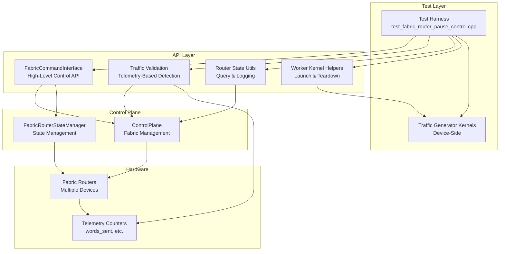
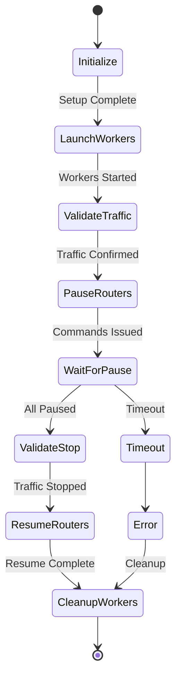
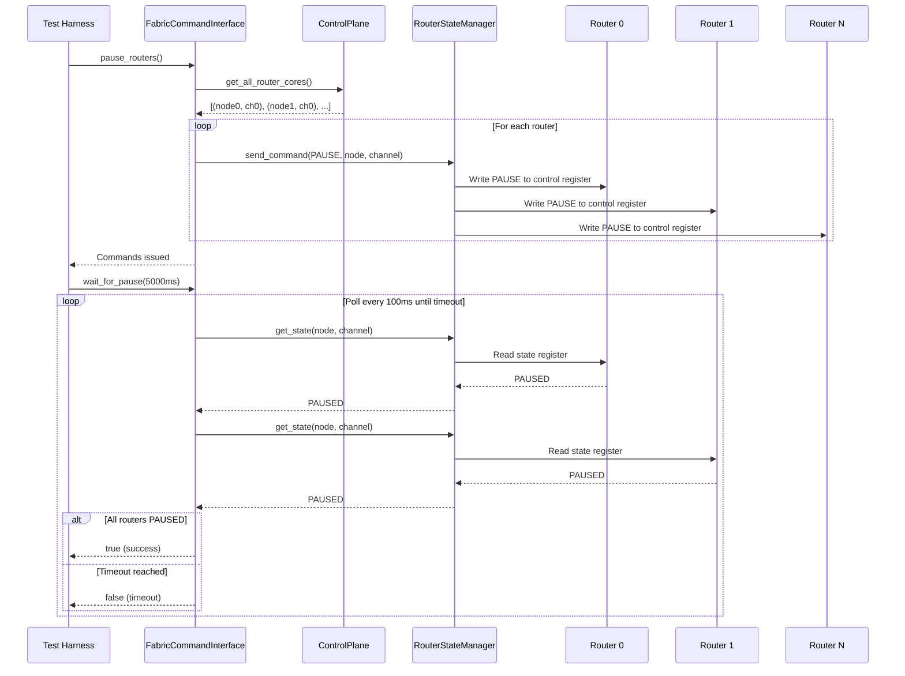
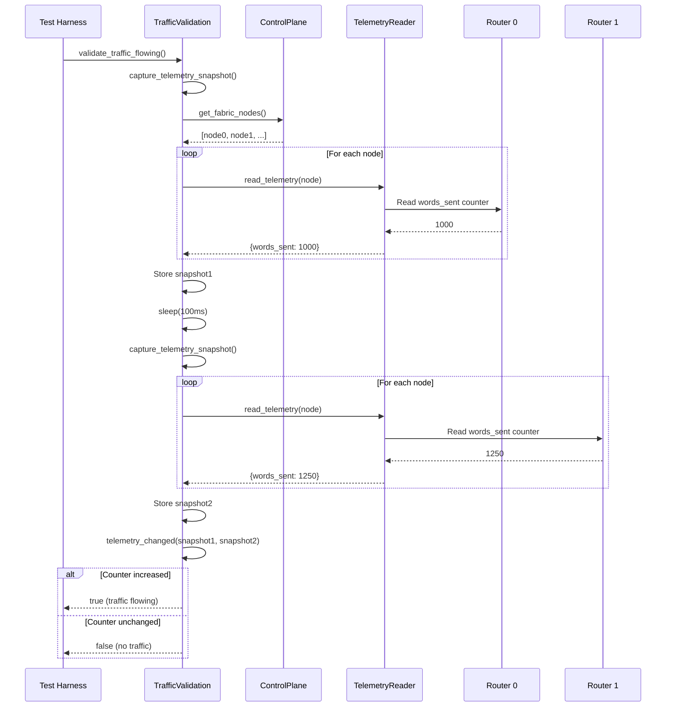
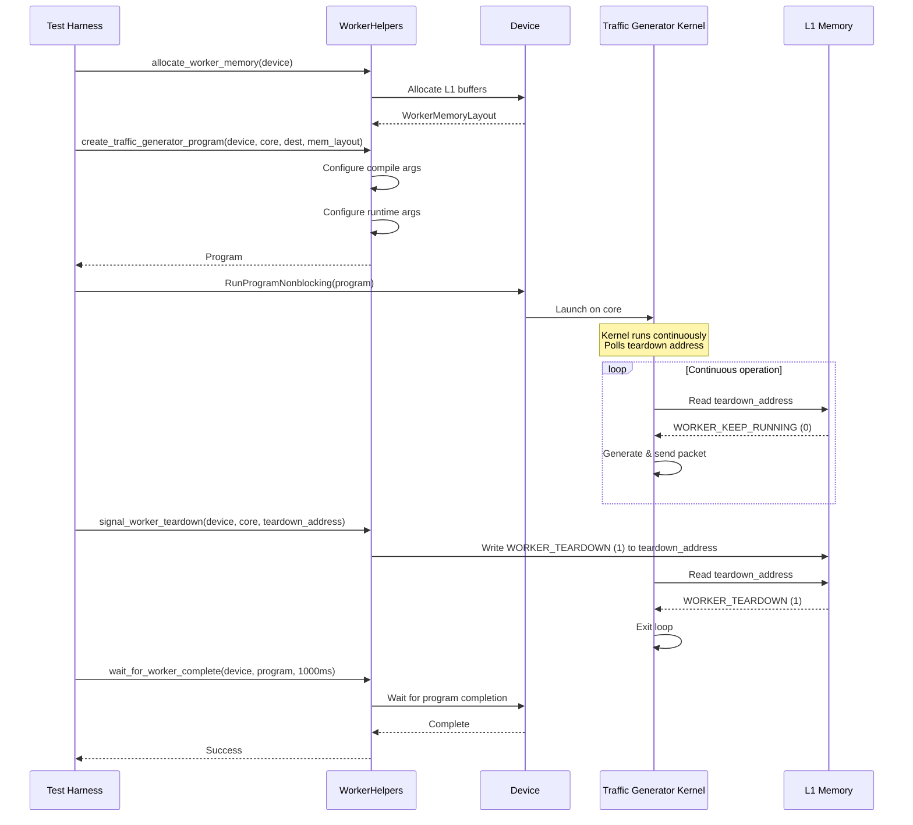
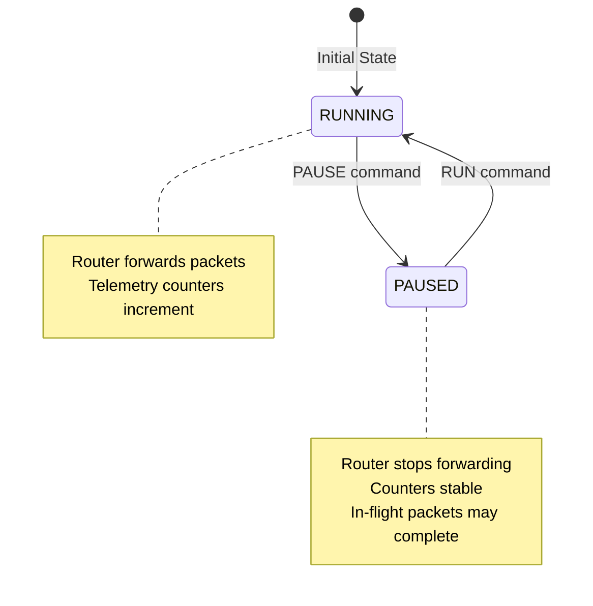
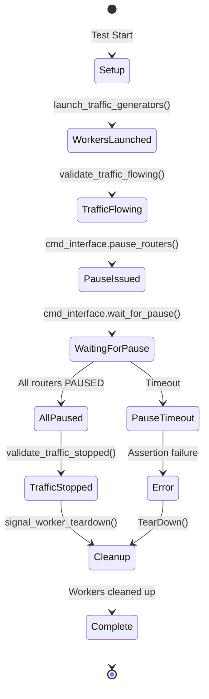
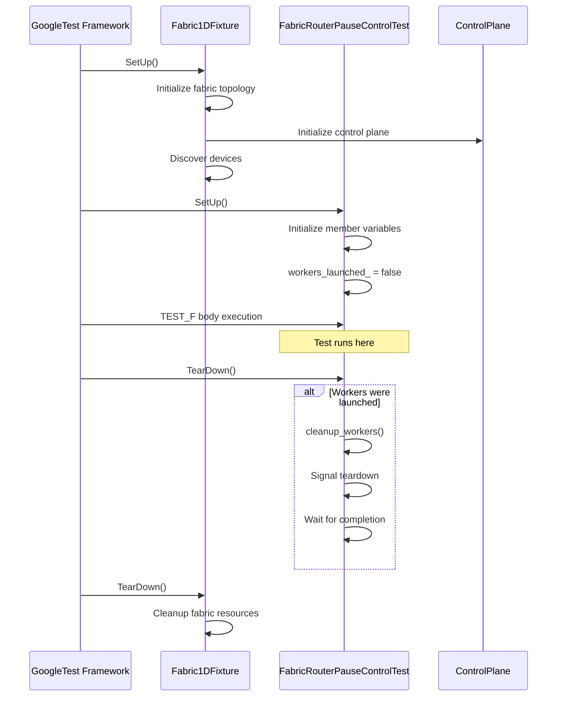
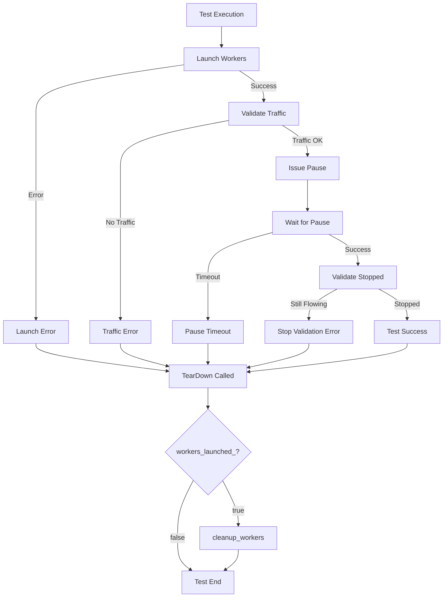

# Fabric Router Pause/Resume Architecture

## System Overview

The fabric router pause/resume feature provides runtime control over packet forwarding in the TT-Metal fabric network. This document describes the architecture, component interactions, and implementation details.

## High-Level Architecture



## Component Architecture

### Layer 1: Test Harness

The test harness orchestrates the complete test lifecycle:



### Layer 2: API Components

#### FabricCommandInterface

High-level abstraction for router control operations.

**Responsibilities:**
- Query active routers from control plane
- Issue pause/resume commands to all routers
- Poll router state until target state reached
- Provide timeout detection

**Key Methods:**
- `pause_routers()`: Issue PAUSE command to all routers
- `resume_routers()`: Issue RUN command to all routers
- `wait_for_pause()`: Poll until all routers PAUSED or timeout
- `all_routers_in_state()`: Check if all routers in expected state

#### Traffic Validation

Telemetry-based traffic detection for validation.

**Responsibilities:**
- Capture telemetry snapshots at different times
- Compare snapshots to detect traffic changes
- Provide validation predicates for test assertions

**Key Methods:**
- `capture_telemetry_snapshot()`: Read all telemetry counters
- `telemetry_changed()`: Compare two snapshots
- `validate_traffic_flowing()`: Assert traffic is active
- `validate_traffic_stopped()`: Assert traffic is stopped

#### Router State Utils

Observability and debugging utilities.

**Responsibilities:**
- Query router state across fabric
- Log detailed state information
- Aggregate state statistics

**Key Methods:**
- `log_all_router_states()`: Print all router states
- `count_routers_by_state()`: Aggregate counts by state
- `router_state_to_string()`: Convert enum to string

#### Worker Kernel Helpers

Management of device-side traffic generator kernels.

**Responsibilities:**
- Allocate L1 memory for worker kernels
- Create and configure kernel programs
- Launch kernels on device cores
- Signal graceful teardown

**Key Methods:**
- `allocate_worker_memory()`: Allocate L1 addresses
- `create_traffic_generator_program()`: Build kernel program
- `signal_worker_teardown()`: Write to teardown mailbox
- `wait_for_worker_complete()`: Block until kernel exits

### Layer 3: Control Plane

The control plane provides the core infrastructure for fabric management.

**Provided by TT-Metal Core:**
- Fabric topology discovery
- Router enumeration
- Telemetry reader interface
- FabricRouterStateManager integration

### Layer 4: Hardware

Physical fabric routers and telemetry infrastructure.

## Data Flow Diagrams

### Pause Command Flow



### Traffic Validation Flow



### Worker Kernel Management



## State Machine

### Router State Transitions



### Test State Machine



## Component Interactions

### Initialization Sequence



### Error Handling Flow



## Memory Layout

### Worker Kernel L1 Memory

```
L1 Address Space:
+-----------------------------------+
| Source Buffer                      |
| (Packet payload data)             |
| Size: packet_payload_size_bytes   |
| Address: source_buffer_address    |
+-----------------------------------+
| Teardown Signal                   |
| (Single uint32_t)                 |
| Values: 0=KEEP_RUNNING, 1=TEARDOWN|
| Address: teardown_signal_address  |
+-----------------------------------+
| Other kernel data...              |
+-----------------------------------+
```

### WorkerMemoryLayout Structure

```cpp
struct WorkerMemoryLayout {
    uint32_t source_buffer_address;      // Base of source buffer
    uint32_t teardown_signal_address;    // Teardown mailbox
    uint32_t packet_payload_size_bytes;  // Size of packets
};
```

## Telemetry Architecture

### Telemetry Snapshot Structure

```cpp
struct TelemetrySnapshot {
    // Map: FabricNodeId -> (channel_id -> words_sent_count)
    std::map<FabricNodeId, std::map<chan_id_t, uint64_t>> words_sent_per_channel;
};
```

### Traffic Detection Algorithm

```
Algorithm: validate_traffic_flowing()
1. snapshot_before = capture_telemetry_snapshot()
2. sleep(sample_interval)  // Default: 100ms
3. snapshot_after = capture_telemetry_snapshot()
4. return telemetry_changed(snapshot_before, snapshot_after)

Algorithm: telemetry_changed()
For each (node, channel) in both snapshots:
    if snapshot_after[node][channel] > snapshot_before[node][channel]:
        return true  // Traffic detected
return false  // No traffic
```

## Performance Considerations

### Pause Latency Breakdown

```mermaid
gantt
    title Pause Operation Timeline
    dateFormat X
    axisFormat %L ms

    section Command Phase
    Issue Commands :milestone, 0, 0
    Command Propagation :10, 50

    section Router Phase
    Router Processing :50, 100
    State Transition :100, 150

    section Verification Phase
    First State Poll :150, 200
    Confirmation :200, 250

    section Total
    Complete :milestone, 250, 250
```



Typical timeline:
- Command issue: < 10ms
- Command propagation to routers: 10-50ms
- Router state transition: 50-150ms
- State polling and confirmation: 50-100ms
- **Total typical latency: 200-400ms**

### Polling Strategy

```
Wait Loop Configuration:
- poll_interval: 100ms (configurable)
- timeout: 5000ms (configurable)
- max_iterations: timeout / poll_interval = 50

Per-iteration cost:
- State query per router: ~1-5ms
- Total per iteration (N routers): N * 5ms
- Sleep: 100ms
- Iteration total: ~100-150ms
```

## Scalability

### Device Scaling

The architecture scales linearly with device count:

```
Operation Complexity:
- pause_routers(): O(N) where N = number of routers
- wait_for_pause(): O(N * M) where M = number of poll iterations
- validate_traffic_flowing(): O(D) where D = number of devices

Memory:
- Telemetry snapshots: O(N * C) where C = channels per router
- Worker programs: O(W) where W = number of workers
```

### Multi-Mesh Support

The implementation supports multiple meshes:

```cpp
// Single mesh
test_utils::log_all_router_states(control_plane, {mesh_id});

// Multiple meshes
auto all_mesh_ids = control_plane.get_user_physical_mesh_ids();
test_utils::log_all_router_states(control_plane, all_mesh_ids);
```

## Design Patterns

### Command Pattern

FabricCommandInterface implements the command pattern:

```
Command: pause_routers()
- Encapsulates pause operation
- Separates invocation from execution
- Supports undo via resume_routers()

Command: resume_routers()
- Reverse operation
- Returns system to original state
```

### Observer Pattern

Telemetry-based validation implements observer pattern:

```
Subject: Router telemetry counters
Observers: Traffic validation utilities
Notification: Counter value changes
Response: Update snapshot, compare, validate
```

### Template Method Pattern

Worker lifecycle follows template method pattern:

```
Template: Worker management
1. allocate_worker_memory()
2. create_traffic_generator_program()
3. RunProgramNonblocking()
4. signal_worker_teardown()
5. wait_for_worker_complete()

Each step is customizable but order is fixed
```

## Threading Model

The implementation is single-threaded with explicit waits:

```
Main Thread:
1. Launch workers (non-blocking kernel launch)
2. Issue pause commands (blocking control plane calls)
3. Poll for pause completion (sleep-based polling)
4. Validate traffic (blocking telemetry reads)
5. Cleanup workers (blocking wait)

No Concurrency:
- No shared mutable state between threads
- No need for locks or atomics
- Simple reasoning about execution order
```

## Error Recovery

### Failure Modes and Recovery

1. **Worker Launch Failure**
   - Detection: Program creation or launch throws exception
   - Recovery: TearDown skips cleanup if workers_launched_ is false
   - Cleanup: No cleanup needed if launch failed

2. **Pause Timeout**
   - Detection: wait_for_pause() returns false
   - Recovery: Test fails with assertion
   - Cleanup: TearDown still attempts worker cleanup

3. **Traffic Validation Failure**
   - Detection: validate_traffic_stopped() returns false during pause
   - Recovery: Test fails with assertion
   - Cleanup: TearDown ensures workers are cleaned up

4. **Worker Teardown Timeout**
   - Detection: wait_for_worker_complete() throws exception
   - Recovery: Exception is caught and logged
   - Cleanup: Continue cleanup of remaining workers

### Cleanup Guarantees

```cpp
void TearDown() override {
    // GUARANTEE: Always attempt cleanup, even if test fails
    if (workers_launched_) {
        cleanup_workers();
    }
    Fabric1DFixture::TearDown();
}
```

This ensures:
- Workers are always signaled to stop
- Device resources are released
- No leaked kernels or memory

## Future Enhancements

Potential improvements to the architecture:

1. **Asynchronous State Polling**
   - Replace sleep-based polling with event-driven notifications
   - Reduce latency and improve responsiveness

2. **Partial Pause Support**
   - Pause specific routers or channels
   - Enable more granular traffic control

3. **State History**
   - Track state transitions over time
   - Enable performance analysis and debugging

4. **Automatic Recovery**
   - Detect and recover from transient pause failures
   - Retry mechanisms with exponential backoff

5. **Multi-Level Pause**
   - PAUSE: Stop new packets
   - DRAIN: Complete in-flight packets
   - FREEZE: Hard stop everything

## References

### Component Files

- Test: `test_fabric_router_pause_control.cpp`
- Command Interface: `fabric_command_interface.{hpp,cpp}`
- Traffic Validation: `fabric_traffic_validation.{hpp,cpp}`
- Router State Utils: `fabric_router_state_utils.{hpp,cpp}`
- Worker Helpers: `fabric_worker_kernel_helpers.{hpp,cpp}`
- Definitions: `fabric_traffic_generator_defs.hpp`

### External Dependencies

- ControlPlane: `tt_metal/fabric/control_plane.hpp`
- FabricRouterStateManager: Core control plane component
- Fabric Telemetry: Hardware telemetry subsystem
- TT-Metal Core: Device management and program execution

### Design Documents

- Main README: `README_PAUSE_RESUME.md`
- API Documentation: See API_REFERENCE.md
- Usage Guide: See USAGE_GUIDE.md
