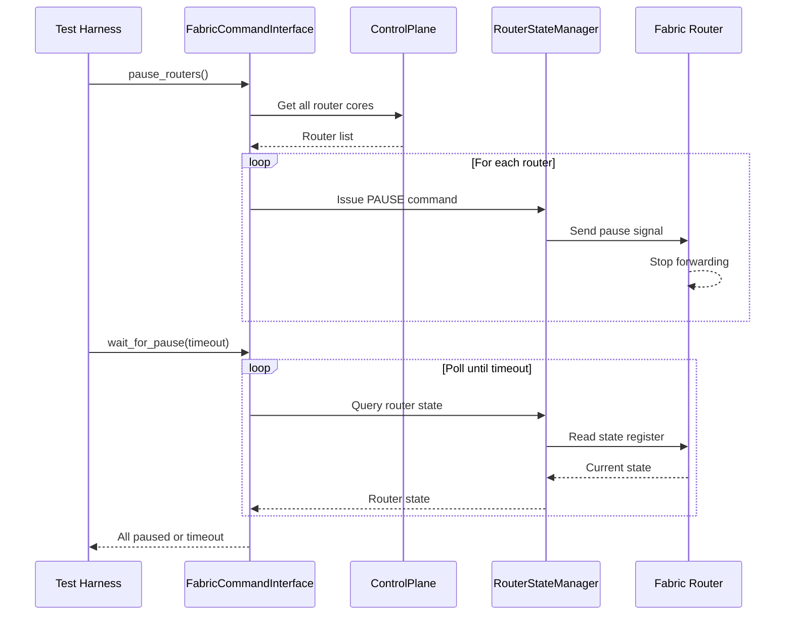

# Fabric Router Pause/Resume Control

## Overview

This document describes the fabric router pause and resume functionality, which provides runtime control over packet forwarding through the TT-Metal fabric network. This capability is critical for safe fabric state management, enabling controlled suspension and resumption of network traffic for operations such as debugging, reconfiguration, and fault recovery.

## Purpose

The fabric router pause/resume feature enables:

- **Traffic Control**: Stop and resume packet forwarding across the fabric network
- **Safe State Management**: Pause routers before reconfiguration or debugging operations
- **Debugging**: Freeze traffic to capture network state for analysis
- **Fault Recovery**: Isolate problematic routers while maintaining system stability
- **Testing**: Validate router behavior under controlled traffic conditions

## Architecture

### Components

The pause/resume implementation consists of several key components:

1. **FabricRouterStateManager**: Core control plane component that manages router state transitions
2. **FabricCommandInterface**: Test utility providing high-level control APIs
3. **Traffic Generator Kernel**: Device-side kernel for generating continuous traffic
4. **Traffic Validation Utilities**: Telemetry-based traffic detection and verification
5. **Router State Utilities**: State query and observability helpers

### State Model

Routers support the following states:

```
RUNNING  <----> PAUSED
```

- **RUNNING**: Router actively forwards packets
- **PAUSED**: Router stops forwarding new packets (packets in flight may still complete)

State transitions are initiated through control plane commands and complete asynchronously.

### Control Flow



## API Reference

### FabricCommandInterface

High-level API for controlling fabric routers.

#### Constructor

```cpp
explicit FabricCommandInterface(ControlPlane& control_plane);
```

Creates a command interface connected to the specified control plane.

**Parameters:**
- `control_plane`: Reference to the fabric control plane instance

#### pause_routers()

```cpp
void pause_routers();
```

Issues pause commands to all active routers in the fabric. This is a non-blocking operation; use `wait_for_pause()` to confirm completion.

**Postconditions:**
- Pause commands are queued to all routers
- Does not wait for state transition to complete

#### resume_routers()

```cpp
void resume_routers();
```

Issues resume (RUN) commands to all routers, returning them to normal packet forwarding operation.

**Postconditions:**
- Resume commands are queued to all routers
- Does not wait for state transition to complete

#### wait_for_pause()

```cpp
bool wait_for_pause(
    std::chrono::milliseconds timeout = DEFAULT_PAUSE_TIMEOUT);
```

Waits for all routers to enter the PAUSED state within the specified timeout.

**Parameters:**
- `timeout`: Maximum time to wait (default: 5000ms)

**Returns:**
- `true`: All routers entered PAUSED state before timeout
- `false`: Timeout occurred before all routers paused

**Performance:**
- Typical pause transition: < 500ms
- Timeout threshold: 5 seconds (NFR-1)

#### wait_for_state()

```cpp
bool wait_for_state(
    RouterStateCommon target_state,
    std::chrono::milliseconds timeout = DEFAULT_PAUSE_TIMEOUT,
    std::chrono::milliseconds poll_interval = DEFAULT_POLL_INTERVAL);
```

Generic method to wait for all routers to enter a specific state.

**Parameters:**
- `target_state`: The desired router state (RUNNING or PAUSED)
- `timeout`: Maximum wait time (default: 5000ms)
- `poll_interval`: Time between state checks (default: 100ms)

**Returns:**
- `true`: All routers reached target state
- `false`: Timeout occurred

#### all_routers_in_state()

```cpp
bool all_routers_in_state(RouterStateCommon expected_state);
```

Queries current state of all routers and checks if they match the expected state.

**Parameters:**
- `expected_state`: The state to check for

**Returns:**
- `true`: All routers are in the expected state
- `false`: One or more routers are in a different state

**Usage:**
Instant state check without waiting. Use this after `wait_for_pause()` succeeds to confirm final state.

#### get_router_state()

```cpp
RouterStateCommon get_router_state(
    const FabricNodeId& fabric_node_id,
    chan_id_t channel_id);
```

Queries the state of a specific router core.

**Parameters:**
- `fabric_node_id`: Fabric node identifier (mesh_id, logical_x, logical_y)
- `channel_id`: Router channel identifier

**Returns:**
- Current state of the specified router (RUNNING or PAUSED)

### Traffic Validation Utilities

Functions for detecting traffic flow through telemetry counters.

#### validate_traffic_flowing()

```cpp
bool validate_traffic_flowing(
    ControlPlane& control_plane,
    MeshId mesh_id,
    size_t num_devices,
    std::chrono::milliseconds sample_interval = DEFAULT_TRAFFIC_SAMPLE_INTERVAL);
```

Validates that traffic is actively flowing on at least one channel.

**Parameters:**
- `control_plane`: Control plane instance
- `mesh_id`: Mesh identifier to check
- `num_devices`: Number of devices in the mesh
- `sample_interval`: Time between telemetry samples (default: 100ms)

**Returns:**
- `true`: Traffic detected (words_sent counter increased)
- `false`: No traffic detected in sample interval

**Implementation:**
Takes two telemetry snapshots separated by `sample_interval` and compares `words_sent` counters.

#### validate_traffic_stopped()

```cpp
bool validate_traffic_stopped(
    ControlPlane& control_plane,
    MeshId mesh_id,
    size_t num_devices,
    std::chrono::milliseconds sample_interval = DEFAULT_TRAFFIC_SAMPLE_INTERVAL);
```

Validates that traffic has stopped on all channels.

**Parameters:**
- Same as `validate_traffic_flowing()`

**Returns:**
- `true`: No traffic detected (words_sent counters unchanged)
- `false`: Traffic still flowing

### Router State Utilities

Observability and logging functions for router state inspection.

#### log_all_router_states()

```cpp
void log_all_router_states(
    ControlPlane& control_plane,
    const std::vector<MeshId>& mesh_ids);
```

Logs the current state of all routers across specified meshes.

**Parameters:**
- `control_plane`: Control plane instance
- `mesh_ids`: Vector of mesh IDs to inspect

**Output Example:**
```
[INFO] === Router State Summary ===
[INFO] Mesh ID: 0
[INFO]   Device 0 Channel 0: RUNNING
[INFO]   Device 0 Channel 1: RUNNING
[INFO]   Device 1 Channel 0: PAUSED
...
```

**Usage:**
Provides observability for debugging test failures (NFR-5).

#### count_routers_by_state()

```cpp
std::map<RouterStateCommon, uint32_t> count_routers_by_state(
    ControlPlane& control_plane,
    const std::vector<MeshId>& mesh_ids);
```

Aggregates router state counts across the fabric.

**Parameters:**
- `control_plane`: Control plane instance
- `mesh_ids`: Vector of mesh IDs to count

**Returns:**
- Map of state to count: `{RUNNING: 4, PAUSED: 0}`

**Usage:**
Quick summary for validating expected fabric state.

#### router_state_to_string()

```cpp
const char* router_state_to_string(RouterStateCommon state);
```

Converts router state enum to human-readable string.

**Parameters:**
- `state`: Router state enum value

**Returns:**
- String representation: "RUNNING", "PAUSED", or "UNKNOWN"

### Worker Kernel Helpers

Utilities for managing traffic generator kernels on devices.

#### allocate_worker_memory()

```cpp
WorkerMemoryLayout allocate_worker_memory(
    const std::shared_ptr<tt_metal::distributed::MeshDevice>& device);
```

Allocates L1 memory addresses for worker kernel buffers.

**Returns:**
- `WorkerMemoryLayout` struct containing allocated addresses

#### create_traffic_generator_program()

```cpp
std::shared_ptr<tt_metal::Program> create_traffic_generator_program(
    const std::shared_ptr<tt_metal::distributed::MeshDevice>& device,
    const CoreCoord& logical_core,
    const FabricNodeId& dest_fabric_node,
    const WorkerMemoryLayout& mem_layout);
```

Creates a program containing the traffic generator kernel.

**Parameters:**
- `device`: Target device
- `logical_core`: Logical core coordinates for kernel placement
- `dest_fabric_node`: Destination node for generated packets
- `mem_layout`: Memory layout for buffers

**Returns:**
- Shared pointer to configured Program

#### signal_worker_teardown()

```cpp
void signal_worker_teardown(
    const std::shared_ptr<tt_metal::distributed::MeshDevice>& device,
    const CoreCoord& logical_core,
    uint32_t teardown_signal_address);
```

Signals a running worker kernel to terminate gracefully.

**Parameters:**
- `device`: Device running the worker
- `logical_core`: Core coordinates of the worker
- `teardown_signal_address`: L1 address to write teardown signal

**Operation:**
Writes `WORKER_TEARDOWN` (1) to the specified L1 address.

#### wait_for_worker_complete()

```cpp
void wait_for_worker_complete(
    BaseFabricFixture* fixture,
    const std::shared_ptr<tt_metal::distributed::MeshDevice>& device,
    tt_metal::Program& program,
    std::chrono::milliseconds timeout = std::chrono::milliseconds(1000));
```

Waits for a worker program to complete after teardown is signaled.

**Parameters:**
- `fixture`: Test fixture reference
- `device`: Device running the worker
- `program`: Worker program
- `timeout`: Maximum wait time (default: 1000ms)

**Throws:**
- Exception if worker does not complete within timeout

## Usage Examples

### Basic Pause/Resume Cycle

```cpp
#include "tests/tt_metal/tt_fabric/common/fabric_command_interface.hpp"

// Get control plane instance
auto& control_plane = tt::tt_metal::MetalContext::instance().get_control_plane();

// Create command interface
test_utils::FabricCommandInterface cmd_interface(control_plane);

// Pause all routers
cmd_interface.pause_routers();

// Wait for pause to complete (with 5 second timeout)
bool paused = cmd_interface.wait_for_pause();
if (paused) {
    log_info(LogTest, "All routers successfully paused");
} else {
    log_error(LogTest, "Pause timeout - some routers did not respond");
}

// Verify all routers are paused
assert(cmd_interface.all_routers_in_state(RouterStateCommon::PAUSED));

// Resume routers
cmd_interface.resume_routers();

// Wait for resume to complete
bool resumed = cmd_interface.wait_for_state(RouterStateCommon::RUNNING);
assert(resumed);
```

### Traffic Validation

```cpp
#include "tests/tt_metal/tt_fabric/common/fabric_traffic_validation.hpp"

auto& control_plane = tt::tt_metal::MetalContext::instance().get_control_plane();
MeshId mesh_id = 0;
size_t num_devices = 4;

// Validate traffic is flowing
bool flowing = test_utils::validate_traffic_flowing(
    control_plane, mesh_id, num_devices);

if (flowing) {
    log_info(LogTest, "Traffic confirmed flowing");
} else {
    log_warning(LogTest, "No traffic detected");
}

// After pausing...
cmd_interface.pause_routers();
cmd_interface.wait_for_pause();

// Validate traffic has stopped
bool stopped = test_utils::validate_traffic_stopped(
    control_plane, mesh_id, num_devices);
assert(stopped);
```

### Observability and Debugging

```cpp
#include "tests/tt_metal/tt_fabric/common/fabric_router_state_utils.hpp"

auto& control_plane = tt::tt_metal::MetalContext::instance().get_control_plane();
auto mesh_ids = control_plane.get_user_physical_mesh_ids();

// Log detailed router states
test_utils::log_all_router_states(control_plane, mesh_ids);

// Get aggregate counts
auto state_counts = test_utils::count_routers_by_state(control_plane, mesh_ids);
for (const auto& [state, count] : state_counts) {
    log_info(LogTest, "Routers in state {}: {}",
        test_utils::router_state_to_string(state), count);
}
```

### Complete Test Example

```cpp
#include <gtest/gtest.h>
#include "tests/tt_metal/tt_fabric/common/fabric_fixture.hpp"
#include "tests/tt_metal/tt_fabric/common/fabric_command_interface.hpp"
#include "tests/tt_metal/tt_fabric/common/fabric_traffic_validation.hpp"

TEST_F(Fabric1DFixture, MyPauseTest) {
    auto& control_plane = tt::tt_metal::MetalContext::instance().get_control_plane();
    auto mesh_ids = control_plane.get_user_physical_mesh_ids();
    ASSERT_FALSE(mesh_ids.empty());
    MeshId mesh_id = mesh_ids[0];

    size_t num_devices = get_devices().size();
    ASSERT_GE(num_devices, 2);

    // Launch traffic generators (implementation specific)
    launch_my_traffic_generators();

    // Validate initial traffic
    bool flowing = test_utils::validate_traffic_flowing(
        control_plane, mesh_id, num_devices);
    ASSERT_TRUE(flowing);

    // Pause and validate
    test_utils::FabricCommandInterface cmd_interface(control_plane);
    cmd_interface.pause_routers();

    bool paused = cmd_interface.wait_for_pause();
    ASSERT_TRUE(paused);

    // Verify traffic stopped
    bool stopped = test_utils::validate_traffic_stopped(
        control_plane, mesh_id, num_devices);
    ASSERT_TRUE(stopped);

    // Resume and validate
    cmd_interface.resume_routers();
    bool resumed = cmd_interface.wait_for_state(RouterStateCommon::RUNNING);
    ASSERT_TRUE(resumed);

    // Verify traffic resumes
    flowing = test_utils::validate_traffic_flowing(
        control_plane, mesh_id, num_devices);
    ASSERT_TRUE(flowing);

    cleanup_my_traffic_generators();
}
```

## Test Suite

### Test File

The main test suite is located at:
```
tests/tt_metal/tt_fabric/fabric_router/test_fabric_router_pause_control.cpp
```

### Running Tests

#### Basic Execution

```bash
# Run all pause/resume tests
TT_METAL_SLOW_DISPATCH_MODE=1 ./build/test/tt_metal/tt_fabric/fabric_router/test_fabric_router_pause_control
```

#### Run Specific Tests

```bash
# Run only the main pause test
./build/test/tt_metal/tt_fabric/fabric_router/test_fabric_router_pause_control \
    --gtest_filter=*PauseStopsTraffic*

# Run pause and resume tests
./build/test/tt_metal/tt_fabric/fabric_router/test_fabric_router_pause_control \
    --gtest_filter=*Pause*:*Resume*

# Run observability tests
./build/test/tt_metal/tt_fabric/fabric_router/test_fabric_router_pause_control \
    --gtest_filter=*Observability*
```

### Test Cases

| Test Name | Description |
|-----------|-------------|
| `PauseStopsTraffic` | Main end-to-end test: validates that pause command stops all traffic |
| `ResumeRestoresTraffic` | Validates that resume command restores traffic after pause |
| `PauseTimeoutDetection` | Tests timeout mechanism for detecting slow/failed pauses |
| `WorkerCleanupOnTestFailure` | Verifies that test teardown cleans up workers even on failure |
| `RouterStateTransitions` | Tests RUNNING -> PAUSED -> RUNNING state transitions |
| `ObservabilityLogging` | Validates logging and state query utilities |
| `MinimumConfiguration` | Tests pause/resume on minimum 2-device configuration |
| `LargerConfiguration` | Tests pause/resume on larger (4+) device configurations |

### Hardware Requirements

- Minimum 2 devices in 1D fabric topology
- Devices must support fabric protocol
- Fabric telemetry must be enabled in firmware build

### Environment Configuration

```bash
# Recommended for consistent timing
export TT_METAL_SLOW_DISPATCH_MODE=1
```

### Skip Conditions

Tests automatically skip if:
- Less than 2 devices available
- Telemetry is not available
- Specific configuration requirements not met

## Performance Characteristics

### Timing Expectations

| Operation | Typical | Maximum (Timeout) |
|-----------|---------|-------------------|
| Pause Transition | < 500ms | 5000ms |
| Resume Transition | < 500ms | 5000ms |
| Worker Teardown | < 100ms | 1000ms |
| Traffic Detection | < 200ms | N/A |

### Latency Measurement

The test harness automatically measures and logs pause transition latency:

```cpp
auto pause_start = std::chrono::steady_clock::now();
bool paused = cmd_interface.wait_for_pause();
auto pause_duration = std::chrono::steady_clock::now() - pause_start;

log_info(LogTest, "Pause transition took {} ms",
    std::chrono::duration_cast<std::chrono::milliseconds>(pause_duration).count());
```

## Troubleshooting

### "Traffic not detected before pause command"

**Symptoms:**
- Test fails with assertion: "Traffic not detected before pause command"

**Possible Causes:**
1. Worker kernels not generating traffic
2. Telemetry not being read correctly
3. Insufficient stabilization time
4. Devices not properly connected in fabric

**Solutions:**
1. Verify telemetry is enabled in firmware build
2. Check kernel launched successfully (look for launch errors in logs)
3. Increase stabilization delay before traffic check
4. Verify fabric topology configuration

### "Routers did not enter PAUSED state within timeout"

**Symptoms:**
- `wait_for_pause()` returns false
- Test fails after 5 second timeout

**Possible Causes:**
1. FabricRouterStateManager not initialized
2. Pause command not propagating to routers
3. Router firmware doesn't support pause protocol
4. Hardware communication issues

**Solutions:**
1. Verify FabricRouterStateManager is properly initialized
2. Check device firmware supports pause protocol (version requirements)
3. Look for errors in pause command propagation logs
4. Increase timeout if hardware is consistently slower
5. Check `log_all_router_states()` output to identify which routers failed to pause

### "Traffic detected during PAUSED state"

**Symptoms:**
- Test fails at traffic validation after pause
- Assertion: "Traffic detected during PAUSED state"

**Possible Causes:**
1. Race condition - validation started before pause complete
2. Incomplete pause across all routers
3. In-flight packets still being forwarded
4. Telemetry sampling interval too small

**Solutions:**
1. Verify `wait_for_pause()` completed successfully before traffic check
2. Check that all routers (not just some) entered PAUSED state
3. Increase delay between pause confirmation and traffic validation
4. Increase `sample_interval` in `validate_traffic_stopped()`
5. Use `log_all_router_states()` to identify which routers are still RUNNING

### "Worker kernel did not complete within timeout"

**Symptoms:**
- Exception during worker cleanup
- Error: "Worker X did not complete in time"

**Possible Causes:**
1. Kernel stuck in infinite loop
2. Teardown signal not received
3. L1 write to teardown address failed
4. Kernel not polling teardown signal

**Solutions:**
1. Verify teardown mailbox address is correct
2. Check kernel implementation polls teardown address
3. Ensure L1 write completed successfully (check device logs)
4. Increase worker timeout from default 1 second
5. Add debug logging in kernel to track teardown signal reception

### Performance Issues

**Symptoms:**
- Pause transitions consistently take > 1 second
- Intermittent timeouts

**Solutions:**
1. Check system load and resource contention
2. Verify no other tests running in parallel
3. Use `TT_METAL_SLOW_DISPATCH_MODE=1` for consistent timing
4. Check for firmware issues or outdated versions
5. Review telemetry counter update frequency

## Design Considerations

### Why Telemetry-Based Traffic Detection?

The implementation uses telemetry counters (`words_sent`) to detect traffic rather than examining packet payloads or using dedicated signaling. This approach provides:

- **Non-invasive**: Doesn't require modifying traffic patterns
- **Scalable**: Works across all routers simultaneously
- **Reliable**: Hardware counters are authoritative
- **Simple**: No complex protocol analysis needed

### Worker Kernel Protocol

Worker kernels use a simple mailbox protocol for teardown:

```
L1[teardown_address] = WORKER_KEEP_RUNNING (0)  // Normal operation
L1[teardown_address] = WORKER_TEARDOWN (1)      // Signal termination
```

Kernels poll this address and exit when teardown is signaled. This ensures:

- **Graceful Shutdown**: Kernels can complete in-flight operations
- **Predictable Timing**: Bounded termination time
- **Simple Implementation**: Single L1 read per iteration

### State Polling Strategy

The `wait_for_pause()` implementation uses polling rather than interrupts:

```cpp
while (elapsed < timeout) {
    if (all_routers_in_state(PAUSED)) return true;
    std::this_thread::sleep_for(poll_interval);
}
return false;
```

This provides:

- **Timeout Guarantees**: Bounded wait time
- **Simplicity**: No interrupt handling complexity
- **Flexibility**: Configurable poll interval
- **Testability**: Easy to verify timeout behavior

### Memory Allocation

Worker memory layout is allocated at runtime to avoid conflicts:

```cpp
struct WorkerMemoryLayout {
    uint32_t source_buffer_address;      // Source buffer for packets
    uint32_t teardown_signal_address;    // Mailbox for teardown signal
    uint32_t packet_payload_size_bytes;  // Packet size
};
```

This ensures each worker has isolated memory regions.

## Integration with CI

### Test Registration

The test is registered in the tt_fabric test suite and runs as part of:

- Fabric verification nightly runs
- Pre-merge validation for fabric changes
- Manual test execution via CTest

### CI Environment

CI uses the following configuration:

```bash
TT_METAL_SLOW_DISPATCH_MODE=1  # Consistent timing
```

### CTest Integration

Tests can be discovered and run via CTest:

```bash
# List all fabric router tests
ctest -N | grep FabricRouter

# Run pause control tests
ctest -R FabricRouterPauseControl -V
```

## Related Documentation

- Fabric Control Plane API: See `tt_metal/fabric/control_plane.hpp`
- FabricRouterStateManager: Core implementation of state management
- Fabric Telemetry: See telemetry reader API documentation
- Fabric Test Fixtures: See `tests/tt_metal/tt_fabric/common/fabric_fixture.hpp`

## References

### Implementation Files

- Test: `tests/tt_metal/tt_fabric/fabric_router/test_fabric_router_pause_control.cpp`
- Command Interface: `tests/tt_metal/tt_fabric/common/fabric_command_interface.{hpp,cpp}`
- Traffic Validation: `tests/tt_metal/tt_fabric/common/fabric_traffic_validation.{hpp,cpp}`
- Router State Utils: `tests/tt_metal/tt_fabric/common/fabric_router_state_utils.{hpp,cpp}`
- Worker Helpers: `tests/tt_metal/tt_fabric/common/fabric_worker_kernel_helpers.{hpp,cpp}`
- Definitions: `tests/tt_metal/tt_fabric/common/fabric_traffic_generator_defs.hpp`

### Changesets

Implementation was completed in changesets CS-001 through CS-008:

- CS-001: Project scaffolding and shared constants
- CS-002: FabricCommandInterface utility
- CS-003: Traffic generator kernel (device-side)
- CS-004: Traffic validation utilities
- CS-005: Router state query utilities
- CS-006: Worker kernel launch helpers
- CS-007: Test harness implementation
- CS-008: Integration testing and validation
- CS-009: Documentation (this document)

## Version History

- **v1.0** (2025-01-14): Initial implementation and documentation
  - Basic pause/resume functionality
  - Telemetry-based traffic validation
  - Comprehensive test suite
  - Full API documentation
