Multicast Schemes
=================

# Overview

The parameters used when performing a NoC multicast write operation can significantly affect performance (Bytes sent / cycle).

A set of tests that sweep through different configurations for these parameters have been performed and documented.

# Sweep Parameters

**Multicast Write Uses Loopback:** Yes, No

**NoC:** 0, 1

**Grid Dimensions (m x m):**
- WH: 2 to 7
- BH: 2 to 9

**Schemes:**

| Sender Inside Grid (1 - 4)        | Sender Outside Grid, Bottom Left Corner (5 - 7)   | Sender Outside Grid, Top Right Corner (8 - 10) |
|-----------------------------------|---------------------------------------------------|------------------------------------------------|
| 1: Top-Right Corner               | 5: Shared Row with Grid                           | 8: Shared Row with Grid                        |
| 2: Bottom-Right Corner            | 6: Shared Column with Grid                        | 9: Shared Column with Grid                     |
| 3: Bottom-Left Corner             | 7: Neither Row nor Column Shared with Grid        | 10: Neither Row nor Column Shared with Grid    |
| 4: Top-Left Corner                |                                                   |                                                |

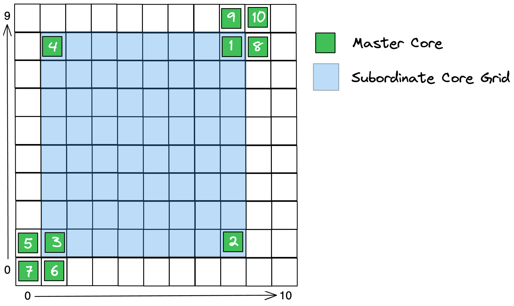

# Results

## Plots

### WORMHOLE
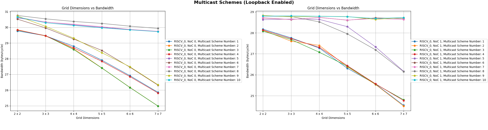
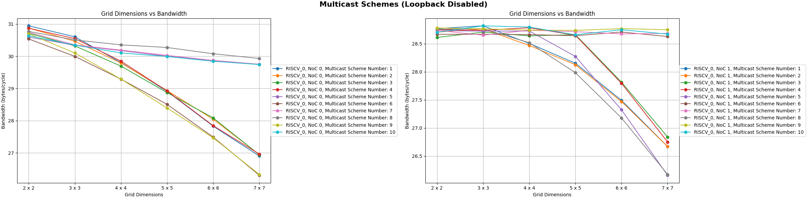

### BLACKHOLE
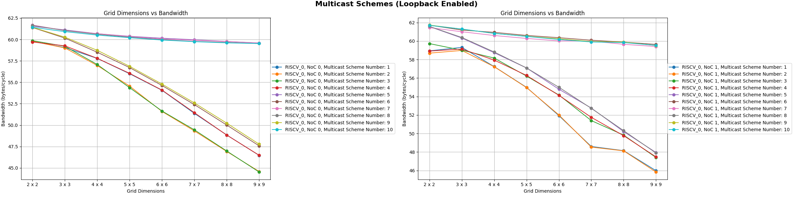
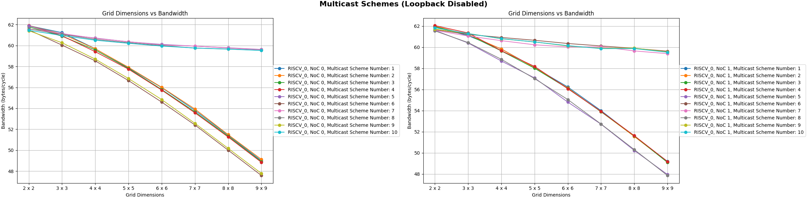

## Key Observations

- A **noticeable drop in performance** is observed when the sender is:
    - Inside the grid (1 - 4)
    - Outside the grid and
        - NoC 0: Shares a row with the grid (6, 9)
        - NoC 1: Shares a column with the grid (5, 8)
- For the **inside-the-grid cases** (1 - 4), **performance increases slightly** when the multicast writes are performed **without loopback**

## Investigative Results

The disproportionate decrease in performance occurs when the **congested acknowledge path occurs on a path in which multicast writes were performed**.
All schemes that experience a significant decrease in bandwidth with increasing subordinate grid size exhibit this phenomenon.

The congestion occurs agnostic of the virtual channel allocation. Although the multicast writes and write acknowledges occur on separate VCs, the congestion occurs because they still share the same physical links between routers.

Below are diagrams that visualize how this occurs depending on the physical NoC channel and the position of the master core relative to the subordinate grid. Specifically, schemes 5 and 6 are shown.
The first of each set of images displays only the multicast write paths while the second displays the subsequent write acknowledge paths.

|       | Congested path **is not** shared by both multicast writes and write acknowledges                      | Congested path **is** shared by both multicast writes and write acknowledges                      |
|-------|-------------------------------------------------------------------------------------------------------|---------------------------------------------------------------------------------------------------|
| NoC 0 | Scheme 5                                                                                              | Scheme 6                                                                                          |
|       | 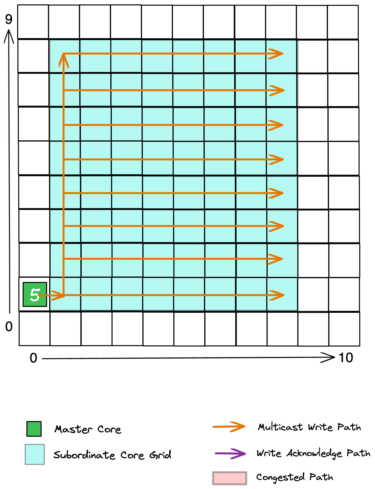                   | 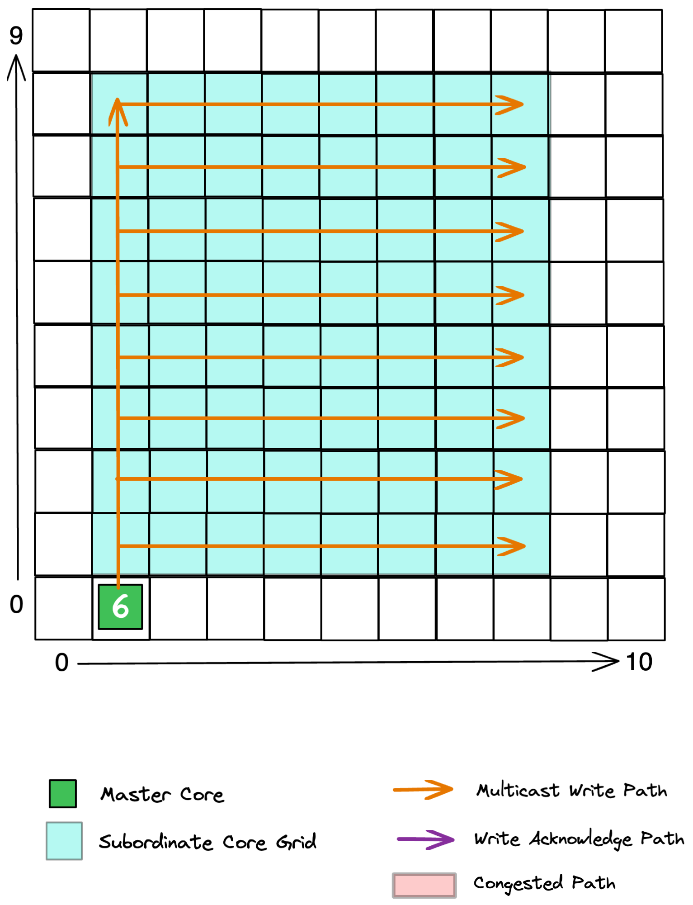               |
|       | 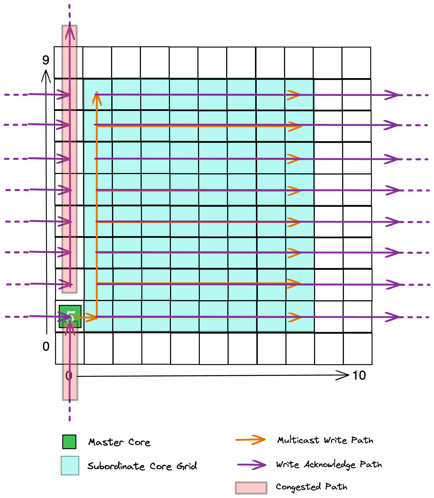                         | 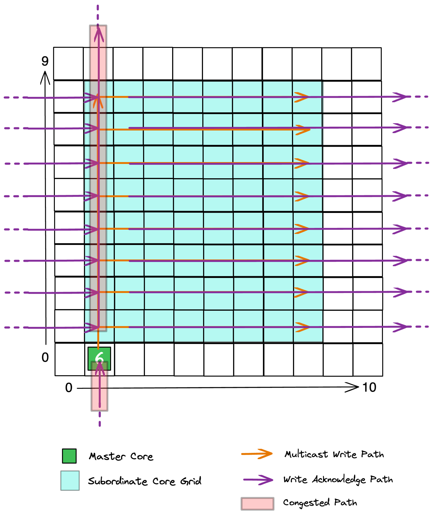                     |
| NoC 1 | Scheme 6                                                                                              | Scheme 5                                                                                          |
|       | 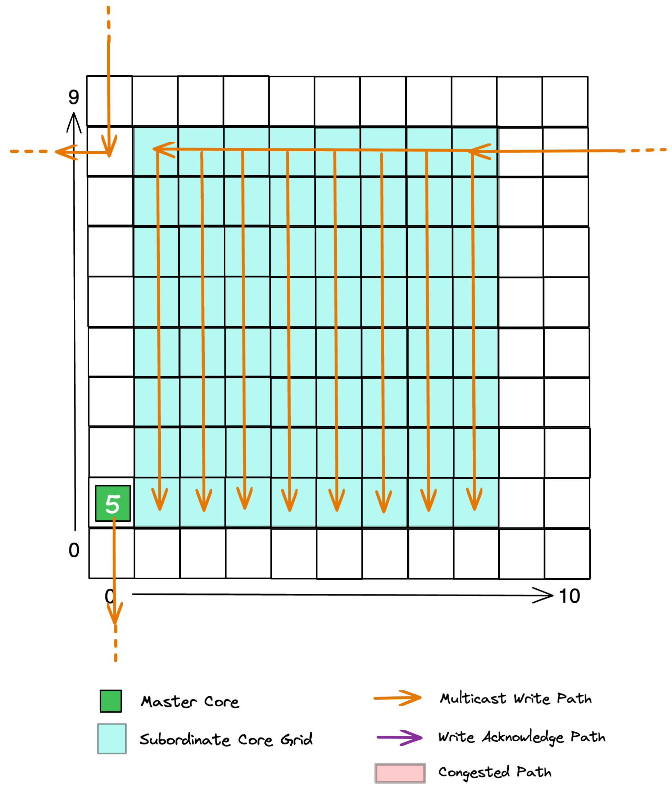                   | 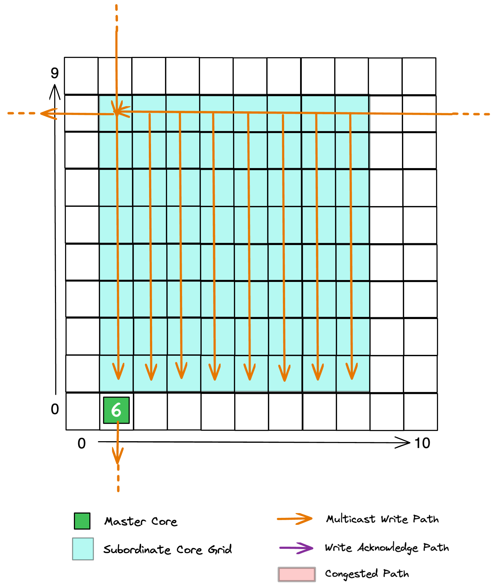               |
|       | 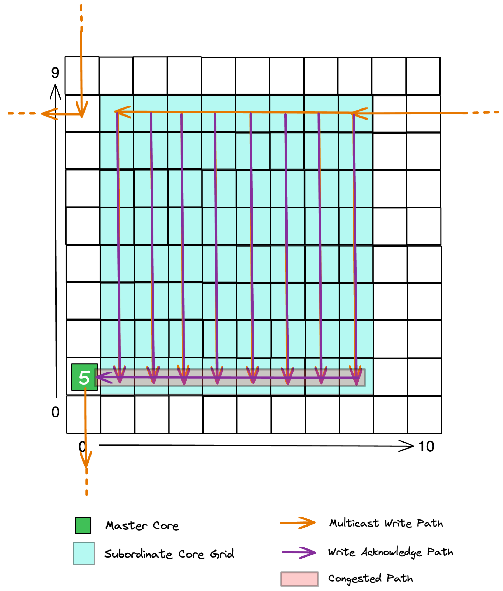                         | 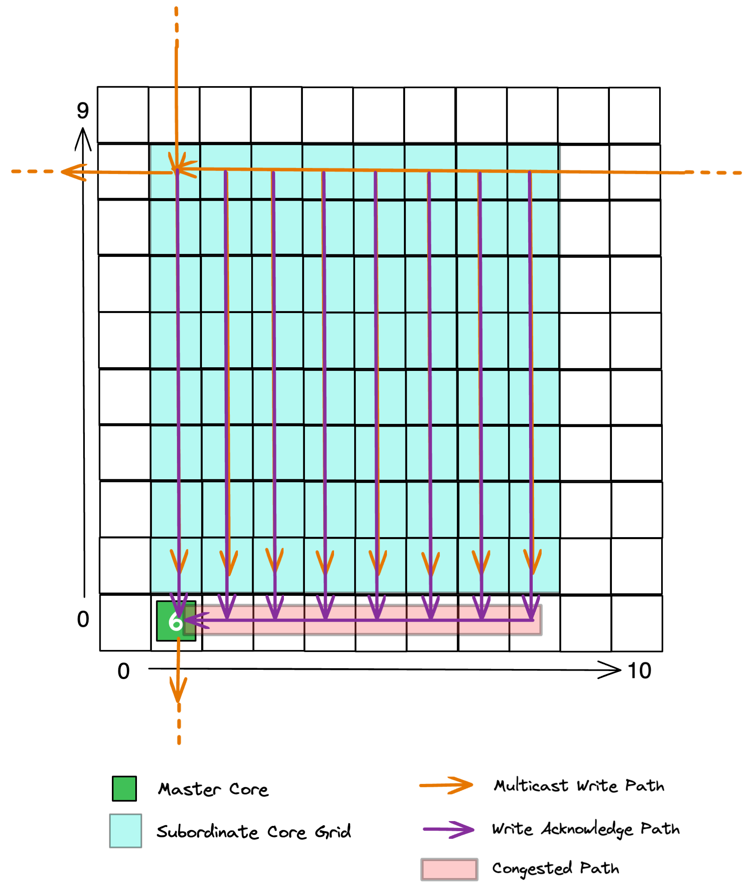                     |
