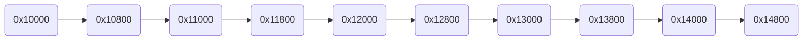
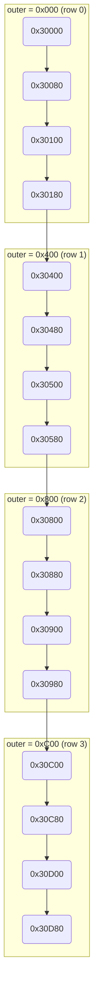

# Quasar Address Generator Examples

Three example kernels demonstrating the hardware address generator loop hierarchy.

## Loop Hierarchy

The hardware implements nested loops from innermost to outermost:

```
for (base = base_start; ; base += face_size) {       // face loop (infinite)
  for (outer = 0; outer < outer_end; outer += outer_stride) {
    for (inner = 0; inner < inner_end; inner += inner_stride) {
      yield  base + outer + inner
    }
  }
}
```

Each call to `pop` advances to the next address in the sequence.

---

## 1D Strided — `addrgen_1d_example.cpp`

Only the inner loop is active. Addresses increment linearly from the base.

**Src config:** base=`0x10000`, stride=2048, n=10
**Dst config:** base=`0x20000`, stride=2048, n=10



---

## 2D Strided — `addrgen_2d_example.cpp`

Inner loop iterates over columns, outer loop iterates over rows.
Traverses a 4×4 matrix row by row.

**Src config:** base=`0x30000`, inner stride=128 (4 cols), outer stride=1024 (4 rows)
**Dst config:** base=`0x40000`, same strides



---

## Face Loop — `addrgen_face_example.cpp`

Adds a face dimension on top of 2D. After completing one full outer×inner tile,
`base` advances by `face_size` to the next tile.

**Src config:** base=`0x10000`, face_size=4096, inner=128×4, outer=1024×4, 2 faces
**Dst config:** base=`0x20000`, same strides

```mermaid
flowchart TD
    subgraph face0["Face 0 — base = 0x10000"]
        subgraph f0r0["row 0"]
            direction LR
            f0a0("0x10000") --> f0a1("0x10080") --> f0a2("0x10100") --> f0a3("0x10180")
        end
        subgraph f0r1["row 1"]
            direction LR
            f0b0("0x10400") --> f0b1("0x10480") --> f0b2("0x10500") --> f0b3("0x10580")
        end
        subgraph f0r2["row 2"]
            direction LR
            f0c0("0x10800") --> f0c1("0x10880") --> f0c2("0x10900") --> f0c3("0x10980")
        end
        subgraph f0r3["row 3"]
            direction LR
            f0d0("0x10C00") --> f0d1("0x10C80") --> f0d2("0x10D00") --> f0d3("0x10D80")
        end
        f0a3 --> f0b0
        f0b3 --> f0c0
        f0c3 --> f0d0
    end

    subgraph face1["Face 1 — base = 0x11000  (base += face_size 0x1000)"]
        subgraph f1r0["row 0"]
            direction LR
            f1a0("0x11000") --> f1a1("0x11080") --> f1a2("0x11100") --> f1a3("0x11180")
        end
        subgraph f1r1["row 1"]
            direction LR
            f1b0("0x11400") --> f1b1("0x11480") --> f1b2("0x11500") --> f1b3("0x11580")
        end
        subgraph f1r2["row 2"]
            direction LR
            f1c0("0x11800") --> f1c1("0x11880") --> f1c2("0x11900") --> f1c3("0x11980")
        end
        subgraph f1r3["row 3"]
            direction LR
            f1d0("0x11C00") --> f1d1("0x11C80") --> f1d2("0x11D00") --> f1d3("0x11D80")
        end
        f1a3 --> f1b0
        f1b3 --> f1c0
        f1c3 --> f1d0
    end

    f0d3 -->|"base += 0x1000"| f1a0
```



---

## Test Matrix

| Test | Kernel | `src_stride_en` | `dst_stride_en` | `num_of_addresses` |
|------|--------|:-:|:-:|:-:|
| `Strided1D_SrcOnly` | `addrgen_1d_example.cpp` | 1 | 0 | 10 |
| `Strided1D_DstOnly` | `addrgen_1d_example.cpp` | 0 | 1 | 10 |
| `Strided1D_Both`    | `addrgen_1d_example.cpp` | 1 | 1 | 10 |
| `Strided2D_SrcOnly` | `addrgen_2d_example.cpp` | 1 | 0 | 16 |
| `Strided2D_DstOnly` | `addrgen_2d_example.cpp` | 0 | 1 | 16 |
| `Strided2D_Both`    | `addrgen_2d_example.cpp` | 1 | 1 | 16 |
| `Face_SrcOnly`      | `addrgen_face_example.cpp` | 1 | 0 | 32 |
| `Face_DstOnly`      | `addrgen_face_example.cpp` | 0 | 1 | 32 |
| `Face_Both`         | `addrgen_face_example.cpp` | 1 | 1 | 32 |

## Running

```bash
TT_METAL_SIMULATOR=1 TT_METAL_DPRINT_CORES=0,0 \
  pytest tests/tt_metal/tt_metal/test_data_movement.py -k QuasarAddrgenOps
```
