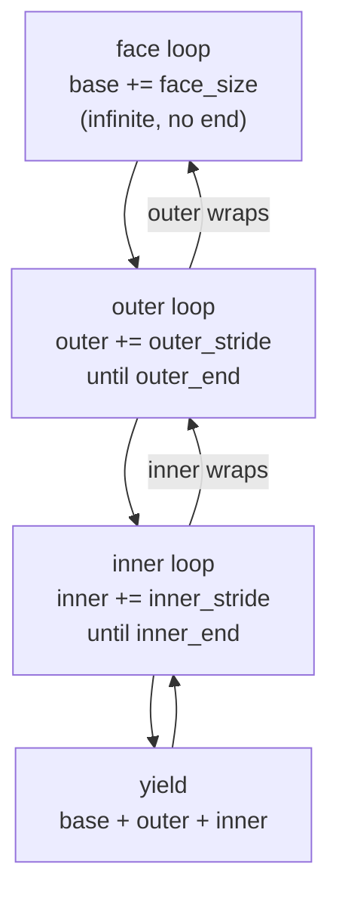
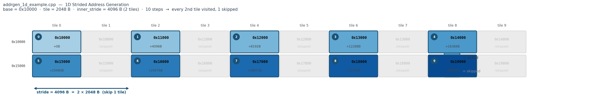
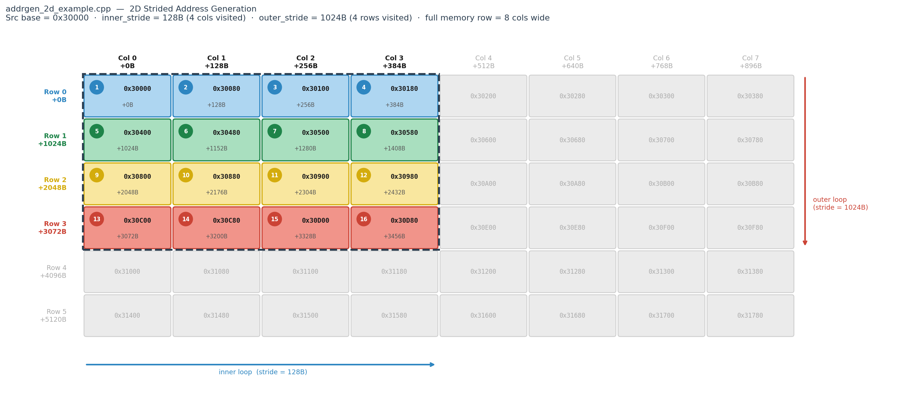
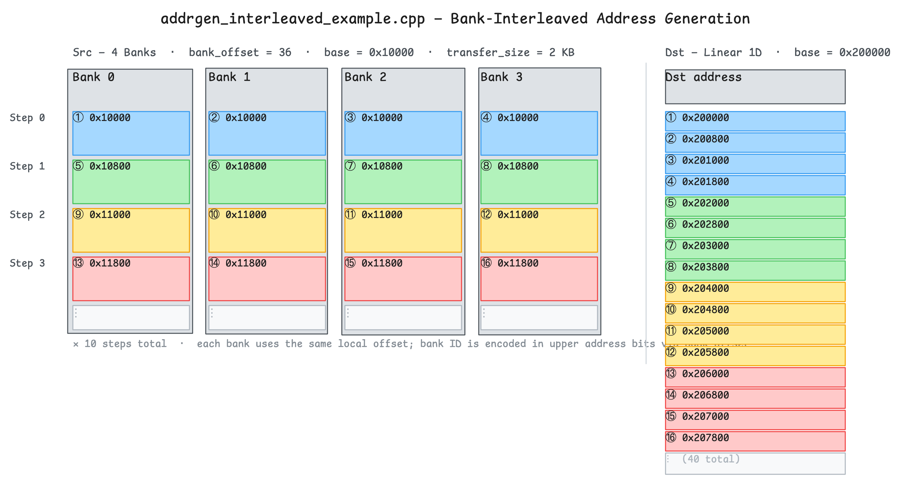

# Quasar Address Generator Examples

Three example kernels demonstrating the hardware address generator loop hierarchy.

## Loop Hierarchy



---

## 1D Strided — `addrgen_1d_example.cpp`

Only the **inner loop** is active. Addresses step linearly from base.

**Src:** `base=0x10000`, stride=4096 (2 tiles) &nbsp;|&nbsp; **Dst:** `base=0x20000`, stride=4096 (2 tiles)

| step | 0 | 1 | 2 | 3 | 4 | 5 | 6 | 7 | 8 | 9 |
|------|---|---|---|---|---|---|---|---|---|---|
| **src** | `0x10000` | `0x11000` | `0x12000` | `0x13000` | `0x14000` | `0x15000` | `0x16000` | `0x17000` | `0x18000` | `0x19000` |
| **dst** | `0x20000` | `0x21000` | `0x22000` | `0x23000` | `0x24000` | `0x25000` | `0x26000` | `0x27000` | `0x28000` | `0x29000` |

> **Tile size: 2048 B.** Each box is one 2048 B tile. `inner_stride = 4096 B = 2 × 2048 B` — every 2nd tile is visited, 1 skipped between each step.



---

## 2D Strided — `addrgen_2d_example.cpp`

**Inner loop** = columns (stride 128B), **outer loop** = rows (stride 1024B).
Numbers show traversal order.

**Src:** `base=0x30000` &nbsp;|&nbsp; **Dst:** `base=0x40000`

| | col 0 | col 1 | col 2 | col 3 |
|---|---|---|---|---|
| **row 0** | `0x30000` ①  | `0x30080` ②  | `0x30100` ③  | `0x30180` ④  |
| **row 1** | `0x30400` ⑤  | `0x30480` ⑥  | `0x30500` ⑦  | `0x30580` ⑧  |
| **row 2** | `0x30800` ⑨  | `0x30880` ⑩  | `0x30900` ⑪  | `0x30980` ⑫  |
| **row 3** | `0x30C00` ⑬  | `0x30C80` ⑭  | `0x30D00` ⑮  | `0x30D80` ⑯  |



---

## Face Loop — `addrgen_face_example.cpp`

After completing one full 4×4 tile, **base advances by face_size** (0x1000) to the next tile.

**Src:** `base=0x10000`, face_size=0x1000 &nbsp;|&nbsp; **Dst:** `base=0x20000`, face_size=0x1000

**Face 0** (base = `0x10000`):

| | col 0 | col 1 | col 2 | col 3 |
|---|---|---|---|---|
| **row 0** | `0x10000` ①  | `0x10080` ②  | `0x10100` ③  | `0x10180` ④  |
| **row 1** | `0x10400` ⑤  | `0x10480` ⑥  | `0x10500` ⑦  | `0x10580` ⑧  |
| **row 2** | `0x10800` ⑨  | `0x10880` ⑩  | `0x10900` ⑪  | `0x10980` ⑫  |
| **row 3** | `0x10C00` ⑬  | `0x10C80` ⑭  | `0x10D00` ⑮  | `0x10D80` ⑯  |

↓ `base += face_size (0x1000)`

**Face 1** (base = `0x11000`):

| | col 0 | col 1 | col 2 | col 3 |
|---|---|---|---|---|
| **row 0** | `0x11000` ⑰  | `0x11080` ⑱  | `0x11100` ⑲  | `0x11180` ⑳  |
| **row 1** | `0x11400` ㉑  | `0x11480` ㉒  | `0x11500` ㉓  | `0x11580` ㉔  |
| **row 2** | `0x11800` ㉕  | `0x11880` ㉖  | `0x11900` ㉗  | `0x11980` ㉘  |
| **row 3** | `0x11C00` ㉙  | `0x11C80` ㉚  | `0x11D00` ㉛  | `0x11D80` ㉜  |

---

## Bank-Interleaved — `addrgen_interleaved_example.cpp`

**Inner loop** cycles through **4 banks** (BANK_INNER) before advancing the address. Banks are 1 MB apart (`bank_id << 20`). Transfer size is 2 KB.

**Src** (`base=0x10000`, 4 banks × 10 steps = 40 addresses):

| step | bank 0 | bank 1 | bank 2 | bank 3 |
|------|--------|--------|--------|--------|
| 0 | `0x010000` | `0x110000` | `0x210000` | `0x310000` |
| 1 | `0x010800` | `0x110800` | `0x210800` | `0x310800` |
| 2 | `0x011000` | `0x111000` | `0x211000` | `0x311000` |
| … | … | … | … | … |

**Dst** (`base=0x200000`): `0x200000`, `0x200800`, `0x201000`, … (2 KB per transaction)



---

## Test Matrix

| Test | Kernel | `src_stride_en` | `dst_stride_en` | `num_of_addresses` |
|------|--------|:-:|:-:|:-:|
| `Strided1D_SrcOnly` | `addrgen_1d_example.cpp`   | 1 | 0 | 10 |
| `Strided1D_DstOnly` | `addrgen_1d_example.cpp`   | 0 | 1 | 10 |
| `Strided1D_Both`    | `addrgen_1d_example.cpp`   | 1 | 1 | 10 |
| `Strided2D_SrcOnly` | `addrgen_2d_example.cpp`   | 1 | 0 | 16 |
| `Strided2D_DstOnly` | `addrgen_2d_example.cpp`   | 0 | 1 | 16 |
| `Strided2D_Both`    | `addrgen_2d_example.cpp`   | 1 | 1 | 16 |
| `Face_SrcOnly`      | `addrgen_face_example.cpp` | 1 | 0 | 32 |
| `Face_DstOnly`      | `addrgen_face_example.cpp` | 0 | 1 | 32 |
| `Face_Both`         | `addrgen_face_example.cpp` | 1 | 1 | 32 |
| `Interleaved_Banking` | `addrgen_interleaved_example.cpp` | — | — | 40 |

## Running

```bash
TT_METAL_SIMULATOR=1 TT_METAL_DPRINT_CORES=0,0 \
  pytest tests/tt_metal/tt_metal/test_data_movement.py -k QuasarAddrgenOps
```
