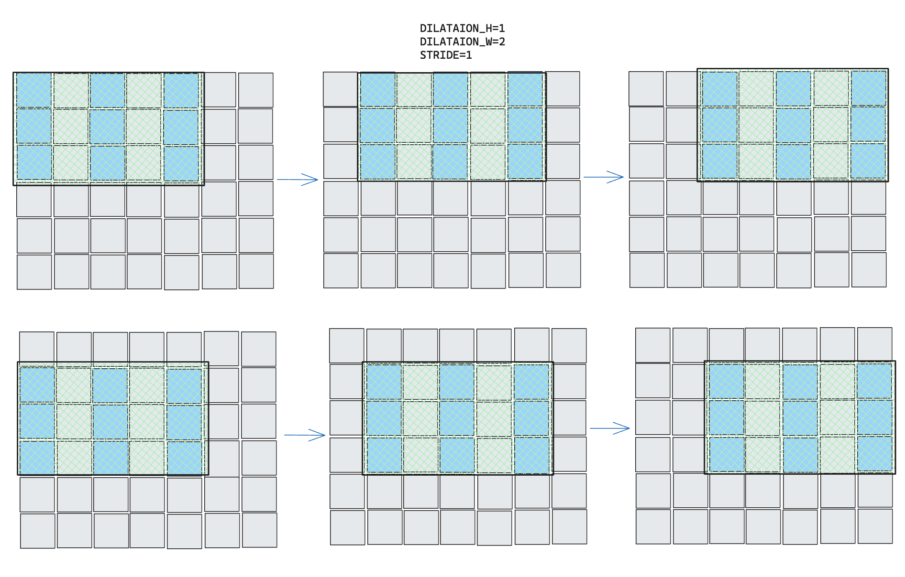
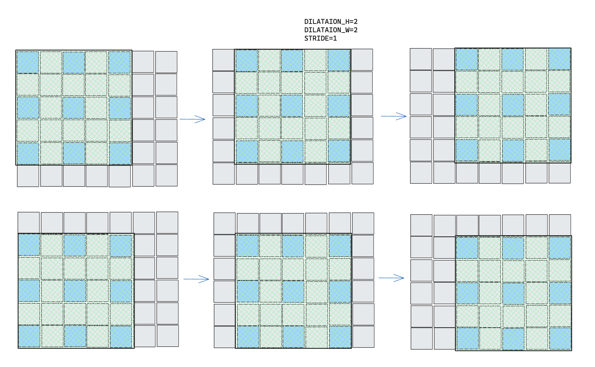
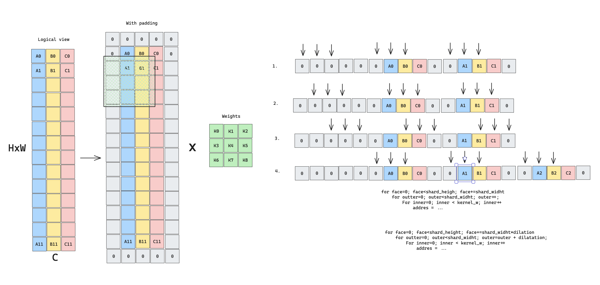
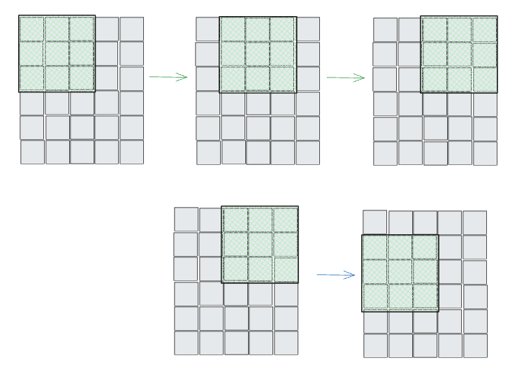

# Quasar Im2Col — address generation examples

## General im2col (with dilation support)

Implementation of local im2col using fast address generators.

Hardware inner/outer loops traverse one kernel patch. A software double loop over output
positions updates the source base address before each patch.

## Im2col — dilation = 1 (face-loop optimisation)

Implementation of local im2col when dilation is 1 using fast address generators.

When dilation = 1 the hardware face loop replaces the software output-row loop: after each
complete inner × outer sweep the base address automatically advances by one row, eliminating
one level of software iteration.

