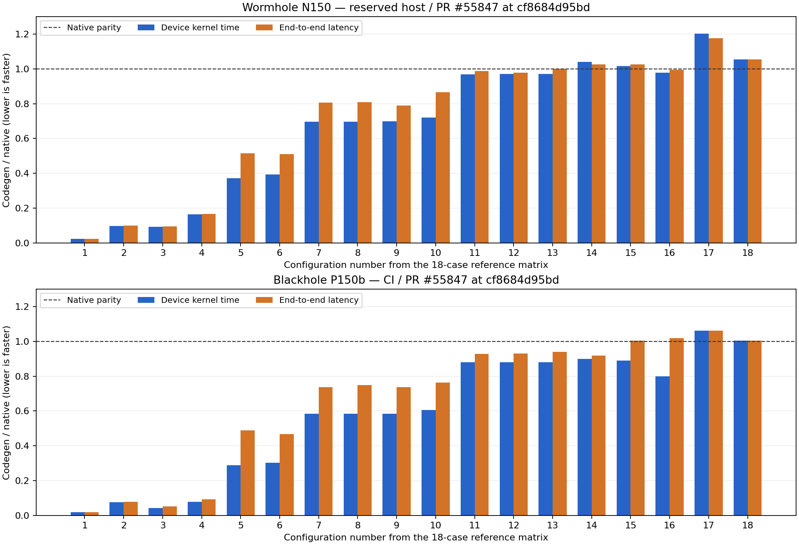

## Final codegen versus native: 18-config port matrix

Codegen is faster on device for **14/18 median comparisons on Wormhole N150 (both local and CI)** and **16/18 on Blackhole P150b CI**. The matrix exposes real exceptions: the many-row case 17 is **20.2% slower on Wormhole** and **6.1% slower on Blackhole**; the wide single-row case 18 is **5.4% slower on reserved Wormhole, 1.5% on Wormhole CI, and 0.3% on Blackhole CI**. The original smaller safety/performance matrix also has Wormhole exceptions, listed below.



Requested follow-up to [PR #52074's 18-config comparison](https://github.com/tenstorrent/tt-metal/pull/52074#issuecomment-5436334701). Production revision: `cf8684d95bd01f0f3cb3bed53163ff78690ed62c`; harness: `9aa200aa7f27e834b447726bec9c7d1c2a48d864`.

The 18 input/index shapes and dimensions match the reference comment. Each uses BF16 tiled input, UINT32 tiled indices and interleaved DRAM. Every configuration checks public dispatch selects a codegen factory and checks public, forced native and forced codegen outputs exactly against `torch.gather`. This samples the supported domain; it is not an exhaustive claim over all supported inputs.

Two independent passes, six adjacent native/codegen window pairs per pass, alternating which implementation runs first. Each implementation warms up five times per configuration. Unprofiled wall windows contain 30 calls including synchronization and output allocation, with operands already on device. Separately profiled windows contain ten calls. Device time is the sum of kernel durations for the whole operation, including any transforms, divided by calls. Gather-only durations are retained separately in raw analysis. Tables report medians over 12 windows per implementation; ratios below 1 mean codegen is faster. Paired-window ranges are inspected for repeatability.

Each dataset contains 432 host windows and 432 device windows (12 per case and implementation). The architectures are Wormhole N150 and Blackhole P150b. Historical absolute timings from the N300/P150 reference are not used as a baseline; this is a direct same-device, same-host-library comparison of current native against current codegen. Neither routing nor production code changed for this measurement.

### Reserved Wormhole N150

All 18 cases passed exact BF16 checks in both host and profiling passes. Codegen is faster on device for **14/18** configurations. Its largest device deficit is **20.19%** on case 17; case 18 is **5.39%** slower. Cases 14 and 15 are **3.94%** and **1.51%** slower respectively. The other configurations include large wins, reaching about **44.6×** on case 1.

| # | Input → index shape; dim | Native device µs | Codegen device µs | C/N | Native wall µs | Codegen wall µs | C/N |
|---:|---|---:|---:|---:|---:|---:|---:|
| 1 | `[1, 1, 1536, 32768] → [1, 1, 1536, 256]; -1` | 722138.73 | 16180.12 | 0.022 | 733332.92 | 16559.70 | 0.023 |
| 2 | `[1, 1, 64, 32000] → [1, 1, 64, 3200]; -1` | 62831.54 | 6154.39 | 0.098 | 63887.81 | 6317.63 | 0.099 |
| 3 | `[1, 1, 32, 15360] → [1, 1, 32, 7680]; -1` | 39812.81 | 3704.80 | 0.093 | 40521.33 | 3819.25 | 0.094 |
| 4 | `[1, 1, 20, 31990] → [1, 1, 20, 7670]; -1` | 45294.01 | 7390.65 | 0.163 | 46177.72 | 7663.08 | 0.166 |
| 5 | `[128, 256] → [128, 128]; -1` | 167.28 | 62.32 | 0.373 | 217.70 | 112.14 | 0.515 |
| 6 | `[1, 1, 256, 256] → [1, 1, 256, 128]; -1` | 167.80 | 65.95 | 0.393 | 209.00 | 106.70 | 0.511 |
| 7 | `[1, 64, 128] → [1, 64, 64]; -1` | 86.04 | 59.93 | 0.697 | 132.90 | 107.03 | 0.805 |
| 8 | `[64, 128] → [64, 64]; -1` | 86.03 | 59.93 | 0.697 | 131.40 | 106.39 | 0.810 |
| 9 | `[1, 1, 128, 128] → [1, 1, 128, 64]; -1` | 86.27 | 60.38 | 0.700 | 123.38 | 97.39 | 0.789 |
| 10 | `[1, 1, 128, 128] → [1, 1, 64, 128]; -2` | 94.23 | 67.86 | 0.720 | 166.02 | 143.74 | 0.866 |
| 11 | `[1, 1, 32, 64] → [1, 1, 32, 32]; -1` | 43.06 | 41.71 | 0.969 | 78.49 | 77.45 | 0.987 |
| 12 | `[32, 64] → [32, 32]; -1` | 43.06 | 41.77 | 0.970 | 89.46 | 87.45 | 0.978 |
| 13 | `[1, 32, 64] → [1, 32, 32]; -1` | 43.05 | 41.76 | 0.970 | 88.74 | 88.63 | 0.999 |
| 14 | `[1, 1, 64, 64] → [1, 1, 64, 32]; -1` | 43.19 | 44.89 | 1.039 | 78.90 | 80.94 | 1.026 |
| 15 | `[1, 1, 64, 128] → [1, 1, 32, 128]; -2` | 50.80 | 51.57 | 1.015 | 123.48 | 126.61 | 1.025 |
| 16 | `[1, 1, 32, 64] → [1, 1, 16, 64]; -2` | 58.74 | 57.49 | 0.979 | 150.97 | 150.29 | 0.995 |
| 17 | `[1, 1, 4352, 128] → [1, 1, 4352, 96]; -1` | 377.91 | 454.19 | 1.202 | 426.94 | 501.91 | 1.176 |
| 18 | `[1, 151936] → [1, 151936]; -1` | 640761.79 | 675297.78 | 1.054 | 650352.98 | 685503.46 | 1.054 |

### Investigation of the Wormhole case 17 deficit

The newly flagged case 17 was checked against the unclamped base on the same reserved N150, same host libraries, with two additional six-window passes. Exact BF16 checks passed. Base codegen was already 444.27 µs versus native 378.05 µs (1.175× native). Final codegen is 454.19 µs: the clamp adds 2.23% (9.92 µs) on this case, while most of the final 20.2% native deficit predates the fix. Base/final codegen end-to-end medians are 493.42/501.91 µs. A final fixed-revision recheck after both base passes measured native 377.97 µs and codegen 454.23 µs, confirming the same gap with fixed measurements bracketing the base runs.

### Blackhole P150b CI

All 18 configurations passed exact BF16 checks in both host and profiling passes on final head `cf8684d95bd`. Codegen wins **16/18** device comparisons. Case 17 is **6.13%** slower than native, and case 18 is **0.31%** slower. Both deficits remain above parity in every paired device window. The small host deficits in cases 15/16 vary around parity (paired ranges 0.606–1.186 and 0.953–1.271); they do not establish a consistent host regression. Cases 17/18 remain slower in all paired host windows.

Runner `tt-ubuntu-2204-p150b-stable-xttnx-runner-brgvv`, P150b board `000004123191109c`, TT-KMD 2.8.0, firmware 19.8.0.0. [CI job](https://github.com/tenstorrent/tt-metal/actions/runs/34333981154/job/102412177059), [raw scripts, hardware, host samples and Tracy reports](https://github.com/tenstorrent/tt-metal/actions/runs/34333981154/artifacts/10098001155).

| # | Input → index shape; dim | Native device µs | Codegen device µs | C/N | Native wall µs | Codegen wall µs | C/N |
|---:|---|---:|---:|---:|---:|---:|---:|
| 1 | `[1, 1, 1536, 32768] → [1, 1, 1536, 256]; -1` | 539189.45 | 9949.23 | 0.018 | 539452.19 | 10096.72 | 0.019 |
| 2 | `[1, 1, 64, 32000] → [1, 1, 64, 3200]; -1` | 22609.42 | 1706.19 | 0.075 | 22836.86 | 1812.40 | 0.079 |
| 3 | `[1, 1, 32, 15360] → [1, 1, 32, 7680]; -1` | 23088.88 | 1010.16 | 0.044 | 21445.37 | 1115.45 | 0.052 |
| 4 | `[1, 1, 20, 31990] → [1, 1, 20, 7670]; -1` | 26660.50 | 2117.58 | 0.079 | 24812.12 | 2324.49 | 0.094 |
| 5 | `[128, 256] → [128, 128]; -1` | 112.99 | 32.51 | 0.288 | 155.09 | 75.66 | 0.488 |
| 6 | `[1, 1, 256, 256] → [1, 1, 256, 128]; -1` | 113.13 | 34.14 | 0.302 | 145.35 | 68.02 | 0.468 |
| 7 | `[1, 64, 128] → [1, 64, 64]; -1` | 56.48 | 32.97 | 0.584 | 95.72 | 70.45 | 0.736 |
| 8 | `[64, 128] → [64, 64]; -1` | 56.48 | 32.97 | 0.584 | 94.51 | 70.81 | 0.749 |
| 9 | `[1, 1, 128, 128] → [1, 1, 128, 64]; -1` | 56.56 | 33.09 | 0.585 | 91.69 | 67.57 | 0.737 |
| 10 | `[1, 1, 128, 128] → [1, 1, 64, 128]; -2` | 60.80 | 36.84 | 0.606 | 119.91 | 91.59 | 0.764 |
| 11 | `[1, 1, 32, 64] → [1, 1, 32, 32]; -1` | 28.19 | 24.84 | 0.881 | 63.85 | 59.28 | 0.928 |
| 12 | `[32, 64] → [32, 32]; -1` | 28.20 | 24.83 | 0.881 | 69.72 | 64.79 | 0.929 |
| 13 | `[1, 32, 64] → [1, 32, 32]; -1` | 28.19 | 24.83 | 0.881 | 69.76 | 65.53 | 0.939 |
| 14 | `[1, 1, 64, 64] → [1, 1, 64, 32]; -1` | 28.24 | 25.41 | 0.900 | 63.73 | 58.49 | 0.918 |
| 15 | `[1, 1, 64, 128] → [1, 1, 32, 128]; -2` | 32.37 | 28.79 | 0.890 | 93.70 | 94.09 | 1.004 |
| 16 | `[1, 1, 32, 64] → [1, 1, 16, 64]; -2` | 38.09 | 30.46 | 0.800 | 101.16 | 103.12 | 1.019 |
| 17 | `[1, 1, 4352, 128] → [1, 1, 4352, 96]; -1` | 153.92 | 163.36 | 1.061 | 199.17 | 211.29 | 1.061 |
| 18 | `[1, 151936] → [1, 151936]; -1` | 184128.63 | 184691.31 | 1.003 | 184448.62 | 185092.13 | 1.003 |

### Independent Wormhole N150 CI

All 18 configurations passed exact BF16 checks in both host and profiling passes on the final PR head. The CI run agrees on **14/18 median device wins** and the **20.21%** case-17 deficit. Case 18 is **1.54%** slower here versus **5.39%** on the reserved N150; those hardware/firmware-specific measurements are reported separately. Case 16 is effectively at parity in CI: its paired device ratios span 0.979–1.002 despite a median just below 1. Small host comparisons remain noisier than device time.

Runner `tt-ubuntu-2204-n150-viommu-stable-khsdf-runner-rx5v5`, N150 L board `010001851170c03b`, TT-KMD 2.8.0, firmware 19.2.0.0. The reserved local N150 instead used TT-KMD 2.4.1 and firmware 18.12.1.0. [CI job](https://github.com/tenstorrent/tt-metal/actions/runs/34333981154/job/102412177098), [raw scripts, hardware, host samples and Tracy reports](https://github.com/tenstorrent/tt-metal/actions/runs/34333981154/artifacts/10098364412).

| # | Input → index shape; dim | Native device µs | Codegen device µs | C/N | Native wall µs | Codegen wall µs | C/N |
|---:|---|---:|---:|---:|---:|---:|---:|
| 1 | `[1, 1, 1536, 32768] → [1, 1, 1536, 256]; -1` | 722132.35 | 16053.58 | 0.022 | 733555.21 | 16475.99 | 0.022 |
| 2 | `[1, 1, 64, 32000] → [1, 1, 64, 3200]; -1` | 62832.11 | 5999.12 | 0.095 | 63974.27 | 6232.08 | 0.097 |
| 3 | `[1, 1, 32, 15360] → [1, 1, 32, 7680]; -1` | 39812.85 | 3505.32 | 0.088 | 40603.25 | 3691.34 | 0.091 |
| 4 | `[1, 1, 20, 31990] → [1, 1, 20, 7670]; -1` | 45293.29 | 7210.67 | 0.159 | 46318.39 | 7603.70 | 0.164 |
| 5 | `[128, 256] → [128, 128]; -1` | 167.22 | 62.19 | 0.372 | 273.18 | 167.44 | 0.613 |
| 6 | `[1, 1, 256, 256] → [1, 1, 256, 128]; -1` | 167.80 | 65.81 | 0.392 | 226.14 | 121.83 | 0.539 |
| 7 | `[1, 64, 128] → [1, 64, 64]; -1` | 86.01 | 59.92 | 0.697 | 148.52 | 123.24 | 0.830 |
| 8 | `[64, 128] → [64, 64]; -1` | 86.01 | 59.93 | 0.697 | 148.11 | 129.93 | 0.877 |
| 9 | `[1, 1, 128, 128] → [1, 1, 128, 64]; -1` | 86.28 | 60.41 | 0.700 | 135.49 | 109.68 | 0.810 |
| 10 | `[1, 1, 128, 128] → [1, 1, 64, 128]; -2` | 94.20 | 67.80 | 0.720 | 184.76 | 159.49 | 0.863 |
| 11 | `[1, 1, 32, 64] → [1, 1, 32, 32]; -1` | 43.06 | 41.70 | 0.968 | 91.98 | 90.22 | 0.981 |
| 12 | `[32, 64] → [32, 32]; -1` | 43.05 | 41.76 | 0.970 | 109.53 | 104.90 | 0.958 |
| 13 | `[1, 32, 64] → [1, 32, 32]; -1` | 43.06 | 41.77 | 0.970 | 102.38 | 100.29 | 0.980 |
| 14 | `[1, 1, 64, 64] → [1, 1, 64, 32]; -1` | 43.19 | 44.90 | 1.040 | 99.66 | 102.16 | 1.025 |
| 15 | `[1, 1, 64, 128] → [1, 1, 32, 128]; -2` | 50.40 | 51.53 | 1.022 | 139.11 | 136.52 | 0.981 |
| 16 | `[1, 1, 32, 64] → [1, 1, 16, 64]; -2` | 57.62 | 57.50 | 0.998 | 169.56 | 171.10 | 1.009 |
| 17 | `[1, 1, 4352, 128] → [1, 1, 4352, 96]; -1` | 377.74 | 454.09 | 1.202 | 496.06 | 568.56 | 1.146 |
| 18 | `[1, 151936] → [1, 151936]; -1` | 657919.28 | 668048.66 | 1.015 | 667981.37 | 678278.33 | 1.015 |

### Additional safety/performance configurations

The 13 safety/performance configurations measured earlier also permit a final-codegen/native comparison. These numbers use only the two fixed-revision passes for both implementations; device time here is the gather primitive, excluding transforms.

| Case | Wormhole codegen/native device | Blackhole codegen/native device |
|---|---:|---:|
| tiny | 0.798 | 0.429 |
| row-full | 0.974 | 0.876 |
| row-partial | 1.048 | 0.788 |
| tiled-full | 0.435 | 0.379 |
| tiled-partial | 0.434 | 0.380 |
| public-valid | 1.042 | 0.897 |
| large-row | 0.002 | 0.001 |
| large-tiled | 0.038 | 0.025 |
| small-square | 0.838 | 0.763 |
| wide-valid | 0.043 | 0.042 |
| l1--1 | 0.006 | 0.006 |
| l1-+0 | 0.006 | 0.006 |
| l1-+1 | 0.016 | 0.014 |

### Reproduction and decision

The [benchmark harness](https://github.com/tenstorrent/tt-metal/tree/9aa200aa7f27e834b447726bec9c7d1c2a48d864/tests/ttnn/perf_tests/gather_55847) runs with:

```bash
bash tests/ttnn/perf_tests/gather_55847/run.sh native
```

It copies the harness, checks out production head `cf8684d95bd`, and runs two unprofiled and two Tracy-profiled passes under a watchdog. `native_compare.py --case 17 --label LABEL --output FILE` restricts the same benchmark to the diagnostic case; the local base comparison used source revision `89e1256c982a5b4739d173bcc446c8c748a44b40` with identical host libraries. The final source was rechecked after the base runs. Exact BF16 comparisons passed throughout; no hang or device reset occurred.

The native comparison supports a qualified conclusion: codegen retains substantial wins across this matrix, with the explicit exceptions above. The case-17 Wormhole deficit mostly predates this PR; the added clamp costs about 2.23% there. Case 18 uses the unchanged streaming path. The Blackhole case-17 base/fix delta was not measured by this follow-up, so its native deficit is not attributed entirely to the clamp.

No production code or routing changed for these measurements. Required CI on `cf8684d95bd` remains passed, and the [native-comparison workflow](https://github.com/tenstorrent/tt-metal/actions/runs/34333981154) also passed both hardware jobs. Merge recommendation remains on hold pending acceptance of the documented performance costs and exceptions.
