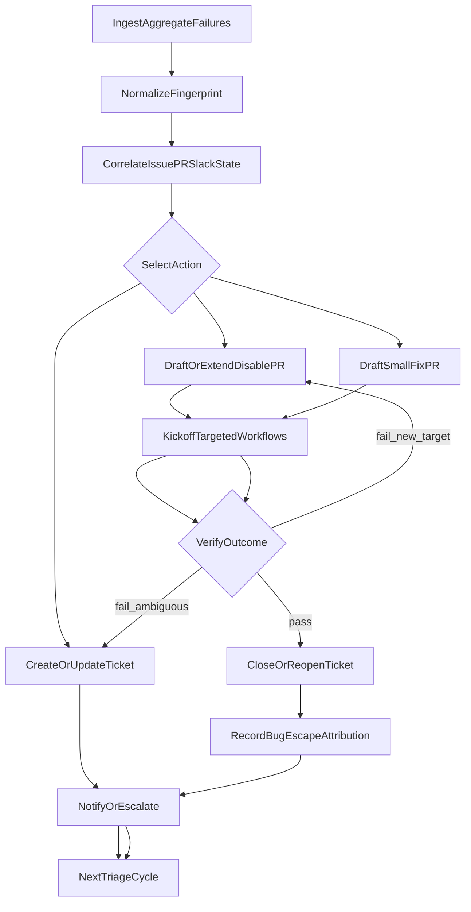

# CI Triage Autonomy Fresh-Agent Handoff Spec

## 1) Mission Contract

This document is the execution specification for a fresh agent with no prior conversation context.
The agent must implement and validate an autonomous CI-triage control loop with minimal human oversight.

Primary outcomes:

- No duplicate disable PRs for the same failing signal
- Existing disable PRs are resumed/extended when new failures appear
- Successful completion triggers one terminal Slack notification
- Bug-escape attribution is tracked post-facto by mapping issue -> fix commit/PR
- New failures are continuously ingested from aggregate workflow data
- Ticket lifecycle is fully automated (create/update/close with recurrence creating a new issue)
- Assignment/follow-up/escalation loops continue even after temporary disables
- Small-scope fix PR drafting is attempted when confidence is high
- Thread progress is continuously read and used to defer/allow disable actions
- Bug-escape categorization correlates where failure manifested vs where fix landed

Non-goals for initial delivery:

- public Slack channel rollout
- broad multi-repo orchestration
- bypassing repository protections/policies

---

## 2) Reader Profile And Operating Mode

This spec assumes the executing model:

- can read/write repository files
- can run local scripts and git commands
- can inspect workflow logs/artifacts
- can perform iterative implementation + validation

This spec does not assume prior knowledge of this repository.

---

## 3) Placeholder Contract (Portable Template)

Use placeholders throughout implementation and map them per repository.

Required placeholders:

- `{{TRIAGE_WORKFLOW_PATH}}`
- `{{TRIAGE_WORKFLOW_NAME}}`
- `{{STATE_ARTIFACT_NAME}}`
- `{{ACTIONS_ARTIFACT_NAME}}`
- `{{SLACK_READ_CHANNEL_ID}}`
- `{{SLACK_NOTIFY_CHANNEL_ID_TEST}}`
- `{{DEFAULT_STALE_HOURS}}`
- `{{DEFAULT_MAX_ACTIONS}}`
- `{{AUTO_DISABLE_COMMAND_PATH}}`
- `{{KICKOFF_COMMAND_PATH}}`
- `{{REPO_SLUG}}`
- `{{ISSUE_TRACKING_REPO_TEST}}`
- `{{ISSUE_TRACKING_REPO_PROD}}`

If values are unknown at runtime, agent must stop and request clarification before write actions.

Slack ID hard constraint for current bootstrap:

- use only `C0APK6215B5` for Slack reads and test notifications
- do not use any other concrete Slack channel ID during this bootstrap phase

---

## 4) Preflight Contract (Hard Gate Before Any Writes)

The agent must verify all of the following before enabling live writes:

### 4.1 Environment/Access

- `python3 tools/ci/guarded_gh.py --dry-run --command "gh auth status"` succeeds
- repository write scopes are available for:
  - contents
  - pull requests
  - actions/workflow dispatch
- issue-tracking repository write scope is available for `{{ISSUE_TRACKING_REPO_TEST}}`
- secrets are configured for:
  - Slack read/export path
  - Slack notify path (test channel only)
  - agent API key (if required by CLI)

### 4.2 Workflow Safety

- workflow supports dry-run mode for auto-disable path
- workflow supports data-gathering/read-only mode
- test channel IDs are configured and validated
- public-channel posting is disabled by default

### 4.3 Kill Switches

All of these must exist:

- `auto-disable-dry-run`
- max actions per run limit
- max attempts per candidate limit
- single-flag disable for Slack notify writes

### 4.4 Command Execution Gateway (Hard Rule)

- Direct `gh` execution is forbidden for automated GitHub actions.
- Any automated GitHub command must be executed only via:
  - `python3 tools/ci/guarded_gh.py --command "<gh command>"`
- Commands rejected by `guarded_gh.py` must not be retried by bypassing the wrapper.
- `guarded_gh.py` allowlist is the execution boundary for issue/pr/workflow operations.

If any preflight check fails, agent must only produce a preflight report and no writes.

---

## 5) Non-Negotiable Invariants

These invariants must always hold:

1. One candidate key maps to at most one active disable PR.
2. Malformed model output never triggers write actions.
3. Completed candidates never re-enter active disable flow.
4. Notifications are terminal-only (no per-attempt spam).
5. Test-mode channels only until explicit promotion.
6. State is source of truth; run-time behavior must reconcile state with live GitHub data.
7. During testing, all automated issue writes must target `{{ISSUE_TRACKING_REPO_TEST}}` only.
8. During bootstrap testing, both `{{SLACK_READ_CHANNEL_ID}}` and `{{SLACK_NOTIFY_CHANNEL_ID_TEST}}` must resolve to `C0APK6215B5`.
9. Automated GitHub commands must be executed via `tools/ci/guarded_gh.py` only.

Violation of any invariant is a release blocker.

---

## 6) State Schema Contract

Canonical state artifact path:

- `build_ci/triage_state/ci_triage_state.json`

Minimum schema:

```json
{
  "version": 1,
  "updated_at_utc": "string",
  "items": [
    {
      "key": "slack_ts:<ts>",
      "slack_ts": "string",
      "issue_numbers": [12345],
      "status": "new|planned|pr_open|kickoff_running|kickoff_failed_new_failure|completed|needs_human|paused",
      "disable_pr": {
        "number": 0,
        "url": "string",
        "branch": "string",
        "head_sha": "string"
      },
      "attempts": 0,
      "last_kickoff_runs": [
        {"workflow": "string", "run_id": 0, "url": "string", "conclusion": "string"}
      ],
      "notification": {
        "terminal_notified": false,
        "last_error": ""
      },
      "terminal_reason": "",
      "history": [
        {"ts_utc": "string", "event": "string", "details": "string"}
      ]
    }
  ]
}
```

Schema rules:

- `key` is unique and deterministic (default `slack_ts:<ts>`)
- `attempts` is monotonic increasing
- `history` append-only
- unknown status values are invalid and must fail closed

---

## 7) Decision Tables (Deterministic Control Logic)

## 7.1 Candidate Routing

| Condition | Action | State Transition |
|---|---|---|
| `status in {completed, paused}` | skip | unchanged |
| no state entry | create entry | `new -> planned` |
| open PR exists for key | resume existing PR flow | `planned/pr_open -> pr_open` |
| no PR + eligible candidate | create disable PR | `planned -> pr_open` |
| malformed planner output | no write | `planned -> needs_human` |

## 7.2 Existing PR Workflow Outcome

| Workflow result | Action | State Transition |
|---|---|---|
| all required workflows pass | send terminal notify | `pr_open/kickoff_running -> completed` |
| fail with known already-disabled target | bounded retry kickoff | `kickoff_running -> kickoff_running` |
| fail with new target | branch resume and incremental disable | `pr_open/kickoff_running -> kickoff_failed_new_failure -> pr_open` |
| dispatch/log fetch failure after retries | escalate | `* -> needs_human` |

## 7.3 Notification Logic

| Condition | Action |
|---|---|
| completed and not notified | send one Slack terminal message |
| completed and notified | no-op |
| non-terminal states | no Slack notification (unless explicitly enabled for diagnostics) |

---

## 8) Milestone Runbooks (Execution Contract Layer)

Each milestone must include Inputs, Actions, Evidence, Go/No-Go gate, Rollback.

## M0 - Baseline Verification

Inputs:

- current repo state
- workflow dispatch access

Actions:

1. run data-gathering mode once
2. run auto-disable dry-run twice

Evidence:

- artifacts exist for both modes
- summary has single report section
- dry-run outputs are deterministic

Go/No-Go:

- Go only if both dry-runs match expected shape and no write side effects

Rollback:

- set workflow to dry-run-only path and disable notify

## M1 - State Persistence

Inputs:

- previous run state artifact (if present)

Actions:

1. download latest state artifact
2. bootstrap if absent
3. merge candidate updates
4. upload new state artifact

Evidence:

- run N+1 sees previous state
- no duplicate `key` entries

Go/No-Go:

- Go only if state survives across 2 consecutive runs

Rollback:

- revert to stateless mode but keep dry-run only

## M2 - Duplicate Prevention

Inputs:

- state + open PR list

Actions:

1. enforce key-level idempotency
2. enforce PR body marker check
3. block second PR creation when active PR exists

Evidence:

- replay run creates zero extra PRs

Go/No-Go:

- Must pass replay test 3 times consecutively

Rollback:

- disable creation path; keep state reconciliation only

## M3 - Resume Existing PR Branch

Inputs:

- existing disable PR with failing workflows

Actions:

1. checkout existing PR branch
2. identify new failing target
3. apply incremental disable
4. push to same PR
5. rerun kickoff workflows
6. append attempt history

Evidence:

- no second PR
- same PR updated with new commit
- kickoff reruns linked in summary/state

Go/No-Go:

- Must pass one controlled scenario end-to-end

Rollback:

- lock candidate to `needs_human` and halt auto-extension

## M4 - Failure Ingestion + Correlation + New-Issue Slack Notify

Inputs:

- aggregate workflow data snapshots
- existing state entries with Slack/issue linkage
- `extract_failing_jobs.py` output for jobs failing 3 runs in a row

Actions:

1. ingest new failures from aggregate workflow data
2. compute deterministic `failure_fingerprint`
3. correlate fingerprint to existing issue/PR/Slack state items
4. create new issues for unmatched high-confidence fingerprints in `{{ISSUE_TRACKING_REPO_TEST}}`
5. send initial Slack lifecycle notification/thread anchor for each newly created issue
6. create or refresh state entries for unmatched fingerprints (fail closed on low confidence)

Evidence:

- new fingerprints appear in state/action artifacts with source links
- each newly created issue has a corresponding initial Slack lifecycle notification
- replay run does not duplicate previously seen fingerprints
- low-confidence fingerprints are suppressed/escalated without writes

Go/No-Go:

- Must pass one controlled ingestion scenario with deterministic replay
- Must prove issue-create + Slack-initial-notify occurs exactly once per new fingerprint

Rollback:

- disable ingestion issue/slack writes; keep read-only ingest report artifacts

## M5 - Ticket Lifecycle + Terminal Notify

Inputs:

- correlated fingerprints from M4
- issue/PR state for `{{ISSUE_TRACKING_REPO_TEST}}`
- Slack thread replies + latest owner responses for each active fingerprint

Actions:

1. run action selector for each active fingerprint (`draft_fix_pr`, `draft_disable_pr`, `refresh_validation`, `observe_only`)
2. create/update issues for active fingerprints (enforce `CI auto triage` label)
3. close solved issues when objective pass window is met
4. create a new issue when a previously closed fingerprint recurs
5. post/update Slack thread lifecycle messages for existing incidents
6. consume thread replies as control signals; if owner confirms imminent fix, prefer `observe_only`/defer and suppress disable PR creation
7. send follow-up lifecycle messages with anti-spam gates:
   - warning at +24h: "disable will be proposed if unresolved by SLA"
   - optional final warning near disable threshold
   - post-disable follow-up ping to the assigned owner with re-enable expectations
8. if disable PR merges, ensure issue assignee is set/updated and persist assignment rationale in state history
9. when developer thread/issue request indicates "agent can attempt fix", allow `draft_fix_pr` path under small-fix gates
10. on completion, mark state `completed`, send one terminal Slack message, set `terminal_notified=true`

Evidence:

- issue create/update/close events recorded in history
- closed-then-recurred fingerprint creates a new issue linked as recurrence
- controlled scenario shows `draft_fix_pr` chosen for high-confidence small fix
- controlled scenario shows `draft_disable_pr` chosen after SLA breach
- controlled scenario shows owner-confirmed thread reply switches action to defer/`observe_only` with no new disable PR
- warning lifecycle messages appear exactly once per phase unless state materially changes
- post-disable follow-up message includes owner ping and issue/PR linkage
- assignment is present (or explicitly pending with reason) after disable merge
- one terminal Slack message per completed key

Go/No-Go:

- Must pass end-to-end lifecycle scenarios for fix path, disable path, and owner-confirmed defer path

Rollback:

- stop issue write actions and Slack terminal notifications; keep state reconciliation only

## M6 - Bug Escape Attribution

Inputs:

- resolved item state + fix PR/commit metadata

Actions:

1. map issue -> fix commit/PR
2. infer problem surface (where failure manifested) from failing test/job metadata
3. infer fix surface (where fix landed) from fix PR files/labels/paths
4. correlate problem surface vs fix surface with explicit method + confidence
5. classify escape type and shift-left recommendation target
6. append bug escape event

Evidence:

- `bug_escape_events.json` updated
- rollup summary includes counts, examples, and confidence bands
- sample events include explicit problem-surface/fix-surface rationale

Go/No-Go:

- sample set must show traceable issue->fix mapping

Rollback:

- keep disable loop active; suspend attribution writes

---

## 9) Failure Recovery Matrix

| Failure Mode | Detect Signal | Retry Policy | Escalation Condition | Escalation Action |
|---|---|---|---|---|
| artifact download missing | artifact fetch 404 | 0 retries | immediate | bootstrap new state + warning |
| malformed model output | missing marker / JSON parse fail | 0 retries | immediate | fail closed, mark `needs_human` |
| PR create failure | gh non-zero | 2 retries with backoff | still failing | set `needs_human`, persist error |
| kickoff dispatch failure | no run IDs / gh error | 3 retries | still failing | set `needs_human` |
| workflow logs unavailable | API/log fetch errors | 3 retries | still failing | keep state, defer next run |
| push rejected | non-fast-forward/policy | 1 rebase attempt | policy block persists | set `needs_human` |
| Slack notify failure | Slack API non-ok | retry next run until success | >N configurable retries | keep completed, mark notify pending |

---

## 10) Acceptance Test Matrix (Portable + Repo Example)

| Test ID | Scenario | Mode | Expected Result |
|---|---|---|---|
| A1 | no prior state | dry-run | state bootstraps, no writes |
| A2 | prior state with open PR | dry-run | no duplicate PR planned |
| A3 | completed item replay | dry-run | skipped with explicit reason |
| A4 | malformed planner output | dry-run/live | no writes, `needs_human` |
| A5 | first live candidate | live test | one draft PR + kickoff runs |
| A6 | unchanged replay | live test | zero new PRs |
| A7 | new failure on existing PR | live test | same PR updated |
| A8 | aggregate failure ingestion replay | live test | deterministic fingerprint intake with no duplicate inserts |
| A9 | new fingerprint issue+Slack bootstrap | live test | new issue created and initial Slack lifecycle message posted exactly once |
| A10 | ticket lifecycle update/close | live test | issue lifecycle transitions recorded and label policy enforced |
| A11 | recurrence new-issue check | live test | previously closed fingerprint creates a new linked issue |
| A12 | action selector fix-vs-disable | live test | selector chooses fix for high-confidence small change and disable for SLA breach |
| A13 | owner-confirmed defer path | live test | thread reply drives `observe_only`/defer and blocks disable PR |
| A14 | successful terminal run | live test | completed + one Slack notify |
| A15 | bug escape attribution | live test | issue->fix mapping recorded |
| A16 | data-gathering regression check | live test | report behavior unchanged |
| A17 | thread persona simulation (progress) | live test | "working on it"/"PR soon" style replies defer disable path |
| A18 | thread persona simulation (blocked/stale) | live test | blocked then stale replies still progress to warning/disable policy |
| A19 | thread persona simulation (fixed signal) | live test | "fixed" + PR link updates state to verify/resolve path |
| A20 | thread persona simulation (conflict/noise) | live test | conflicting/vague replies fail safe (observe or escalate), no unsafe disable |
| A21 | thread persona anti-spam gate | live test | no duplicate phase messages unless state materially changes |

Minimum promotion threshold:

- A1-A16 pass
- A1-A21 pass
- A6 passes 3 consecutive runs
- no invariant violations

---

## 11) Minimal-Oversight Operator Checkpoints

Use this schedule for overnight or low-touch execution:

- T0: preflight contract pass and kill-switch confirmation
- T+30m: M0 evidence review
- T+90m: first live PR and kickoff validation
- T+3h: replay/no-duplicate validation
- T+6h: resume-existing-PR validation
- T+6h: failure-ingestion and correlation validation
- T+8h: ticket lifecycle (create/update/close + recurrence new-issue) validation
- T+end: completed-state + notify + bug-escape evidence

At any failed checkpoint:

- freeze promotion
- force dry-run
- execute rollback path for current milestone

Bootstrap-specific check:

- verify workflow/default config reads only from `C0APK6215B5`
- verify notification path posts only to `C0APK6215B5`

---

## 12) Fresh-Agent Bootstrap Prompt (Copy/Paste)

Use this prompt with a fresh agent:

```text
You are a fresh execution agent for CI triage autonomy.
Repository root: {{REPO_ROOT}}.

Primary spec to follow exactly:
tools/ci/ci-triage-autonomy-agent-planning.md

Rules:
1) Enforce all non-negotiable invariants in the spec.
2) Run preflight contract first. If any hard gate fails, stop and report only.
3) Execute milestones in order M0 -> M6.
4) Do not skip Go/No-Go gates.
5) Fail closed on malformed LLM output or schema mismatches.
6) Use placeholders from the spec and map to repo values via Appendix A.
7) Use test-only Slack channels and dry-run first.
8) Preserve state as source of truth and reconcile against live PR/workflow data each run.
9) Produce evidence artifacts and checkpoint report at each milestone.
10) If blocked, output exact blocker and proposed minimal fix.
11) Never run `gh` directly for automation; route all automated GitHub commands through `python3 tools/ci/guarded_gh.py`.

Start now with:
- Read spec
- Generate preflight report
- Propose M0 execution steps
```

---

## 13) Zero-Context Dry-Run Simulation Walkthrough

This section proves a fresh agent can start from zero context.

Step 1:

- read this spec
- resolve placeholders from Appendix A

Step 2:

- execute preflight contract
- if any requirement missing, output blocking report and stop

Step 3:

- run M0 only in dry-run mode
- generate checkpoint evidence:
  - artifact presence
  - summary integrity
  - deterministic output comparison

Step 4:

- if M0 passes, continue to M1 in dry-run mode first
- perform replay run to validate idempotency logic before live writes

Step 5:

- only after M2 pass criteria, enable limited live run (`max_actions=1`)

Expected outputs for this walkthrough:

- preflight report markdown
- milestone status table
- evidence artifact index
- explicit next action recommendation

---

## 14) Commit-History Discovery Requirement

A fresh agent must inspect recent commits before major edits to avoid reintroducing removed logic.

Required checks:

- recent commit messages around `{{TRIAGE_WORKFLOW_PATH}}`
- diff history for triage scripts/actions
- identification of previously failed approaches

If unclear why a behavior exists, agent must document assumption and continue with reversible changes.

---

## 15) Rollback Protocol

If instability or invariant breach is detected:

1. force `auto-disable-dry-run=true`
2. disable live Slack notifications
3. stop PR create/update writes
4. continue state read + observability artifacts
5. revert only latest milestone changes
6. rerun M0 to verify recovery baseline

---

## 16) Definition Of Ready / Done

Definition of ready (before live writes):

- preflight pass
- placeholders mapped
- dry-run checkpoints M0-M2 pass
- issue-routing confirmed to `{{ISSUE_TRACKING_REPO_TEST}}`

Definition of done:

- repeated runs converge with no duplicate PRs
- existing PR resume/extend path proven
- terminal completion emits exactly one notification
- bug escape events map issue->fix commit/PR with classification
- data-gathering mode remains non-regressed
- aggregate-data intake, ticket create/update/close, Slack lifecycle, and escalation loops are all validated end-to-end

---

## Appendix A: Example Placeholder Mapping For This Repository

Use these as examples; do not hardcode in portable implementations.

- `{{TRIAGE_WORKFLOW_PATH}}` -> `.github/workflows/triage-ci.yaml`
- `{{TRIAGE_WORKFLOW_NAME}}` -> `(triage) Export Evan Slack threads`
- `{{STATE_ARTIFACT_NAME}}` -> `triage-state` (recommended)
- `{{ACTIONS_ARTIFACT_NAME}}` -> `triage-actions` (recommended)
- `{{SLACK_READ_CHANNEL_ID}}` -> `C0APK6215B5`
- `{{SLACK_NOTIFY_CHANNEL_ID_TEST}}` -> `C0APK6215B5`
- `{{DEFAULT_STALE_HOURS}}` -> `32`
- `{{DEFAULT_MAX_ACTIONS}}` -> `3`
- `{{AUTO_DISABLE_COMMAND_PATH}}` -> `.cursor/commands/ci/ci-disable-test-ci.md`
- `{{KICKOFF_COMMAND_PATH}}` -> `.cursor/commands/ci/ci-kickoff-workflows.md`
- `{{REPO_SLUG}}` -> `tenstorrent/tt-metal`
- `{{ISSUE_TRACKING_REPO_TEST}}` -> `ebanerjeeTT/issue_dump`
- `{{ISSUE_TRACKING_REPO_PROD}}` -> `tenstorrent/tt-metal`

---

## Appendix B: Required Evidence Bundle Per Milestone

For each milestone, the agent must produce:

- run summary section with pass/fail gate
- artifact list with paths
- key decision log (state transitions)
- rollback command set for the exact milestone

---

## 17) Full CI Maintenance Feature Set (Expanded Scope)

This section upgrades the system from "auto-disable loop" to full CI maintenance automation.

Feature domains:

1. Failure ingestion from aggregate workflow data
2. Ticket lifecycle automation
3. Slack lifecycle automation
4. Disable-vs-fix action selection
5. Assignment and escalation automation
6. Continuous follow-up after disable
7. Testing strategy with synthetic scenarios/mocks

All domains must integrate into one state machine with shared keys and audit history.

---

## 18) Failure Ingestion Contract (Aggregate Workflow Data)

Primary intake source:

- aggregate workflow data runs (latest successful and recent failed runs)
- `extract_failing_jobs.py` output used to identify jobs failing 3 times consecutively

Deterministic failure definition (hard):

- a failure is deterministic only when the same job fails 3 runs in a row
- the failure signature/message across those 3 runs is semantically identical
- for `.github/workflows/triage-ci.yaml`, signature equivalence is determined by Cursor CLI agent analysis (not simple string matching only)

Intake requirements:

- pull new failure clusters since last processed cursor timestamp
- normalize each failure into a deterministic `failure_fingerprint`
- map each fingerprint to existing issue(s), PR(s), and prior state item(s)
- deduplicate across retried runs and mirrored workflow names

Minimum normalized fields per failure:

```json
{
  "failure_fingerprint": "string",
  "workflow_name": "string",
  "workflow_run_id": 0,
  "job_name": "string",
  "test_target": "string",
  "first_seen_utc": "string",
  "last_seen_utc": "string",
  "signal_strength": "high|medium|low",
  "source_links": []
}
```

Hard rules:

- no ticket creation without a stable fingerprint
- no action if fingerprint confidence is low and no corroborating evidence exists
- every downstream action must reference fingerprint + source links
- do not treat "3 failures in a row" as deterministic unless Cursor agent confirms equivalent failure signature
- when Cursor signature-equivalence result is uncertain, classify as low confidence and do not write

---

## 19) Ticket Lifecycle Automation Contract

Ticket states:

- `new_candidate`
- `open_active`
- `open_waiting_on_owner`
- `open_disabled_temporarily`
- `resolved_pending_verification`
- `closed_resolved`
- `closed_obsolete`

Issue repository routing rule:

- test/staging: create/update/close issues only in `{{ISSUE_TRACKING_REPO_TEST}}`; recurrence creates a new issue
- production: use `{{ISSUE_TRACKING_REPO_PROD}}` only after explicit promotion gate
- pre-promotion writes to production issue repo are forbidden

### 19.1 Create

Create a ticket when:

- fingerprint is persistent (above configurable repeat threshold)
- no active ticket already linked to same fingerprint

Labeling requirement (hard rule):

- every issue created by this new system must include label `CI auto triage`
- this system must not apply or rely on label `glean CI maintenance`

Ticket body must include:

- source runs/jobs links
- failing target fingerprint
- owner/team hint
- initial remediation recommendation
- non-closing references to related work

### 19.2 Update

Periodic update cadence:

- each triage cycle or bounded interval

Update fields:

- fresh run links
- current status summary
- latest owner response state
- open PR links (disable/fix)

### 19.3 Close

Close when either:

1. objective resolved condition met (stable pass window), or
2. superseded/invalid signal with rationale

Close operation must capture:

- resolving PR/commit linkage
- resolution evidence window
- bug-escape classification placeholder (for later enrichment if not available yet)

Labeling requirement on close/update:

- issue label `CI auto triage` must remain present when closing/updating
- if an issue lacks `CI auto triage`, add it before automated close/update actions
- never auto-close or auto-update issues that are only labeled `glean CI maintenance` and not `CI auto triage`

### 19.4 Recurrence After Close

If the same fingerprint recurs after close beyond hysteresis threshold, create a new issue instead of reopening the closed issue.

---

## 20) Slack Lifecycle Contract

Slack domains:

- read channel(s) for triage signals
- notify channel(s) for agent actions
- optional owner-specific follow-up threads

Slack capabilities:

1. read latest relevant thread context
2. post/update triage status message
3. post disable/fix PR links
4. post completion/escalation notices

Message policy:

- concise, factual, action-oriented
- include direct links to ticket, PR, workflow runs
- avoid repeated spam by message keying (`fingerprint + phase + day`)

Thread policy:

- one anchor message per fingerprint lifecycle
- updates stay in thread unless escalation requires separate visibility

---

## 21) Action Selector Contract (Disable vs Fix vs Observe)

Action options:

- `observe_only`
- `create_or_update_ticket`
- `draft_disable_pr`
- `draft_fix_pr`
- `kickoff_targeted_workflows`
- `notify_owner`
- `escalate`

Selection inputs:

- failure stability
- blast radius
- fix complexity estimate
- prior attempts count
- owner responsiveness

### 21.1 Disable Path

Prefer disable when:

- severe CI blockage + no quick deterministic fix
- repeated failures crossing stale threshold

### 21.2 Fix Path

Allow small fix PR drafting only when:

- likely fix is scoped and high-confidence
- affected files/area are limited
- tests to validate fix are known and runnable

Fix PRs must be draft by default unless policy allows direct ready-for-review.

### 21.3 Observe Path

Use observe-only when:

- evidence is ambiguous
- signal is too fresh/noisy
- previous action is still pending verification

---

## 22) Assignment, Follow-Up, And Escalation Contract

### 22.1 Auto-Assignment

Assignment sources (in priority order):

1. existing ticket owner
2. relevant-file commit history (recent commits on failure-linked paths)
3. CODEOWNERS/service ownership map
4. workflow/job owner hints (including `owners.json` reference signals)
5. fallback on-call rotation

Assignment rules:

- max 3 owner mentions in any single Slack message
- prefer owners with strongest multi-signal overlap (commit history + CODEOWNERS + job owner + thread participation)
- ignore team/group handles for direct mention unless policy explicitly allows

### 22.2 Follow-Up

Follow-up runs independently from disable/fix status.

Even after disable:

- continue ping cadence until root cause is fixed or accepted as deferred with explicit owner approval

Follow-up schedule (example):

- initial assignment ping
- reminder at +24h with disable warning
- optional pre-disable warning near threshold (e.g., +40h for +48h disable SLA)
- post-disable reminder ping to assigned owner until root-cause fix lands

### 22.3 Escalation

Escalate when:

- no owner acknowledgment after threshold
- no progress updates after threshold
- repeated disable extensions without root-cause trajectory

Escalation targets:

- owner manager/lead channel (configured mapping required)

Escalation safeguards:

- require at least one prior reminder
- include concise evidence packet
- limit escalation frequency per fingerprint

### 22.4 Disable Delay / Proceed Decision Contract

Delay disable when any high-confidence progress signal is present:

- linked fix PR is open and actively updated
- owner replied recently with concrete ETA/plan
- recent commits on relevant files indicate active fix work

Proceed with disable when:

- SLA threshold exceeded and no high-confidence progress
- thread activity is stale/non-substantive
- no active fix PR or equivalent owner-confirmed trajectory

---

## 23) Post-Disable Continuous Control Loop

After a test is disabled, the loop must continue:

1. monitor whether underlying issue is being worked
2. continue owner reminders/escalation cadence
3. detect when true fix PR appears
4. link fix PR/commit to ticket and bug-escape records
5. recommend/perform re-enable path when confidence is sufficient

Re-enable gate (minimum):

- sustained pass window on relevant workflows
- owner acknowledgment or policy-approved auto-reenable
- no conflicting active incidents for same target

---

## 24) Bug Escape Enrichment Contract (Full)

Bug-escape enrichment runs after resolution events and may be backfilled.

Required record fields:

```json
{
  "fingerprint": "string",
  "issue_number": 0,
  "disable_pr_number": 0,
  "fix_pr_number": 0,
  "fix_commit_sha": "string",
  "problem_surface": {
    "layer": "llk|metalium|ttnn|models|infra|unknown",
    "component": "string",
    "source": "failing_job|stack_trace|test_path|agent_inference"
  },
  "fix_surface": {
    "layer": "llk|metalium|ttnn|models|infra|unknown",
    "component": "string",
    "source": "changed_files|pr_labels|commit_message|agent_inference"
  },
  "failure_layer": "llk|metalium|ttnn|models|unknown",
  "fix_layer": "llk|metalium|ttnn|models|unknown",
  "correlation_method": "path_overlap|ownership_overlap|semantic_match|mixed",
  "correlation_confidence": "low|medium|high",
  "escape_type": "gate_coverage_gap|layer_escape_lower_to_higher|unknown",
  "shift_left_target": "pr_gate|merge_gate|lower_layer_suite|owner_alerting|unknown",
  "explanation": "string",
  "captured_at_utc": "string"
}
```

Interpretation requirements:

- include "why classified this way" text
- include shift-left recommendation candidate
- include explicit evidence for both problem surface and fix surface
- include confidence rule:
  - high: deterministic path/component match or repeated historical correlation
  - medium: partial overlap with supporting context
  - low: weak/ambiguous signals (must be called out explicitly)
- never block ticket close if enrichment temporarily unavailable; mark pending and retry

---

## 25) Expanded Test Strategy For Sparse Real-World Scenarios

Real pipelines may not naturally produce all permutations. A synthetic test harness is required.

### 25.1 Scenario Fixture Packs

Create fixture packs for:

- no stale Slack messages
- stale Slack with open issue
- stale Slack with closed issue
- no existing ticket + persistent fingerprint
- existing open ticket + no owner response
- disable PR exists + same failure persists
- disable PR exists + new failure appears
- fix PR appears and resolves failure
- false positive/noisy transient
- thread shows active progress and disable should be deferred
- thread stale with no owner response and disable should proceed
- post-disable state where owner follow-up continues until fix merge
- developer explicitly requests agent-authored small fix PR

### 25.2 Mock/Replay Sources

Mock inputs should include:

- aggregate workflow data snapshots
- Slack export JSON snapshots
- issue/PR metadata snapshots
- workflow run conclusions

### 25.3 Permutation Matrix

Must cover at least these cross products:

- issue state (`none/open/closed`) x failure persistence (`new/stable/flaky`)
- owner state (`unassigned/assigned/unresponsive/responding`)
- action state (`none/disable/fix`) x verification state (`pending/pass/fail`)
- thread progress (`none/investigating/fix_in_progress/blocked`) x disable decision (`defer/proceed`)
- bug-escape mapping confidence (`low/medium/high`) x classification correctness (`expected/unexpected`)

### 25.4 Test Gates

Before production rollout:

- all fixture packs pass deterministically in dry-run
- at least one controlled live run per major lifecycle branch
- escalation and notification suppression rules verified

### 25.5 Thread Persona Simulation Tests (Required)

Goal:

- verify the triage loop can correctly interpret realistic developer responses in Slack threads, not just static fixture labels

Execution mode:

- run only in testing mode and only in `C0APK6215B5`
- use bot-authored synthetic replies that emulate developer language patterns
- never impersonate real users; messages must be clearly marked as simulation

Required simulated persona reply types:

1. active owner with concrete plan
   - example: "Looking now, I will post PR in 2 hours."
2. active owner with linked WIP PR
   - example: "Fix in progress: <PR link>."
3. blocked owner
   - example: "Blocked on infra/hardware dependency."
4. resolved claim with evidence
   - example: "Should be fixed by <PR link>; please verify."
5. vague/noise reply
   - example: "Taking a look."
6. conflicting replies from multiple participants
   - one says "fixed", another says "still failing"

Expected control-loop behavior:

- active plan / WIP PR -> defer disable and schedule follow-up verification
- blocked + stale -> continue reminder cadence, then proceed per SLA disable policy
- resolved claim + PR link -> transition to verification path before closure
- vague/noise only -> remain observe/escalate, do not falsely treat as progress
- conflicting signals -> fail safe (observe/escalate) until objective evidence resolves conflict

Timing variants that must be tested:

- fresh progress reply within hold window
- stale progress reply older than hold window
- no new reply across 24h and 48h thresholds

Assertions:

- decision rationale records which thread message(s) influenced action
- no duplicate warning/follow-up message for same phase without state change
- no disable PR created while a high-confidence progress hold is active
- assignment can be updated if thread evidence indicates a different active owner
- all simulation artifacts are persisted for replay/debug

---

## 26) End-To-End State Machine (Unified)



---

## 27) Fresh-Agent Validation Checklist For Full Feature Set

A fresh agent must explicitly confirm all "yes" before claiming completion:

- Aggregate failure ingestion implemented and tested
- Ticket create/update/close and recurrence-new-issue behavior implemented and tested
- Ticket label policy enforced (`CI auto triage` only; no overlap with `glean CI maintenance`)
- Slack read/post/update thread lifecycle implemented and tested in test channels
- Disable and small-fix selection logic implemented and tested
- Assignment/follow-up/escalation loops implemented and tested
- Post-disable continuity behavior implemented and tested
- Bug-escape enrichment (issue->fix commit mapping) implemented and tested
- Thread-progress-aware disable delay/proceed logic implemented and tested
- Follow-up warning and post-disable owner ping lifecycle implemented and tested
- Issue assignment after disable merge implemented and tested
- Bug-escape problem-surface vs fix-surface correlation with confidence implemented and tested
- Synthetic fixture/permutation suite implemented and passing

Any "no" means not done.
