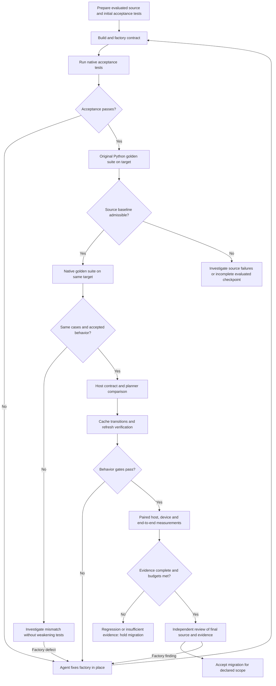

# Generic op → C++ comparison and migration gate

This protocol defines the evidence needed to accept a native migration within a
declared support matrix. Host verification covers the binding, validation,
output creation, planner, cache key, refresh hook, and enqueue path. Numerical
golden tests alone do not verify all of those behaviors.

Input authority is the **complete final evaluated branch**, pinned by
[prepare_branch](PREPARE_EVALUATED_BRANCH.md), not the run's starting commit or
a reconstructed DB source package. The branch's own evaluator revision supplies
the test suite. DB results are optional historical evidence, not a source overlay.

**Status:** this is a review protocol and implementation specification. The
current [validation driver](validate_port.py) automates build, factory-contract,
golden-outcome comparisons, supplied native acceptance tests (including cache
behavior), and a review receipt. It does
not implement the descriptor comparison, benchmark harness, or numerical
performance gate described here. Its `complete` status can include
`performance.classification: "not_measured"`; that is narrower than acceptance
under this protocol. No operation has been measured by writing this document.

## 1. Comparison flow



Host comparison cases can run alongside the corresponding golden/cache stages;
they need not add another full golden-suite traversal. Performance runs are
separate focused workloads. The two default golden executions and optional
historical diagnostic remain as described in [PORT_FLOW.md](PORT_FLOW.md).
The acceptance loop uses the same editable factory and workspace. An implementation
change invalidates previous passes; final golden checks, performance evidence and
review must describe the corrected code. The driver defaults to acceptance only;
golden checks are explicitly requested after that loop passes. Repairs are agent-led,
not an automatic LLM invocation inside the driver.

## 2. Freeze what is being compared

Use the frozen Python implementation and the distinct native entry point on
**one target revision and build**. Historical DB outcomes establish provenance;
old DB timings on another machine are not the performance baseline. A separate
existing TTNN operation can be a third benchmark reference, but cannot replace
the frozen candidate when checking translation fidelity.

Before collecting results, record:

- Candidate/export hashes, target commit and diff/untracked-file hashes,
  evaluator revision, entry-point routes, build command/flags and library hashes.
- Host CPU, affinity/thread settings, OS, Python/runtime versions, device
  architecture/IDs, mesh/grid, dispatch configuration, firmware and relevant
  profiler/debug/cache settings. Run the routes serially on the same hardware.
- Exact cases, seeds, input distributions, tolerances, optional arguments,
  output-allocation policy, legal aliases, and expected support refusals.
- Required metrics, workload weights if used, absolute/relative budgets, sample
  counts, uncertainty method, and a maximum measurement budget. Freeze these
  before looking at native results; do not relax them to make a result pass.

Build the case matrix from the operation's actual branches: smallest legal
case, tile/core/work-split boundaries on both sides, typical model cases,
largest supported cases, every factory/planner mode, dtype/layout/memory
configuration, optional-presence combination, and supported compute setting.
Do not claim the entire Cartesian product was tested when only representatives
were run. Record unsupported combinations and untested supported combinations
separately. Every claimed planner branch needs at least one exercised case.

## 3. Required gates and their evidence

| Gate | Compare or verify | Pass condition | Evidence |
| --- | --- | --- | --- |
| G0: identity and build | Frozen inputs, actual loaded libraries, native binding → checked factory | Inputs match plan; build and every factory-concept probe pass; native route observed with no generic-op fallback | Existing build/contract/route receipts plus dispatch review |
| G1: golden behavior | DB ↔ target Python; target Python ↔ native case identities and outcomes | No unaccepted baseline drift, missing cases, new refusal, crash, or numerical failure; unchanged golden tolerances | Full JUnit, raw exit status, route/call-count sidecars, comparison reports |
| G2: host contract | Binding, validation, output metadata/ownership, planner decisions | Every required case meets the contract below; every descriptor difference explained | Host case results, planner snapshots/diffs, source references |
| G3: cache behavior | Miss → hit, fresh buffers, changed attributes, return to old key | Correct output and runtime state at every transition; expected reuse/specialization; no skipped required case | Cache tests, address/key-transition records, refresh comparison |
| G4: performance | Public API, host stages, device span, synchronized completion | Valid matched samples; every required per-case metric meets its frozen budget | Raw samples, trace/CSV, cache observations, environment manifest, analysis |
| G5: final review | Final implementation and all gate evidence | Findings resolved; scope and limitations explicit; no stale receipts | Independent review plus comparison report bound to the validation plan |

Matching historical failures is a baseline-parity statement, not a passing
correctness claim. Carry accepted historical failures into the report and exclude
them from the supported-success claim. Unresolved correctness defects in the
claimed support matrix block acceptance, even if performance improves.

### G2a. Verify the observable host contract

Run the same table-driven cases through both entry points. For mutable/aliased
inputs, construct equivalent independent input sets and restore state between
runs. Record result metadata and errors, not just whether a call returned.

| Surface | Cases and assertions |
| --- | --- |
| Python binding | Positional/keyword/default behavior; accepted scalar conversions; overflow and wrong types; optional arguments; observed native dispatch |
| Validation | Legal and illegal shapes, dtype/layout/storage/device combinations, shard/grid limits; exception class and support-refusal classification; precedence when several inputs are invalid |
| Output contract | Count/container, logical/padded shape, dtype, layout, memory configuration, device, allocation/alias identity, and any supported preallocated/in-place output |
| Side effects | Inputs preserved unless mutation is part of the contract; output lifetime valid after wrapper return; allocation/enqueue behavior for refusals matches the documented contract |
| Numeric contract | Both paths satisfy the independent golden reference; focused paired outputs use identical inputs and predeclared tolerances; include finite/NaN/Inf behavior where supported |
| Language boundary | Native planning/dispatch does not invoke the Python planner; inspect GIL release/reacquisition and Python-object lifetime if the binding uses them |

Assert exact error text, traceback identity, custom-exception behavior, or
validation ordering only where promised by the source contract. Explicitly
document intentional changes. Do not silently describe a changed refusal as
parity. A new safety check may be appropriate, but changes the declared scope.

CPU-only tests can check pure scalar conversion, arithmetic, metadata planning,
and hashing if those paths accept real host metadata without device allocation.
Device-buffer validity, output allocation, actual enqueue, and cache reuse need
the real runtime/device. Label mocked checks as unit evidence; they cannot
satisfy those device-dependent claims.

### G2b. Compare what the host tells the device to do

For representative cases covering every planner branch, capture the Python
`ProgramDescriptor` before launch and the native factory descriptor on a miss.
This needs a comparison harness; the current driver does not capture them.
Use structured snapshots with these fields:

| Field group | Required comparison |
| --- | --- |
| Work selection | Factory/mode, participating core coordinates/ranges, per-core tile/stick counts and offsets, coverage without gaps or overlap |
| Kernels | Reader/compute/writer roles, source and helper identity, processor/NOC settings, compile arguments/defines, compute configuration |
| Circular buffers | Presence, core coverage, indices and every consumer reference, data formats, page/total sizes, local versus tensor-backed storage |
| Semaphores | Core coverage, initial values, allocated IDs and all producer/consumer references |
| Runtime ABI | Per-core and common argument lengths/order/values, scalar encoding, accessor tails, typed tensor-buffer bindings, tensor-backed CB addresses |
| Outputs | Output specs and tensor roles connected to the descriptor |

Normalize addresses to tensor role plus byte offset, preserving alias groups.
Retain raw addresses for fresh-buffer assertions. Normalize path relocation only
after checking source identity; record formatting and ABI adaptations separately.
Resource-ID renumbering is acceptable only with a consistent mapping of every
host and kernel reference. Never sort argument arrays or discard compile values,
core placement, formats, optional presence, or alias relationships to erase a
diff. An algorithmic/tuning change needs separate justification and measurements.

This comparison finds host translation errors even when numerical tests happen
to miss them. It does not prove that two identically wrong planners implement
the mathematical operation; the independent golden reference remains required.

### G3. Verify cached state as a sequence

Write an operation-specific expectation for each axis: structural specialization
(may require a new entry) or dynamic state (must refresh on a hit). Compare the
reuse behavior, not numeric hash values between different operation types.
Do not assume every shape/scalar change must miss: the actual generated program
and validated key contract decide that.

| Sequence | Required assertion |
| --- | --- |
| A → A | Second call hits; same semantics; no descriptor/program rebuild on a normal native hit |
| A → fresh A | Retain old allocations and verify new addresses; output uses new input/output/affine buffers; no spurious miss for addresses alone |
| A → B → A | B changes one structural axis; required specialization occurs; returning to A reuses its program with current buffers |
| scalar a → b → a | Dynamic scalars patch without a miss; structural scalars select the correct entry; use values that expose stale/default scalar bugs |
| absent → present → absent | Correct optional branch, argument contents, CB presence and specialization/reuse |
| distinct → aliased → distinct | Each legal alias class works in both directions, including a cache entry initially created with aliasing |
| valid → invalid → valid | Cache hits still reject invalid mutable device/buffer state; valid reuse remains correct after refusal |

Measure entry-count deltas around the operation after setup helpers complete;
helper transfers can populate their own cache entries. Also assert output
correctness at every transition: entry counts alone do not prove correct reuse.
Check runtime/common arguments and tensor-backed CB addresses, not only reader
input addresses. Bound allocation retention to the test's memory budget.

The [descriptor adapter](../../ttnn/api/ttnn/mesh_device_operation_adapter.hpp)
already has a compile-time `TT_DESCRIPTOR_PATCHING_PARITY_CHECK` branch. For
the explicit descriptor refresh-hook path it builds a scratch native descriptor
on a hit and compares patched runtime state using
[`assert_fastpath_parity`](../../tt_metal/impl/program/program_descriptor_patching.cpp).
This is required in the flow's correctness build; the factory gate verifies the
CMake option and the macro in the actual factory compilation. Acceptance tests
must prove real cache hits, not just repeated calls or an enabled flag. Keep
production-performance measurements on a separate verified configuration with
the option OFF. It compares native refresh
against native reconstruction, **not Python against C++**, and checks only the
state covered by that assertion. It cannot replace G2b or numerical tests.

Turn that diagnostic off for performance: reconstruction deliberately adds work.
Keep diagnostic and performance build identities explicit. The final normal
build must still have its own required golden/cache evidence.

## 4. Measure host cost without conflating it with device execution

The user-facing comparison is frozen Python public call versus native public
call from Python. Comparing only the inner `ttnn.generic_op` launch would omit
the Python planner being migrated. A direct C++ microbenchmark is useful for
attribution, but does not represent the full Python-facing migration benefit.

### Required timing boundaries

Also require a **native-only hot-versus-cold program-cache comparison** using
[NATIVE_CACHE_PERFORMANCE.md](NATIVE_CACHE_PERFORMANCE.md). Keep the compiled
kernel cache warm and program caching enabled for both cases; prove the same
native operation's hit path is faster than its miss path. This is a separate
performance requirement, not evidence of Python-to-C++ speedup. Noisy or missing
measurements cannot satisfy it, even when behavioral acceptance passes.

| Metric | Start → stop | Interpretation |
| --- | --- | --- |
| Warm public-call latency | Immediately before wrapper/binding call → its return, after prior device work is drained | Python wrapper, binding, validation, output allocation, hash/lookup, refresh, enqueue; can still include blocking |
| Host stage durations | Explicit nested zones around conversion, validation, output creation, hash/lookup, miss planning, refresh, enqueue | Attributes cost to actual host stages; report inclusive/exclusive semantics and thread identity |
| Warm synchronized latency | Before public call → completion of the following device synchronization | Full call-to-completion latency; includes host and device work |
| Batched submission/completion | Before N calls → last call returns; separately → final synchronization | Application throughput and queue/backpressure behavior; divided batch time is a per-call average, not individual latency |
| Device execution span | Profiler kernel start → final kernel completion for the invocation | Device critical span across participating programs/cores, with program count and configuration |
| First-use latency | Before first call → call return and separately → synchronization | Report in-memory program-cache miss with disk kernel cache warm, and process/kernel-cache cold separately |
| Native hot versus cold host path | Matched native hash/lookup-through-dispatch boundaries on hits versus misses | Same operation/configuration; compiled kernels warm; demonstrates the benefit of program-cache reuse |

Host and device execution overlap. Do not estimate host time by subtracting
device duration from synchronized wall time. Do not sum nested host zones or
overlapping device program durations. For multi-program/mesh operations use
supported correlated timing or report individual program/device spans separately;
do not compare unsynchronized device clocks. Trace replay, if supported and
relevant, is a separate workload because it bypasses much of per-call host work.

### Measurement procedure

1. Build once for the paired routes using the target's supported toolchain
   (`./build_metal.sh`, via the CI wrapper where required). Use that checkout's
   environment, created with `./create_venv.sh` if absent, then
   `source ./python_env/bin/activate`. Preserve all build and profiler settings.
2. Prepare identical device inputs outside timing. Keep natural output allocation
   inside the public call. Use preallocated output only when both APIs support
   it, and report it as a separate case. Make output retention/deallocation policy
   identical; retain each timed result through synchronization and release it
   outside the interval. Restore mutable inputs outside timing.
3. Run correctness/route checks and explicit per-route warmup. Confirm cache hits
   rather than assuming the disk compilation cache implies program-cache reuse.
   Record warmup counts and observed cache changes. First-use cases use separately
   isolated process/cache state for each route; never clear a shared cache.
4. For isolated warm latency, synchronize before the timer, call once using
   `time.perf_counter_ns()`, take the return timestamp, synchronize, then take the
   completion timestamp. Store both durations. Check results outside timing.
   This provides the two wall metrics; zones explain any blocking within them.
5. Start with 30 paired blocks of 100 warm single-call samples per route/case.
   Alternate source/native order across blocks (AB then BA), serially, to reduce
   order bias. Record process/session identity. Repeat across fresh sessions if
   session variability matters. A bounded pilot may adjust counts before the
   final measurement plan is frozen; larger cases may need smaller blocks.
6. Run a separate bounded batch-size sweep (for example N=1, 4, 16) to expose
   queue pressure and practical throughput. Keep outputs alive through batch
   synchronization. Label these results as batch averages; do not substitute
   their apparent p95 for individual-call p95.
7. Collect diagnostic host traces and device profiles separately from the
   minimally instrumented latency pass. Confirm expected operation/program counts,
   stage-zone presence, complete samples, and no dropped profiler records.
   Measure instrumentation impact before using instrumented latency for a budget.
8. Preserve every sample and exclusion reason. Report per-case median and p95,
   sample/block counts, variability, absolute delta, native/source ratio and an
   uncertainty interval. Resample paired blocks, rather than treating adjacent
   calls as independent, when estimating uncertainty. Include fresh-session
   variability in the resampling unit when sessions are repeated.

The counts above are a starting protocol, not a statistical guarantee. Missing
zones, noisy results, unexplained misses, mismatched profiler settings, or an
interval crossing the acceptance boundary yield insufficient evidence. Use the
predeclared measurement budget; do not keep sampling until a favorable pass.

### Existing tools and what still needs implementing

- [`profile_host_overhead.py`](../../tests/ttnn/profiling/profile_host_overhead.py)
  already separates submission and submission-plus-sync wall time. Its current
  stacked-call loops, `time.time()` clock, op registry and aggregate statistics
  are a starting reference, not the paired migration benchmark above.
- [`profile_host_overhead_with_tracy.py`](../../tests/ttnn/profiling/profile_host_overhead_with_tracy.py)
  extracts named C++ stages, but expects older marker names and launches pytest
  directly. Do not use its output without checking actual zone presence and
  nesting in this target; use the safe runner for new benchmark tests.
- [`device_operation.hpp`](../../ttnn/api/ttnn/device_operation.hpp) and the
  descriptor adapter identify actual hash, validation, cache, refresh and enqueue
  boundaries. Add missing stage zones/counters only where attribution needs
  them; benchmark the final source and track instrumentation overhead.
- [`run_safe_pytest.sh`](../../scripts/run_safe_pytest.sh) supports `--profile`
  with a Tracy-enabled build and prints the profiler CSV path. That wrapper
  warns that profiling can mask pytest's exit status. Require complete JUnit,
  expected case/call counts and valid raw measurements; a wrapper PASS alone is
  insufficient. Keep the ordinary correctness run separate.

Once an operation-specific paired benchmark test exists, use commands of this
form from the target root (the path below is a placeholder, not an existing test):

```bash
./scripts/run_safe_pytest.sh --run-all --no-precompile \
  path/to/test_operation_comparison.py --junitxml=/absolute/evidence/timing.xml
./scripts/run_safe_pytest.sh --run-all --no-precompile --profile \
  path/to/test_operation_comparison.py --junitxml=/absolute/evidence/profile.xml
```

The benchmark owns warmup and timing boundaries; runner wall time includes test
startup/fixtures and is not an operation metric. Profiler columns are documented
in [Profiling TTNN Operations](../../docs/source/ttnn/ttnn/profiling_ttnn_operations.rst).

## 5. Make the decision explicit

For each required case/metric, define an allowed absolute regression `a` and
relative regression `r`. One useful budget rule is:

```text
allowed_delta = max(a, r * source_statistic)
margin = (native_statistic - source_statistic) - allowed_delta
PASS: upper end of the predeclared uncertainty interval for margin <= 0
FAIL: lower end > 0
INSUFFICIENT_EVIDENCE: interval straddles 0, or required evidence is missing/invalid
```

Use consistent units; compute the statistic and source-dependent allowance
again within each paired resample. Apply the rule independently to required
median/p95 host-call and synchronized latency, device span, and first-use budgets.
Declare which stage metrics are diagnostic and which have hard budgets. Calibrate
absolute noise floors with source/source repetitions before the final A/B run;
there is no universal defensible microsecond or percentage threshold for all ops.

If reduced host overhead is the reason for migration, also freeze a minimum
improvement target and require its uncertainty bound to clear that target on the
declared primary cases. Merely passing a non-regression budget does not establish
a speedup. Weighted summaries may describe model impact but must not hide a
required per-case regression. Unexpected descriptor construction/compilation on
warm hits or unbounded cache/allocation growth blocks acceptance even if an
aggregate wall-time result is favorable.

Use these report outcomes:

| Outcome | Meaning |
| --- | --- |
| ACCEPTED_FOR_DECLARED_SCOPE | G0–G5 pass, required measurements meet budgets, and final evidence matches the reviewed source |
| BEHAVIOR_VERIFIED_PERFORMANCE_PENDING | G0–G3 pass; profiling missing, incomplete, or inconclusive; migration acceptance remains pending |
| BLOCKED_BEHAVIOR | A correctness, host contract, routing, descriptor, or cache requirement fails |
| BLOCKED_PERFORMANCE | A required performance budget fails on valid evidence |

No hardware means device-dependent gates remain pending. A successful build,
review, CPU-only planner check or mocked dispatch benchmark cannot substitute.

## 6. Evidence bundle and integration

Keep an immutable comparison report alongside the validation evidence, containing:

- Validation-plan hash, final source/build identities and support/case matrix.
- Gate statuses and reasons; host contract cases; descriptor diffs and declared
  adaptations; cache transition expectations and observations.
- Frozen metric budgets and sample plan; environment manifest; exact commands;
  JUnit, raw samples, traces/CSV and analysis-script hashes.
- Per-case statistics/intervals and decisions, incomplete coverage, known baseline
  failures, review identity/findings and final scoped outcome.

Today, attach the report and its raw evidence as hashed measurement files through
the existing [review receipt](REVIEW.md); use `measured` only for actual valid
measurements. The driver verifies file integrity, not these performance rules.
The reviewer must explicitly apply G0–G5; a `complete` receipt alone is insufficient.
Do not retrofit historical receipts or add undeclared fields to claim automated
enforcement. Source or instrumentation changes need fresh validation evidence.

The next implementation steps are a structured planner capture/comparator, an
operation-specific paired benchmark interface, and a versioned comparison-report
validator with explicit checkpoint enforcement before final review/completion.
Implement those as tooling changes with meaningful synthetic failure cases; real
per-operation device evidence is still required afterward.
