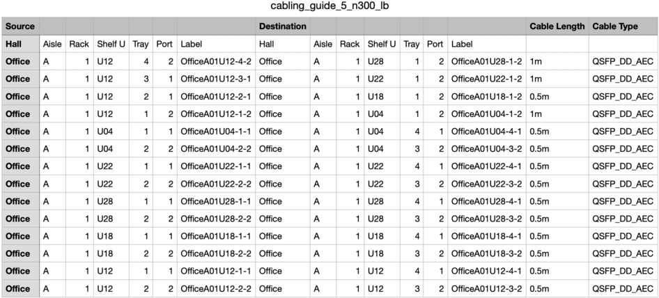

# Cabling Generator

A tool meant to be used in in scale-out of various Tenstorrent systems. Given
deployment specifications (rack locations of systems i.e. from the rack
elevation of a data center) and cabling specification (how to connect a set of
hosts in a certain topology) the cabling guide will generate a cutsheet listing
out each cabling link that a technician will need to attach.

## Expected Inputs

### Cabling Descriptor

This is where a topology expert will work. With no need to consider how the hosts are arranged physically, they can focus on the ideal way to connect a set of hosts together.

The Cabling Descriptor is designed to support a generic hierarchy structure so that users don't have to duplicate redundant work. At each level of hierarchy (i.e. Pod, SuperPod) the user can define connections to be duplicated at each instance of hierarchy. For example, a user only has to describe the Host->Self connections once as a part of the base node descriptor and those connections will be duplicated across all instances of that Node in the graph.

#### Cabling Hierarchy

There are 3 main parts to how the Cabling Hierarchy works

1. Nodes: the base level of the hierarchy, they describe a host system. A user of the Cabling Generator tool would define a node format as a collection of boards or use some defaults that we have included ourselves. For example, a T3K would best be described as a Node.
Examples can be seen at [Node Code](node/node.cpp).

2. Graphs: Essentially collections of Nodes (to represent a collection of multiple hosts) or other Graphs (to represent some hierarchy). This would be where users would consider groupings of hosts and how connections are duplicated at different levels of groupings.
Examples can be seen at [Graph Example](../tests/scaleout/cabling_descriptors/)

3. Root Instance: A summary of the hierarchical view of the system, also used to assign host_ids to each host. This structure in the hierarchy will enumerate every possible host in the system and where they are in the hierarchy. The host_ids enumerated here will help inform the mapping to real hosts defined in the Deployment Descriptor.
Examples can be seen at the last section of files in [Graph Example](../tests/scaleout/cabling_descriptors/)

### Deployment Descriptor

This is where a person managing a specific data center deployment of a system cluster will work. After installing/setting up the hosts required for the cluster, the technician can fill out a deployment descriptor enumerating the physical location and hostnames of each host in the cluster they wish to connect.
Examples can be seen at [Deployment Example](../tests/scaleout/deployment_descriptors/).

### Putting Them Together

One thing to consider with how the Cabling Generator puts both the Descriptors together is that the Cabling treats hosts indexes array, and the Deployment is basically an array of hosts. This is brought up to point out that order matters in the Deployment Descriptor; you will not get the same cabling guide if you mix up the order of hosts in a Deployment Descriptor

## Outputs

### Cabling Guide

The Cabling Guide is a `.csv` file that will be emitted by the cabling generator. It is a list of all cable connections that are part of the system. The Guide will specify the physical location of the host at each end of a connection, estimated cable length, and expected cable type.

Example:

### FSD

A `.textproto` file that will enumerate all the expected hosts, boards, and connected channels in a scaleout system.

## Notes/Warnings

- Usage examples can be found in the tests directory at [Examples](../tests/scaleout/test_factory_system_descriptor.cpp)

- As stated previously, the ordering of hosts in the deployment descriptor does matter. This means that you will get different cabling setups with different ordering of hosts.
