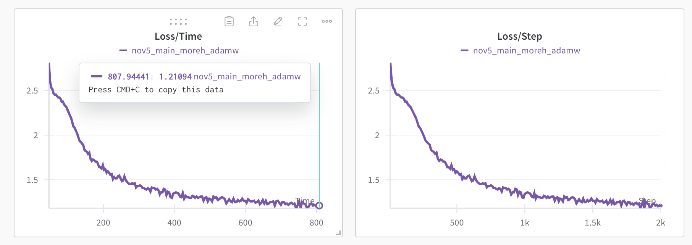

# tt-train: CPP ML training framework

## Overview
This repository contains a high-performance training framework developed in C++ designed to efficiently leverage the computational capabilities of Tenstorrent hardware. The framework is optimized to accelerate model training tasks, providing a seamless interface for training deep learning models on Tenstorrent's advanced hardware architecture.

# Install
1. Initialize and update submodules
```
git submodule update --init --recursive
```
2. Install CMake 3.30
3. Run setup script to configure env variables, direnv, clang-tidy and clang-format.
```
source ./init_repo.sh
```
4. Navigate to `tt-metal` folder and follow repository instructions to build it


# Building the project:
You have two options for building the project:

## 1. VSCode
* Install the [CMake](https://marketplace.visualstudio.com/items?itemName=twxs.cmake) and [direnv](https://marketplace.visualstudio.com/items?itemName=mkhl.direnv) extensions for VSCode.
* Use UI to build all targets.

## 2. Terminal
### Debug
```
cmake -DCMAKE_BUILD_TYPE=Debug -B build -GNinja
cmake --build build --config Debug --clean-first
```
### Release
```
cmake -DCMAKE_BUILD_TYPE=Release -B build -GNinja
cmake --build build --config Release --clean-first
```


# Run
## MNIST
### Training
```
# Navigate to the root directory of the repository
./build/sources/examples/mnist_mlp/mnist_mlp --model_path mnist_mlp.msgpack --num_epochs 10
```
### Evaluation
```
# Navigate to the root directory of the repository
./build/sources/examples/mnist_mlp/mnist_mlp --model_path mnist_mlp.msgpack -e 1
```

## NanoGPT Shakespeare
### Training
```
# Navigate to the root directory of the repository
TT_METAL_LOGGER_LEVEL=FATAL ./build/sources/examples/nano_gpt/nano_gpt
```

Training loss example from [wandb project](https://wandb.ai/tenstorrent-ml/tt_train_nano_gpt):



### Evaluation
```
# Navigate to the root directory of the repository
TT_METAL_LOGGER_LEVEL=FATAL ./build/sources/examples/nano_gpt/nano_gpt --model_path nano_gpt.msgpack -e 1 --data_path sources/examples/nano_gpt/data/shakespeare.txt

```

### CI only tests
If CI fails, but local tests pass as expected, please consider changing ENABLE_CI_ONLY_TT_TRAIN_TESTS definition in tests/CMakeLists.txt

### wandb support
If you don't have an account to wandb (or don't want to use it), use `-w 0` argument or run `wandb offline` beforehand (creates `wandb/settings` file)

# Contributing
* Create a new branch.
* Make your changes and commit them.
* Add new tests and run existing ones
* Open a pull request (PR).
* Ensure the PR is approved by at least one code owner before merging.
