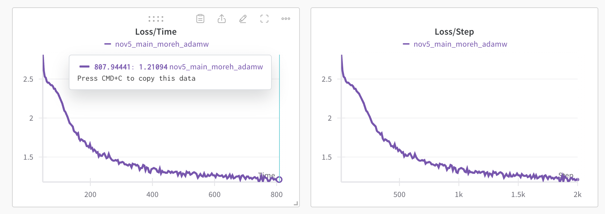

# tt-train: CPP ML training framework

## Overview
This repository contains a high-performance training framework developed in C++ designed to efficiently leverage the computational capabilities of Tenstorrent hardware. The framework is optimized to accelerate model training tasks, providing a seamless interface for training deep learning models on Tenstorrent's advanced hardware architecture.

# Prerequisites

tt-train is built as part of tt-metal. Before building, ensure you have:

1. Cloned the tt-metal repository with submodules:
```bash
git submodule update --init --recursive
```

2. Followed the tt-metal setup instructions in the main repository README.

# Building the project

tt-train is built using the `build_metal.sh` script from the tt-metal root directory.

## Terminal

```bash
# Release build (default)
./build_metal.sh --build-tt-train

# Debug build
./build_metal.sh --build-tt-train --debug

# Development build (RelWithDebInfo)
./build_metal.sh --build-tt-train --development
```

## VSCode

1. Open the tt-metal root directory in VSCode
2. Install the [CMake](https://marketplace.visualstudio.com/items?itemName=twxs.cmake) extension
3. Set `BUILD_TT_TRAIN=ON` in your CMake configure settings
4. Build all targets using the CMake extension


# Run
## MNIST
### Training
```
# Navigate to the root directory of the repository
./build/sources/examples/mnist_mlp/mnist_mlp --model_path mnist_mlp.msgpack --num_epochs 10
```
### Evaluation
```
# Navigate to the root directory of the repository
./build/sources/examples/mnist_mlp/mnist_mlp --model_path mnist_mlp.msgpack -e 1
```

## NanoGPT Shakespeare
### Training
```
# Navigate to the root directory of the repository
TT_LOGGER_LEVEL=FATAL ./build/sources/examples/nano_gpt/nano_gpt
```

Training loss example from [wandb project](https://wandb.ai/tenstorrent-ml/tt_train_nano_gpt):



For more information on training with the C++ version, please see the [NanoGPT Example README](sources/examples/nano_gpt/README.md).

For both training and evaluation, we encourage you to use the Python version of NanoGPT, which can be used via Jupyter Notebook found in the NanoGPT example directory.

More information on available configuration options can be found in the [configs directory](configs/README.md).

### Nightly only tests
If CI fails, but local tests pass as expected, please consider changing the
is_nightly_tt_train_tests_enabled in the nano_gpt_test.cpp
TT-Train nightly tests are all tests with "NIGHTLY_" in the name.
To run it in github please search for `Nightly tt-metal L2 tests`.

### wandb support
If you don't have an account to wandb (or don't want to use it), use `-w 0` argument or run `wandb offline` beforehand (creates `wandb/settings` file)

### GPU baseline
[This repository](https://github.com/philei-tt/tt-train_nanoGPT-gpu-baseline) can be used to compare speed and accuracy to GPU implementation of nanoGPT and gpt2s

# Profiler
Use of profiler requires additional setup. Follow instructions [here](./docs/PROFILER.md).

# Contributing
* Create a new branch.
* Make your changes and commit them.
* Add new tests and run existing ones
* Open a pull request (PR).
* Ensure the PR is approved by at least one code owner before merging.
