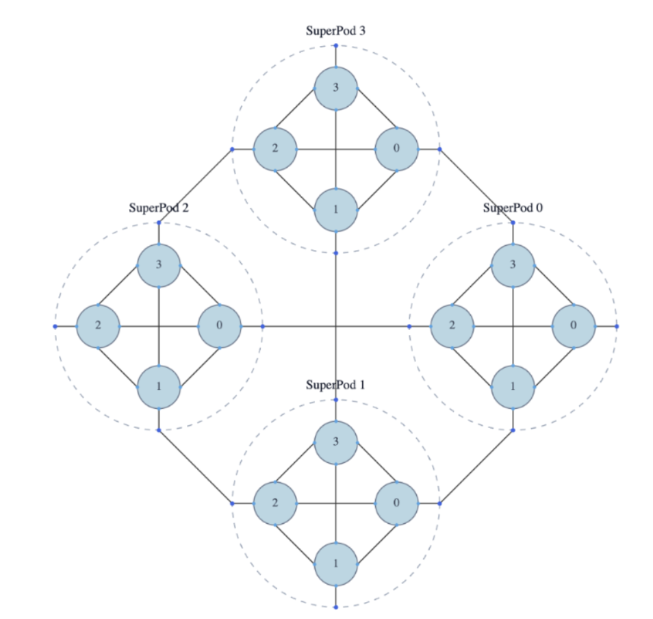

# Mesh Graph Descriptor (MGD) — Quick Use Guide

This guide explains how to define and load a Mesh Graph Descriptor (MGD) for TT‑Fabric using the schema in [`tt_metal/fabric/protobuf/mesh_graph_descriptor.proto`](protobuf/mesh_graph_descriptor.proto). It focuses on how to write a valid textproto, how node references work, and which fields are required.

A Mesh Graph Descriptor is the input to the Fabric Control Plane to specify a partition and topology of a device that a user would like to initialize fabric for.

---

### Where to look
- Schema: [`tt_metal/fabric/protobuf/mesh_graph_descriptor.proto`](protobuf/mesh_graph_descriptor.proto)
- Example textproto: [`tests/tt_metal/tt_fabric/custom_mesh_descriptors/mgd2_syntax_check_mesh_graph_descriptor.textproto`](../../tests/tt_metal/tt_fabric/custom_mesh_descriptors/mgd2_syntax_check_mesh_graph_descriptor.textproto)
- C++ API: [`tt_metal/api/tt-metalium/mesh_graph_descriptor.hpp`](../../tt_metal/api/tt-metalium/mesh_graph_descriptor.hpp)

## Usage

Mesh graph descriptor files must use the `.textproto` format. Provide the path to your mesh graph descriptor file via the `TT_MESH_GRAPH_DESC_PATH` environment variable.

```bash
TT_MESH_GRAPH_DESC_PATH="/home/my_custom_desc.textproto" ./your_fabric_script
```

## Background

A Mesh Graph Descriptor (MGD) specifies the logical topology that a user specifies for running their workload on an multi-host Exabox cluster.

This descriptor will capture information about how to compose a "big-mesh" (intra-mesh) across multiple host systems and how to connect meshes together (inter-mesh) in some user-topology. The MGD represents the minimum hardware allocation requirements for a workload to multi-host Exabox cluster.

Read more about Text proto at [Mesh Graph Descriptor 2.0](https://docs.google.com/document/d/1291H1Wl_pSkIGHP9B_L6oikaD3MflAGXg3Lox1O8S0c/edit?usp=sharing)


## Minimal workflow
> This is currently TBD
1) Write an MGD textproto
2) Provide Control Plane with the Mesh graph descriptor via `TT_MESH_GRAPH_DESC_PATH`
3) Run metal workload using fabric

```bash
TT_MESH_GRAPH_DESC_PATH="/home/my_custom_desc.textproto" ./your_fabric_script
```

Notes:
- Unknown fields in the textproto are tolerated for forward/backward compatibility during parsing.

---

## Pinning Fabric Nodes

Pinnings allow you to map logical fabric nodes to specific physical ASIC positions in the hardware system. This is useful when you need to constrain certain fabric nodes to specific hardware locations.

### Fabric Node ID

A `LogicalFabricNodeId` identifies a logical fabric node within a mesh:
- `mesh_id`: The identifier of the mesh instance
- `chip_id`: The chip identifier within that mesh, enumerated in **row-major order** based on the mesh's `device_topology` dimensions

For example, in a mesh with `device_topology { dims: [ 4, 8 ] }` (4 rows × 8 columns):
- `chip_id: 0` corresponds to position (0, 0)
- `chip_id: 1` corresponds to position (0, 1)
- `chip_id: 8` corresponds to position (1, 0)
- `chip_id: 31` corresponds to position (3, 7)

The chip_ids are assigned sequentially from 0 to `(rows × cols - 1)` in row-major order, where each row is traversed left-to-right before moving to the next row.

### Physical ASIC Position

A `PhysicalAsicPosition` identifies a physical ASIC location in the cluster:
- `tray_id`: The tray identifier from the cluster descriptor. A tray is a physical grouping of ASICs (e.g., a board or UBB unit)
- `asic_location`: The ASIC location within that tray, as defined in the cluster descriptor. This identifies which specific ASIC slot within the tray

These values come from the cluster descriptor and represent the physical hardware topology of the system.

### Pinning Syntax

Pinnings are specified as a separate top-level section in the MGD file:

```proto
# --- Pinnings ---------------------------------------------------------------

pinnings {
  logical_fabric_node_id {
    mesh_id: 0
    chip_id: 0
  }
  physical_asic_position {
    tray_id: 1
    asic_location: 1
  }
}
```

---

## Writing an MGD 2.0 textproto

An MGD has three main parts:
- mesh_descriptors: definitions of reusable meshes
- graph_descriptors: logical groupings and connectivity across meshes/graphs
- top_level_instance: the single root instance to instantiate

Optionally, an MGD can also include:
- pinnings: mappings of logical fabric nodes to physical ASIC positions (see [Pinning Fabric Nodes](#pinning-fabric-nodes))

Follow comments written in .proto file for detailed instructions for how to write an MGD file.
[`tt_metal/fabric/protobuf/mesh_graph_descriptor.proto`](protobuf/mesh_graph_descriptor.proto)

## Additional examples

### Single mesh (no graphs):
```proto
mesh_descriptors {
  name: "M0"
  arch: WORMHOLE_B0
  device_topology: { dims: [ 2, 4 ] }
  host_topology:   { dims: [ 1, 1 ] }
  channels:        { count: 2 }
}
top_level_instance { mesh { mesh_descriptor: "M0" mesh_id: 0 } }
```

### All‑to‑all between two graphs:
```proto
graph_descriptors {
  name: "G0" type: "POD"
  instances { mesh { mesh_descriptor: "M0" mesh_id: 0 } }
  instances { mesh { mesh_descriptor: "M0" mesh_id: 1 } }
  graph_topology: { layout_type: ALL_TO_ALL }
  channels: { count: 2 policy: STRICT }
}
graph_descriptors {
  name: "G1" type: "CLUSTER"
  instances { graph { graph_descriptor: "G0" graph_id: 0 } }
  instances { graph { graph_descriptor: "G0" graph_id: 1 } }
  graph_topology: { layout_type: ALL_TO_ALL }
  channels: { count: 2 policy: RELAXED }
}
top_level_instance { graph { graph_descriptor: "G1" graph_id: 0 } }
```

### 16 LoudBox Cluster


```proto
# --- Mesh Descriptors ------------------------------------------------------

mesh_descriptors {
  id: "M0"
  arch: WORMHOLE_B0
  device_topology { dims: [2, 4] }
  channels { count: 2 policy: STRICT }
}

# --- Graph Descriptors -----------------------------------------------------

graph_descriptors {
  id: "G0"
  type: "SUPERPOD"
  instances { mesh { mesh_descriptor: "M0" id: 0 } }
  instances { mesh { mesh_descriptor: "M0" id: 1 } }
  instances { mesh { mesh_descriptor: "M0" id: 2 } }
  instances { mesh { mesh_descriptor: "M0" id: 3 } }
  topology: { layout_type: ALL-TO-ALL }
  channels { count: 2 policy: STRICT }
}

graph_descriptors {
  id: "G1"
  type: "CLUSTER"
  instances { graph { graph_descriptor: "G0" id: 0 } }
  instances { graph { graph_descriptor: "G0" id: 1 } }
  instances { graph { graph_descriptor: "G0" id: 2 } }
  instances { graph { graph_descriptor: "G0" id: 3 } }
  topology: { layout_type: ALL-TO-ALL }
  channels { count: 2 policy: STRICT }
}

# --- Instantiations --------------------------------------------------------

top_level_instance { graph { graph_descriptor: "G1" id: 0 } }
```

If in doubt, follow the `.proto` in code; it is the source of truth.

---

## FABRIC Graph Requirement

Every MGD descriptor requires a `GraphDescriptor` with `type: "FABRIC"`. The FABRIC graph must be used as the `top_level_instance`.

**Important:** Any higher-level graph structures (e.g., CLUSTER, SUPERPOD graphs that contain FABRIC graphs) will currently be ignored by the implementation. Only the FABRIC-level graph is processed.

**Example:**
```proto
graph_descriptors {
  name: "G0"
  type: "FABRIC"
  instances { mesh { mesh_descriptor: "M0" mesh_id: 0 } }
  instances { mesh { mesh_descriptor: "M0" mesh_id: 1 } }
  # ... connections ...
}

top_level_instance { graph { graph_descriptor: "G0" graph_id: 0 } }
```

**Note:** If you define higher-level graphs like this, they will be ignored:
```proto
graph_descriptors {
  name: "CLUSTER"
  type: "CLUSTER"
  instances { graph { graph_descriptor: "FABRIC_GRAPH" graph_id: 0 } }
  # This entire structure will be ignored - only FABRIC level is processed
}
```

---

## Converting from MGD 1.0 (YAML) to MGD (textproto)

If you have an existing MGD 1.0 YAML file, you need to convert it to the textproto format. This section provides a step-by-step guide for conversion.

### Overview

MGD 1.0 used YAML format with sections like `ChipSpec`, `Board`, `Mesh`, and `Graph`. The new MGD format uses textproto with `mesh_descriptors`, `graph_descriptors`, and `top_level_instance`.

### Step-by-Step Conversion

#### 1. Convert Mesh Definitions

**MGD 1.0 YAML:**
```yaml
ChipSpec: {
  arch: wormhole_b0,
  ethernet_ports: {
    N: 2,
    E: 2,
    S: 2,
    W: 2,
  }
}

Board: [
  { name: 2x4,
    type: Mesh,
    topology: [2, 4]}
]

Mesh: [
{
  id: 0,
  board: 2x4,
  device_topology: [2, 4],
  host_topology: [1, 1],
}
]
```

**MGD textproto:**
```proto
mesh_descriptors {
  name: "M0"
  arch: WORMHOLE_B0
  device_topology { dims: [ 2, 4 ] }
  host_topology   { dims: [ 1, 1 ] }
  channels {
    count: 2
    policy: STRICT
  }
}
```

**Key changes:**
- `ChipSpec.arch` → `mesh_descriptors.arch` (convert to uppercase enum: `wormhole_b0` → `WORMHOLE_B0`)
- `Board.topology` → `device_topology.dims`
- `Mesh.device_topology` → `device_topology.dims` (same)
- `Mesh.host_topology` → `host_topology.dims` (same)
- `ChipSpec.ethernet_ports` → `channels.count` (use the number of ports per direction)
- Add `channels.policy` (typically `STRICT`)

#### 2. Convert Simple Mesh (No Inter-Mesh Connections)

**MGD 1.0 YAML:**
```yaml
Mesh: [
{
  id: 0,
  board: 2x4,
  device_topology: [2, 4],
  host_topology: [1, 1],
}
]

Graph: [
]
```

**MGD textproto:**
```proto
mesh_descriptors {
  name: "M0"
  arch: WORMHOLE_B0
  device_topology { dims: [ 2, 4 ] }
  host_topology   { dims: [ 1, 1 ] }
  channels {
    count: 2
    policy: STRICT
  }
}

top_level_instance { mesh { mesh_descriptor: "M0" mesh_id: 0 } }
```

#### 3. Convert Inter-Mesh Connections (RelaxedGraph)

**MGD 1.0 YAML:**
```yaml
Mesh: [
{ id: 0, board: 2x4, device_topology: [2, 4], host_topology: [1, 1] },
{ id: 1, board: 2x4, device_topology: [2, 4], host_topology: [1, 1] },
]

RelaxedGraph: [
  [M0, M1, 8]
]
```

**MGD textproto:**
```proto
mesh_descriptors {
  name: "M0"
  arch: WORMHOLE_B0
  device_topology { dims: [ 2, 4 ] }
  host_topology   { dims: [ 1, 1 ] }
  channels {
    count: 2
    policy: STRICT
  }
}

graph_descriptors {
  name: "G0"
  type: "FABRIC"
  instances { mesh { mesh_descriptor: "M0" mesh_id: 0 } }
  instances { mesh { mesh_descriptor: "M0" mesh_id: 1 } }

  connections {
    nodes { mesh { mesh_descriptor: "M0" mesh_id: 0 } }
    nodes { mesh { mesh_descriptor: "M0" mesh_id: 1 } }
    channels { count: 8 }
  }
}

top_level_instance { graph { graph_descriptor: "G0" graph_id: 0 } }
```

**Key changes:**
- `RelaxedGraph: [M0, M1, 8]` → `graph_descriptors` with `connections` between mesh instances
- The number `8` becomes `channels.count`
- Create a `graph_descriptors` with `type: "FABRIC"` containing all meshes
- Use `top_level_instance` to reference the graph

#### 4. Convert Inter-Mesh Connections (Strict Graph)

**MGD 1.0 YAML:**
```yaml
Graph: [
  [[0, S2], [1, S4]],
  [[0, S3], [1, S5]],
  [[1, S4], [0, S2]],
  [[1, S5], [0, S3]],
]
```

**MGD textproto:**
```proto
graph_descriptors {
  name: "G0"
  type: "FABRIC"
  instances { mesh { mesh_descriptor: "M0" mesh_id: 0 } }
  instances { mesh { mesh_descriptor: "M0" mesh_id: 1 } }

  # Convert port-based connections to device-level connections
  # [[0, S2], [1, S4]] means mesh 0 device 0 port S2 connects to mesh 1 device 0 port S4
  connections {
    nodes { mesh { mesh_descriptor: "M0" mesh_id: 0 device_id: 0 } }
    nodes { mesh { mesh_descriptor: "M0" mesh_id: 1 device_id: 0 } }
    channels { count: 2 }
  }
  # Add reverse connections for bidirectional links
  connections {
    nodes { mesh { mesh_descriptor: "M0" mesh_id: 1 device_id: 0 } }
    nodes { mesh { mesh_descriptor: "M0" mesh_id: 0 device_id: 0 } }
    channels { count: 2 }
  }
}
```

**Key changes:**
- `[[mesh_id, port], [mesh_id, port]]` → `connections` with `device_id` specified
- Port directions (N, E, S, W) are no longer needed in textproto
- Each connection pair typically needs bidirectional entries
- Count channels based on number of port connections (e.g., S2 and S3 = 2 channels)

#### 5. Convert Host Ranks

**MGD 1.0 YAML:**
```yaml
Mesh: [
{
  id: 0,
  board: Galaxy,
  device_topology: [1, 32],
  host_topology: [1, 1],
  host_ranks: [[0]]
}
]
```

**MGD textproto:**
```proto
mesh_descriptors {
  name: "M0"
  arch: WORMHOLE_B0
  device_topology { dims: [ 1, 32 ] }
  host_topology   { dims: [ 1, 1 ] }
  channels { count: 4 policy: STRICT }
}

top_level_instance { mesh { mesh_descriptor: "M0" mesh_id: 0 } }
```

**Note:** `host_ranks` in MGD 1.0 is implicit in the `host_topology` dimensions in MGD. The host topology dimensions define how the mesh is partitioned across hosts.

### Common Conversion Patterns

#### All-to-All Connectivity

**MGD 1.0:**
```yaml
RelaxedGraph: [
  [M0, M1, 4],
  [M0, M2, 4],
  [M1, M2, 4],
]
```

**MGD textproto:**
```proto
graph_descriptors {
  name: "G0"
  type: "FABRIC"
  instances { mesh { mesh_descriptor: "M0" mesh_id: 0 } }
  instances { mesh { mesh_descriptor: "M0" mesh_id: 1 } }
  instances { mesh { mesh_descriptor: "M0" mesh_id: 2 } }

  graph_topology: { layout_type: ALL_TO_ALL channels { count: 4 policy: STRICT } }
}

top_level_instance { graph { graph_descriptor: "G0" graph_id: 0 } }
```

#### Star Topology

**MGD 1.0:**
```yaml
RelaxedGraph: [
  [M0, M1, 2],
  [M0, M2, 2],
  [M0, M3, 2],
]
```

**MGD textproto:**
```proto
graph_descriptors {
  name: "G0"
  type: "FABRIC"
  instances { mesh { mesh_descriptor: "M0" mesh_id: 0 } }
  instances { mesh { mesh_descriptor: "M0" mesh_id: 1 } }
  instances { mesh { mesh_descriptor: "M0" mesh_id: 2 } }
  instances { mesh { mesh_descriptor: "M0" mesh_id: 3 } }

  connections {
    nodes { mesh { mesh_descriptor: "M0" mesh_id: 0 } }
    nodes { mesh { mesh_descriptor: "M0" mesh_id: 1 } }
    channels { count: 2 }
  }
  connections {
    nodes { mesh { mesh_descriptor: "M0" mesh_id: 0 } }
    nodes { mesh { mesh_descriptor: "M0" mesh_id: 2 } }
    channels { count: 2 }
  }
  connections {
    nodes { mesh { mesh_descriptor: "M0" mesh_id: 0 } }
    nodes { mesh { mesh_descriptor: "M0" mesh_id: 3 } }
    channels { count: 2 }
  }
}

top_level_instance { graph { graph_descriptor: "G0" graph_id: 0 } }
```

### Example Files

For complete examples, see:
- [`tests/tt_metal/tt_fabric/custom_mesh_descriptors/mgd2_syntax_check_mesh_graph_descriptor.textproto`](../../tests/tt_metal/tt_fabric/custom_mesh_descriptors/mgd2_syntax_check_mesh_graph_descriptor.textproto) - Comprehensive example with various features
- [`tests/tt_metal/tt_fabric/custom_mesh_descriptors/t3k_2x2_mesh_graph_descriptor.textproto`](../../tests/tt_metal/tt_fabric/custom_mesh_descriptors/t3k_2x2_mesh_graph_descriptor.textproto) - Simple multi-mesh example
- [`tt_metal/fabric/mesh_graph_descriptors/t3k_mesh_graph_descriptor.textproto`](../../tt_metal/fabric/mesh_graph_descriptors/t3k_mesh_graph_descriptor.textproto) - Single mesh example

### Tips

1. **Architecture enum**: Convert lowercase YAML values to uppercase proto enum values (`wormhole_b0` → `WORMHOLE_B0`)
2. **Channel count**: Use the number of ethernet ports per direction from `ChipSpec.ethernet_ports`
3. **Policy**: Default to `STRICT` unless you have specific requirements
4. **Device IDs**: When converting strict Graph connections, you may need to map port-based connections to device IDs based on your topology
5. **Bidirectional connections**: Remember to add reverse connections for bidirectional links
6. **Graph type**: Always use `type: "FABRIC"` for the top-level graph descriptor

If you encounter issues during conversion, refer to the schema documentation in [`tt_metal/fabric/protobuf/mesh_graph_descriptor.proto`](protobuf/mesh_graph_descriptor.proto) for detailed field descriptions.
