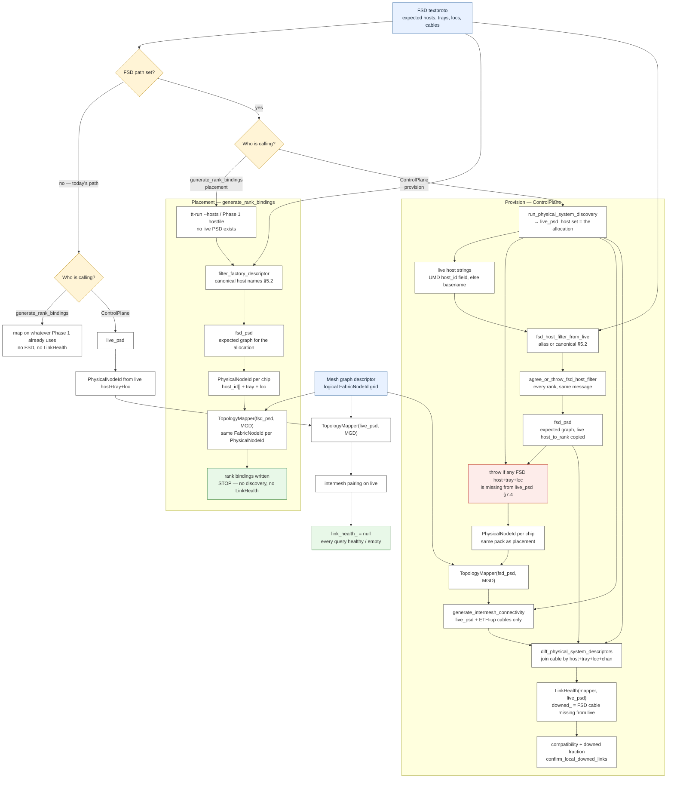

# Plan: FSD-backed topology map + Control Plane downed-links API

**Status:** Implementation plan
**Umbrella:** [tenstorrent/tt-metal#52859](https://github.com/tenstorrent/tt-metal/issues/52859)
**Contract:** [`README_downed_links_contract.md`](README_downed_links_contract.md)
**Depends on (already on main):** RTOptions FSD path ([#53451](https://github.com/tenstorrent/tt-metal/pull/53451)), `build_physical_descriptor_from_file` ([#53857](https://github.com/tenstorrent/tt-metal/pull/53857))
**FSD assets:** [tt-cluster-descriptors#18](https://github.com/tenstorrent/tt-cluster-descriptors/pull/18) (`79cb691` — pin until it merges). E2E pairing: [`PLAN_downed_links_testing.md`](PLAN_downed_links_testing.md) §6.

Namespace: `tt::tt_fabric`. Types live in `link_health.hpp`; `ControlPlane` forwards. No FSD ⇒ `link_health_ == nullptr`, forwarders return healthy / empty / `false` / `0`.

> **Decisions (testing plan §7.1–§7.6, §7.11).** Intermesh missing cables **are** downed links
> (`get_downed_intermesh_links()` is not empty). Cross-host intermesh is visible on
> `get_downed_links_between_hosts`. `is_link_healthy` is live-PSD presence and **works on mock**.
> FSD is golden: extras in the live PSD are OK; host mismatch and **>10%** of FSD-expected
> connections missing are errors (log the fraction). **STRICT + FSD: do not fatal on down** —
> record in LinkHealth (including intermesh) and ignore `is_link_healthy` / ETH-up for abort.
> Filter failure: every rank, same message. **Downgraded-plane intra holes → `get_unused_downed_links()`**;
> `planes_lost` ignores them (§3.3). **Mapper physical identity is `(host_id, tray, loc)`, not AsicID**
> (§5.5) — FSD placement and tt-run / live discovery must produce the same solve. See implementation
> §7.1–§7.3 and the contract README.

---

## 1. Goal

FSD present: convert FSD→PSD at init, map on that, diff against live PSD. Missing FSD edges are downed links.

No FSD: today's path (map on live). Every link healthy; `fsd_rerouting_active() == false`.

Same `TopologyMapper` on both paths. Physical identity is `PhysicalNodeId` = `{canonical host[64], tray, loc}` — §5.5 and [`PLAN_physical_node_id.md`](PLAN_physical_node_id.md). UMD `chip_unique_id` is a Cluster ChipId label **after** the solve, never a mapper key.



**What moves.** FSD + host list → `fsd_psd`. Live discovery (ControlPlane only) → `live_psd`. Both graphs are re-keyed to `PhysicalNodeId` before the solver, so placement and provision assign the same `FabricNodeId`. Pairing never reads the FSD. `LinkHealth` diffs the two graphs by `(host_id, tray, loc, chan)` after pairing.

**What does not move.** Placement never calls discovery. Overlay of live UMD ids onto the FSD graph is gone — Cluster ChipId is a post-solve lookup, not a mapper input. Missing **chip** at provision is a fatal **before** the mapper (§7.4), not a downed-link record.

---

## 2. `LinkHealth`

Inputs: `const TopologyMapper&` (expected PSD + mesh graph + asic→node) and `const PhysicalSystemDescriptor&` live. No default ctor. Non-copyable / non-movable. `link_health.hpp` forward-declares `TopologyMapper`.

Declare `link_health_` **after** `physical_system_descriptor_`, `fsd_physical_system_descriptor_`, `topology_mapper_` so it is destroyed first.

```cpp
// tt-metalium/experimental/fabric/link_health.hpp
namespace tt::tt_fabric {

class TopologyMapper;

class LinkHealth {
public:
    LinkHealth(const TopologyMapper& mapper, const tt::tt_metal::PhysicalSystemDescriptor& live);

    // nullptr = keep current binding. Invalidates get_downed_links() and all index pointers.
    void refresh(const TopologyMapper* mapper = nullptr,
                 const tt::tt_metal::PhysicalSystemDescriptor* live = nullptr);

    LinkHealth(const LinkHealth&) = delete;
    LinkHealth& operator=(const LinkHealth&) = delete;
    LinkHealth(LinkHealth&&) = delete;
    LinkHealth& operator=(LinkHealth&&) = delete;

    bool fsd_rerouting_active() const { return !downed_.empty(); }  // unused_downed_ does not count
    bool has_downed_links() const { return !downed_.empty(); }
    const std::vector<LinkInfo>& get_downed_links() const { return downed_; }
    const std::vector<LinkInfo>& get_unused_downed_links() const { return unused_downed_; }
    // remaining queries: README contract §4
    // get_downed_intermesh_links() is NOT empty when FSD-expected intermesh is missing from live.

private:
    const TopologyMapper* mapper_;
    const tt::tt_metal::PhysicalSystemDescriptor* live_;
    std::vector<LinkInfo> downed_;
    std::vector<LinkInfo> unused_downed_;  // §3.3 — downgraded-plane holes; not indexed as fabric-used
    std::unordered_set<EndpointKey> fsd_expected_;  // (asic, chan) the FSD declared
    std::unordered_set<EndpointKey> live_present_;   // (asic, chan) live discovery found — see §3.1
    std::unordered_map<NodeChanKey, const LinkInfo*> by_node_chan_;
    std::unordered_map<FabricNodeId, std::vector<const LinkInfo*>> by_node_;
    std::unordered_map<NodeDirKey, std::vector<const LinkInfo*>> by_node_dir_;
    std::unordered_map<LinkScope, std::vector<const LinkInfo*>> by_scope_;
    std::unordered_map<MeshPairKey, std::vector<const LinkInfo*>> by_mesh_pair_;
    std::unordered_map<EndpointKey, const LinkInfo*> by_physical_;
    std::unordered_map<tt::tt_metal::AsicID, std::vector<const LinkInfo*>> by_asic_;
    std::unordered_map<std::string, std::vector<const LinkInfo*>> by_host_;
};

}  // namespace tt::tt_fabric
```

`downed_` grows only in the first loop of `refresh()`; indexes hold `const LinkInfo*` into it. After indexing: `TT_ASSERT(downed_.data() == storage)`.

### 3.1 `refresh()`

Prerequisite — `topology_mapper.hpp` beside the throwing getter:

```cpp
std::optional<FabricNodeId> find_fabric_node_id_from_asic_id(tt::tt_metal::AsicID asic_id) const;
```

Reimplement `get_fabric_node_id_from_asic_id` on top of it (`TT_FATAL` on miss). `LinkHealth` must not `TT_FATAL` on an unmapped ASIC.

```cpp
LinkHealth::LinkHealth(const TopologyMapper& mapper, const PhysicalSystemDescriptor& live)
    : mapper_(&mapper), live_(&live) {
    refresh();
}

void LinkHealth::refresh(const TopologyMapper* mapper, const PhysicalSystemDescriptor* live) {
    if (mapper) { mapper_ = mapper; }
    if (live) { live_ = live; }

    downed_.clear();
    fsd_expected_.clear();
    live_present_.clear();
    /* clear indexes */

    const auto& expected = mapper_->get_physical_system_descriptor();
    const auto delta = diff_physical_system_descriptors(expected, *live_);

    downed_.reserve(count_directed(delta.missing_links));
    for (const auto& [src_asic, edges] : delta.missing_links) {
        for (const auto& [dst_asic, conns] : edges) {
            for (const EthConnection& conn : conns) {
                LinkInfo rec;
                rec.src_asic = src_asic;
                rec.src_chan = conn.src_chan;
                rec.src_host = expected.get_host_name_for_asic(src_asic);
                rec.src_tray = expected.get_tray_id(src_asic);
                rec.src_loc = expected.get_asic_location(src_asic);
                rec.dst_asic = dst_asic;
                rec.dst_chan = conn.dst_chan;
                rec.dst_host = expected.get_host_name_for_asic(dst_asic);
                rec.dst_tray = expected.get_tray_id(dst_asic);
                rec.dst_loc = expected.get_asic_location(dst_asic);
                rec.medium = conn.port_type;

                const auto src = mapper_->find_fabric_node_id_from_asic_id(src_asic);
                const auto dst = mapper_->find_fabric_node_id_from_asic_id(dst_asic);
                rec.logical_resolved = src.has_value() && dst.has_value();
                if (rec.logical_resolved) {
                    rec.src_node = *src;
                    rec.dst_node = *dst;
                    rec.scope = (src->mesh_id == dst->mesh_id) ? LinkScope::IntraMesh
                                                               : LinkScope::InterMesh;
                    if (rec.scope == LinkScope::InterMesh) {
                        // Still a downed link. Pairing did not assign this cable a port, so
                        // directions stay NONE. Do NOT drop it — get_downed_intermesh_links()
                        // must not be empty when FSD-expected intermesh is missing from live.
                    } else {
                        const auto dirs = directions_from_mesh_graph(mapper_->get_mesh_graph(), *src, *dst);
                        rec.src_direction = dirs.first;
                        rec.dst_direction = dirs.second;
                    }
                }
                downed_.push_back(std::move(rec));
            }
        }
    }

    const LinkInfo* const storage = downed_.data();
    for (const LinkInfo& rec : downed_) {
        const LinkInfo* p = &rec;
        by_physical_[{rec.src_asic, rec.src_chan}] = p;
        by_asic_[rec.src_asic].push_back(p);
        by_host_[rec.src_host].push_back(p);
        if (!rec.logical_resolved) {
            continue;
        }
        by_node_chan_[{rec.src_node, rec.src_chan}] = p;
        by_node_[rec.src_node].push_back(p);
        by_scope_[rec.scope].push_back(p);
        if (rec.src_direction != RoutingDirection::NONE) {
            by_node_dir_[{rec.src_node, rec.src_direction}].push_back(p);
        }
        if (rec.is_intermesh()) {
            by_mesh_pair_[{rec.src_mesh(), rec.dst_mesh()}].push_back(p);
        }
    }
    TT_ASSERT(downed_.data() == storage);

    for (const auto& [host, topo] : expected.get_system_graph().asic_connectivity_graph) {
        for (const auto& [asic, edges] : topo) {
            for (const auto& [peer, conns] : edges) {
                for (const EthConnection& c : conns) {
                    fsd_expected_.insert({asic, c.src_chan});
                }
            }
        }
    }
    for (const auto& [host, topo] : live_->get_system_graph().asic_connectivity_graph) {
        for (const auto& [asic, edges] : topo) {
            for (const auto& [peer, conns] : edges) {
                for (const EthConnection& c : conns) {
                    live_present_.insert({asic, c.src_chan});
                }
            }
        }
    }
}
```

`directions_from_mesh_graph` (intra only): `intra_mesh_connectivity[src.mesh][src.chip][dst.chip].port_direction` and the reverse `[dst.mesh][dst.chip][src.chip]`. Miss on either side → `NONE` for that side.

Intermesh missing edges **land in `downed_`** with `scope == InterMesh` and `NONE` directions. Do not
filter them against post-pairing `inter_mesh_connectivity_` — that table is assigned-up only and would
empty `get_downed_intermesh_links()`. Still construct `LinkHealth` after `generate_intermesh_connectivity()`
so intra directions and any later MeshGraph walk are valid.

`is_link_healthy` answers from live-PSD presence, not from absence in `downed_`:

```cpp
std::unordered_set<EndpointKey> live_present_;  // (asic, chan) present in the LIVE PSD
```

`expected ∧ ¬live_present_ → false`. Works on mock cluster descriptors: mock discovery builds the live
PSD from the YAML; no call to `cluster.is_ethernet_link_up`. On STRICT + FSD, do **not** use this API
(or ETH-up) to fatal — record the intermesh in LinkHealth and continue (§7.5 in the testing plan).

Physical fields always from **expected** PSD. Live is used only by the diff. `delta.extra_links` unused by `LinkHealth`. Never call `get_eth_chan_direction` / `get_routing_plane_id` (they throw on downed chans). No `routing_plane` on `LinkInfo`.

`planes_lost` is **not** “expected PSD chans minus live PSD chans”. A PSD has no direction, and a
downed channel has no live plane index. After routing-plane downgrade, missing cables on unused
planes are ignored — see §3.3.

### 3.2 Query rules (FSD present)

| Call | Result |
|------|--------|
| `is_link_healthy` | not in `fsd_expected_` → `out_of_range`; else `live_present_` decides. Works on mock (presence only). STRICT + FSD: do not use this to abort init. |
| `find_downed_link` | `nullopt` if healthy **or** never expected |
| `fsd_rerouting_active` / `has_downed_links` | `!downed_.empty()` (intermesh records count; **unused_downed_ does not count**) |
| `get_unused_downed_links` | intra holes on **downgraded** routing planes (§3.3). Documented; not fabric-used. |
| `planes_lost` / `get_num_downed_routing_planes_in_direction` | count of **active** `downed_` records on `(node, src_direction)` — unused-plane holes excluded |
| `is_intramesh` / `is_intermesh` | `logical_resolved && scope == …` |
| `get_downed_links(Unknown)` | empty |
| present-but-degraded | not downed (presence only) |
| `get_downed_intermesh_links` | FSD-expected intermesh missing from live; **not empty** when those cables are gone; directions `NONE` |
| extra live-only cables | ignored — FSD is golden; extras in the PSD are OK |

Indexes are src-side only; each cable is two directed records.

### 3.3 Unused downed links: holes on downgraded routing planes

> **Decision (testing plan §7.11).** If fabric **downgrades** routing planes, ignore those missing
> cables for rerouting / `planes_lost`. Still **document** them in LinkHealth: a real unplugged cable,
> but fabric does not route on that plane anymore. They go to `unused_downed_` /
> `get_unused_downed_links()`, not `downed_`.
>
> This is the **only** unused set. Intermesh holes are **active** downed links (§4) — do not read
> "documented, not routed on" as applying to them.

A plane index is a position in the **live** ordered channel list. A downed channel is absent from
that list, so `LinkInfo` has no `routing_plane` and `LinkHealth` must **not** call
`get_eth_chan_direction` / `get_routing_plane_id`. Classify by **counts per `(node, dir)`**, not by
inventing a plane for a missing chan.

**Where the numbers come from** (ControlPlane, after trim + merge — not from the PSD):

| Number | Source | When |
|--------|--------|------|
| `expected_planes(node, dir)` | MeshGraph `golden_link_counts` / `intra_mesh_connectivity[…][dir].connected_chip_ids.size()` | same on every rank |
| `live_planes(node, dir)` | `router_port_directions_to_physical_eth_chan_map_[node][dir].size()` **after** `initialize_dynamic_routing_plane_counts` + `order_ethernet_channels` + `trim_ethernet_channels_not_mapped_to_live_routing_planes` + `collect_and_merge_router_port_directions_from_all_hosts` | global after merge |

`initialize_dynamic_routing_plane_counts` already takes the row/col **min** of live ETH channels
(all-gathered). That *is* the downgrade. `trim` then drops extra live channels so the vector length
equals that min. Do not reimplement the min.

```cpp
struct RoutingPlaneSnapshot {  // lives in link_health.hpp; ControlPlane fills it
    std::unordered_map<NodeDirKey, size_t> expected_planes;  // MGD / golden
    std::unordered_map<NodeDirKey, size_t> live_planes;      // after trim + merge
};

void LinkHealth::classify_unused_from_routing_planes(const RoutingPlaneSnapshot& snap);
```

**Rule for each intra record** with `src_direction == dir` on `src_node`:

```
downgraded(node, dir)  ⇔  live_planes < expected_planes
```

- **Downgraded:** move the record from `downed_` to `unused_downed_`. Fabric already dropped that
  plane. Keep the `LinkInfo` (physical fields, hosts, chans) so DC bringup can see the cable; do
  **not** turn on `fsd_rerouting_active()`.
- **Not downgraded** (`live_planes == expected_planes`): leave it in `downed_`. That hole sits on a
  plane fabric still uses.
- Intermesh records stay in `downed_` (already decided §4). This unused set is the **intra**
  analogue of “documented, not routed on.”
- Trimmed **live** extras are not downed (they are present). Do not invent unused records for them.

```
planes_lost(node, dir) = count of remaining downed_ records with
                         src_node == node && src_direction == dir
                       = 0 when that direction was downgraded
```

That is `get_num_downed_routing_planes_in_direction`. Computable from `downed_` after classify.
No PSD walk, no ETH-up, no `get_eth_chan_direction`.

**When classify runs.** `LinkHealth` is still constructed after `generate_intermesh_connectivity()`
(cable identity). Classify is a **second pass**, after routing-table configure:

```
generate_intermesh_connectivity()
construct_link_health_after_intermesh()          // PSD diff → downed_ (intra + intermesh)
configure_routing_tables_for_fabric_ethernet_channels():
    initialize_dynamic_routing_plane_counts()    // row/col min = downgrade
    order_ethernet_channels()
    trim_ethernet_channels_not_mapped_to_live_routing_planes()
    collect_and_merge_router_port_directions_from_all_hosts()
    link_health_->classify_unused_from_routing_planes(snapshot)  // AFTER merge so every rank agrees
```

If `configure_routing_tables` never runs (CUSTOM / no fabric), skip classify; every intra hole stays
in `downed_` (no downgrade happened).

**Logs (required):**

```
log_info(LogFabric,
    "FSD: {} unused downed link(s) on downgraded routing planes (ignored for rerouting / planes_lost). "
    "See get_unused_downed_links().",
    unused_downed_.size());
```

Per direction that downgraded, warning is optional: `(node, dir) expected E live_planes L, moved N records to unused`.

Rebuild indexes after the move (`downed_` pointers invalidate). `unused_downed_` is **not** indexed
into `by_node_dir_` / `by_scope_` used by `get_downed_*`. Physical / host queries that should show
the unplugged cable for DC can include unused — document that `get_downed_links_for_host` returns
**active** only; unused is only `get_unused_downed_links()` unless a consumer asks to union them.
Default: unused is a separate set, like the old unused-intermesh diagnostic.

---

## 4. Intermesh: pairing still chooses up links; LinkHealth still records the downed ones

> **NOTE — `generate_intermesh_connectivity()` still gathers live / ETH-up cables only.**
> Pairing is unchanged. What changed: FSD-expected intermesh that is missing from live **is a
> downed link**. It goes into `downed_` with `scope == InterMesh` and is returned by
> `get_downed_intermesh_links()`. Directions stay `NONE` (pairing never assigned that cable a port).
> Cross-host intermesh is visible on `get_downed_links_between_hosts`. Do **not** filter these
> records against post-pairing MeshGraph — that table is assigned-up only and would empty the set.
>
> Construct `LinkHealth` after pairing so intra directions and any MeshGraph walk are valid. Intra
> still uses `intra_mesh_connectivity` both ways.

Two PSDs after FSD init:

| Member | Consumer |
|--------|----------|
| `fsd_physical_system_descriptor_` | mapper solve; `LinkHealth` expected |
| `physical_system_descriptor_` | gather / pairing; `LinkHealth` live |

```
physical_system_descriptor_->get_connecting_exit_nodes(my_host, neighbor_host)
        │
gather_intermesh_cables_for_exit_nodes                    control_plane.cpp:2792
        │  skip if !cluster.is_ethernet_link_up           :2858
        ▼
pair_logical_intermesh_ports / generate_intermesh_connections_on_local_host
        ▼
load_intermesh_connections → MeshGraph inter_mesh_connectivity_
```

`construct_link_health_after_intermesh()` runs **immediately after** `generate_intermesh_connectivity()`
in both init functions. Intra `src_direction` / `dst_direction` come from `intra_mesh_connectivity`.
Intermesh missing cables come from the PSD diff into `downed_`, not from filtering MeshGraph.
Do not reimplement pairing. Do not gather from the FSD. Do not feed pairing's cable hashes into
`LinkHealth` (§4.2).

### 4.1 Boundary deficit — deferred past v1

**Status: documented gap, not implemented in v1.** v1 reports missing intermesh **cables** in
`get_downed_intermesh_links()`. It does not report per-boundary requested-vs-resolved shortfall as a
count. This section is here so that gap is a known one rather than a surprise.

A down cable matters to fabric exactly when pairing could **not** cover it with a survivor. That is a
per-boundary shortfall, not a cable:

```
deficit(src_mesh, dst_mesh) = requested channels − resolved channels
```

Both numbers already exist at init. `requested` is `MeshGraph::get_requested_intermesh_ports()`
(sum of `std::get<2>(port_spec)`) or `get_requested_intermesh_connections()`; `resolved` is what
`validate_requested_intermesh_connections` counts as `num_resolved_between` (`control_plane.cpp`
§ "Part 2"). Direction is `inter_mesh_connectivity_[mesh][chip][dst_mesh].port_direction`.

Three things to settle whenever this is picked up:

1. **Granularity.** A deficit is a *count plus a direction*, never a cable, because `RouterEdge` is
   `{port_direction, connected_chip_ids, weight}` — there is no `chan_id_t` anywhere in
   `inter_mesh_connectivity_`. `LinkInfo` requires `src_chan` / `dst_chan` and every logical index
   keys on `(node, chan)`, so a deficit **cannot** be expressed as a `LinkInfo`. It needs its own
   accessor, e.g. `get_intermesh_planes_lost(src_mesh, dst_mesh)`, not a downed-link record.
2. **Relation to downed intermesh cables.** `get_downed_intermesh_links()` is cable identity (FSD
   vs live) with no verdict on pairing impact; the deficit is impact with no cable identity.
   Correlating the two (which missing cable caused which shortfall) is not always possible —
   pairing is a round-robin allocator over survivors, so a shortfall attributes to a boundary, not
   to a specific cable. Do not build an API that implies otherwise.
3. **A deficit can happen today.** The claim "init fatals if assigned &lt; requested" is only true in
   STRICT **without** an FSD. With an FSD, STRICT must not fatal on down (§7.1 / testing plan §7.5).
   The aggregate check in `generate_intermesh_connectivity` compares the cable count against
   `requested.size()`, which is a count of *source meshes*, so it backstops nothing. The real
   per-pair check warns rather than throws when `is_inter_mesh_policy_relaxed()`:
   `resolved == 0` throws, but `requested > resolved > 0` only logs a warning
   (`control_plane.cpp`, relaxed branch of `validate_requested_intermesh_connections`). So any test
   that *requires* zero intermesh loss is asserting something the code does not guarantee — assert
   on the **downed-cable** set (missing FSD intermesh in `get_downed_intermesh_links()`) and treat
   the deficit separately.

### 4.2 `LinkHealth` does not join pairing hashes

**Decision.** Downed intermesh is FSD-vs-live cable identity. Pairing decides which *live* cables fabric
routes on. Those are two different questions, and `LinkHealth` only answers the first. Do **not** pass
`AnnotatedIntermeshConnections`, `connection_hash`, or an `IntermeshAssignment` into `LinkHealth`.

A missing FSD intermesh cable is a downed link whether or not pairing assigned a survivor to that
logical port. `get_downed_intermesh_links()` reports the unplugged cable. Whether fabric still has a
route to the peer mesh is ControlPlane / MeshGraph after pairing — not a hash join inside `LinkHealth`.

Ctor stays `LinkHealth(mapper, live)`. Directions on intermesh records stay `NONE`. `RouterEdge` stays
`{port_direction, connected_chip_ids, weight}` — do not add channel ids.

Do not read `exit_node_directions_` or `intermesh_chan_to_peer_` from `LinkHealth` either: both are
local-only on the multi-host path, so anything published from them would be rank-dependent.

Per-boundary requested-vs-resolved shortfall stays deferred (§4.1). If that is picked up later, it
lives next to pairing in ControlPlane, not as a second identity key in `LinkHealth`.

---

## 5. Host filtering: which slice of the FSD to ingest

An FSD in the wild describes a whole superpod or an aggregated datacenter. A job runs on a subset of it.
Ingesting the whole FSD breaks both halves of this feature:

- The mapper is handed every chip in the datacenter, so the solve either fails or places the mesh on hardware
  the job does not own.
- Every cable on every non-allocated host is FSD-expected and missing from live, so `get_downed_links()`
  returns the rest of the datacenter and `fsd_rerouting_active()` is permanently true. The API is worthless.

So the FSD must be restricted to the allocated hosts **before** `build_physical_descriptor`. The mechanism
already exists (`filter_factory_descriptor`, and the `host_filter` argument of
`build_physical_descriptor_from_file`). What this section adds is where the host list comes from and what
happens when it does not line up.

### 5.1 Where the host list comes from

Two ingest sites, two sources.

| Site | Host list | Why |
|------|-----------|-----|
| ControlPlane init | `physical_system_descriptor_->get_all_hostnames()` on the **globally merged live PSD** | Discovery already ran across exactly the ranks the job owns, so the live PSD's host set *is* the allocation |
| `generate_rank_bindings` Phase 1 with FSD substitution | `tt-run --hosts` / the Phase 1 hostfile | No discovery ran, so there is no live PSD to ask |

For ControlPlane the rule is one line: **the filter is the live PSD's host set.** Do not add an
`--fsd-hosts` flag. A second source of truth for "which hosts" is a bug generator, because the two lists can
disagree and nothing would notice.

For `generate_rank_bindings`, tt-run already validates `--hosts` (`_parse_hosts_option` dedups and rejects
flag-like or whitespace-bearing tokens) and writes the Phase 1 hostfile (`write_phase1_openmpi_hostfile`).
Pass that same list down. If it is absent, an FSD path is an **error** — never fall back to ingesting the
whole FSD.

### 5.2 The join key is not a hostname

The live PSD's host keys are **not always OS hostnames**, so a naive string intersection silently matches
nothing. From `physical_system_discovery.cpp`:

- **Mock mode** (`TT_METAL_MOCK_CLUSTER_DESC_PATH`): prefer
  `ClusterDescriptor::get_host_id()` (the accelerator-group id, whose value today is the
  exact FSD / OS name —
  [`PLAN_umd_cluster_descriptor_hostname.md`](PLAN_umd_cluster_descriptor_hostname.md)).
  If the field is unset, today's basename fallback stays (ClosetBox). Do not pass a
  basename to `filter_factory_descriptor`; use the UMD `host_id` or the aisle-token alias
  (testing plan §6.3) until every FSD-paired YAML is filled.
- **Non-unique hostnames across ranks**: the key becomes `hostname + "_" + rank` (`run_local_discovery`;
  `my_host_name()` mirrors it through `all_hostnames_unique_`).
- **Live and unique**: the raw `gethostname()` result, short or FQDN depending on host config. The FSD
  carries whatever the cabling-descriptor author wrote. `run_blitz_superpod_automapper_tests.py` already
  needs a `hostname_matches` helper for this — the mismatch is real, not hypothetical.

Define one canonicalization and use it on **both** sides, for the filter and for the overlay's
`(host_id, tray, loc)` join:

```
canonical(h):
    if !psd.get_all_hostnames_unique():  strip a trailing "_<rank>"
    take the first label (up to the first '.')      // FQDN -> short name
    lowercase
```

Require it to be **injective over the live host set**. If two live hosts canonicalize to the same string,
fatal: the join is ambiguous and would otherwise attach one machine's cables to another. Normalize both
sides; never rewrite the FSD on disk.

### 5.3 Error cases

| # | Condition | Detection | Action |
|---|-----------|-----------|--------|
| 1 | FSD unreadable / unparseable | `load_factory_descriptor` throws | Fatal, print the path (already) |
| 2 | A live host is **absent from the FSD** | `filter_factory_descriptor` rejects requested-but-absent | Catch locally, set `local_filter_ok = false`, then **case 9**. Do not throw here. |
| 3 | FSD has hosts the job does not use | normal case | Filter silently; one info line `FSD: N hosts, using M` |
| 4 | **Zero overlap** | retained set empty | Fatal, distinct message, print a few names from each side (not a diff of thousands) |
| 5 | Allocation **not connected** in the FSD | retained hosts fall into >1 component (the builder already computes components for `build_physical_descriptors`) | Warn; fatal if the MGD needs a mesh spanning them |
| 6 | Live-only ASICs on a retained host | `extra_asics` in the diff | Warn per host with counts — mapping on the FSD makes them invisible to the mapper |
| 7 | **Board-type mismatch** per `(host_id, tray)` | compare FSD board type against live | Fatal — wrong/stale FSD, would otherwise surface as a confusing partial mapping |
| 8 | **Duplicate hostnames inside the FSD** | duplicates among retained hosts | Fatal — `filter_factory_descriptor` keeps *all* matching indices, so one name silently pulls in two machines |
| 9 | Any rank's filter failed, **or** ranks disagree on the filter | `agree_or_throw_fsd_host_filter` — all-reduce `local_ok` + host-list checksum + FSD fingerprint **before** ingest | **Every rank throws the same `std::runtime_error`.** See protocol below. |
| 10 | **Mock cluster + FSD** | live name from `ClusterDescriptor::get_host_id()` once filled ([`PLAN_umd_cluster_descriptor_hostname.md`](PLAN_umd_cluster_descriptor_hostname.md)); filename is not a hostname | Prefer the UMD `host_id` field (value is the exact FSD name). If the field is still empty, aisle-token alias (testing plan §6.3) so `PhysicalNodeId.host_id[]` and the filter still use FSD hostnames. Fatal if a live key has no field and no token, the token misses or collides, or the map is not injective. ClosetBox / no-field / no-FSD keeps the basename fallback. |

Case 2 **replaces** the earlier "unknown host in the FSD filter: warn, fall back to live, leave
`link_health_` null". That fallback is per-rank: one rank maps on live while the others map on the FSD, so
`fsd_rerouting_active()` disagrees across ranks and any collective gated on it deadlocks.

**Case 9 protocol — fail together, same message (testing plan §7.6).**

A local `TT_FATAL` / `TT_THROW` on the rank that noticed the bad filter hangs every other rank at the
next MPI collective. So:

1. Compute the local host list / try `filter_factory_descriptor` (and the mock alias) in a try/catch.
2. `local_filter_ok = false` on any local failure (missing host, zero overlap, unreadable FSD, alias miss).
   Do **not** throw yet.
3. `agree_or_throw_fsd_host_filter(ctx, checksum_sorted_host_list(hosts), fsd_fingerprint, local_filter_ok)`
   on **every** rank. This all-reduces, then either returns on every rank or throws on every rank.
4. Only then ingest.

Thrown `what()` is **byte-identical** on every rank — only all-reduced scalars, no rank-local host names:

```
FSD host filter is not identical on every rank (local_ok_min={}, host_checksum min={} max={},
fsd_fingerprint min={} max={}). Every rank fails together with this message.
No per-rank fallback to live mapping.
```

Logged at error with the same text (`LogFabric`). Tests in the testing plan §7.6 — not written yet.

Two consequences worth stating explicitly because they are easy to get backwards:

**Cables crossing the allocation boundary must not be reported as downed.**
`filter_factory_descriptor` drops any connection with an endpoint on a filtered-out host, which is correct —
those cables are outside the allocation. The edge chips' outward-facing channels are then unconnected in the
FSD-PSD while the live PSD may still show them connected to a non-allocated neighbor, so they land in
`extra_links`, which the diff already ignores. Assert this with a test: if they landed in `missing_links`
instead, every job would report the entire pod boundary as downed.

**`host_to_rank` after filtering is wrong and must be copied from live at provision.** `build_physical_descriptor` assigns
`host_to_rank` = FSD host index, and `filter_factory_descriptor` densely renumbers, so the FSD-PSD's ranks
are `0..M-1` in FSD **file order** — unrelated to the live MPI ranks. Copy `host_to_rank` from the live
PSD. That is **not** an AsicID overlay and does not change the solve (§5.5). `generate_rank_bindings`
does not need live ranks: it is producing the rank binding.

### 5.4 What the builder needs

- `filter_factory_descriptor`: match on canonical names, reject duplicates among the retained hosts, keep
  reporting *all* missing names at once (it already does).
- Optional `FilterReport` out-param (hosts dropped, connections dropped, component count) so ControlPlane
  logs one line and the builder stays quiet.

The init sequence that applies all of this is in §7.

### 5.5 Mapper identity is `(host_id, tray, loc)`, not AsicID

> **Decision.** The topology solver's physical node is a **POD**
> `{canonical_host[64], TrayID, ASICLocation}`, not UMD `AsicID`, not FSD `1..N`, and not
> `hash32(host)` stuffed into a `uint64`. Encoding, utility, mock→FSD hostname join, and
> mapper/builder call sites: [`PLAN_physical_node_id.md`](PLAN_physical_node_id.md) — **separate
> change**, land first. FSD does **not** encode ASIC ids. Fabric Manager and
> `generate_rank_bindings` must produce the **same** `FabricNodeId` placement as ControlPlane
> given the same FSD, whether or not UMD discovery has succeeded.
> [Piotr Stankiewicz, #54752](https://github.com/tenstorrent/tt-metal/pull/54752) shows the
> solver can take a tuple `GlobalNode`; production uses the POD (fixed `char[]`, not
> `std::string`). Mock + FSD pack the **exact** FSD hostname from
> `ClusterDescriptor::get_host_id()`
> ([`PLAN_umd_cluster_descriptor_hostname.md`](PLAN_umd_cluster_descriptor_hostname.md)) —
> the UMD descriptor's `host_id`, an accelerator-group id whose value today is that
> hostname. Not the builder's `host_id` index below. Filename is not a hostname.

**Why overlay-before-solve is the wrong fix.** The previous plan rewrote FSD AsicIDs to live UMD ids
(`overlay_live_asic_identity`) so the mapper would see one id space. Two consequences:

1. **Unstable solutions.** `physical_descriptor_builder` synthesizes `1..N` in `(host_id, tray, loc)`
   order. Live discovery uses UMD `chip_unique_id`. The solver erases `GlobalNode` to dense `size_t`
   in `GraphIndexData` **in node-iteration order**, which drives SAT variable numbering and DFS
   candidate order, so it **selects among equally valid mappings**. Different AsicIDs → different
   iteration order → a different legal placement. That is why FSD-based FM placement and the tt-run
   / live-PSD flow disagree today.
2. **Placement cannot wait on UMD.** The production flow is (1) compute placement → (2) run recovery →
   (3) provision. Recovery often makes UMD re-probe succeed. Forcing live ids into the FSD graph
   before the solve makes a host that failed discovery a **hard blocker for (1)**. Do not do that.

The rejected alternative — "build a PSD with live UMD ids and FSD connectivity" — is the same overlay,
and it has the same blocker. Connectivity comes from the FSD; identity comes from `(host_id, tray, loc)`.

**What changes in the mapper.** `TopologyMapper` already reads tray and location off the descriptor
(`topology_mapper.cpp`, the `config.asic_positions` / `hostname_to_asics` fill). Lift that into the
node type:

```cpp
// Production type is PhysicalNodeId (char host[64] + tray + loc). See PLAN_physical_node_id.md.
struct PhysicalNodeKey {
    char host[64];  // canonical (§5.2), NUL-padded C array — not a hash / std::string
    tt::tt_metal::TrayID tray;
    tt::tt_metal::ASICLocation loc;
};
```

- `PhysicalAdjacencyMap` / solver `GlobalNode` = `PhysicalNodeId`.
- `TopologyMappingConfig::asic_positions` and `hostname_to_asics` become **derived** (tray/loc and host
  are on the node). That is the payoff #54752 pins.
- `PhysicalSystemDescriptor::get_asic_id(hostname, tray, loc)` already exists — Cluster ChipId and
  `LinkInfo::src_asic` still resolve through it **after** the solve.
- Duplicate `(host_id, tray, loc)` is fatal (the descriptor already keys ASICs uniquely this way).
- Canonical host injectivity (§5.2) is now the **node identity**, not only the overlay join.

**Two stages, two fatals.**

| Stage | Who | Live UMD | Missing chip |
|-------|-----|----------|--------------|
| Placement | `generate_rank_bindings`, Fabric Manager | **not required** | not a fatal; the FSD node is still placed |
| Provision | ControlPlane init | required | **fatal** (§7.4) — allocation is wrong |

§7.4 stays. It is step (3), after recovery, not a placement check.

**Node order.** Position-keyed iteration is what makes the solve stable, but string hosts sort
lexicographically (`host10` before `host2`). That is a locality-heuristic quality issue, **not** a
stability issue: FSD and live both pack the same canonical host `char[]`, so they still agree. Do not
sort by AsicID to "fix" it — that reintroduces the divergence. If a later change wants rack order,
sort by `(aisle, rack, u, tray, loc)` from the FSD, still not AsicID. Existing mapper tests that
assert one specific mapping will need a re-baseline; that is expected and is the cost recorded in
#54752.

**What this deletes.** Overlay-before-mapper. Reserved-range synthesized ids as an "absent" detector
(§7.4 keys on `(host_id, tray, loc)` missing from live). The diff precondition "same AsicID space"
(§6 joins on position). `generate_rank_bindings` calling discovery or overlay when an FSD is set.

---

## 6. `diff_physical_system_descriptors`

```cpp
// physical_system_descriptor.hpp / physical_system_descriptor_diff.cpp
namespace tt::tt_metal {

struct PhysicalSystemDelta {
    std::vector<AsicID> missing_asics;
    std::vector<AsicID> extra_asics;
    AsicTopology missing_links;  // both endpoints, same shape as descriptor graph
    AsicTopology extra_links;
    AsicTopology mismatched_links;  // same LinkKey, different port_type / is_local
    std::vector<AsicID> mismatched_asics;

    bool matches() const {
        return missing_asics.empty() && extra_asics.empty() &&
               missing_links.empty() && extra_links.empty() &&
               mismatched_links.empty() && mismatched_asics.empty();
    }
};

// PRECONDITION: none on AsicID space. Join by physical position.
PhysicalSystemDelta diff_physical_system_descriptors(
    const PhysicalSystemDescriptor& golden, const PhysicalSystemDescriptor& candidate);

}  // namespace tt::tt_metal
```

Join key: canonical `(host_id, tray, loc, chan)` on each endpoint, then undirected
`(min(end, end), max(end, end))`. Host compared with §5.2 canonicalization (and the mock aisle-token
alias). Do **not** put `port_type` or AsicID in the key. Hash-map: golden `|= GOLDEN`, candidate
`|= CANDIDATE`. Sort output vectors. Diff ASIC graph only, not `host_connectivity_graph`.

AsicIDs in the output records are taken from **golden** when present, else candidate — they are labels
on the `LinkInfo`, not the join. Calling this without a prior overlay is the normal path.

---

## 7. ControlPlane

```cpp
std::unique_ptr<tt::tt_metal::PhysicalSystemDescriptor> fsd_physical_system_descriptor_;  // null if no FSD
std::unique_ptr<LinkHealth> link_health_;  // after mapper in declaration order
std::vector<LinkInfo> locally_unhealthy_;
const LinkHealth* get_link_health() const;  // nullptr if no FSD
```

```cpp
bool ControlPlane::has_factory_descriptor() const { return link_health_ != nullptr; }
bool ControlPlane::fsd_rerouting_active() const {
    return link_health_ != nullptr && link_health_->fsd_rerouting_active();
}
bool ControlPlane::is_link_healthy(FabricNodeId n, chan_id_t c) const {
    return link_health_ == nullptr ? true : link_health_->is_link_healthy(n, c);
}
const std::vector<LinkInfo>& ControlPlane::get_downed_links() const {
    static const std::vector<LinkInfo> kNone;
    return link_health_ == nullptr ? kNone : link_health_->get_downed_links();
}
void ControlPlane::refresh_connectivity_diff() {
    if (link_health_ == nullptr) {
        return;
    }
    link_health_->refresh();
    confirm_local_downed_links();
}
```

No-FSD: `is_link_healthy` → `true`; flags → `false`; vectors → `{}`; `optional` → `nullopt`; counts → `0`. Walk the whole surface in a test — a missing null check segfaults.

Init (`init_control_plane` / `init_control_plane_auto_discovery`):

```cpp
run_physical_system_discovery();  // live_psd — its host set IS the allocation
if (rtoptions_.get().has_factory_system_descriptor_path()) {
    // Mock: live keys are YAML basenames. Do not pass them to the filter.
    // Build aisle-token alias (testing plan §6.3) and filter with alias.values() (FSD hostnames).
    // Silicon: hosts = canonical_host_set(live) (§5.2).
    auto hosts = fsd_host_filter_from_live(*physical_system_descriptor_, fsd);  // alias or canonical
    // Catch local filter/alias errors → local_ok=false. Do not throw yet.
    agree_or_throw_fsd_host_filter(ctx, checksum_sorted_host_list(hosts), fsd_fingerprint, local_ok);  // §5.3 case 9
    fsd_physical_system_descriptor_ = build_physical_descriptor_from_file(path, hosts);
    // Do NOT overlay UMD AsicIDs onto the FSD graph. Mapper keys on (host_id, tray, loc) — §5.5.
    // FAIL EARLY at provision (§7.4): any FSD (host_id, tray, loc) with no live counterpart.
    // Reports every absent chip. Same message on every rank. Does not run in generate_rank_bindings.
    throw_on_fsd_chips_absent_from_live(*fsd_physical_system_descriptor_, *physical_system_descriptor_);
}
// TopologyMapper(*fsd_psd or *live_psd)  — PhysicalNodeKey, not AsicID
generate_intermesh_connectivity();          // fills MeshGraph inter_mesh_connectivity_
construct_link_health_after_intermesh();    // after pairing; intermesh downed from PSD diff
// later, configure_routing_tables: plane min + trim + merge + classify_unused (§3.3)
```

```cpp
void ControlPlane::construct_link_health_after_intermesh() {
    // After pairing so intra directions and MeshGraph are valid. Intermesh downed come from
    // the PSD diff (FSD-expected missing from live) and MUST NOT be empty when those cables
    // are gone. STRICT + FSD: do not fatal on down — the LinkHealth record is the result.
    // Unused-plane split happens later (§3.3), after trim + merge.
    if (!rtoptions_.get().has_factory_system_descriptor_path()) {
        return;
    }
    link_health_ = std::make_unique<LinkHealth>(*topology_mapper_, *physical_system_descriptor_);
    check_fsd_compatibility_and_downed_fraction();  // hosts match; >10% missing → error (unused still counts as missing)
    confirm_local_downed_links();                    // never TT_FATAL when FSD is set
}

void ControlPlane::classify_unused_downed_after_plane_trim() {
    // AFTER collect_and_merge so live_planes is identical on every rank.
    if (link_health_ == nullptr) {
        return;
    }
    RoutingPlaneSnapshot snap;  // expected from MeshGraph golden; live from trimmed+merged chan map
    link_health_->classify_unused_from_routing_planes(snap);
}
```
```

Replacing mapper/live without `refresh(mapper, live)` or reconstruct dangles `link_health_`. Host filter derivation and every failure mode of it: §5.

`load_physical_chip_mapping`: `FabricNodeId → (host_id, tray, loc) → live AsicID → cluster chip id` via
`PhysicalSystemDescriptor::get_asic_id`. There is **no missing-chip case to handle at provision**: §7.4
fails ControlPlane init if an FSD `(host_id, tray, loc)` has no live counterpart, so every node resolves to a
real ChipId and no placeholder is needed. Skip `validate_mesh_connections` ETH fatals on downed-cable
edges. Do **not** overlay AsicIDs before the mapper (§5.5). `verify_topology_mapping` Check 1/3 compare
against cluster unique ids using the live AsicID looked up by position after the solve.

### 7.1 STRICT + FSD — do **not** fatal on down; document in LinkHealth (testing plan §7.5)

> **THIS IS THE LOAD-BEARING RULE.** When an FSD is set, STRICT must not abort on a missing or
> downed cable. The outcome is a `LinkInfo` in `LinkHealth` — including intermesh. Do not consult
> `is_link_healthy` or `cluster.is_ethernet_link_up` to decide whether to fatal.

Sites that today `TT_FATAL` in STRICT and **must be skipped when FSD is present**:

| Site | Today | With FSD |
|------|-------|----------|
| `configure_routing_tables_for_fabric_ethernet_channels` (`connections_exist`) | fatal if missing and STRICT | skip + warning; record in LinkHealth |
| same function (link-count) | fatal if short and STRICT | skip + warning; record in LinkHealth |
| `validate_mesh_connections` | fatal if neighbor missing | skip + warning on FSD holes |
| `generate_intermesh_connectivity` (assigned < requested) | always fatal | skip + warning; intermesh hole is in LinkHealth |
| `validate_requested_intermesh_connections` (strict `resolved == requested`) | fatal on shortfall | skip + warning |
| `trim_ethernet_channels_not_mapped_to_live_routing_planes` | fatal if short | skip on FSD holes if it fires |
| `confirm_local_downed_links` ETH-up | fatal | skip; do not use ETH-up / `is_link_healthy` to abort |

Without an FSD, STRICT is unchanged.

**Do not consult `is_link_healthy` or `cluster.is_ethernet_link_up` to decide whether to abort.**
Those APIs stay available for diagnostics. Health is presence vs the live PSD and works on mock
(no ETH-up). On STRICT + FSD the abort path is closed; the `LinkInfo` *is* the result.

Intermesh holes go to `get_downed_intermesh_links()` (not a separate absent set). Directions `NONE`.

**Logs (required — same text in the README):**

```
# every skipped STRICT fatal
log_warning(LogFabric,
    "STRICT + FSD: skipping fatal on missing/short connection {} chan {} → {}. "
    "FSD in use — recording in LinkHealth, not fatal.",
    src, chan, dst);

# extras in live PSD (not downed)
log_info(LogFabric,
    "FSD is golden: {} live-only extra cable(s) ignored (not downed).",
    extra_count);

# after LinkHealth is built
log_info(LogFabric,
    "FSD: {} expected connections, {} downed ({:.1f}%). Extra live-only cables ignored.",
    expected, downed, 100.0 * frac);

# >10% missing
TT_THROW("FSD: {:.1f}% of expected connections are missing from live (limit 10%). "
         "See get_downed_links().",
         100.0 * frac);

# host mismatch (filter, §5.3)
// existing fatals: zero overlap / live host absent from FSD / wrong FSD

# FSD chip absent from live (§7.4) — thrown BEFORE the mapper, before any LinkHealth exists
TT_THROW("FSD: {} chip(s) expected by the factory descriptor are absent from the live cluster: {}. "
         "A missing chip is not a downed-link case — check the allocation and the boards.",
         absent_count, absent_list);  // absent_list: "host/tray/loc" per chip, all of them
```

### 7.2 FSD is golden; extras OK; hosts / 10% are errors (testing plan §7.4)

| Condition | Action |
|-----------|--------|
| Live has a cable the FSD does not (`extra_links`) | OK. Info log. Not downed. |
| FSD has a cable live does not | Downed link. The feature. §7.1. |
| **FSD has a whole chip live does not** | **Fatal, before the mapper. Not a downed link. §7.4.** |
| Hosts do not match (zero overlap / wrong FSD) | Fatal. §5.3 cases 2 and 4. |
| `downed_count / fsd_expected_count > 0.10` | Error. Log the fraction. Fail init. |

```cpp
void ControlPlane::check_fsd_compatibility_and_downed_fraction() {
    // Host mismatch already fatal at filter. Here: extras are OK; >10% missing is not.
    const size_t expected = link_health_->fsd_expected_count();  // directed or undirected — pick one and test it
    const size_t downed = link_health_->get_downed_links().size();
    const double frac = expected == 0 ? 0.0 : static_cast<double>(downed) / static_cast<double>(expected);
    log_info(LogFabric, "FSD: {} expected connections, {} downed ({:.1f}%). Extra live-only cables ignored.",
             expected, downed, 100.0 * frac);
    if (frac > 0.10) {
        TT_THROW("FSD: {:.1f}% of expected connections are missing from live (limit 10%). "
                 "See get_downed_links().",
                 100.0 * frac);
    }
}
```

### 7.3 `confirm_local_downed_links` — after `LinkHealth`

`Cluster` is local to this host. Candidates = presence-missing only. **When FSD is set, never
`TT_FATAL` here** — not on ETH-up, not on `is_link_healthy`. Record locals in `locally_unhealthy_`
when ETH is down; if ETH is up, still keep the presence-missing record in `get_downed_links()` and
log a warning (descriptor vs cluster disagree). Remote / unmapped: skip the ETH check.

```cpp
void ControlPlane::confirm_local_downed_links() {
    TT_ASSERT(link_health_ != nullptr);
    const auto local_chips = this->cluster_.get().user_exposed_chip_ids();
    std::vector<LinkInfo> locally_unhealthy;
    for (const auto& rec : link_health_->get_downed_links()) {
        if (!rec.logical_resolved) {
            continue;
        }
        auto chip = try_get_physical_chip_id_from_fabric_node_id(rec.src_node);
        if (!chip.has_value() || !local_chips.contains(*chip)) {
            continue;  // remote — this rank cannot check ETH
        }
        const auto& soc_desc = this->cluster_.get().get_soc_desc(*chip);
        auto eth_core = soc_desc.get_eth_core_for_channel(rec.src_chan, CoordSystem::LOGICAL);
        if (this->cluster_.get().is_ethernet_link_up(*chip, eth_core)) {
            log_warning(LogFabric,
                "FSD-expected cable missing from live PSD but ethernet is up: {} chan {} (chip {}). "
                "FSD is golden — not fatal. Record stays in LinkHealth.",
                rec.src_node, rec.src_chan, *chip);
            continue;
        }
        locally_unhealthy.push_back(rec);
    }
    locally_unhealthy_ = std::move(locally_unhealthy);
}
```

### 7.4 A chip in the FSD and absent from live: **fail early at provision** (testing plan §7.7)

> **DECISION.** At **ControlPlane init** (provision), a whole chip present in the (filtered) FSD with no
> counterpart in the live PSD is a **hard failure**, thrown **before** the `TopologyMapper` is
> constructed. `LinkHealth` is **not** involved. Downed links stay a **cable-level** concept. A missing
> *cable* is §7.1; a missing *chip* is a wrong allocation.
>
> This check does **not** run in `generate_rank_bindings` / Fabric Manager. Placement is step (1) of
> place → recover → provision; UMD often fails until recovery. See §5.5.

**Where.** After the FSD PSD is built, before the mapper, at ControlPlane only. **Definition of absent:**
an FSD `(canonical_host, tray, loc)` with no live ASIC at that position. `PhysicalSystemDescriptor`
already has `get_asic_id(hostname, tray, loc)`. Do **not** detect absence via a reserved-range AsicID
after overlay — overlay is gone as a mapper input.

```cpp
throw_on_fsd_chips_absent_from_live(*fsd_physical_system_descriptor_, *physical_system_descriptor_);
```

**Rules.**

- Report **every** absent chip, not the first, each with `(host_id, tray, loc)`. One pulled board is
  several ASICs; a per-chip abort makes the operator re-run init once per chip.
- The check reads only the filtered FSD PSD and the live PSD, both of which are identical on every rank
  when discovery is global — so **every rank throws the same message** and there is no partial-abort
  deadlock (same requirement as §5.3 case 9).
- **Precondition:** scope the check to hosts the live PSD actually enumerates. With
  `run_global_discovery` false the live PSD is local-only, so every remote chip would look absent and
  every rank would fatal on a healthy system.
- This fires **before** the >10% downed-fraction rule (§7.2) and before `validate_mesh_connections`, so
  a missing chip never reaches the code that would otherwise report it as a pile of downed cables.

**What this deletes.** The ChipId-0 sentinel, reserved-range "absent" ids, and overlay-before-mapper.

- **No placeholder ChipId anywhere** at provision. Past the check, every FSD node has a real live chip.
- **`verify_topology_mapping` is unchanged** at ControlPlane — all three checks stay fatal; absent chips
  never reach the mapper.
- **`LinkHealth` is unchanged.** It never sees a chip-level absence.

`LinkHealth`'s unmapped-ASIC handling (`logical_resolved == false`) stays for "the MGD solve did not
place this ASIC", never "absent from live".

---

## 8. Tests

**`test_physical_system_descriptor_diff.cpp`** (offline): identical → `matches()`; drop edge → both endpoints in `missing_links`; swap args → `extra_links`; drop ASIC; extra cable; drop+add; `port_type` mismatch → `mismatched_links` not missing+extra; tray mismatch → `mismatched_asics`; one cable two directed reps → one entry per end; stable sort; **disjoint AsicID spaces with the same `(host_id, tray, loc)` still match** (join is positional, §5.5).

**`test_link_health.cpp`**: copy `test_topology_mapper.cpp` fixture. Mutate live, keep mapper. Identical → empty; drop intra/cross-host/ASIC; extras not in `get_downed_links()`; `fsd_rerouting_active`; intra `src_direction` / `dst_direction` match MeshGraph both ways (typically opposites); `planes_lost` = count of **active** `downed_` on `(node, src_direction)` after classify (§3.3); unused-plane holes in `get_unused_downed_links()` and not in `downed_`; queryable after ctor; `refresh()` idempotent; `refresh(nullptr, &live)` rebind; not default-constructible; index pointers identity + in `downed_`; unmapped → `logical_resolved == false`, physical façade only; intra vs inter getters disjoint union of resolved; `medium` from expected `port_type`; physical fields from expected.

**Intermesh downed is not empty (required).** Drop an FSD-expected intermesh cable from the live PSD.

- `get_downed_intermesh_links()`, `get_downed_links(LinkScope::InterMesh)`, `get_downed_intermesh_eth_chans` contain it (one record per direction). `src_direction` / `dst_direction` are `NONE`.
- Cross-host: `get_downed_links_between_hosts` contains it.
- `is_link_healthy(node, chan)` and `is_link_healthy(asic, chan)` are `false`. This API is presence vs the live PSD and **works on mock cluster descriptors** (no `is_ethernet_link_up`).
- STRICT + FSD: init does **not** fatal; the record in LinkHealth is the result. Do not use `is_link_healthy` to abort.

Assert `LinkHealth` is constructed only after pairing in both ControlPlane inits.

**Host filtering (§5):** offline in `test_physical_descriptor_builder.cpp` — canonical match on FQDN / case / `_rank` suffix; injectivity violation fatal; duplicate retained hostnames fatal; zero overlap fatal; missing host reports *all* names; boundary cables land in `extra_links` and never `missing_links`; `host_to_rank` correct when FSD file order is reversed relative to MPI rank order; disconnected allocation detected. Mock + FSD with no token remap is a clean fatal.

**§7.6 filter agreement (plan):** one rank `local_ok=false` → every rank throws the **same** `what()`. Checksum disagreement → same. All-ok → no throw. Never local-fatal before the all-reduce. See testing plan §7.6.

**E2E FSD + mock PSD + ControlPlane (testing plan §6 / §4 / §5):** `test_fsd_psd_e2e.cpp` and the FSD cases in `test_multi_host.cpp`. Assets from tt-cluster-descriptors #18. Hostname join is the aisle-token alias (§6.3) — do not change discovery. Single-host and multi-host ControlPlane tests both set an FSD. Start with `SC20_32x4_revAB_aisleC`.

**ControlPlane:** no-FSD walk entire contract. Path set → mapper on FSD PSD, **AsicIDs not rewritten**. Every rank `get_downed_links()` identical including remotes. STRICT + FSD + downed intra/intermesh → init completes, records in LinkHealth. No FSD + STRICT + missing connection → still fatals. Extras in live PSD → OK. Host mismatch → fatal. >10% of FSD-expected connections down → error + log. **Placement stability (§5.5):** same FSD, synthesized vs UMD-like AsicIDs → identical `FabricNodeId` placement. `generate_rank_bindings` with FSD does not call discovery.

---

## 9. Non-goals

- Second solver; FSD protobuf above the builder; `generate_cluster_descriptor_from_fsd` as map input
- Fabric 2.0 reroute planner (consumes this API)
- Acting on extras; pairing FSD-expected (including down) intermesh cables
- Re-implementing RTOptions / `tt-run --factory-system-descriptor`
- A separate `--fsd-hosts` flag: at runtime the filter is the live PSD's host set, full stop (§5.1)

---

## 10. Open issues — recorded, not yet folded into the plan

**Tests for everything below: testing plan §10**, numbered to match. Several of these are decisions the
test cannot invent, so close the item and the test together.

From the plan review. The big four (intermesh `is_link_healthy`, the blinded physical façade, the
unimplementable MeshGraph walk, absent chips) are resolved in §3.1, §4, and §7.4. What follows is
everything left over. **Nothing below is decided or implemented** — the numbering is the review's,
kept so the discussion is traceable.

### 10.1 Open

**#8 `construct_link_health_after_intermesh()` guards on the wrong condition.** It tests
`rtoptions_.has_factory_system_descriptor_path()` (§7 sketch), but the thing that must exist is
`fsd_physical_system_descriptor_`. Any path that sets the RTOption and still leaves the FSD PSD null
gives `has_factory_descriptor() == true` with an empty diff — a silent all-clear, the worst failure mode
this feature can have. Guard on `fsd_physical_system_descriptor_ != nullptr`.
Related: `build_physical_descriptor_from_file` **throws** on an unknown hostname in the filter
(`physical_descriptor_builder.hpp:46`). §5.3 case 2 says a live host absent from the FSD is fatal on
every rank, so there is no fallback to fall into — but that makes the throw the *only* path, and the
plan never says which frame catches it or how it reaches `agree_or_throw_fsd_host_filter`'s
`local_ok=false`.

**#9 `find_fabric_node_id_from_asic_id` must return `nullopt` for unmapped, not only for not-found.**
The existing throwing getter fatals on both conditions (`topology_mapper.cpp:178-183`), and
`is_mapped == false` now means only "the MGD solve did not place this ASIC" — §7.4 fails early on absent
chips, so it no longer also covers "absent from live". `LinkHealth::refresh()` still walks such ASICs. The
file-changes overview entry for `topology_mapper.*` only says "find + `TT_FATAL` on miss", which reads as
covering not-found alone. Spell out both: absent from `asic_id_to_mapping_` **and** present but `!is_mapped` → `nullopt`.

**#10 `planes_lost` has no defined answer for intermesh.** §3.2 keys it on `(node, src_direction)`, and
intermesh records carry `src_direction == NONE` by decision, so intermesh losses silently contribute
nothing — correct, but only by accident of the key. State it: `planes_lost` is **intra-only** and
returns 0 for intermesh. There is no `intermesh_planes_lost` in v1 (that would have been a pairing
join, which §4.2 rejects). Say the same in the README so no caller reads 0 as "no intermesh loss".

**#11 `refresh_connectivity_diff()` can never change its answer.** It re-diffs the same two stored
descriptors (§7 sketch, `link_health_->refresh()` with no arguments) and nothing re-runs discovery, so
it is a no-op that the README advertises as "recompute". Either drop it from v1 or have it take a fresh
live PSD. Note `LinkHealth::refresh(mapper, live)` already accepts one — only the ControlPlane forwarder
is degenerate.

**#12 `PhysicalSystemDelta::missing_links` is an `AsicTopology`, not "the same shape as the descriptor
graph".** The trailing comment on that field in the §6 struct is wrong: the descriptor graph is
`unordered_map<std::string, AsicTopology>`
(`api/tt-metalium/experimental/fabric/physical_system_descriptor.hpp:143`). Flattening across hosts
is the right call — downed links are not per-host — but the comment should say so. Separately,
`AsicTopology`'s edge list is `vector<pair<AsicID, vector<EthConnection>>>`, so the **same destination
ASIC can appear in more than one entry**, and the diff must merge them before comparing or it will
report false misses. §8's diff tests do not cover that shape.

**Global completeness is conditional.** README §4's claim holds because `asic_id_to_mapping_` covers
every PSD ASIC and the mapping is broadcast (`topology_mapper.cpp:1055-1067`) — but it is void when
`run_global_discovery` is false, since then the PSD is local-only and ranks cannot agree on remote
records. The README states the guarantee unconditionally. Add the precondition.

### 10.2 Resolved, with residual risk worth a second look

**#4 residual — the "assigned < requested" backstop is weaker than the plan assumed.** The plan no
longer depends on it (intermesh downed is populated from the diff, §4), so this is no longer
load-bearing. But for §7.1's table: the strict per-pair check does fatal
(`control_plane.cpp:3111`), while the relaxed-policy branch already only **warns** on
`requested_channels > resolved` (`control_plane.cpp:3141-3155`) and only throws when `resolved == 0`
(`:3131`). So the row that says "skip + warning when FSD is present" partly describes behaviour that
already exists under relaxed policy — check whether the FSD skip adds a *second* warning for the same
condition, and note that line numbers here drift: cite by function name, not offset.

**#5 residual — warning volume when a peer host drops out of discovery.**
`remove_unresolved_nodes` and `erase_one_sided_connections`
(`physical_system_discovery.cpp:304-313`) erase every edge whose peer ASIC never reported. If a peer
*host* fails to join discovery, this rank sees FSD-expected + missing-from-live + local ETH **up** for
every cable to that host at once. §7.3 no longer fatals on that (good), but it logs one warning per
cable — potentially hundreds. Consider aggregating per peer host, and note that the "descriptor vs
cluster disagree" wording is misleading for this case: the descriptor is right, the peer is simply
absent.

### 10.3 Checked and holding (do not re-litigate)

- Neither `physical_system_descriptor_` nor `topology_mapper_` is reassigned after init, so
  `LinkHealth`'s raw pointers cannot dangle through any current path. The declaration-order rule (§7)
  still matters for destruction.
- The mapping is broadcast to all ranks, so `get_downed_links()` is rank-independent — subject to the
  `run_global_discovery` precondition above.
