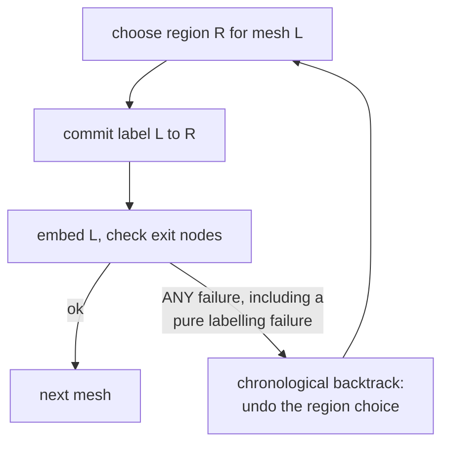
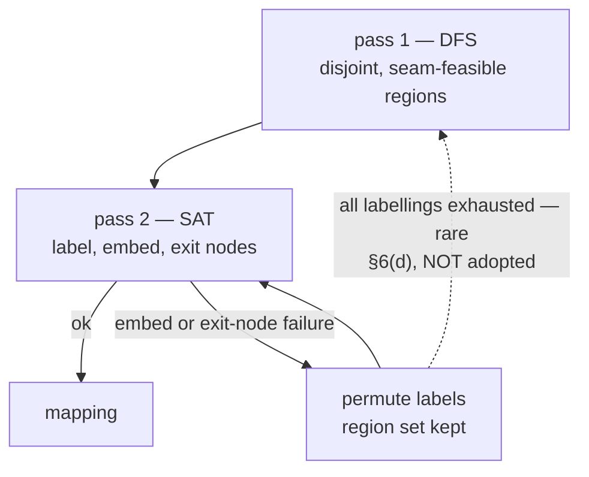
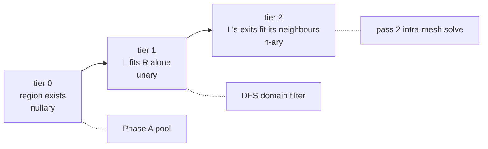
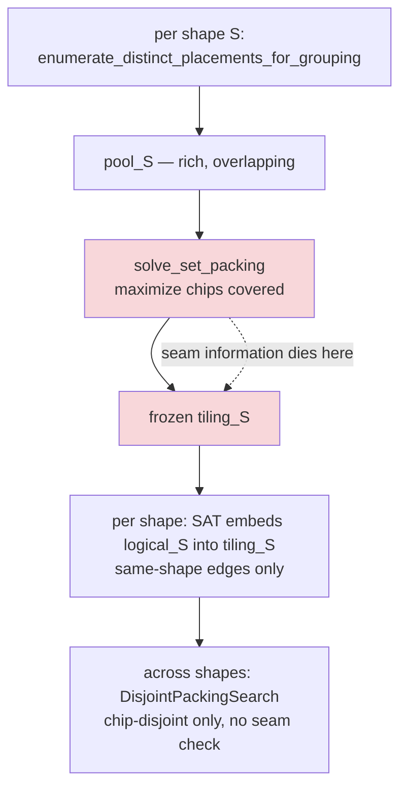
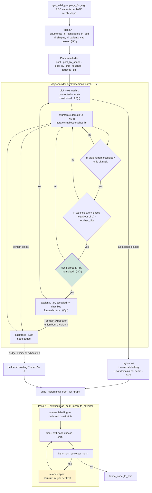
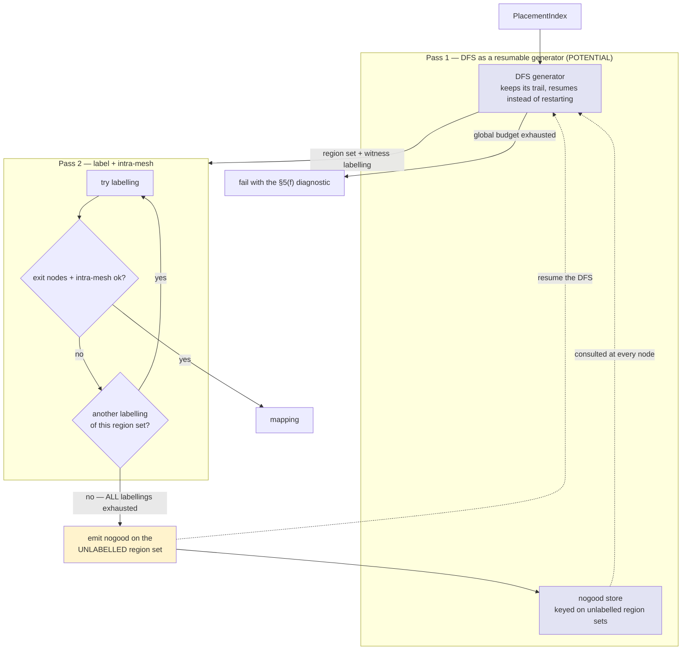
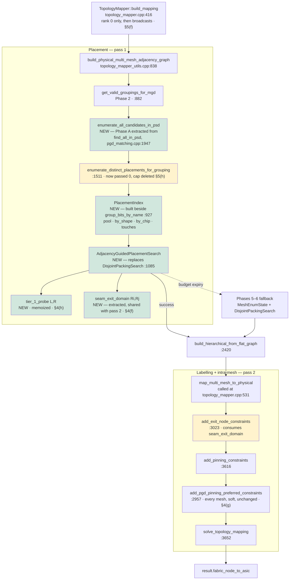

# Plan 3 — Connectivity-aware PGD grouping placement

**Adjacency-guided mixed-shape placement.** Replace the per-shape maximum-coverage tiling with a single
DFS that grows one mixed-shape placement along the MGD's own mesh graph.

**Status: WIP.** The search is implemented (`PhysicalGroupingDescriptor::solve_adjacency_guided_placement`
and the pool entry point) and covered by offline unit tests. It is not wired into
`build_physical_multi_mesh_adjacency_graph`; `find_all_in_psd` is still the production placement path.

**Priority: 2.** This is the plan that actually answers #54623.

Tracking issue: [#54623 — \[Auto-mapper\] Verify inter-mesh connectivity in heterogeneous placements via
SAT-based joint planning](https://github.com/tenstorrent/tt-metal/issues/54623)
Related: #40640 (SAT engine), #50510 (epic), #52016 (pipeline-stage adjacency in MGD).
Sibling plans: [Plan 1 — PGD-shape-aware inter-mesh constraints](TOPOLOGY_MAPPER_PLAN_1_PGD_SHAPE_INTERMESH_CONSTRAINTS.md),
[Plan 2 — incremental inter-mesh solving](TOPOLOGY_MAPPER_PLAN_2_INCREMENTAL_INTERMESH_SOLVE.md).

> **Goal.** Choose physical regions by walking the logical mesh-level adjacency graph, placing one mesh
> at a time next to a neighbour that is already placed, so every declared inter-mesh boundary is
> satisfied *by construction* rather than checked after the fact.

"Seam" is used throughout and is not a codebase term; §3 defines it and says exactly what it means.

**This does not replace the inter-mesh solve.** §4 states the architecture — two coupled passes — and
the rule that fixes what the DFS is allowed to decide: *the DFS decides properties of the region set;
the inter-mesh solve decides properties of the labelling.* §4(c) and §4(e) are the in/out lists.
§6 records optimizations under consideration and is explicitly undecided.

---

## 1. Where placements are chosen today

`build_physical_multi_mesh_adjacency_graph`, `tt_metal/fabric/topology_mapper_utils.cpp:838`:

| Phase | Lines | What happens |
| --- | --- | --- |
| 2 | `882` | `get_valid_groupings_for_mgd` → candidate groupings per mesh shape |
| 3 | `907–951` | Per shape: `find_all_in_psd` → `PsdPlacement`s; one chip bitmask per placement (`927–946`) |
| 4 | `953–970` | Fast path: single shape returns the pre-built graph directly |
| 5 | `993–1058` | One `MeshEnumState` per shape: own logical subgraph (`1037`), own physical graph, own `TopologyMappingEnumerationSession` |
| 6 | `1085–1458` | `DisjointPackingSearch`: DFS over one cached solution per shape, `bitset_disjoint` only |
| 7 | `1480–1515` | Re-key winners under logical MeshId; `build_hierarchical_from_flat_graph` |

The important part is inside Phase 3, one level down. `find_all_in_psd` →
`solve_for_many_groupings_to_psd_heterogeneous` (`physical_grouping_descriptor_matching.cpp:1718`) has
two phases of its own:

```
Phase A  enumerate_distinct_placements_for_grouping(grouping, …, kMaxPlacementsPerGrouping = 1024)
         → a rich pool of candidate placements, overlapping, deduped by image set   (1739–1789)

Phase B  solve_set_packing(candidates, universe_size, kSetPackingBudget = 5s)
         → ONE maximum-weight disjoint subset, weight = asic_slots.size()           (1800–1830)
```

Only Phase B's survivors are returned. So `placements_by_shape["S4x1"]` is not a menu of options — it is
a single frozen tiling of the machine chosen to cover as many chips as possible. The loop at
`topology_mapper_utils.cpp:907` runs this **once per shape, independently**, so each shape gets its own
maximum-coverage tiling of the same hardware, computed with no knowledge of the other shapes and no
knowledge of the MGD.

## 2. The gap

Two failures compound, and the second is the one that cannot be repaired downstream.

**The logical subgraph drops cross-shape edges.**
`build_mgd_mesh_level_subgraph_for_mesh_descriptor_name` (`1037`) keeps only FABRIC edges between meshes
of the *same* shape. `DisjointPackingSearch` then accepts any combination that is chip-disjoint —
`bitset_disjoint` (`1103`) is the only test. Nothing anywhere asks whether a cross-shape boundary landed
on physically connected regions.

**The tiling is frozen before any of that runs.** Phase B commits to tile boundaries while optimizing
for chip coverage, which is not what the MGD wants. Here is the smallest case that shows it — eight
chips in a line, an MGD chain of `S2 — S4 — S2`:

```
Physical:   c0 ── c1 ── c2 ── c3 ── c4 ── c5 ── c6 ── c7

Logical:    [S2_a] ──── [S4_a] ──── [S2_b]
```

Maximum-weight set packing has exactly one optimum per shape, and both are forced:

```
S4 tiling (weight 8):          S2 tiling (weight 8):
 c0 c1 c2 c3 c4 c5 c6 c7        c0 c1 c2 c3 c4 c5 c6 c7
 └─── T0 ──┘└─── T1 ──┘         └U0─┘└U1─┘└U2─┘└U3─┘
```

Pick `S4_a = T0`. The only `S2` tile both disjoint and adjacent is `U2`; two `S2` meshes, one candidate,
dead. `T1` is symmetric. **Over the frozen tilings this MGD is unsatisfiable**, though the hardware
plainly supports it:

```
 c0 c1 c2 c3 c4 c5 c6 c7
 └S2_a┘└── S4_a ──┘└S2_b┘
```

`S4_a = [c2..c5]` is in shape `S4`'s Phase A pool. It is never in `S4`'s Phase B tiling, because
covering all eight chips forces the `[c0..c3][c4..c7]` split. No seam check at the packing DFS, and no
constraint added to the inter-mesh SAT, can recover it: the tile boundary was destroyed two phases
earlier. This is #54623 in eight chips.

It gets worse as shapes approach capacity — packing slack is what accidentally saves seams today, and
slack vanishes exactly when the MGD is interesting.

## 3. Terminology: what a "seam" is

"Seam" is not a term in the codebase. It is shorthand for **one declared inter-mesh boundary**: a single
edge of the MGD's mesh-level graph. In the textproto that is exactly one `connections` block between two
mesh instances:

```proto
connections {
  nodes { mesh { mesh_descriptor: "S4x1" mesh_id: 6 } }
  nodes { mesh { mesh_descriptor: "S4x2" mesh_id: 7 } }
  channels { count: 8 policy: RELAXED }
}  # A group 0 stage 4 -> A group 0 join
```

That is one seam: logical mesh 6 and logical mesh 7 have declared they must be able to talk, over 8
channels. Those edges are collected by `get_requested_intermesh_from_mgd` and land in
`LogicalMultiMeshGraph::mesh_level_graph_`
(`tt_metal/api/tt-metalium/experimental/fabric/topology_mapper_utils.hpp:309`), built by
`build_logical_multi_mesh_adjacency_graph_impl` (`topology_mapper_utils.cpp:395–524`). Channel
multiplicity is duplicate entries in the neighbour vector, so "8 channels" is 8 parallel edges rather
than a weight.

**Same-shape vs cross-shape.** A seam is *same-shape* when both endpoints use the same mesh descriptor
(mesh 2 → mesh 3, both `S4x1`) and *cross-shape* when they differ (mesh 6 `S4x1` → mesh 7 `S4x2`). In
the router-pipeline MGD every group boundary (`4x1 → 4x2`, `4x2 → 4x1`, `4x2 → 4x4`, `4x4 → 4x2`) is
cross-shape, and so is every one of the router mesh's four edges.

**The seam predicate.** Given two logical meshes assigned physical regions `Ri` and `Rj`, the question
is:

> Is there at least one ethernet link from some chip in `Ri` to some chip in `Rj`?

`build_flat_adjacency_map_from_psd` (`topology_mapper_utils.cpp:737`) already emits one edge per
ethernet link, cross-host links included, so this is a set-crossing test over an edge list.

**The change in this plan is where that predicate is applied.** Today it is applied nowhere. The earlier
draft of this plan applied it as a *filter* at the leaf of the packing DFS. This plan applies it as a
*generator*: candidates for the next mesh are drawn from the set of regions adjacent to the neighbours
already placed, so a violating placement is never constructed. Same predicate, far stronger pruning.

Three things stay where they are:

| Not this | Where it actually happens |
| --- | --- |
| Which *chip* in `Ri` talks to which chip in `Rj` | Inter-mesh port assignment, later, from `mesh_exit_node_graphs_` |
| Whether the logical mesh's internal shape fits the region | The intra-mesh solve, `map_multi_mesh_to_physical:3550+` |
| Whether the region is the *right* region for that logical mesh | [Plan 1](TOPOLOGY_MAPPER_PLAN_1_PGD_SHAPE_INTERMESH_CONSTRAINTS.md) — shape-class domain filter |

## 4. Architecture: two coupled passes, and what the DFS is allowed to decide

### (a) Verdict: stay two-pass, redraw the boundary

The obvious reading of this plan is that the DFS subsumes the inter-mesh solve — it assigns logical
meshes to physical regions, so why keep `map_multi_mesh_to_physical` at all? **Because the bug is
premature commitment, not the existence of stages.** What breaks today is Phase B discarding the
candidate pool (§1, §2); that is a lossy handoff, and the cheap fix is to stop losing information, not
to collapse the pipeline. Keeping the pool alive gets the whole benefit without touching the boundary.

Three things argue against merging the labelling into the DFS:

**Symmetry.** A DFS that assigns logical meshes as it places will, on failure, re-derive the same region
set repeatedly with permuted labels; it has no mechanism to recognise it has already tried this
equivalence class. SAT rejects the class at once via learned clauses. Nogoods recorded against an
*unlabelled region set* are also strictly stronger than nogoods against a labelled assignment.

**Intra-mesh failures are frequently not the placement's fault.** Channel-count validation, MGD
pinnings, and rank binding can all fail on a region set that is perfectly good. The cheap repair is to
permute labels; only when *every* labelling fails is the placement to blame. A single-pass DFS cannot
tell those apart and will re-place when it should have relabelled.

**Blast radius.** `map_multi_mesh_to_physical` has one production caller
(`tt_metal/fabric/topology_mapper.cpp:531`) but roughly thirty-five call sites in
`tests/tt_metal/tt_fabric/fabric_router/test_topology_mapper_utils.cpp`, and `map_multi_mesh_to_physical_n`
plus `TopologyMappingEnumerationSession` are documented public API sharing the same SAT path
(`topology_mapper_utils.hpp:591–637`). Deleting the stage means rewriting the mapper's test suite and
providing DFS equivalents for the enumeration entry points.

**Why a straight DFS is the wrong shape.** The objection is not that a single search *cannot* do all of
this — it can. It is that a single search has exactly one repair mechanism, chronological backtracking,
and the failures it must repair have wildly different natural costs. A placement failure genuinely needs
a different region. A labelling failure usually needs nothing more than swapping two same-shape meshes.
An intra-mesh failure often needs neither, because a different labelling of the same regions would embed
fine. A straight DFS pays the *placement* price for all three: it undoes the region choice, re-derives an
almost identical region set, and re-tries with the labels permuted, with no mechanism for noticing it has
already refuted this equivalence class. That is the thrashing mode, and it gets worse as the number of
same-shape meshes grows — precisely the direction real MGDs scale. Splitting the passes is not about
tidiness; it is about giving the cheap failures a cheap repair.



*Straight DFS: one repair mechanism, applied to every failure class.*



*Two coupled passes: the repair is matched to the failure class. The dashed edge is the only path that
re-enters placement, and §6(d) records it as a proposal rather than part of this design.*

So: two passes, coupled as a coroutine rather than pipelined.

```
PASS 1  adjacency-guided DFS  (§5)
        → a chip-disjoint, seam-feasible set of physical regions
        → labels only where a pinning already forces one
                    │
                    ▼
PASS 2  map_multi_mesh_to_physical + intra-mesh solve
        → completes the labelling, embeds each mesh, checks exit nodes,
          channel counts, rank bindings, per-chip MGD pinnings
```

Pass 2 is near-identity work in the common case, because pass 1 already guaranteed the seams. It exists
to permute when intra-mesh rejects something, and to check the constraints the DFS deliberately cannot
see. §6(d) proposes — but does not adopt — a feedback edge back into pass 1.

### (b) The rule that decides scope

> The DFS decides properties of the **region set**. Pass 2 decides properties of the **labelling**.

Everything below follows from that one line, and it is the test to apply to anything proposed for the
DFS later. A property is a region-set property if it can be evaluated without knowing which logical mesh
sits on which region — footprint, disjointness, physical adjacency.

**With one carve-out: unary domain filters.** A property of a single `(mesh L, region R)` pair, needing
no other mesh's assignment, may be used by the DFS to shrink `domain(L)` even though it mentions a
label. This is sound because domain filtering is per-mesh: removing `R` from `domain(L)` leaves `R`
available to every other mesh, so no valid region set is lost. Tier-1 (§4(h)) is exactly this.

What must stay in pass 2 is anything **n-ary** — a property whose truth depends on how *several* meshes
are labelled simultaneously. Exit-node orientation is the canonical case: which chip of `L` must face
outward depends on which meshes its neighbouring regions ended up holding. That cannot be decided one
pair at a time, which is why it is not a domain filter and cannot be pushed into the DFS.

| Arity | Example | Home |
| --- | --- | --- |
| Nullary — region set only | disjointness, seam existence, footprint | DFS, as a constraint |
| Unary — one `(L, R)` pair | tier-1 embeddability, mesh-level pinning projection | DFS, as a domain filter |
| N-ary — couples several labels | exit-node orientation, global labelling consistency | Pass 2 |

### (c) In scope — the DFS determines these

| Decision | Why it belongs to the region set |
| --- | --- |
| Which PGD grouping variant (shape/topology) backs each mesh | Determines the footprint itself |
| Where each grouping lands on PSD chips | This *is* the region |
| Chip disjointness across all placed regions | Occupancy mask; native to a backtracking search |
| Seam existence between placed region pairs | Purely physical: does an ethernet link cross? (§3) |
| PGD↔MGD shape compatibility | Filters which candidates can serve which mesh |
| **MGD pinnings, mesh-level projection** | See (d) — a pinning is a *given*, not a search decision |
| **Tier-1 embeddability**, memoized per `(L, R)` | Unary, so a legal domain filter under (b); defined in (h) |
| Host locality | Soft only: value-ordering bias (§5(e)), never a constraint |

### (d) MGD pinnings: a given, not a decision

Pinnings are the one case where partial labelling is free, which is why they belong in the DFS despite
labelling being pass 2's job. A `PinningConstraint` names both a fabric node and an ASIC position, so it
answers two different questions at two different granularities:

| Granularity | Question answered | Consumer |
| --- | --- | --- |
| Mesh-level projection | *Which region must host logical mesh A?* — whichever region contains that ASIC position | **DFS**: seeds and pre-labels that mesh |
| Chip-level | *Which ASIC does fabric node (A, chip 3) occupy?* | Intra-mesh solve, `add_pinning_constraints` (`topology_mapper_utils.cpp:3616`) |

The DFS takes only the projection. It performs no search to obtain it — the pinning states it — so the
"DFS does not label" rule is intact. The payoff is large: a pinned mesh is a fixed anchor, which removes
the seed symmetry problem (§5(g)) and gives the search a most-constrained starting point for free.

The DFS output is therefore a region set with a *partial* labelling: pinned meshes bound, everything
else anonymous. Pass 2 completes it.

### (e) Out of scope — the DFS must not determine these

| Deferred to pass 2 | Rationale | Where it happens |
| --- | --- | --- |
| Labelling of unpinned meshes | Labelling property; SAT handles permutation and symmetry far better (§4(a)) | `map_multi_mesh_to_physical` |
| Exit node selection — *which chip* faces the neighbour | Labelling property, and orientation is a joint constraint across all of a mesh's neighbours | `add_exit_node_constraints` (`3023`) |
| MGD intra-mesh embedding, fabric node → ASIC | Independent of seam feasibility at region granularity | `solve_topology_mapping`, `3652` |
| Per-chip MGD pinnings | Chip granularity; see (d) | `add_pinning_constraints` (`3616`) |
| **Rank bindings** | Excluded by judgement for v1, **not** by the (b) rule — see the note below | Rank-binding identity path in `build_inter_mesh_constraints` |
| Channel counts, STRICT vs RELAXED | Deferred by §5(j); existence-only is the weakest predicate that kills #54623 | Inter-mesh validation |
| PGD↔MGD node orientation | Frozen pre-placement and seam-blind, which is why it stays *soft* — but it is required and is never skipped for any mesh; see (g) | `add_pgd_pinning_preferred_constraints` (`2957`) |

**Rank bindings, honestly.** An earlier draft excluded these on principle, arguing a rank binding is a
labelling property. That is too strong. "Mesh `L` is bound to rank 3" evaluated against a candidate
region `R` is *unary* — it needs no other mesh's assignment — so under (b) it is a perfectly legal domain
filter, and a cheap one: compare `R`'s host against the binding.

The v1 exclusion therefore rests on judgement rather than principle. The argument for leaving it out is
that rank-binding failures are exactly what pass 2 repairs by relabelling, so filtering for them buys a
better witness rather than a solve that would otherwise fail. The argument for putting it in is that a
better witness means fewer pass-2 permutations, and the check costs one comparison. **Left out of v1,
flagged as cheap to add**: if the §10 counter shows rank-binding rejections dominating pass-2 failures,
this is a few lines, not a redesign.

What remains genuinely out of reach is the *global* version — whether the multiset of host ranks the
region set covers can satisfy total demand. That is a Hall-type bound over all meshes at once, not a
unary filter, and §6(b) candidate 2 is where it would live if ever wanted.

### (f) One seam predicate, two consumers

The seam predicate of §3 and the exit-node domain computed by `add_exit_node_constraints` are the same
function evaluated at different times. That function builds, for a region pair, the set of ASICs in one
region having links toward the other:

```3060:3062:tt_metal/fabric/topology_mapper_utils.cpp
            // Use the mapped physical mesh ID as the key (which is the same as dst_exit_node.mesh_id)
            valid_physical_exit_nodes_by_mesh[dst_exit_node.mesh_id].insert(src_exit_node.asic_id);
```

The DFS needs the same set — non-empty is exactly its seam test. **Extract it once and share it.** The
DFS uses non-emptiness as its generator (§5(c)); pass 2 uses the set itself as the required domain.

**`add_exit_node_constraints` is not removed, weakened, or made conditional.** Sharing the predicate is
about having one definition instead of two that can drift, plus fail-fast pruning in the DFS. It is not
a step toward eliminating the constraint, and an earlier draft of this section was wrong to imply the
`"exit node constraints cannot be satisfied"` rejection at `topology_mapper_utils.cpp:3611` becomes
unreachable.

The reason it stays is that the two consumers answer different questions at different granularities:

| | DFS (pass 1) | `add_exit_node_constraints` (pass 2) |
| --- | --- | --- |
| Operates on | PGD regions | MGD fabric nodes inside a region |
| Asks | Do these two *regions* touch at all? | Which *chip* of this mesh faces the neighbour? |
| Arity | nullary — region pair only | n-ary — depends on neighbours' labels (§4(h) tier 2) |

Placement is a PGD-level activity; the intra-mesh solve is where MGD nodes are finally positioned. The
exit-node constraints are what orient the MGD *within* its region so its declared exits land on chips
that physically face the right neighbours — a question the DFS never asked and cannot answer, because at
placement time the MGD's internal node positions do not exist yet. A non-empty seam is necessary for
that orientation to be possible; it is nowhere near sufficient.

So what the sharing buys is narrower than "elimination", and still worth having: the DFS stops
generating region pairs that would fail for the *non-adjacency* reason, which is the #54623 class. Exit
failures for orientation reasons remain reachable and remain pass 2's to solve.

### (g) Keep the PGD pinning preference — required, and it stays soft

The PGD↔MGD node correspondence is composed at *match* time, before placement:

```1113:1115:tt_metal/fabric/physical_grouping_descriptor_matching.cpp
                    committed.mesh_node_to_asic_position =
                        compose_mesh_node_to_asic_position_from_pgd_match(committed, match.mapping.target_to_global);
                    return committed;
```

At that moment nobody knows where the region will land or who its neighbours will be, so the orientation
it encodes is seam-blind by construction, and every placement of that grouping inherits it. It reaches
the intra-mesh solve as a soft preference, deliberately added after the hard constraints
(`topology_mapper_utils.cpp:3632–3645`), so it cannot cause a failure — but on a mesh that has seams it
biases toward a neighbour-ignorant orientation that the hard exit constraints must then undo.

That seam-blindness is the reason it must stay **soft**. It is emphatically not a reason to skip it.

**Do not skip `add_pgd_pinning_preferred_constraints`, for any mesh, under any circumstance.** An
earlier draft of this plan proposed suppressing it for meshes with a non-empty exit-node graph. That was
wrong and is withdrawn. The preference is the only thing connecting the MGD's chip numbering to the
PGD's intended physical layout. The hard constraints — exit nodes, MGD pinnings, rank binding — leave
many orientations legal; a 4x4 MESH has eight, a torus far more. With the preference removed, the
intra-mesh solver picks among the survivors arbitrarily, so which physical ASIC becomes logical chip 0
turns into an artifact of solver internals rather than a property of the descriptors. Mesh coordinates
then shift between runs and between solver versions for reasons no descriptor explains, and the PGD's
declared layout stops meaning anything downstream.

**Do not promote it to a hard constraint either.** A hard pinning would fix one of the eight
orientations before the seams are known and convert a cheap local repair into a whole-placement
backtrack.

Soft, applied to every mesh, ordered after the hard constraints — which is exactly what the code does
today at `topology_mapper_utils.cpp:3632–3645`. The ordering is load-bearing: it lets the hard
constraints choose the orientation and lets the preference break the remaining ties toward the PGD's
intent. Nothing about this plan changes it.

### (h) Check tiers

"Tier-1" and "tier-2" appear in the diagrams and are defined here. They are a way of sorting the
feasibility questions by **arity** (§4(b)), which is what decides where each one can be answered.

| Tier | Question | Arity | Answered by | Cost |
| --- | --- | --- | --- | --- |
| 0 | Does a region of this shape exist here at all? | nullary | Candidate pool construction | Paid once, during Phase A |
| 1 | Could mesh `L` live in region `R`, ignoring every other mesh? | unary | **DFS**, as a domain filter, memoized by `(L, R)` | Set comparisons |
| 2 | Do `L`'s declared exits land on chips facing the meshes its neighbours actually got? | n-ary | Pass 2, `add_exit_node_constraints` | Part of the intra-mesh solve |



**Tier 0 is stronger than it looks, which narrows tier 1.** `get_valid_groupings_for_mgd` already matches
each MGD mesh's topology against PGD grouping variants, and `enumerate_distinct_placements_for_grouping`
solves every placement against the *real* PSD adjacency in STRICT mode (`pull_next_solution`,
`topology_mapper_utils.cpp:1162`). So a candidate sitting in `pool_by_shape[shape(L)]` is already known to
embed `L`'s topology on real links. Tier 1 is not re-asking that question.

**What tier 1 actually adds**, and it is a short list:

- **Chip-level MGD pinning containment.** If `L` has pinnings, `R` must contain those exact ASIC
  positions. A set-containment test against `config.asic_positions`, and the sharpest of the three.
- **Intra-mesh channel shortfall under STRICT**, where the MGD requests more channels between two of
  `L`'s chips than the links inside `R` provide.
- **Optionally, mesh-level rank binding** — see the note in (e). Not in v1.

**Keep it a probe, not a solve.** Tier 1 must stay at cheap necessary conditions. Calling
`solve_topology_mapping` per `(L, R)` would put a SAT solve inside the DFS inner loop and give back the
cost the pool-based design exists to avoid. Memoize on `(L, R)` so each pair is answered at most once;
the table is bounded by `meshes × pool` and in practice is far sparser, since a mesh only ever probes
candidates that survived disjointness and adjacency.

**Expect it to prune little, and build it anyway only if it does.** Given how much tier 0 covers, the
honest prediction is that tier 1 fires rarely except on heavily pinned MGDs. Instrument it — count probe
calls and rejections — and drop it if the rejection count stays at zero.

## 5. Design — adjacency-guided mixed-shape DFS



*Today. Phase B collapses a menu of options into one maximum-coverage tiling per shape, before anything
has looked at the MGD's edges. §2 shows an 8-chip MGD that is unsatisfiable over the result.*

Delete Phase B from this path, and **fix** Phase A rather than leaving it alone — its cross-grouping
dedup discards PGD variants the DFS needs, and its caps truncate the pool the DFS searches (§5(h)). Then
index the pool and grow one placement over all shapes at once, ordered by the MGD's own graph.



*Proposed. The pool stays alive and becomes the search space. Green is the one genuinely new check
inside the DFS; amber is the repair that pass 2 keeps and a straight DFS would not have.*

The intra-mesh solve is not fused into this. The tier-1 probe is a unary necessary condition, not a
solve (§4(h)), and seam feasibility at region granularity is answered from `flat_graph` alone — an
answer that does not depend on how chips inside a region get assigned.

### (a) Data structures

One global candidate index space across all shapes:

```cpp
struct Candidate {
    std::string shape;                    // MGD mesh descriptor name
    std::vector<std::uint64_t> chip_bits; // asic_word_count words, same encoding as group_bits_by_name
    ::tt::tt_fabric::PsdPlacement placement;
};

std::vector<Candidate>                                  pool;          // all shapes, one index space
std::unordered_map<std::string, std::vector<uint32_t>>  pool_by_shape;
std::vector<std::vector<uint32_t>>                      pool_by_chip;  // dense ASIC index → candidate ids
std::vector<std::vector<uint32_t>>                      touches;       // candidate → candidates with ≥1 crossing link
std::vector<boost::dynamic_bitset<>>                    touches_bits;  // same, for O(1) membership
```

`touches` must **not** be built by iterating candidate pairs. Drive it from the physical edge list:

```
for each candidate p:
  for each chip c in p.footprint:
    for each flat_graph neighbour d of c:
      for each candidate q in pool_by_chip[d]:
        touches[p] += q
```

Cost is `Σ_p |p| × degree × avg_candidates_per_chip`, not `O(P²)`. For the router-pipeline MGD (352
chips, three shapes, pool ≤ 1024 each) that is single-digit millions of increments. `touches_bits` at
3072 × 3072 bits is ~1.2 MB, which buys `O(1)` membership during the DFS.

### (b) Which logical mesh to place next

VF2-style: keep the frontier connected, and be most-constrained-first within it. The order is dynamic
because domain sizes change as chips get consumed.

**Seed.** If the MGD has pinnings, seed there — the pinning *is* the anchor and the symmetry problem
disappears. Otherwise pick maximum degree, tie-break by largest shape, then lowest MeshId for
determinism. For the router-pipeline MGD that selects the degree-4 `4x4` router mesh, which is correct:
it is the hardest mesh to place and three of its four seams cross shapes.

**Subsequent.** Among unplaced meshes with at least one placed neighbour, choose:

1. most placed neighbours (maximum constraint from the frontier),
2. then smallest current domain (fail-first),
3. then largest shape,
4. then lowest MeshId.

If the MGD mesh graph is disconnected, each component gets its own seed; components interact only
through the occupancy bitmask.

### (c) Generating adjacent candidates

This is the heart of it. For the next mesh `L`:

```
domain(L) = { c ∈ pool_by_shape[shape(L)]
              : chip_bits[c] ∩ occupied == 0
              ∧ ∀ placed neighbour N of L : touches_bits[assign(N)][c] }
```

Implementation order matters. Start from the *smallest* `touches[assign(N)]` list over `L`'s placed
neighbours, then filter that list by shape, by disjointness, and by membership in the remaining
neighbours' `touches_bits`. Iterating the smallest adjacency list rather than the shape pool is what
keeps this cheap: a placed region touches tens of candidates, while a shape pool holds up to 1024.

A newly seeded mesh has no placed neighbour, so its domain is the whole shape pool minus occupancy —
that is the expensive case, and it happens once per connected component.

```
MGD fragment:  L0(4x1) ─ L1(4x2) ─ L2(4x4) ─ L3(4x2) ─ L4(4x1)
                                     │
                                  L5(4x1)          ← router, degree 4

step 1: seed at L2 — largest shape, highest degree
        ┌────────┐
        │   L2   │
        └────────┘
step 2: frontier {L1, L3, L5}; each domain = pool_shape ∩ touches[L2] ∩ ¬occupied
        ┌────┐┌────────┐┌────┐
        │ L1 ││   L2   ││ L3 │
        └────┘└────────┘└────┘
                   │
                ┌────┐
                │ L5 │
                └────┘
step 3: extend outward along the pipeline: L0 from L1, L4 from L3
```

### (d) Forward checking

After tentatively assigning `L → c`, before recursing:

- `occupied += chip_bits[c]`
- recompute `domain(M)` for every unplaced neighbour `M` of `L`; if any is empty, fail immediately
- **singleton conflict**: if two frontier meshes have the same single candidate, fail
- **union bound**: for the frontier set `F`, if `|⋃ domain(M)| < |F|`, fail

The last two are a cheap Hall approximation, both `O(|F| × domain)`. Full Hall matching is not worth it
until measurement says otherwise. In the 8-chip example above, the union bound alone prunes the two bad
seeds without ever making an assignment.

### (e) Which candidate to try first

Least-constraining-value, so the DFS keeps its options open:

1. prefer candidates leaving the most live candidates for `L`'s unplaced neighbours — approximate by
   counting members of `touches[c]` that are still disjoint from `occupied` and of a shape some unplaced
   neighbour needs,
2. then prefer fewer distinct hosts spanned (locality). `PackingCandidate::host_count` already computes
   this in the packer (`1780–1786`); `PsdPlacement` does not carry it, so either add the field or
   recompute from `get_host_name_for_asic`,
3. then lowest pool index, for determinism.

### (f) Backtracking, budget, fallback

Chronological backtracking to start. On budget expiry or exhaustion, **fall back to the existing Phase
5/6 path** rather than throwing — this plan should not be able to regress an MGD that maps today.

**Budget on search nodes expanded, not wall-clock**, with a generous wall-clock value kept only as a
coarse backstop against a pathology the node count fails to catch. The reason is reproducibility rather
than correctness: a wall-clock cutoff makes the search's outcome depend on machine load, so a CI job
that maps under load and fails when idle becomes flaky in a way that is painful to diagnose. A node
count makes a failure reproducible from the MGD and PSD alone. `kSetPackingBudget` (5s) is the existing
precedent for the wall-clock form and is why it is worth stating the departure explicitly.

**The budget can be generous.** The solve is not replicated across ranks. `TopologyMapper::build_mapping`
guards it with `if (generate_mapping_locally_ || my_rank == control_host_rank)`
(`tt_metal/fabric/topology_mapper.cpp:443`); rank 0 solves alone and broadcasts the result
(`571–580`), while every other rank waits in `receive_chip_info_from_host` (`583`). So search cost is
paid once per job on one host, not once per rank, and there is no cross-rank divergence hazard from a
non-deterministic cutoff — the constraint is purely about reproducible debugging.

Keep the deepest partial assignment reached. That is the diagnostic payload, and it is much better than
a SAT unsat core:

> placed 47 of 69 meshes; L48 (`S4x2`) needs a region adjacent to L47 at chips [...]; 0 of 812 `S4x2`
> candidates are both disjoint and adjacent

Conflict-directed backjumping and randomized restarts are the obvious escalations if chronological
backtracking thrashes. Do not build them up front.

### (g) Symmetry breaking

Galaxies are interchangeable, so an unpinned seed can rediscover the same dead end once per symmetric
image — a 4×–24× multiplier on every failure at SC36 scale.

Use symmetry only for **ordering**, never for pruning, so no solution can be lost: group seed candidates
by an invariant signature (sorted multiset of host/tray labels plus local degree profile), try one
representative from each signature class first, then the rest. If measurement later shows the classes
really are isomorphic, promoting this to a prune is a one-line change — but it needs evidence first,
because the machine is not guaranteed vertex-transitive under that signature.

### (h) Phase A pool completeness: every variant, no caps

Under this plan the pool *is* the search space, so anything Phase A silently drops is a solution the DFS
can never find. Phase A drops things in two ways, and the first is the more damaging.

**Keep every PGD variant. Phase A cannot be left untouched.** An earlier draft of this plan said to keep
Phase A as-is and delete only Phase B. That was wrong: Phase A performs its own lossy step, and it
destroys exactly the distinction this plan needs.

```1730:1730:tt_metal/fabric/physical_grouping_descriptor_matching.cpp
    // Phase A: enumerate candidates per grouping, de-duplicating identical ASIC sets across groupings.
```

The key is the sorted ASIC slot set, and `seen_sets` is shared across every grouping in the call:

```1776:1779:tt_metal/fabric/physical_grouping_descriptor_matching.cpp
            std::string key(reinterpret_cast<const char*>(slots.data()), slots.size() * sizeof(size_t));
            if (!seen_sets.insert(std::move(key)).second) {
                continue;
            }
```

`find_all_in_psd` is called once per MGD mesh name with *all* matching PGD variants in `groupings`
(`topology_mapper_utils.cpp:907–911`). So `4x4_Mesh` and `4x4_SplitHost` covering the same sixteen chips
hash to the same key and only one survives — and which one is not arbitrary, because `variant_priority`
deliberately orders `MESH` ahead of the torus forms (`physical_grouping_descriptor_matching.cpp:1124–1131`).
The split-host form is systematically the loser.

The consequence is severe and is independent of everything else in this plan: an MGD that needs a region
whose chips span two hosts can never be satisfied, because the variant expressing that structure was
discarded before any search saw it. Two variants over an identical chip set are *not* interchangeable —
they differ in host structure and in internal adjacency, which is precisely what the intra-mesh solve
and the rank bindings care about.

**The fix.** Make the dedup key `(grouping index, sorted slot set)` rather than the slot set alone.
Dedup within a single grouping stays — two enumerations of the same grouping over the same chips really
are redundant. Cross-grouping dedup existed to keep Phase B's packing universe small; Phase B is gone
from this path, and the DFS needs the distinction that dedup was throwing away.

This fix is independent of the DFS: it repairs any path that consumes the pool, including the
single-shape path that §8 folds into the search.

**Second: delete `kMaxPlacementsPerGrouping`.**

The cap is 1024 placements per grouping. It exists to stop Phase B's set packing from choking on a big
pool. Phase B is gone from this path, so the reason for the cap is gone too, and silently truncating the
pool can turn a solvable MGD into a reported failure.

**Delete it, and pass `0` instead.** `solve_topology_mapping_n` treats `0` as "enumerate everything",
capped by its own backstop `kTopologyMappingEnumerateSolutionsHardCap = 500000`
(`topology_solver.tpp:44`, applied at `1160–1162`). There is also already an
`solve_topology_mapping_all` entry point that does exactly this.

**Real pools are tiny, so this costs nothing.** Every PGD grouping node is pinned to an exact
`(asic_location, tray_id)`:

```proto
{ id: 0 location { asic_location: ASIC_LOCATION_5 tray_id: TRAY_1 } },
{ id: 1 location { asic_location: ASIC_LOCATION_6 tray_id: TRAY_1 } },
```

`build_pgd_to_psd_constraints` turns those into `add_required_trait_constraint` domain restrictions
(`1467–1483`), so a grouping node can only land on a chip carrying that exact label — roughly one chip
per host. A `tray_1` grouping is therefore rigid: choose the host and the placement is decided.
Composite shapes are built from those same labelled trays. Pools land in the tens to low hundreds, far
below 1024, so the cap almost certainly never fires today.

Enumeration is also incremental AllSAT — `SatSearchEngine::search_n` keeps one solver, encodes once, and
appends a blocking clause per model — so the cost of enumerating a small set completely is small.

**Third: the full cap inventory.** Deleting one cap while others still silently truncate would produce
an identical-looking failure from a different line. The dividing principle:

> Delete caps that silently truncate a **search space**. Keep caps that bound **cost** and announce
> themselves when they fire.

| Cap | Where | Verdict |
| --- | --- | --- |
| `kMaxPlacementsPerGrouping = 1024` | `1663`, applied in Phase A at `1740` | **Delete.** Truncates the pool, which under this plan *is* the search space |
| `kMaxPlacementsPerRun` as a loop bound | `1659`, applied at `1685` in `solve_for_many_groupings_to_psd` | **Delete.** Provably unreachable — each iteration forbids every grouping node from the ASICs just used (`1700–1703`), so the domain shrinks monotonically and the loop ends after at most `cluster_asics / grouping_size` placements. That is tens, against a cap of ten thousand |
| `seen_asic_sets` (`1683`) | declared "Guard against infinite loop" | **Delete.** Dead code: it is declared and `used_asic_ids` is computed, but nothing ever inserts into or queries it. The forbidden-constraint loop is what actually guarantees termination. Goes with the cap above |
| `kMaxPlacementsPerRun` as packing truncation | applied at `1822` | **Keep.** Off this plan's path once Phase B is gone, and it still guards the packer's remaining callers. Changing it alters existing behaviour for no benefit here |
| `kSetPackingBudget = 5s` | `1666`, applied at `1806` | **Keep.** Belongs to Phase B, which survives for `find_all_in_psd`'s other callers and its tests |
| `kTopologyMappingEnumerateSolutionsHardCap = 500000` | `topology_solver.tpp:44` | **Keep.** This is the backstop inherited by passing `0`, and it sits orders of magnitude above any real pool |
| `kMaxCardinalityLiterals = 4096` | `topology_solver_sat.cpp` | **Keep.** An encoding limit that fails loudly rather than truncating quietly |
| DFS node budget | new, §5(f) | **Keep.** The only thing bounding the new search |

The two deletions plus the dead guard are a small, self-contained change to
`solve_for_many_groupings_to_psd` and Phase A. Note that `find_all_in_psd` and the packer keep working
for their other callers throughout — the caps being removed are the ones that bound *enumeration*, not
the ones that bound the packer.

**No new bookkeeping.** Do not replace either cap with truncation tracking, a wall-clock guard, or a
config knob. The 500k backstop is orders of magnitude above any real pool, and if it ever fires the
solver already says so. Adding machinery for a case that cannot happen is the accretion this plan is
trying to remove.

### (i) Contingency: anchored placement, expressed with existing constraints

Only needed if some future PGD leaves slot labels unspecified, so domains do not collapse and the pool
is genuinely large. In that case, do not enumerate every placement of a shape across the whole machine.
Ask the solver for placements *next to where we already are*.

Both halves of that question are already expressible — no solver changes, no new primitives:

```cpp
MappingConstraints<uint32_t, AsicID> seed;

// 1. Stay off chips we have already used.
seed.add_forbidden_constraint(all_grouping_nodes, occupied_chips);

// 2. Touch each already-placed neighbour region R: at least one grouping node must land
//    on a chip that has an ethernet link into R.
for (const auto& R : placed_neighbour_regions) {
    seed.add_cardinality_constraint(all_grouping_nodes, open_boundary(R), /*min_count=*/1);
}

// 3. Hand it to the existing path, which already accepts initial constraints.
auto constraints = build_pgd_to_psd_constraints(grouping, physical_graph, psd, std::move(seed));
```

with `open_boundary(R) = { d : ∃ c ∈ R with (c,d) ∈ flat_graph, d ∉ R }`.

Constraint 2 *is* the seam predicate from §3, and `min_count = 1` is exactly the existence-only choice
made in §5(j) — the constraint form and the design decision agree for free.

Why this is cheap. Cardinality is real CNF, step 8 of `topology_sat_encode_hard_constraints`
(`topology_solver_sat.cpp:1179`), not a post-hoc check. Its literals are collected *after* domain
filtering and AC-3 (`1074–1091`), so the trait constraints have already shrunk each node's domain to
about one chip per host. A `4x4` grouping against a ~30-chip boundary produces tens of literals against
a cap of `kMaxCardinalityLiterals = 4096`, and overflow fails loudly rather than silently.

Why it is the contingency and not the default. `topology_sat_encode_hard_constraints` rebuilds domains,
runs AC-3, and emits CNF on every call. One anchored solve is small; thousands of them inside a
backtracking search is a different cost, and it is the aggregate that would need measuring. With the cap
deleted, enumerating the complete pool once and letting the DFS work on set operations avoids per-node
solver calls entirely.

Two honest limits. `min_count` counts grouping *nodes* landing in the boundary, not ethernet links
crossing it, so it is a lower-bound proxy if channel counts are ever wanted. And the seed is passed
before `build_pgd_to_psd_constraints` adds its trait constraints, so verify the pending-forbidden path
(`topology_solver.hpp:792`) behaves when `valid_mappings_` is not yet populated.

### (j) Deferred: channel counts and STRICT/RELAXED

> **TODO — defer channel counts for the placement-time seam predicate.**
> Start at **existence only**: `link_count(Ri, Rj) >= 1`, regardless of the seam's declared
> `channels { count: N }`. Push "≥ the requested channel count" and any STRICT/RELAXED distinction to a
> follow-up, and only add it if a real MGD is shown to need it.
>
> Rationale: existence is the weakest predicate that still kills the #54623 failure mode (a stranded
> seam has *zero* links, not too few), and a weaker predicate means larger domains — the DFS reaches a
> complete assignment sooner and cannot be driven infeasible by a channel shortfall on an otherwise
> correct placement. It is also cheaper to index: `touches` can be built with a short-circuit on the
> first crossing edge, whereas counting must walk every crossing edge for every pair.
>
> Worth knowing before revisiting: the surrounding solves already disagree about strictness. Per-shape
> placement enumeration runs **STRICT** (`pull_next_solution`, `topology_mapper_utils.cpp:1162`), while
> the inter-mesh solve defaults to **RELAXED** (`determine_inter_mesh_validation_mode`, `2722–2727`,
> overridable via `TopologyMappingConfig::inter_mesh_validation_mode`). The natural default is to follow
> the inter-mesh mode being protected — existence, matching RELAXED — and to honour the requested count
> only when the caller explicitly asked for STRICT.
>
> The cost, stated honestly: a placement can pass an existence-only predicate and still fail later under
> STRICT inter-mesh validation because the seam resolved to fewer channels than requested. That trades
> early precise failure for a faster, more permissive search. Right while the common bug is "zero
> channels"; wrong once it becomes "not enough channels", which is the signal to pick this back up.
>
> If it is picked up, `touches` becomes a count rather than a bool and the domain filter compares
> against the seam's declared count. Keep the accessor count-shaped (`std::size_t link_count(a, b)` with
> an early-out at 1) so that is a threshold change, not a data-structure change.

### (k) Worked trace on the 8-chip example

```
order: S4_a (largest shape, degree 2) → S2_a → S2_b

try S4_a = [c0..c3]
    S2_a domain = {[c4,c5]}      ← adjacent to c3, disjoint
    S2_b domain = {[c4,c5]}
    union bound: |F| = 2, |⋃ domain| = 1  → prune, no assignment made

try S4_a = [c1..c4]
    S2_a domain = {[c5,c6]} ; S2_b domain = {[c5,c6]}  → prune

try S4_a = [c2..c5]
    S2_a domain = {[c0,c1]} ; S2_b domain = {[c6,c7]}  → disjoint, assign, done
```

Three search nodes. The propagation does the work, not the enumeration.

## 6. DFS optimizations

### (a) Status

**Open — the option space below is recorded, not decided.** Nothing here is committed to the v1
implementation. The design in §5 is deliberately the lightest thing that can work: connected growth,
domain filtering, a union bound, chronological backtracking. Every entry below is a *response to a
measured symptom*, and the symptom has to show up first.

The guard rail: v1 ships with node-count, wall-clock, and deepest-depth counters. An optimization is
adopted when a validation MGD (§10) demonstrates the symptom it targets, and not before. This section
exists so that when a symptom appears the response is already thought through.

### (b) Candidates, grouped by the symptom they answer

| # | Optimization | Symptom it answers | Cost / risk |
| --- | --- | --- | --- |
| 1 | **State memoization** — hash on `(placed mesh set, occupied chip bitset)`, skip states already refuted | The same partial state is reached by different assignment orders | Likely dead weight; see (c) |
| 2 | **Capacity counting bounds** — free-chip popcount, and per-shape remaining-demand vs supply | Search continues below a state that provably has no room left | Near-free with incrementally maintained counts; strictly weaker than Hall |
| 3 | **Anchored enumeration** (§5(i)) — generate candidates next to the frontier instead of filtering a global pool | Pools large enough that global filtering dominates | Per-node solver calls; already documented as a contingency |
| 4 | **Conflict-directed backjumping + nogood learning on minimal conflict subsets** | Chronological backtracking thrashes on a long pipeline | One decision, not two — both need the same conflict-provenance tracking |
| 5 | **Full Hall matching** instead of the §5(d) union bound | Union bound admits states that die a few levels deeper | Bipartite matching per node; §5(d) says explicitly to wait for evidence |
| 6 | **Bidirectional growth** — seed both ends of a pipeline and meet in the middle | Long path MGDs walk far before finding a dead end | Two frontiers to merge; already raised in §12 |
| 7 | **Seed-class budget rotation** — give each signature class (§5(g)) a node budget, rotate on exhaustion | Symmetric dead ends rediscovered per image on unpinned MGDs | Completeness survives: a class is abandoned temporarily, not pruned |
| 8 | **Incremental domain maintenance** with an undo trail, instead of recomputing domains per node | Profiling shows constant factor, not search shape, is the cost | Standard CSP technique; trail bookkeeping |
| 9 | **Randomized restarts** | Heavy-tailed runtime; one bad early choice dominates | Non-reproducible failures unless the seed is fixed; see §5(f) |

**Not on this list, deliberately.** A shared seam cache is not an optimization — `touches` is a static
property of the pool and the PSD, independent of search state, so §5(a) already precomputes it in full.
The only lazily computed piece is the exit-domain *set* handed to pass 2 (§4(f)), needed for the region
pairs actually chosen and therefore O(seams). There is nothing left to cache.

### (c) Why state memoization is probably dead

Memoization pays when the same subproblem is reachable along many paths. It is not, here. The variable
order in §5(b) is a deterministic function of the current state, so any given partial assignment can be
built in exactly one order and the search is a tree rather than a DAG — the table would cost a bitset
hash per node and never hit.

The version that does pay is different in kind: record nogoods on a **minimal conflict subset** rather
than the full state. A subset like "these three regions together strand mesh L7" recurs under many
completions of everything else, so it prunes broadly. That is candidate 4, and it is why backjumping
and nogood learning are listed as one decision.

Recorded rather than deleted, because the argument depends on the variable order staying deterministic.
If ordering ever acquires a tie-break that is not a pure function of state, this needs revisiting.

### (d) Proposed, not adopted: pass-2 → pass-1 loopback

Recorded as a possibility. **Not part of the current design.**

Pass 1 cannot see the labelling properties in §4(e), so pass 2 can still fail on a region set the DFS
considers valid — a rank binding that no labelling satisfies, or an intra-mesh embedding that fails for
every permutation. Today that is terminal for the placement. The proposal is to make it recoverable:

> **POTENTIAL — not part of this design.** Everything in this subsection is a sketch of what the
> escalation would look like if the §10 counter justifies it. Nothing here should be built for v1.



*The load-bearing detail is the amber node: the nogood is emitted only after **every** labelling of the
region set has failed, and it is recorded against the set rather than against any one labelling. That is
what makes a single nogood refute an entire equivalence class instead of one permutation.*

The DFS becomes a resumable generator rather than a one-shot call, and resumes from its trail instead of
restarting. The nogood is recorded against the *unlabelled* set, which is what makes it strong — it
refutes every labelling at once, and §4(a) already argues that this granularity is the reason to keep
labelling in SAT.

**Why it is attractive.** It closes the last completeness gap without moving any decision into the DFS,
and it costs nothing on the common path, where pass 2 accepts the first region set.

**Why it is not adopted.** It converts a clean stage boundary into a control-flow cycle, which is the
most expensive kind of coupling to debug and the hardest to reason about when it misbehaves. It requires
pass 2 to distinguish "no labelling exists" from "this labelling failed", which is not a distinction the
current code makes. And it needs a global budget across the cycle, otherwise a pathological MGD can
alternate between passes indefinitely.

**The cheaper alternative, and the default.** Fail with the §5(f) diagnostic — deepest partial
assignment plus the specific mesh and seam that could not be satisfied — and let a human read it. If the
counters show pass-2 rejection of a DFS region set is common rather than rare, revisit.

**Decision gate.** Instrument first: count how often pass 2 rejects a DFS-produced region set for a
labelling-property reason. If that is ~0 across the MGD corpus, this stays unbuilt permanently. That
same counter is the falsification test for §4(a) — if pass 2 *never* permutes, the labelling stage is
dead weight and the argument for two passes weakens.

## 7. Ownership and function passing

### Where the DFS sits in the call graph

Green is new, amber is modified, plain is untouched. Every call site is the current line number.



Two things the diagram is meant to make obvious. `seam_exit_domain` has one definition and two callers,
one in each pass (§4(f)) — that is what stops the DFS from handing pass 2 a region pair that will fail
the exit-node check. And every new symbol lives inside `build_physical_multi_mesh_adjacency_graph`'s
subtree, so nothing new appears in a public header.

### Ownership table

| Concern | Owner | Notes |
| --- | --- | --- |
| Candidate pool (unpacked) | New `enumerate_all_candidates_in_psd(groupings, psd, flat_graph)` in `physical_grouping_descriptor_matching.cpp` | Extract Phase A (`1730–1789`) into its own function, deduping **within** a grouping only (§5(h)). Cross-grouping dedup moves out into `solve_for_many_groupings_to_psd_heterogeneous`, so the packer's behaviour is bit-for-bit unchanged while the DFS sees every variant |
| Variant preservation | The `seen_sets` key (`1776–1779`) becomes `(grouping index, slot set)` on the DFS path | The single most important correctness fix in this plan: without it `4x4_SplitHost` is discarded in favour of `4x4_Mesh` before any search runs (§5(h)) |
| Pool caps | `kMaxPlacementsPerGrouping` (`1663`) deleted and `0` passed instead; `kMaxPlacementsPerRun` deleted as the loop bound at `1685` but kept as the packing truncation at `1822`; dead `seen_asic_sets` (`1683`) removed | Full inventory and the delete/keep rule in §5(h). Inherits the solver's own 500k backstop; no replacement bookkeeping |
| Single-shape fast path | Phase 4 (`953–970`) **deleted**; every MGD reaches the search | Its premise does not hold (§8). Deleting it also removes pass-2 headroom, so the search emits disjoint spares to restore it |
| Disjoint spares | `AdjacencyGuidedPlacementSearch` continues past the last mesh, tiling free chips with additional non-overlapping candidates | Handed to Phase 7 as unassigned regions. Safe because they are disjoint, which is what the fast path relies on today (§8) |
| Anchored placement | New `enumerate_placements_anchored` beside `enumerate_distinct_placements_for_grouping` (`1514`) | Seeds `initial_constraints` with a forbidden set plus one at-least-1 cardinality per placed neighbour; no solver change. Contingency only (§5(i)) |
| Pool indices | New `PlacementIndex` struct, anonymous namespace in `topology_mapper_utils.cpp`, built in Phase 3 beside `group_bits_by_name` (`927`) | Owns `pool`, `pool_by_shape`, `pool_by_chip`, `touches`, `touches_bits`; built from `flat_graph`, which Phase 3 already holds |
| Tier-1 probe | New `tier_1_probe(MeshId, candidate)` beside `PlacementIndex` | Unary necessary conditions only (§4(h)): pinning containment, intra-mesh channel shortfall. Memo table keyed on `(MeshId, candidate id)`. **Must not call `solve_topology_mapping`** |
| Seam exit domain | New `seam_exit_domain(Ri, Rj)`, extracted from the accumulation loop inside `add_exit_node_constraints` (`3042–3063`) | One definition, two callers (§4(f)): the DFS tests non-emptiness, pass 2 consumes the set as its required domain |
| Full logical mesh graph | `get_requested_intermesh_from_mgd` result used **unfiltered** (`1007`) | The existing `build_mgd_mesh_level_subgraph_for_mesh_descriptor_name` (`1037`) shape filter is simply not applied on this path |
| Shape of each logical mesh | `logical_mesh_id_to_mgd_instance_name` (`1522`) + `get_valid_groupings_for_mgd` keys | Already the key space `placements_by_shape` uses |
| The search | New `AdjacencyGuidedPlacementSearch` replacing `DisjointPackingSearch` (`1085–1458`) | Takes `const PlacementIndex&`, the logical graph, and the shape map by const ref; owns only `occupied`, `assign`, and the trail |
| Result assembly | Phase 7 (`1480–1515`), **unchanged — do not modify** | The DFS already assigns real logical MeshIds, so the re-key at `combined_placements[logical_mesh_id.get()]` (`1494`) is a straight copy and every downstream consumer keeps working. This is also how each placement's `mesh_node_to_asic_position` reaches `mesh_pgd_pinnings_` (`2519–2522`) and therefore how `add_pgd_pinning_preferred_constraints` still gets its input — see §4(g). Disjointness by construction keeps the one-ASIC-to-one-MeshId assumption in `build_hierarchical_from_flat_graph` (`2433–2437`) sound |
| Fallback | Existing Phases 5–6, kept | Entered on budget expiry or exhaustion |
| Diagnostics | Replaces the `TT_THROW` at `1472` | Reports the deepest partial assignment and the specific mesh and seam that could not be satisfied |

`PlacementIndex` and the search stay in the anonymous namespace in `topology_mapper_utils.cpp`. Nothing
here needs to appear in a public header.

## 8. What this displaces

| Phase | Fate |
| --- | --- |
| 3 — `find_all_in_psd` | Replaced on this path by the Phase A pool build. `find_all_in_psd` itself has no other production caller — see the inventory in §8(a) |
| 4 — single-shape fast path | **Delete.** Every MGD goes through the search — see the note below |
| 5 — per-shape `MeshEnumState` + SAT | Becomes fallback only |
| 6 — `DisjointPackingSearch` | Becomes fallback only |
| 7 — result assembly | Unchanged |

The per-shape SAT is subsumed rather than lost: it embedded the same-shape subgraph into a fixed tiling,
and the new search embeds the *whole* graph into the whole pool.

**On deleting Phase 4.** The justification for the fast path — one shape means no cross-shape seams, so
there is nothing to search — does not hold. "Single shape" means a single MGD mesh *descriptor name*,
which can still resolve to several PGD variants, and the fast path returns the graph built from Phase
B's output directly:

```962:969:tt_metal/fabric/topology_mapper_utils.cpp
    if (mesh_shape_entries.size() == 1) {
        const std::string& sole_mesh_name = mesh_shape_entries.begin()->first;
        const auto sole_it = mesh_physical_graphs.find(sole_mesh_name);
        TT_FATAL(
            sole_it != mesh_physical_graphs.end(),
            "Single mesh shape '{}' missing PSD-derived PhysicalMultiMeshGraph",
            sole_mesh_name);
        return sole_it->second;
```

So a single-shape MGD inherits both Phase A's variant dedup and Phase B's tiling, with no search
available to recover from either. Fixing the dedup key (§5(h)) removes the variant half, but the tiling
half remains: a single-shape MGD still has same-shape seams, and Phase B still chooses tile boundaries
to maximize chip coverage rather than to satisfy them. §2's counterexample is drawn cross-shape only
because that is the sharpest form; nothing about it requires two shapes. **Delete Phase 4 and route
every MGD through the search.**

Two consequences to plan for.

**The search must cope with weakly connected MGDs.** Single-shape descriptors are more likely to have
few mesh-level edges, or none — a single mesh, or several with no declared connections. Adjacency then
prunes nothing and the DFS degenerates toward the packing problem it replaced. The counting bounds
(§6(b) candidate 2) matter more once this path exists, and this is the case most likely to justify
adopting them.

**Deleting Phase 4 removes repair headroom that currently exists, and the fix corrects an earlier claim
in this plan.** The fast path returns a graph built from *all* placements `find_all_in_psd` returned —
Phase B's disjoint tiling, which normally holds more regions than the MGD has meshes. So pass 2 has
genuine choice on this path today: it decides which tiles to use. The DFS as described emits exactly one
region per mesh, which removes that choice.

An earlier discussion concluded slack regions were structurally impossible because alternates would
overlap in chips and break the one-ASIC-to-one-MeshId assumption in `build_hierarchical_from_flat_graph`.
That is true only of *overlapping* alternates. The fast path is a working proof that a **disjoint
superset** is fine — the invariant holds because the extra regions do not overlap either. So the DFS can
preserve the headroom: after all meshes are placed, keep tiling the remaining free chips with additional
disjoint candidates and hand those to pass 2 as unassigned spares. Pass 2 then retains somewhere to move
a mesh when `handle_forbidden_constraint` rejects a pair, which is the only repair it currently has.

This is worth doing as part of deleting Phase 4 rather than after it, since deleting the fast path is
what takes the headroom away. It is cheap — the DFS already has the pool and the occupancy mask, so
producing spares is continuing the loop rather than new machinery.

### (a) Function-level inventory: what becomes dead, and what has to be true first

None of this is deleted in the change that introduces the DFS. The order is: land the DFS as the
placement producer, confirm on real MGDs that the fallback is either unnecessary or is being kept
deliberately, and only then remove. Each row below records the condition that must hold before the
deletion is safe, so that the removal is a separate reviewable change rather than a guess bundled into
the feature.

| Symbol | File | Role today | Fate |
| --- | --- | --- | --- |
| `solve_for_many_groupings_to_psd_heterogeneous` | `physical_grouping_descriptor_matching.cpp` | Phase A enumeration plus Phase B set packing — the frozen tiling this plan exists to remove | **Delete** once the DFS is the only placement producer. Its sole caller is `find_all_in_psd` |
| `solve_set_packing`, `PackingResult`, `kSetPackingBudget` | same | Maximum-weight set packing, objective is chip coverage | **Delete** together with the row above, which is its only caller |
| `find_all_in_psd`, both overloads | same, declared in `physical_grouping_descriptor.hpp` | Public entry point the Phase 3 loop calls once per mesh shape | **Delete** once Phase 3 is replaced. Its only non-test callers are the two Phase 3 sites, so after that it is reachable only from `test_physical_grouping_descriptor.cpp` |
| `solve_for_many_groupings_to_psd` | same | Homogeneous repeated placement of a single grouping | **Already unreachable today** — see below. Deletable now, independently of this plan |
| Phase 3 loop | `topology_mapper_utils.cpp` | Per-shape placement, shape graph, and per-placement bitmask precompute | Replaced by one DFS call |
| Phase 4 single-shape fast path | same | Returns Phase B's tiling directly, skipping the solver | **Delete** — rationale above |
| `group_bits_by_name` | same | Chip bitmask per candidate placement, built in Phase 3 and consumed by Phase 6 | Dead on the DFS path, which builds its own bitsets. Survives exactly as long as the Phase 6 fallback does |
| Phase 5 `MeshEnumState`, Phase 6 `DisjointPackingSearch` | same | Per-shape SAT enumeration and the disjointness search over its solutions | Fallback only. Delete when the fallback is retired, not before |
| `mesh_physical_layouts_from_psd_placements`, `build_hierarchical_from_flat_graph` | same | Turn placements into the result graph, re-keyed under logical `MeshId` | **Keep.** The DFS emits the same `PsdPlacement` struct, so Phase 7 is untouched |

Two things this inventory exposes that are worth acting on separately.

**`solve_for_many_groupings_to_psd` is already dead code.** It sits at namespace scope in
`tt::tt_fabric` rather than in the anonymous namespace, so it has external linkage and no compiler
warns about it, but it is declared in no header and called from nowhere — not from production, not from
tests. It is the homogeneous ancestor of the heterogeneous packer that replaced it. This is not caused
by the DFS and does not need to wait for it; it can be removed on its own.

**Every `topology_mapper_utils.cpp` row above exists twice.**
`build_physical_multi_mesh_adjacency_graph` has a single-MGD and a multi-MGD copy, and the multi-MGD one
says so in its own header comment: *"Phases 1/3/4/6/7 are identical to the single-MGD builder."* So each
deletion here, and the DFS wiring itself, has to be applied in both places, with the usual risk that the
two drift. Unifying the two builders before wiring in the DFS would roughly halve the work and remove
that risk; doing it afterwards means doing the integration twice. This is the strongest argument in the
plan for tackling the duplication first, and it is worth deciding deliberately rather than discovering
mid-implementation.

## 9. Interaction with Plans 1 and 2

Complementary, and the relationship gets stronger rather than weaker.

Phase 7 re-keys placements under the logical MeshId, so after this search the physical graph handed to
`map_multi_mesh_to_physical` is already keyed by the intended logical identity. The inter-mesh solve's
remaining freedom is exactly the permutation among same-shape regions — which is precisely what
[Plan 1](TOPOLOGY_MAPPER_PLAN_1_PGD_SHAPE_INTERMESH_CONSTRAINTS.md)'s shape-class domain filter removes.
Plans 1 and 3 together should make the inter-mesh solve close to deterministic, which in turn shrinks
the retry loop that [Plan 2](TOPOLOGY_MAPPER_PLAN_2_INCREMENTAL_INTERMESH_SOLVE.md) optimizes.

Plan 2's value therefore drops further if this lands. It remains an encode-once performance win, not a
correctness fix.

## 10. Validation

- **The 8-chip chain from §2**, as a direct unit test in
  `tests/tt_metal/tt_fabric/fabric_router/test_topology_mapper_utils.cpp`. It fails today and must pass
  after. This is the sharpest possible regression test because the frozen tilings make it provably
  unsatisfiable on the current path.
- **Variant preservation** (§5(h)), and this one is worth writing first because it is independent of the
  DFS: a PGD offering two variants over an identical chip set — a single-host `4x4_Mesh` and a
  `4x4_SplitHost` — with an MGD that can only be satisfied by the split form. It must fail today (the
  split variant is deduped away in favour of the MESH-first ordering) and pass after the dedup key
  change. Assert on the *chosen variant*, not merely on success, so the test cannot pass for the wrong
  reason. Use a single-shape MGD, so it also covers the path §8 folds into the search.
- **Single-shape regression sweep** (§8). Every single-shape MGD in the suite previously took the Phase 4
  fast path and now goes through the search; all of them must still map. Include at least one edgeless
  MGD and one single-mesh MGD, since those give the DFS no adjacency to prune with.
- **The issue's 4-slot cycle**: 4 physical slots in a cycle, 4 logical meshes alternating two shapes;
  assert the interleaved placement, not the packed one.
- **`bh_glx_2branch_mesh_per_stage_router_pipeline.textproto`**: assert every declared MGD boundary
  resolves to ≥1 channel. The degree-4 router mesh is the sharpest case, three of its four seams being
  cross-shape.
- **`llama_8b_4galaxy_unpinned_mesh_graph_descriptor.textproto`**: no pinnings, so it exercises the
  unpinned seed and symmetry-ordering path from §5(g).
- **Pool sizing**, per §5(h): log the per-shape pool size for the validation MGDs once the cap is
  deleted, confirming pools stay in the tens-to-low-hundreds range the trait constraints predict.
- Extend the `bh-heterogeneous` group in
  `tests/scripts/multihost/run_fabric_cpu_only_unit_tests.sh` with a boundary-resolution assertion
  rather than only `TestGalaxyLayoutCheck`.
- **Counters, shipped with v1** (§6(a)): search nodes expanded, wall-clock, deepest depth reached,
  tier-1 probe calls and rejections, and how often pass 2 rejects a DFS region set for a
  labelling-property reason. These are the evidence gates for every §6(b) optimization and for the
  §6(d) loopback; without them each is a guess. The tier-1 rejection count is also the deletion
  criterion for tier-1 itself (§4(h)) — if it stays at zero, the probe is not earning its place.
- **Pinned vs unpinned pairing.** Run `llama_8b_4galaxy_unpinned_mesh_graph_descriptor.textproto`
  against its pinned sibling and compare node counts. The pinned MGD exercises the §4(d) seed path and
  should be dramatically cheaper; if it is not, the pinning projection is not being applied.

## 11. Risks

| Risk | Mitigation |
| --- | --- |
| DFS thrashes on a hard instance; no completeness guarantee within budget | Node-count budget plus fallback to the existing Phase 5/6 path (§5(f)) |
| A budget expiry is not reproducible, making a CI failure flaky | Budget on nodes expanded, not wall-clock, so the outcome depends only on the MGD and PSD (§5(f)) |
| Pool truncation makes a satisfiable MGD report failure | Delete the cap (§5(h)); trait constraints keep real pools far below it anyway |
| A future PGD leaves slot labels unspecified, so pools are large | Anchored placement via existing constraints (§5(i)) |
| Symmetry multiplies dead ends on unpinned MGDs | Signature-ordered seeds (§5(g)); pinned MGDs are unaffected |
| Loss of an explicit objective — the search returns *a* solution, not a good one | Host-locality as value-ordering bias (§5(e)). Max coverage was the wrong objective anyway |
| Single-shape MGDs now reach the DFS (§8) and may be weakly connected or edgeless, so adjacency prunes nothing | Counting bounds (§6(b) candidate 2) become the primary pruning for this class; this is the case most likely to justify adopting them |
| Deleting Phase 4 removes the pass-2 choice the fast path provided | The search emits disjoint spares (§8), restoring it. Regression test: a single-shape MGD that maps today must still map |
| `touches` build or memory blows up at SC36 scale | Edge-list-driven construction, not pairwise (§5(a)); measure before assuming |
| Pass 2 rejects a region set the DFS considers valid, and there is no recovery | Accepted for v1: fail with the §5(f) diagnostic. §6(d) records the loopback as the escalation, gated on the §10 counter |
| Scope creep pulls labelling properties into the DFS one at a time | §4(b) is the single test to apply; §4(e) records each exclusion with its reason so the argument does not have to be re-litigated |

## 12. Open questions

- **What should the seed be for an unpinned MGD?** Most-constrained-mesh-first is right, but its
  *placement* choice is unconstrained, so symmetry ordering carries the whole load. Pinned MGDs get this
  for free. This is the weakest part of the design.
- **Is chronological backtracking enough for 69 meshes?** A pipeline is nearly a path, which is the
  friendly case, but it is also the case where you can walk a long way before discovering a dead end.
  Bidirectional growth from both ends of the pipeline is a cheap thing to try before backjumping.
- **Should the fallback ever be removed?** Keeping two placement paths is a maintenance cost. Proposed
  trigger for deleting Phases 5–6: the new search handles every MGD in the `bh-heterogeneous` group
  within budget for a full release cycle.
- **When does the deferred channel-count check get picked up?** Proposed: the first MGD whose seams
  resolve to a non-zero but insufficient channel count under STRICT inter-mesh validation (§5(j)).
- **Where does #52016 (pipeline-stage adjacency in MGD) intersect?** If stage adjacency becomes explicit,
  seams gain direction — ordered pipeline hops rather than undirected boundaries — and both the ordering
  heuristic in §5(b) and the predicate in §3 could use it.
- **How many disjoint spares should the search emit (§8)?** Tiling every remaining free chip matches
  what the deleted fast path did and gives pass 2 the most room, but it also costs search time after a
  complete assignment is already in hand. Stopping at a small number per shape is cheaper and probably
  enough, since pass 2 only ever moves one mesh at a time. Start by matching the old behaviour so the
  regression sweep is clean, then measure how many spares are ever actually used.
- **Does pass 2 ever actually permute?** The whole two-pass argument in §4(a) rests on relabelling being
  a real repair. If the counter in §10 shows pass 2 always accepts the DFS labelling unchanged, the
  labelling stage is dead weight and collapsing the passes becomes defensible — with evidence rather
  than as a bet.
- **Is a rank-count feasibility bound worth adding to the DFS?** §4(e) says no: a Hall-type check on
  host-rank supply versus demand is the most a label-free pass can do, and pass 2 repairs those failures
  by relabelling anyway. Revisit only if rank-binding rejections turn out to dominate pass-2 failures.
- **Does the variant fix in §5(h) stand alone?** It needs neither the DFS nor Plan 1, and it repairs the
  single-shape path (§8) on its own. Strong candidate to ship first and independently — it is a dedup
  key change, and it is the one fix here with a known concrete failure behind it.
- **Does the joint SAT from #54623 still have a role?** It becomes the escalation if the DFS proves
  inadequate, not the first move. The DFS is strictly less new machinery: encoding chip-disjointness in
  the SAT needs an at-most-one primitive that `MappingConstraints` does not have today
  (`add_cardinality_constraint` is at-*least*-N only), whereas disjointness is native to a search that
  carries an occupancy mask.
