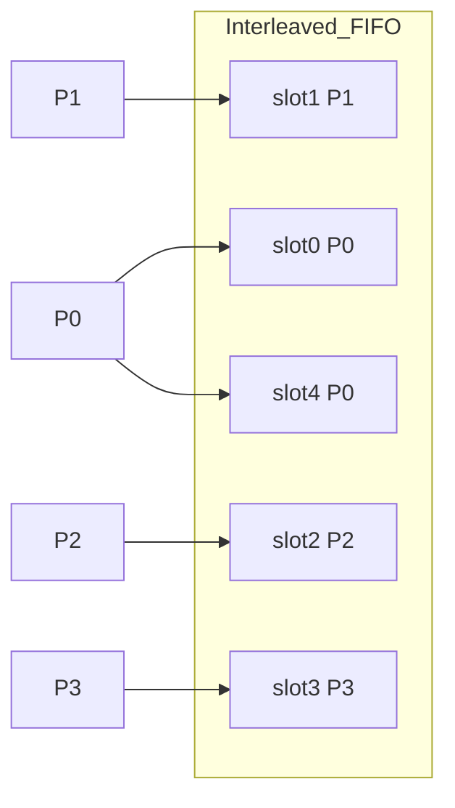
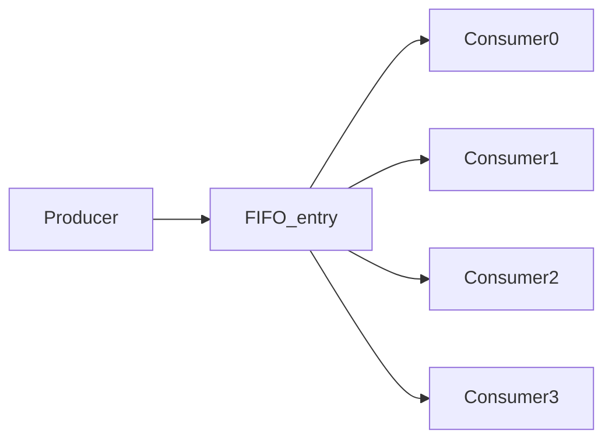
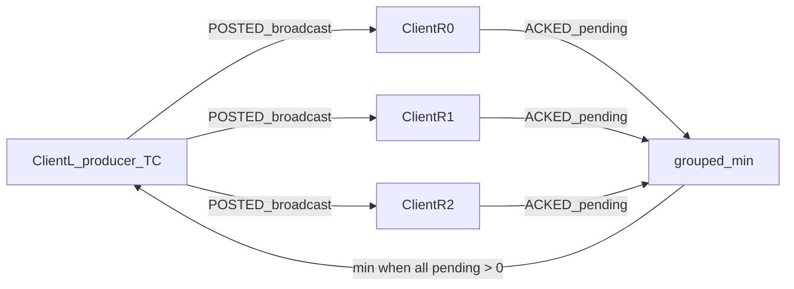
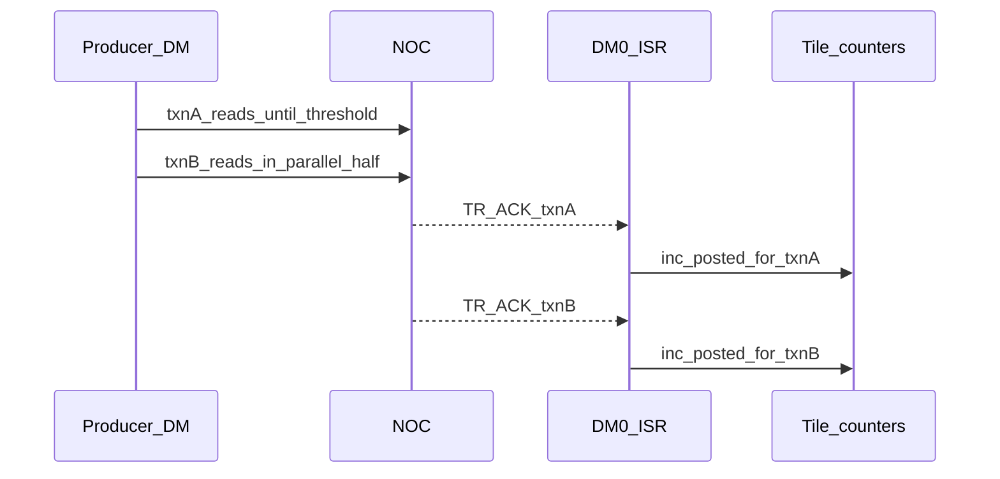
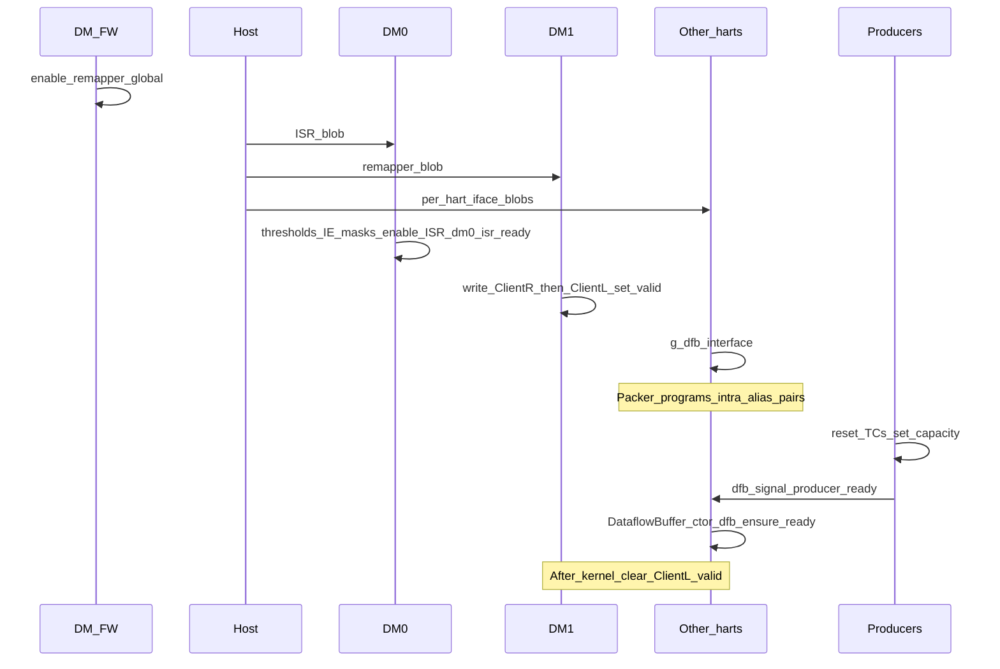

# DataflowBuffer Reference

A **Dataflow Buffer (DFB)** is a software FIFO with built-in credits that moves data from producers to consumers. It replaces Circular Buffers (CBs) and is the preferred Metal 2.0 data-path abstraction.

Kernels construct a `DataflowBuffer` from a `DFBBindingToken` — a named binding constant generated from the host `accessor_name`. That token is what kernels pass into the constructor and then use the usual reserve/push/wait/pop APIs (or, on Quasar DM, NOC `async_read` / `async_write` with `NocOptions::TXN_ID` for implicit sync). Host/runtime still track a separate **logical DFB id** for allocation and config, but kernel authors work with the binding token.


| Audience                        | Start here                                                                    |
| ------------------------------- | ----------------------------------------------------------------------------- |
| Writing kernels                 | [Part A — Kernel-author guide](#part-a--kernel-author-guide)                  |
| WH/BH stream credits            | [Part B — Wormhole / Blackhole credits](#part-b--wormhole--blackhole-credits) |
| Quasar TCs, remapper, ISR, init | [Part C — Quasar deep dive](#part-c--quasar-deep-dive)                        |
| Hangs, TILE_COUNTERS, asserts   | [Part D — Common debugging](#part-d--common-debugging)                        |


---


## Table of contents

- [Part A — Kernel-author guide](#part-a--kernel-author-guide)
- [Part B — Wormhole / Blackhole credits](#part-b--wormhole--blackhole-credits)
- [Part C — Quasar deep dive](#part-c--quasar-deep-dive)
  - [C1. Tile counters (TCs)](#c1-tile-counters)
  - [C2. Access patterns](#c2-access-patterns--tile-counter-counts)
  - [C3. Remapper](#c3-remapper)
  - [C4. Explicit vs implicit sync](#c4-explicit-vs-implicit-sync-txn-ids-isrs)
  - [C5. Device initialization](#c5-device-initialization--constructor-sync)
  - [C6.](#c6-finish-and-barrier-apis) `finish()` [and barriers](#c6-finish-and-barrier-apis)
  - [C7. Intra-tensix DFBs](#c7-intra-tensix-dfbs)
  - [C8. wait→pop TDMA hazard (TEN-4746)](#c8-quasar-waitpop-tdma-hazard-ten-4746)
- [Part D — Common debugging](#part-d--common-debugging)
- [Sources](#sources)

---


## Part A — Kernel-author guide


### What you bind

On the **host**, a `DataflowBufferSpec` plus per-kernel `DFBBinding`s declare the FIFO and which kernels are producers/consumers. Typical fields:

- Entry size and total capacity (in entries)
- Number of producers and consumers
- Producer access pattern and consumer access pattern
- Whether endpoints use NOC-backed implicit sync (`noc.async_read` / `async_write` with `NocOptions::TXN_ID`) when applicable
- `accessor_name` for each binding (becomes the kernel-side token)

Unlike CBs, neither the host **logical DFB id** nor the kernel `DFBBindingToken` is a hardware stream/TC index. Runtime maps the token to the logical id under the hood.

### Explicit sync

The kernel itself exchanges credits: producers call `reserve_back` / `push_back`, consumers call `wait_front` / `pop_front` (no ISR doing that for you).

```cpp
// dfb::my_input is a constexpr DFBBindingToken from kernel_bindings_generated.h
DataflowBuffer dfb(dfb::my_input);

// Producer (e.g. DM reader)
for (...) {
    dfb.reserve_back(N);
    // fill L1 of dfb via NOC transaction
    noc.async_read_barrier();
    dfb.push_back(N);
}
dfb.finish();

// Consumer (e.g. DM writer)
for (...) {
    dfb.wait_front(N);
    // read L1 of dfb / issue NOC transaction out of it
    dfb.pop_front(N);
}
dfb.finish();
```


#### Intra-tensix (compute, always explicit)

Same-Neo **packer → unpacker** FIFO (no DM/NOC). Bind the DFB as both PRODUCER and CONSUMER on the compute kernel. In shared compute source you can call all four APIs; they only take effect on the owning TRISC (`reserve`/`push` on **packer**, `wait`/`pop` on **unpacker**; MATH no-ops them).

```cpp
// Host binds the same DFB as PRODUCER (e.g. accessor "out") and CONSUMER ("in")
DataflowBuffer dfb(dfb::out);  // or dfb::in — same logical DFB for INTRA

for (...) {
    // Packer (TRISC2 / UCK_CHLKC_PACK): own free-space + post
    dfb.reserve_back(1);
    // pack_tile(...) / write L1 at get_write_ptr()
    dfb.push_back(1);

    // Unpacker (TRISC0 / UCK_CHLKC_UNPACK): own occupancy + ack
    dfb.wait_front(1);
    // copy_tile(...) / read L1 at get_read_ptr()  (need real unpack TDMA before pop — TEN-4746)
    dfb.pop_front(1);
}
dfb.finish();
```


### Implicit sync (Quasar DM)

Credits are posted/acked by the **DM0 ISR** when a NOC transaction tagged with a DFB txn id hits its threshold — the kernel does **not** call `reserve`/`push`/`wait`/`pop` around each transfer.

**Double buffering:** runtime typically assigns **two** DFB txn ids and splits the FIFO into halves. Each `async_read` / `async_write` with `NocOptions::TXN_ID` is tagged with the next id in that pool; the DM kernel keeps issuing without waiting on credits itself. While the ISR posts/acks for half A (txn A), the same endpoint can already be filling/draining half B on txn B — overlapping NOC traffic with credit updates. You never pick the ids; the DFB does that inside the NOC overload. (Up to four ids when entry counts divide; see [C4](#c4-explicit-vs-implicit-sync-txn-ids-isrs).)

```cpp
DataflowBuffer dfb(dfb::out);  // DFBBindingToken
Noc noc;
const auto tensor_accessor = TensorAccessor(tensor::src_tensor);

// Producer: DRAM/tensor → DFB
for (...) {
    noc.async_read<NocOptions::TXN_ID>(tensor_accessor, dfb, {.page_id = page_id}, {});
}
dfb.finish();

// Consumer: DFB → DRAM/tensor
DataflowBuffer dfb_in(dfb::in);
for (...) {
    noc.async_write<NocOptions::TXN_ID>(dfb_in, tensor_accessor, {}, {.page_id = page_id});
}
dfb_in.finish();
 // This is backwards compatabile with Gen1 but will always issue a full global barrier. It can be skipped if the kernel wants to issue
 // a noc.async_writer_barrier(); at the end of the kernel.
dfb_in.write_barrier(noc);
```

Each such call issues **one NOC transaction**. Credits are posted/acked by the **DM0 ISR** when that transaction’s threshold is hit.

Always call `finish()` so partial batches below the ISR threshold still exchange credits and all tile counters drain.

### Choosing an access pattern


| Pattern     | When to use                                                                                                                            |
| ----------- | -------------------------------------------------------------------------------------------------------------------------------------- |
| **STRIDED** | Independent work: each of N threads owns every N-th entry (elementwise, split readers).                                                |
| **ALL**     | Fan-out / broadcast to at most four<sup>[1](#fn1)</sup> consumers: every consumer sees every entry (e.g. matmul weights shared across engines). Producer ALL is not supported. |
| **BLOCKED** | Contiguous block of N entries per thread, then stride by `block_size × num_threads`. Intended to unblock compute with large NOC fills. |

<a id="fn1"></a><sup>1</sup> More than four consumers can be supported if needed in the future.


### You do not manage hardware sync resources

 Runtime assigns tile counters, remapper pairs, and DFB transaction IDs. You never pick them and do not need to reason about them for correct kernels—only about producer/consumer counts, patterns, balanced reserve/push and wait/pop operations, and calling `finish()` on every endpoint.

For hangs and faults, see [Part D](#part-d--common-debugging).

---


## Part B — Wormhole / Blackhole credits

On WH/BH, Circular Buffers use **stream registers** for credits:

- Producer updates **tiles received**
- Consumer updates **tiles acked**
- CB id maps to a stream id (see `stream_io_map.h`)


| Topic       | Detail                                                                                                   |
| ----------- | -------------------------------------------------------------------------------------------------------- |
| Model       | Typically **one stream register per CB**; CB id *is* the sync resource                                   |
| Wormhole    | **32** CBs (TRISC SRAM limit)                                                                            |
| Blackhole   | **64** CBs unlocked ([circular_buffer_constants.h](../../api/tt-metalium/circular_buffer_constants.h))   |
| DFB goal    | Quasar DFBs should match BH’s **64**-buffer scale; today `NUM_DFBS` is still **32**                      |
| Limitations | No multi-threaded access patterns, no remapper, no implicit-sync ISR path                                |


On WH/BH, DFB APIs largely wrap CB-style interfaces; Quasar is where tile counters and remapper appear.

---


## Part C — Quasar deep dive

**Kernel authors do not allocate and do not need to think about** tile counters, remapper pairs, or transaction IDs. Host runtime and device firmware derive those from producer/consumer counts and access patterns. The rest of this part explains those mechanisms for debugging and runtime work.

### C1. Tile counters

**Tile counters (TCs)** are hardware sync registers but are not 1:1 with DFBs. Number of TCs used is a function of num of producer/consumer threads and the access pattern. Each tracks:

- Buffer capacity
- Entries posted / acked (cumulative views)
- Tiles available / space available (live occupancy views)
- Trap / debug signals on under/overflow

**Compute (TRISC) read oddity:** through the Tensix `tile_counters[]` interface, the fields named `posted` / `acked` are **not** the cumulative totals. On pack/unpack they expose the **live** views — `posted` ≈ tiles available (occupancy), `acked` ≈ space available. The **cumulative** posted/acked totals live on the **DM overlay** path (`fast_llk_intf_read_posted` / `read_acked`). That is why `finish()` drains differently: TRISC waits until `tile_counters[].posted == 0` (empty occupancy); DM waits until overlay `read_posted == read_acked`.

Per Neo Tensix there are **32** TCs:


| Range      | Role                                                                                          |
| ---------- | --------------------------------------------------------------------------------------------- |
| `[0, 16)`  | Mirrored to DMs (4 Tensix × 16 → **64** DM-visible counters)                                  |
| `[16, 32)` | **Tensix-only unless remapped** — remapper can expose them to DMs; used for intra-tensix DFBs |


Packed as `(tensix_id[1:0], tc_id[4:0])` in `PackedTileCounter`.

**A single DFB may own many TCs.** Each participating RISC round-robins `num_tcs_to_rr` slots (`MAX_NUM_TILE_COUNTERS_TO_RR = 6`).

**Why 6:** Quasar reserves **DM0** (DFB ISR) and **DM1** (remapper programming), so at most **DM2–DM7** (= 6) can be ordinary producers/consumers. `MAX_NUM_TILE_COUNTERS_TO_RR` and `MAX_PRODUCERS_PER_DFB` are the same limit — one RISC never RR-walks more TCs for a DFB than that participation cap (and the producer-ready signal region is strided by it). How many TCs a given DFB actually gets is still set by access pattern and P/C counts (see [C2](#c2-access-patterns--tile-counter-counts)), not by always allocating 6. Kernels only see a `DataflowBuffer` built from a `DFBBindingToken`.

### C2. Access patterns + tile-counter counts


| Pattern     | Meaning                                                                  |
| ----------- | ------------------------------------------------------------------------ |
| **STRIDED** | Each of N threads owns every N-th entry (interleaved ring)               |
| **ALL**     | Each consumer sees every entry (broadcast / fan-out)                     |
| **BLOCKED** | Contiguous block of N entries, then stride by `block_size × num_threads` |


#### STRIDED




Typical use: elementwise / split-reader where each thread owns independent tiles.

**TC count (STRIDED):**

- Producer: `num_consumers / num_producers` if C ≥ P (else 1); when C ≥ P, C must be divisible by P
- Consumer: `num_producers / num_consumers` if P ≥ C (else 1); when P ≥ C, P must be divisible by C
- Capacity per TC: `num_entries / max(P, C)`; `stride_in_entries = max(P, C)`


#### ALL (consumer)




Typical use: each math engine needs the same input block.

**TC count (ALL):**

- **Any Tensix on the DFB**: producer **1** TC as ClientL → remapper **1:m** to consumer ClientRs; each consumer gets `num_producers` TCs as needed
- **DM↔DM ALL:** **no remapper**; producer sets `broadcast_tc` and SW-posts to **N consumer TCs**
- Capacity: `num_entries / num_producers`; `stride_in_entries = 1` (contiguous blocks per TC)


#### BLOCKED

Each thread processes a contiguous block of `block_size` entries, then advances by `block_size × num_threads`. With implicit sync, one NOC transaction can still move that whole block.

**TC count (BLOCKED):** same pairing math as STRIDED (`calculate_num_tile_counters` falls through to the STRIDED formulas). Asymmetric `P ≠ C` is supported — the per-thread RR fans blocks across the unequal side the same way.

- Producer: `num_consumers / num_producers` if C ≥ P (else 1)
- Consumer: `num_producers / num_consumers` if P ≥ C (else 1)
- Capacity per TC: `num_entries / max(P, C)`; `stride_in_entries = 1` (contiguous sub-rings — block-ness is the credit/move quantum, not an interleaved ring stride)
- `num_entries` must be divisible by `producer_block_size × max(P, C)` and by `consumer_block_size × max(P, C)` so each sub-ring holds a whole number of blocks on both sides


### C3. Remapper

The remapper maps Tensix TCs ↔ DM-visible TCs in **1:1** or **1:m** (max 4 ClientRs).

Firmware enables the remapper globally during DM FW initialization (`g_remapper_configurator.enable_remapper()`).

- If a pair’s ClientL **valid** bits are clear (ClientR[0] not valid), HW keeps **default mirroring**.
- Kernel launch **programs only needed pairs**, setting ClientL valid.
- After the kernel, **clear valid** on programmed pairs so they do not leak:
  - DM1: `clear_clientL_valid_up_to_high_watermark_hw()`
  - Packer: `dfb_clear_packer_remapper_window([lo, hi))`


#### Pair pool


| Pairs      | Role               |
| ---------- | ------------------ |
| `[0, 16)`  | **1-to-many** only |
| `[16, 64)` | **1-to-1** only    |


**Why packer/intra 1:1 is top-down:** the 1:1 pool is shared. DM1 allocates **bottom-up from 16**; packer/intra `reserve_packer_ranges` **from 63 downward**. That (1) avoids colliding with DM1, (2) keeps packer pairs in a high contiguous window packer can tear down without touching DM1’s watermark, (3) leaves unused middle capacity for either side.

#### When a DFB uses remapper vs default mirror

- **ALL with any Tensix endpoint** (producer and/or consumer) → remapper **1:m** (pairs in `[0, 16)`). That includes **Tensix → DM** and **DM → Tensix**
- **DM ↔ DM ALL** → **no remapper** (HW cannot map DM↔DM through it); producer sets `broadcast_tc` and SW-posts to **N consumer TCs**
- **Intra-tensix** → 1:1 alias pairs to avoid [HW bug](#c7-intra-tensix-dfbs)
- **STRIDED** → usually default Tensix↔DM mirroring (TCs not listed in a remapper entry keep the default mirror)


#### ALL 1:m Remapper Config

DFB programs every ALL Remapper slot with `clientr_group = 1` and `distribute = 0`. See [Tile Counters Theory of Operation](https://yyz-gitlab.local.tenstorrent.com/tensix/tensix-hw/tile_counters/-/blob/abrkic/tile_counter_remapper/doc/Tile_Counters_Theory_of_operation.md) for more details on Remapper configuration.

**Left→right (producer posts):** ClientL is the producer TC (`cL_is_producer=1`). A POSTED update on ClientL is **broadcast** to every valid ClientR TC; each ClientR receives the **full** increment (every consumer sees the same tiles posted because distribution is disabled).

**Right→left (consumers ack):** ClientR ACKED updates are **not** forwarded to ClientL one-at-a-time. In **grouped** mode the remapper keeps a **pending** count per ClientR and only updates ClientL when **every** active ClientR has a **non-zero** pending value. The credit returned to ClientL is the **minimum** pending across those ClientRs (`incr_distribute=0` → no ×m scaling). So space on the producer side does not free until **all** consumers have made matching progress — a slow consumer stalls free-space return for everyone.




#### ClientL / ClientR config

- **ClientL:** `id`, `cnt_sel`, `valid` mask, `clientl_is_producer`, `clientr_group`, `distribute`
- **ClientR[0..3]:** `id`, `cnt_sel` each (max fan-out 4; ClientL id ≠ any ClientR id)
- DFB ALL slots: `clientl_is_producer=1`, `clientr_group=1`, `distribute=0` (grouped broadcast / min-ack as above)


### C4. Explicit vs Implicit Sync, Txn IDs, ISRs


#### Explicit

Software update credits directly after tracking whether data has landed or been sent out.

#### Implicit (DM only)

Use `noc.async_read<NocOptions::TXN_ID>(…, dfb, …)` / `noc.async_write<NocOptions::TXN_ID>(dfb, …)`. The DFB tags the NOC op with a txn id. **All DFB ISRs run on DM0:**


| Handler                       | Trigger                     | Action                         |
| ----------------------------- | --------------------------- | ------------------------------ |
| `dfb_tile_poster_irq_handler` | RD cmdbuf TR_ACK threshold  | `inc_posted` on descriptor TCs |
| `dfb_tile_acker_irq_handler`  | WR cmdbuf WR_SENT threshold | `inc_acked` on descriptor TCs  |


Interrupt setup is `setup_dfb_implicit_sync` in [dataflow_buffer_init.h](../../hw/inc/internal/tt-2xx/dataflow_buffer/dataflow_buffer_init.h) (DM0 only).

#### How the ISR threshold is programmed

Host `compute_txn_descriptor` picks sizes so that **when the ISR fires, every TC in that txn’s descriptor is incremented by the same amount** (`tiles_to_post` / `tiles_to_ack` = `num_entries_per_txn_id_per_tc`). The poster/acker handlers loop all counters and apply that one value to each — they do not credit TCs differently.

That requires the batch to divide evenly across txn ids, participating DMs, and TCs RR’d by each DM:


| Quantity                                           | Meaning                                                                                                               |
| -------------------------------------------------- | --------------------------------------------------------------------------------------------------------------------- |
| `num_txn_ids`                                      | How many txn ids slice the FIFO                                                                                       |
| `threshold` (`num_entries_to_process_threshold`)   | Cmdbuf tiles-to-process count that fires the IRQ for that trid                                                        |
| `num_entries_per_txn_id` (`per_txn`)               | Entries **each** producer/consumer DM contributes toward one full threshold batch                                     |
| `num_entries_per_txn_id_per_tc` (`per_txn_per_tc`) | Entries each of that DM’s RR TCs owns in the batch → stored as `tiles_to_post` / `tiles_to_ack` in `TxnDFBDescriptor` |


**Normal (non–ALL-consumer) side:**

- `threshold = num_entries / num_txn_ids`
- Must have `threshold % num_prods_or_cons == 0` → `per_txn = threshold / num_prods_or_cons`
- Must have `per_txn % num_tcs_per_risc == 0` → `per_txn_per_tc = per_txn / num_tcs_per_risc`

So one ISR fire means: all participating DMs have each completed `per_txn` NOC ops on that trid, which RR’d evenly so each TC is owed exactly `per_txn_per_tc` credits — matching the uniform increment.

**ALL consumer:** `wr_sent` is global across DMs, so the threshold waits for **every** consumer’s batch:

- `per_txn = num_entries / num_txn_ids` (still per consumer’s share of that txn slice)
- `threshold = num_consumers × per_txn`
- Same `per_txn % num_tcs_per_risc == 0` → equal `per_txn_per_tc` per TC

`num_entries` must be divisible by `num_txn_ids × … × num_tcs_per_risc` (see txn-id count rules below).

#### Setting up txn-id interrupts (`setup_dfb_implicit_sync`)

Host packs a **DM0 ISR blob** into the DFB config region. Layout:

1. `dfb_dm0_isr_blob_core_header_t` — `producer_txn_id_mask` and `consumer_txn_id_mask` (bit `i` set ⇒ txn id `i` needs poster and/or acker IRQ)
2. **Threshold pool** — one `threshold` per used id, ascending id order (dense slots)
3. **Descriptor pool** — 32B `TxnDFBDescriptor` images per used id: which TCs to touch and how many tiles to `inc_posted` / `inc_acked` when that id fires

At kernel launch DM0 runs `setup_dfb_implicit_sync`:

1. If no implicit sync: `disable_dfb_tile_isr()`, set `dm0_isr_ready`, return.
2. Else load the config into DTCM `g_txn_dfb_descriptor[txn_id]` (ISR indexes by trid, not dense slot).
3. For each txn id in `producer ∪ consumer` masks:
  - **Producer bit:** clear RD cmdbuf tiles-to-process for that trid, then `SET_TILES_TO_PROCESS_THRES_TR_ACK(txn_id, threshold)` — IRQ when that many **read TR_ACKs** accumulate on the overlay RD cmdbuf for that trid.
  - **Consumer bit:** clear WR cmdbuf tiles-to-process, then `SET_TILES_TO_PROCESS_THRES_WR_SENT(txn_id, threshold)` — IRQ when that many **writes have been sent** on the WR cmdbuf for that trid.
4. **Arm per-trid interrupt enables (IE):**
  - RD cmdbuf `PER_TR_ID_IE_1` upper 32 bits ← `producer_txn_id_mask` (TR_ACK path)
  - WR cmdbuf `PER_TR_ID_IE_2` lower 32 bits ← `consumer_txn_id_mask` (WR_SENT path)
5. If either mask is non-empty: `enable_dfb_tile_isr()` (ROCC IRQ in `mie` + `mstatus.MIE`); else leave ISR disabled.
6. Publish `dm0_isr_ready = 1` so other harts’ `DataflowBuffer` ctors can proceed.

When HW hits a threshold it sets the corresponding bit in the IP (interrupt pending) register; the ISR walks pending trids, credits the TCs from `g_txn_dfb_descriptor[trid]`, clears tiles-to-process for that trid (re-arms the next batch), then W0C-clears the IP bit.

#### Transaction IDs


| Range     | Use                                                                   |
| --------- | --------------------------------------------------------------------- |
| **0**     | Reserved (`NOC_V2_TRID_STATIC`) for NOC ops that supply **no** txn id |
| `[0, 7]`  | User / kernel constexpr trids                                         |
| `[8, 31]` | DFB pool, allocated **top-down**                                      |


Per DFB side: up to `NUM_TXN_IDS` **(4)** ids in the descriptor array.

#### How many txn ids (`compute_optimal_txn_id_count`)

`num_entries` does **not** need to be a power of two. Runtime picks the **smallest** `n` in `[2, NUM_TXN_IDS]` that divides cleanly, else falls back to **1**:


| Side            | Divisibility check                                        |
| --------------- | --------------------------------------------------------- |
| ALL consumer    | `num_entries % (n × #TCs_per_risc) == 0`                  |
| Everything else | `num_entries % (n × #prods_or_cons × #TCs_per_risc) == 0` |


Examples with 1 producer, 1 consumer, 1 TC per RISC:


| `num_entries` | `num_txn_ids` | Why                                    |
| ------------- | ------------- | -------------------------------------- |
| 16            | 2             | `16 % 2 == 0` (first eligible `n ≥ 2`) |
| 15            | 3             | `15 % 2 ≠ 0`, `15 % 3 == 0`            |
| 7             | 1             | no `n ∈ {2,3,4}` divides → fallback    |


#### Double buffering

When `n ≥ 2`, those ids split the FIFO into equal slices (`threshold ≈ num_entries / n`, then further split across producers/consumers/TCs). While the ISR posts/acks credits for txn A, the endpoint can already issue the next NOC ops on txn B — overlapping NOC traffic with credit updates.




#### Thresholds and “one NOC txn”

- Threshold / `per_txn` / `per_txn_per_tc` as above — programmed so each TC gets the **same** increment per ISR fire
- **ALL consumer:** threshold scales by `#consumers` so the IRQ waits for the full collective batch
- Each `async_read` / `async_write` with `NocOptions::TXN_ID` still issues **one** NOC transaction; with BLOCKED that txn can be a **large chunk**
- Partial last batches that never hit the ISR threshold are flushed by `handle_final_credits` inside `finish()` (below)


#### `handle_final_credits` (DM implicit sync, called from `finish()`)

The ISR only fires when a txn id’s tiles-to-process counter reaches the programmed **threshold**. If the last batch is smaller than that (or the count never reaches the collective threshold), credits would stall forever unless software manually clears them.

producer = POSTED / TR_ACK path; consumer = ACKED / WR_SENT path:

1. **Pick the tail txn id.** Kernels rotate transaction ids as they issue. If `transactions_issued` lands exactly on a per-txn boundary, the index has already wrapped to the *next* id — step back one slot.
2. **Compute expected credits on TC slot 0 (progress sentinel).** Entries round-robin across `N = num_tcs_to_rr` TCs with remainder going to the **lowest** indices first (`expected[i] = issued/N + (i < issued%N ? 1 : 0)`). So **slot 0 always has the max (or tied) expected count**. The wait/early-exit loops only poll that one TC as a cheap proxy for “ISR caught up”: the ISR credits **all** descriptor TCs by the same amount each fire, so once the busiest slot reaches its expected value, every other slot has too. Checking a lower-remainder slot instead could look “done” while slot 0 is still short.
3. **Wait until the NoC has completed the tail batch (or the ISR already caught up).** Poll overlay posted/acked vs `expected_slot0`. Also watch cmdbuf state for the tail txn id:
  - `TR_ACK`/`WR_SENT` outstanding == 0 and `tiles_to_process` == 0 → not dispatched yet
  - `TR_ACK`/`WR_SENT` outstanding > 0 → in flight
  - `TR_ACK`/`WR_SENT` outstanding == 0 and `tiles_to_process` > 0 → completed into tiles-to-process → break
   Early exit if ISR already brought slot 0 to `expected_slot0`.
4. **Unconditional** `sync_threads` on barrier 0 (producers) or 1 (consumers). Every participating DM on that side must have issued its tail ops and seen NOC pickup before anyone inspects the collective `tiles_to_process`. Skipping the barrier when “already caught up” is racy (ISR can fire between threads’ checks). Separate barriers avoid producer/consumer deadlock when thread counts differ.
5. **If ISR already posted/acked to expectation → return.** Nothing left to do.
6. **Else wait until the tail is a genuine partial** (`0 < tiles_to_process < global_threshold`). The ISR will never fire for that remainder.
7. **Manual credit top-up.** For each of this DM’s RR TCs, compute that slot’s expected count from `transactions_issued` and `inc_posted` / `inc_acked` by `(expected - actual)`.

After that, `finish()` continues to the normal drain loop (`posted == acked` on DM).

Note: Note: Instead of manually topping up credits, an alternative implementation could make DM0 reprogram the transaction-ID thresholds and update the transaction-ID descriptor.

### C5. Device initialization + constructor sync




1. FW already enabled the remapper globally.
2. Host packs: remapper blob → DM0 ISR blob → per-hart iface blobs → signal region.
3. **DM0:** txn descriptors, thresholds, IE masks, enable tile ISR, `dm0_isr_ready`.
4. **DM1:** ClientR then ClientL for this launch (sets valid bits).
5. **Other DMs / TRISCs:** `setup_local_dfb_interfaces`. Packer programs intra alias pairs itself (Tensix-only TCs invisible to DM1).
6. **Producers** reset TCs and set capacities, then publish bytes in `dfb_signal[]`.
7. `DataflowBuffer` **constructor / `dfb_ensure_ready`:** poll expected producer signal bits; if using the ISR path, also wait for `dm0_isr_ready`; remapped producers wait for ClientL valid.
8. After kernel: clear ClientL valid (DM1 watermark + packer window).


### C6. `finish()`

1. If implicit sync was used, [`handle_final_credits`](#handle_final_credits-dm-implicit-sync-called-from-finish) handles any producer/consumer partial batches that never hit the ISR threshold.
2. Spin until all TCs drained: DM `posted == acked`; TRISC unpack/pack occupancy `posted == 0` since TRISC side does not track cumulative posted/acks.

`write_barrier(noc)`

- No DFB txn ids → full `noc.async_write_barrier()`
- Else barrier per DFB txn id used by this buffer


### C7. Intra-tensix DFBs

Same-Neo **packer (TRISC2) → unpacker (TRISC0)** FIFO without DM/NOC (see [Part A](#intra-tensix-compute-always-explicit)).

- Patterns: **STRIDED → STRIDED** only
- Uses Tensix-only TCs; **no implicit sync**
- Remapper still used for the HW alias workaround below

**HW bug:** a T6 update to a Tensix-only TC can **alias into overlay TCs** `[0, 15)` unless remapped.

**Workaround:** allocate a Tensix-only ClientL TC (live) to a sacrificial Tensix-only ClientR TC shadow (`TILE_COUNTERS_PER_INTRA_TENSIX_DFB = 2`). Packer programs a 1:1 remapper pair. Both packer and unpacker drive the ClientL TC; nothing reads the shadow.

### C8. Quasar wait→pop TDMA hazard (TEN-4746)

On Quasar unpack, a bare `wait_front` immediately followed by `pop_front` with **no real unpack TDMA** between them can let `POP_TILES` race past `WAIT_TILES` → tile-counter underflow (watcher index often `0x00010000`).

**Workaround:** insert a real unpack (e.g. dummy `copy_tile` of tile 0) between wait and pop. `TTI_NOP` / `TTI_DMANOP` are **not** sufficient.

This is a **kernel / LLK** constraint; DFB host APIs do not insert the TDMA for you. With `TT_METAL_LLK_ASSERTS=1`, `llk_pop_tiles` asserts if a wait was armed with no unpack since (`LLK_TDMA_GUARD`).

See [Part D](#part-d--common-debugging).

---


## Part D — Common debugging


### Watcher waypoints


| Waypoint        | Where                | Meaning                                             |
| --------------- | -------------------- | --------------------------------------------------- |
| `WFW` / `WFD`   | `wait_front`         | Waiting for / got consumer tiles                    |
| `RBW` / `RBD`   | `reserve_back`       | Waiting for / got producer space                    |
| `DFW` / `DFD`   | `dfb_ensure_ready`   | Constructor sync (producer signals / DM0 ISR ready) |
| `UPTW` / `UPTD` | unpack tilize/reduce | Unpack stalled on tiles / done                      |
| `AAW` / `AAD`   | `finish()`           | Draining until posted==acked                        |
| `NTW`           | DM firmware          | Early FW wait (often idle / pre-kernel)             |


### Failure modes

1. **Hang on** `wait_front` **(**`WFW`**)**
  Producer never `push_back` / ISR never posted / wrong pattern so this consumer’s TC never sees posts.
   Check: P/C counts and patterns; producer reached push or committed `async_read<NocOptions::TXN_ID>`; implicit path has DM0 ISR and divisible thresholds.
2. **Hang on** `reserve_back` **(**`RBW`**)**
  Consumer never `pop_front` / never acked; ring full.
   Check: consumer progress; ALL remapper space only after *all* consumers ack; DM–DM ALL needs every consumer TC acked.
3. **Hang in ctor (**`DFW`**)**
  Missing producer-ready signal; ClientL not valid yet; `dm0_isr_ready` never set when ISR expected.
   Check: which harts are producers; DM0/DM1 setup blobs ran.
4. **Hang in** `finish()` **(**`AAW`**)**
  Partial implicit batch not flushed; one RR TC never drained; ALL consumer still holding occupancy.
   Check: every endpoint called `finish()`; entry-count divisibility vs txn ids / TCs.
5. **TILE_COUNTERS fault / index** `0x00010000`
  Often TEN-4746 (pop without TDMA after wait), or post/ack past capacity / wrong TC.
   Check: bare wait→pop on unpack; `TT_METAL_LLK_ASSERTS=1`; watcher TC dump.
6. **Watcher “assert on line N” (no filename)**
  `__LINE__` of `ASSERT` / `LLK_ASSERT` in a **header**, not the kernel `.cpp`. Map N under LLK asserts to e.g. `llk_io_unpack.h` (TEN-4746 guard), `ckernel_trisc_common.h` (buf-desc), `dataflow_buffer.inl` (capacity).
7. **Wrong / stale data with implicit sync (esp. emulator)**
  Credit posted before write visible; missing L1/L2 invalidate on consumer read of Tensix-written L1; PUSH_TILES packer_wr_done not modeled on sim.
   Check: barriers / STALLWAIT before push; invalidate before DM reads; compare HW vs emulator.
8. **Access-pattern / binding mismatches**
  Producer ALL; BLOCKED without `block_size > 0`; wrong `#producers/#consumers` for split readers; STRIDED when every consumer needs full data (use ALL); BLOCKED `num_entries` not divisible by `block_size × max(P,C)`.
   Check: host `TT_FATAL` text; Metal2 `DFBBinding` matches intent.
9. **Remapper / intra-tensix weirdness**
  DM→DM ALL expected remapper (it does not); Tensix-only TC alias without shadow pair; packer remapper window not cleared across kernels.
   Check: `broadcast_tc` path; ClientL+shadow; post-kernel valid clear.
10. **Credit API misuse (CB-like rules still apply)**
  Uneven `wait_front` sizes without matching pops; wait without pop; pop from both compute and DM on the same DFB.
    One consumer thread should own pops for a given DFB endpoint.

---


## Sources

- [DataflowBuffer design doc](https://docs.google.com/document/d/1J55PCzS1VQKbNoSmKvwgPZ_siu04aqnS5DAsDw0vj1Q)
- [dataflow_buffer.cpp](dataflow_buffer.cpp) — TC / remapper / txn allocation
- [dataflow_buffer_config.h](../../hw/inc/internal/tt-2xx/dataflow_buffer/dataflow_buffer_config.h) — constants
- [dataflow_buffer_init.h](../../hw/inc/internal/tt-2xx/dataflow_buffer/dataflow_buffer_init.h) — device init
- [dataflow_buffer_isr.h](../../hw/inc/internal/tt-2xx/dataflow_buffer/dataflow_buffer_isr.h) — DM0 ISR
- [dataflow_buffer.inl](../../hw/inc/internal/tt-2xx/dataflow_buffer.inl) — kernel API impl
- `[rocc_instructions.hpp](../../hw/inc/internal/tt-2xx/quasar/overlay/rocc_instructions.hpp)` — txn-id ISRs
- Remapper: `tt_metal/hw/inc/internal/tt-2xx/quasar/overlay/remapper_*.hpp`
- [Tile Counters Theory of Operation](https://yyz-gitlab.local.tenstorrent.com/tensix/tensix-hw/tile_counters/-/blob/abrkic/tile_counter_remapper/doc/Tile_Counters_Theory_of_operation.md)
