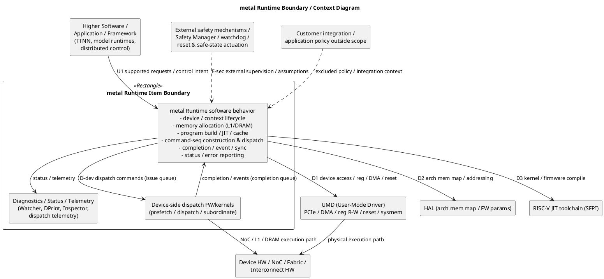
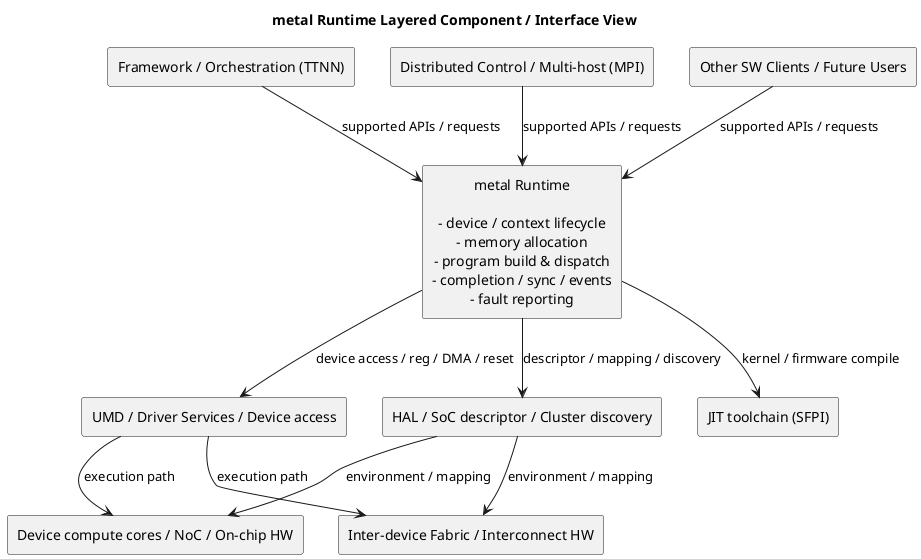
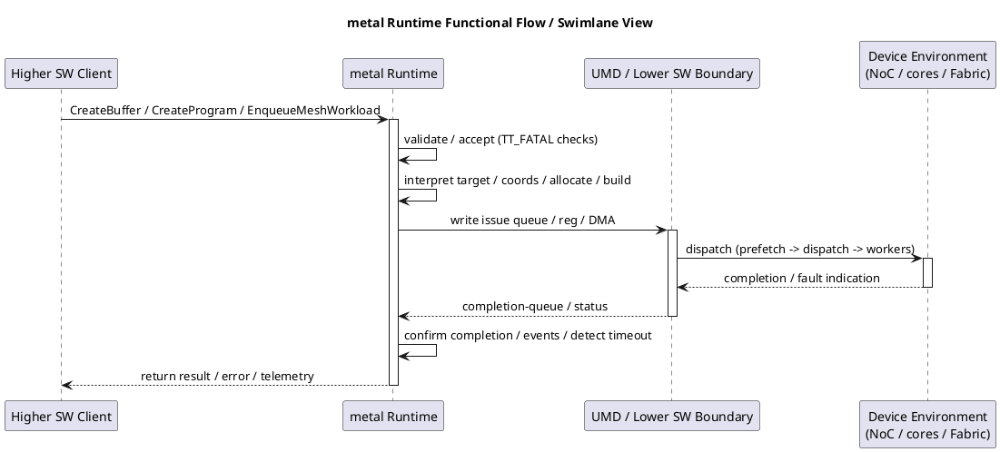

# metal Runtime (runtime) — Boundary & Interface Specification

Boundary diagrams plus the upward / downward / environmental interface specification
for metal Runtime. Companion to `runtime-item-definition.md` (§5–6, §16).

At ASIL-D, every interface must be analyzed for common-cause / dependent failures
(DFA); data and control flow should be independently verifiable where possible. Each
interface below lists **owner**, **data/control exchanged**, and **safety-relevance**.

---

## 1. Boundary diagrams

### 1.1 Context / boundary diagram

### 1.2 Layered component / interface view

### 1.3 Functional flow / swimlane view

---

## 2. Upward interfaces (consumers → metal Runtime)

| ID | Interface | Owner | Data / control exchanged | Safety-relevance |
|----|-----------|-------|--------------------------|------------------|
| U1 | Device lifecycle API | runtime | open/close device & mesh; readiness | High — mis-init / mis-close (HLR-05b/c) |
| U2 | Memory allocation API | runtime | buffer/CB/semaphore create & free | High — placement/overlap (HLR-01c/d, 02a) |
| U3 | Program/kernel build API | runtime | program/kernel create, runtime args, compile | High — binary integrity, args (HLR-02d, 02a) |
| U4 | Data-transfer API | runtime | enqueue read/write buffers & shards (host ptr, blocking flag) | High — data integrity/ordering (HLR-02a/b/c) |
| U5 | Workload dispatch API | runtime | `EnqueueMeshWorkload` / `LaunchProgram` | High — targeting/ordering (HLR-01*, 03*) |
| U6 | Sync / event API | runtime | Finish, Synchronize, record/wait/query event | High — ordering/completion (HLR-03a/b) |
| U7 | Trace API | runtime | begin/end/replay trace | Medium — replay correctness (FR-11) |
| U8 | Sub-device API | runtime | create/load manager, stall groups | High — isolation (HLR-01e) |
| U9 | Mesh/distributed control API | runtime | shape/reshape/submesh; MPI context | Medium/High — topology (ENV-06) |
| U10 | Diagnostics/status API | runtime | error/exception, bool returns, telemetry | High — fault reporting (HLR-04a) |

Key headers: `CODE:tt_metal/api/tt-metalium/host_api.hpp`,
`CODE:tt_metal/api/tt-metalium/tt_metal.hpp`,
`CODE:tt_metal/api/tt-metalium/distributed.hpp`,
`CODE:tt_metal/api/tt-metalium/mesh_command_queue.hpp`,
`CODE:tt_metal/api/tt-metalium/mesh_device.hpp`,
`CODE:tt_metal/api/tt-metalium/device.hpp`,
`CODE:tt_metal/api/tt-metalium/distributed_context.hpp`.

Error model at this boundary: precondition/fault → `TT_FATAL`/`TT_THROW` →
`std::runtime_error`; a minority of low-level accessors and `EventQuery`/`CloseDevice`
return `bool` (`CODE:tt_stl/tt_stl/assert.hpp`). No `StatusOr`-style structured status.

---

## 3. Downward interfaces (metal Runtime → providers)

| ID | Interface | Owner | Data / control exchanged | Safety-relevance |
|----|-----------|-------|--------------------------|------------------|
| D1 | UMD device access | UMD | device start/close, reg R/W, L1/DRAM R/W, DMA (WH MMIO ≥32B), RISC reset assert/deassert, sysmem alloc, membar, topology discovery | High — all physical effects; DFA focus |
| D2 | HAL | HAL | L1/DRAM address bases & sizes, core/processor types, FW/JIT params, NOC encoding/alignment, dev-msg structs | High — addressing correctness |
| D3 | JIT toolchain (SFPI) | SFPI | invoke `riscv-tt-elf-g++`, build flags, cache | High — code generation (tool qual) |
| D-dev | Device dispatch FW/kernels | runtime | issue-queue commands in; completion-queue records/events out | High — dispatch correctness/ordering |

Key references: `CODE:tt_metal/llrt/tt_cluster.cpp` (metal↔UMD façade),
`CODE:tt_metal/third_party/umd/device/api/umd/device/cluster.hpp` (UMD API),
`CODE:tt_metal/llrt/hal.hpp` (HAL), `CODE:tt_metal/jit_build/build.cpp` (JIT),
`CODE:tt_metal/impl/dispatch/kernels/cq_dispatch.cpp` (device dispatch).

Representative D1 mapping (metal → UMD):
- `write_core`/`read_core` → UMD `dma_*` (WH MMIO ≥32B) or `write_to_device`/`read_from_device`
- `write_reg`/`read_reg` → UMD `write_to_device_reg`/`read_from_device_reg`
- `assert_risc_reset`/`deassert_risc_reset_at_core` → UMD reset APIs
- `start_driver` → UMD `start_device`; `~Cluster` → UMD `close_device`

---

## 4. Environmental interfaces (context)

| ID | Interface | Owner | Data / control exchanged | Safety-relevance |
|----|-----------|-------|--------------------------|------------------|
| E1 | Cluster / SoC descriptor | UMD/runtime | topology, chips, eth connections, harvesting, boards; per-chip `metal_SocDescriptor`; coord maps | High — targeting/config (HLR-06b) |
| E2 | Device discovery / enumeration | UMD | reachable chip ids; visibility filters (`TT_VISIBLE_DEVICES`, `TT_METAL_VISIBLE_DEVICES`) | High — device set correctness |
| E3 | Fabric configuration | runtime/? | `FabricConfig`, reliability mode, mesh graph descriptor (`TT_MESH_GRAPH_DESC_PATH`) | High — multi-chip routing (ENV-06) |
| E4 | RunTimeOptions env | runtime | `TT_METAL_*` env vars (dispatch mode, timeouts, watcher, mem-clear, fw-skip, jit-force) | High — changes safety behavior (HLR-06c) |
| E5 | Diagnostics / telemetry channels | runtime | Watcher log, Inspector RPC (localhost:50051), dispatch telemetry, operation timeout | High — fault observability (HLR-04b/c) |
| E6 | Reset / power / init state | UMD/HW | barrier addrs, host mem channels, NOC translation (BH) | High — precondition (PRE-07) |
| E7 | Multi-host MPI env | MPI/runtime | world rank/size; `TT_MESH_ID`, `TT_MESH_HOST_RANK` | Medium/High — distributed identity |

Key references: `CODE:tt_metal/llrt/tt_cluster.cpp`,
`CODE:tt_metal/llrt/metal_soc_descriptor.hpp`, `CODE:tt_metal/llrt/rtoptions.cpp`,
`CODE:tt_metal/fabric/fabric.cpp`, `CODE:tt_metal/fabric/control_plane.cpp`,
`CODE:tt_metal/impl/context/metal_context.cpp`,
`CODE:tt_metal/distributed/multihost/distributed_context.cpp`.

Notable safety-relevant env toggles (E4) to control in a safety configuration:
`TT_METAL_WATCHER` (fault detection — default off),
`TT_METAL_OPERATION_TIMEOUT_SECONDS` (hang detection — default off/infinite),
`TT_METAL_SKIP_LOADING_FW`, `TT_METAL_DISABLE_DMA_OPS`,
`TT_METAL_SLOW_DISPATCH_MODE`, `TT_METAL_VALIDATE_PROGRAM_BINARIES`,
`TT_METAL_INSPECTOR` (default on), `RELIABILITY_MODE`.

---

## 5. DFA / common-cause notes (for later analysis)

- **Shared UMD driver**: a single `tt::umd::Cluster` serves all chips
  (`CODE:tt_metal/llrt/tt_cluster.cpp`) — common-cause candidate across devices.
- **Shared MetalContext singleton** and shared program/JIT caches — common-cause /
  interference candidates (HLR-07a/b).
- **Shared completion-reader thread / CQ shared state** — interference candidate
  (HLR-07a).
- **Env-var configuration** applied process-wide affects all devices — common-cause
  candidate (HLR-06c).
- **HAL / SoC descriptor** correctness is a single point of dependence for all
  addressing (HLR-01b/c, HLR-06b).

These are inputs to a dedicated DFA once the boundary and ownership decisions in
`runtime-baseline-decisions.md` are resolved.
