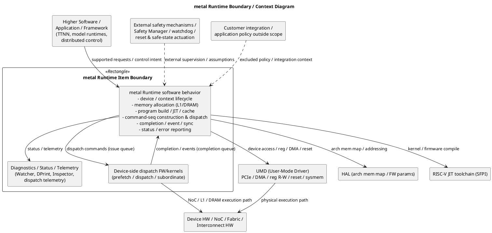
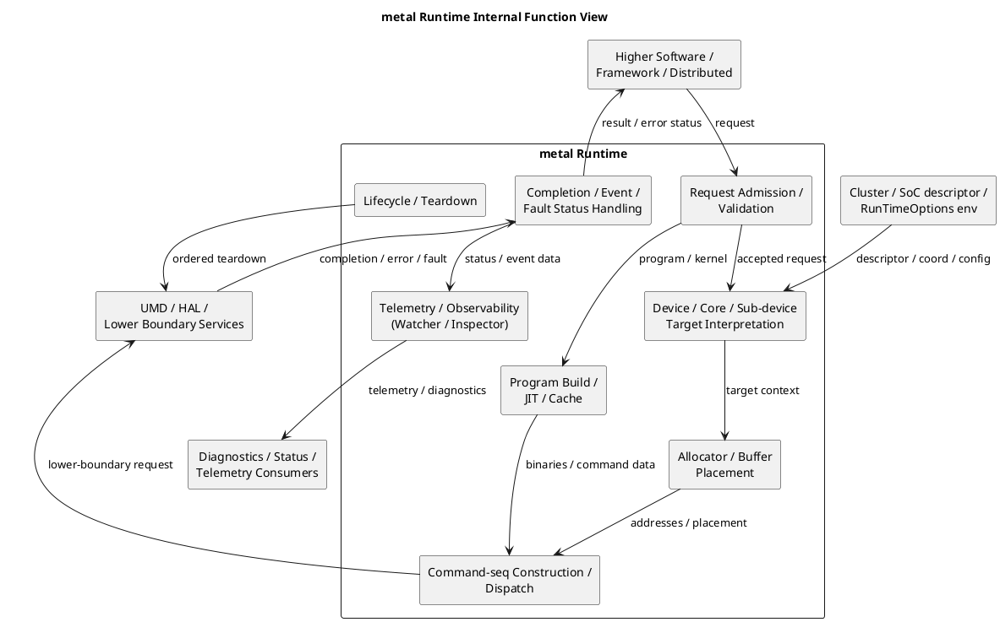
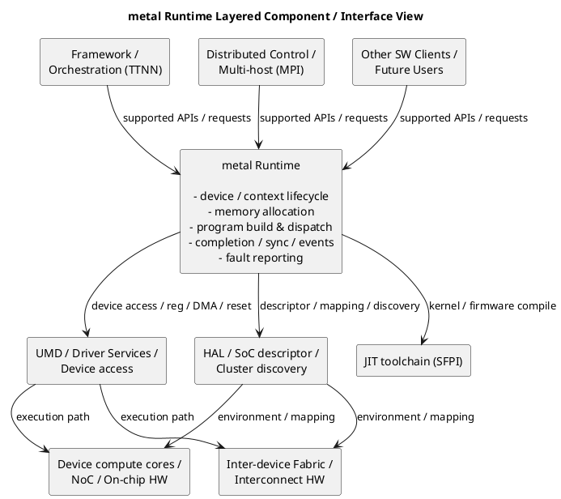
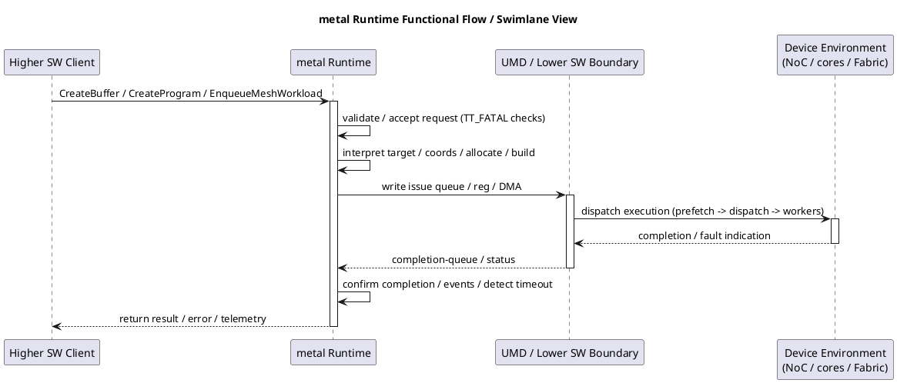

# metal Runtime (runtime) — Safety Item Definition

AI-IP SW Safety Component Definition — ASIL-D / SEooC
Item Definition and Preliminary Requirements

> Status: DRAFT (first-cut baseline). Every claim is traceable to a code artifact,
> header, or architecture decision. Variant-specific assumptions are collected in
> Section 11 (Assumptions of use) and in `runtime-assumptions-pre-post-deps.md`.
>
> Program-level safety reference: `<SAFETY_README_URL>` (not supplied for this pass).
>
> Conventions used across the companion requirement files:
> - Provenance tags: `SPEC:<id>` (spec-backed), `CODE:<path>` (impl-observed),
>   `HAZARD:§13` (top-down failure-theme), `PRODUCT` (product requirement).
> - Status tags: `FIRM` (spec-backed), `CANDIDATE` (code-derived, confirm),
>   `PROPOSED` (hazard-derived, decide ownership).

---

## 1. Item name

**metal Runtime (runtime)**

Also referred to in the source tree as `tt_metal` / `tt-metalium`, the low-level
host-side programming-model runtime for Tenstorrent AI-IP devices. The public
namespace is `tt::tt_metal` (single-device / build-time) and
`tt::tt_metal::distributed` (mesh / multi-device runtime dispatch).

- Source root: `/proj_sw/user_dev/ayaacob/tt-metal/tt_metal`
- Public API root: `tt_metal/api/tt-metalium/` (`CODE:tt_metal/api/tt-metalium/host_api.hpp`)
- Self-description: "A low level programming model with user facing host APIs"
  (`CODE:tt_metal/README.md`).

The item name is the root of all requirement IDs (`runtime-HLR-*`, `runtime-FR-*`,
`runtime-PERF-*`, `runtime-ENV-*`) and of DFA / FMEDA traceability.

---

## 2. Item purpose

metal Runtime provides the **host-side control, dispatch, and memory-management
services** used to compile, load, launch, synchronize, and tear down compute
workloads on Tenstorrent AI-IP compute devices across the AI-IP system. In the
current safety-baseline framing it is a software item whose purpose is to enable
**deterministic, correctly-targeted issuance of work and data transfers to device
compute/memory resources** through defined software-controlled interfaces and
configuration paths, and to return completion / error status to the caller.

Safety-relevant aspects currently allocated to metal Runtime include:

- **Correct targeting and placement** of programs, buffers, and data transfers to
  the intended device, core, sub-device, and memory address
  (`CODE:tt_metal/impl/allocator/allocator.hpp`, `CODE:tt_metal/impl/buffers/buffer.cpp`,
  `CODE:tt_metal/impl/dispatch/`).
- **Command ordering, completion confirmation, and synchronization** on the command
  queue (events, `Finish`, completion-queue polling)
  (`CODE:tt_metal/impl/dispatch/system_memory_manager.cpp`,
  `CODE:tt_metal/impl/event/dispatch.cpp`).
- **Input validation and fault reporting** at the host API boundary, predominantly
  through `TT_FATAL` / `TT_THROW` precondition checks
  (`CODE:tt_stl/tt_stl/assert.hpp`).
- **Lifecycle management** (device open, firmware/dispatch init, runtime dispatch,
  ordered teardown) with defined host-side cleanup
  (`CODE:tt_metal/impl/device/device_manager.cpp`,
  `CODE:tt_metal/impl/context/metal_context.cpp`).
- **Opt-in device fault observability** (Watcher: NOC / CB / stack / assert / launch-
  message sanitization; dispatch operation timeouts / hang detection)
  (`CODE:tt_metal/impl/debug/watcher_server.cpp`,
  `CODE:tt_metal/impl/dispatch/system_memory_manager.cpp`).

Every safety requirement in the companion files is derivable from this purpose.
At this stage the purpose statement is variant-generic; specialization for specific
architectures (Wormhole B0 / Blackhole / Quasar), cluster types, and mesh scales is
recorded as controlled assumptions (Section 11) and in the envelope requirements
(`runtime-functional-capabilities.md`).

---

## 3. Item type

**Software item** within the AI-IP SW stack (host-side runtime library plus the
device-side dispatch firmware/kernels it builds and loads).

Notes relevant to work-product scoping at ASIL-D:

- metal Runtime **generates and loads executable code** onto the device: it JIT-
  compiles kernels/firmware via a RISC-V toolchain (`riscv-tt-elf-g++` from SFPI)
  and assembles binary command sequences for the device dispatch path
  (`CODE:tt_metal/jit_build/build.cpp`, `CODE:tt_metal/impl/program/dispatch.cpp`).
  Because it produces safety-relevant executable/dispatch data, the **JIT build /
  code-generation subsystem is a tool-qualification candidate** (ISO 26262-8; TCL to
  be assessed). Tracked as an open decision in `runtime-baseline-decisions.md`.
- The runtime also embeds **device-side dispatch kernels** (prefetch / dispatch /
  subordinate) that are part of the delivered item
  (`CODE:tt_metal/impl/dispatch/kernels/cq_prefetch.cpp`,
  `CODE:tt_metal/impl/dispatch/kernels/cq_dispatch.cpp`).

---

## 4. Item context

The AI-IP SW safety program baseline explicitly includes **metal Runtime** as one of
the software functional areas to be defined within the cross-program SEooC boundary,
alongside domains such as **UMD (User-Mode Driver)**, **Fabric**, **TTNN / Kernel
Ops**, and system-level supervision (**System Health Monitor / Safety Manager**).

The current working process for the safety baseline is to start each domain with
scope, boundary, interface, and assumptions work before deriving requirements,
failure analysis, and verification planning. metal Runtime is being handled through
that domain-by-domain item-definition approach.

Within that context, metal Runtime should be positioned as the **host-side
control-plane and dispatch software domain** that sits below application / framework
software (e.g., TTNN, model runtimes) and above the User-Mode Driver (UMD) and
device hardware. Its exact decomposition and supported behaviors are specialized by
architecture variant, cluster/mesh topology, and dispatch mode (fast vs slow
dispatch). It depends downward on **UMD** for physical device access and on a
**RISC-V JIT toolchain (SFPI)** for kernel/firmware build.

> Note on lineage (`CODE:tt_metal/fusa-template.md`): the Runtime domain has
> undergone significant churn since inception; requirements are anchored on stable
> invariants (targeting correctness, ordering/completion, boundary validation,
> lifecycle) rather than on interfaces that are still in flux.

---

## 5. Item boundary

### 5.1 Coarse boundary

The metal Runtime boundary covers the **host-side software that discovers and opens
devices, allocates device memory, builds and compiles programs/kernels, constructs
and enqueues command sequences (data transfers, program launches, events, traces),
confirms completion, reports faults, and tears the system down** — together with the
**device-side dispatch firmware/kernels** it generates and loads. It does **not**
include the application/framework logic that decides *what* work to run, the
User-Mode Driver (UMD) that performs the physical PCIe/register/DMA/reset
transactions, the RISC-V JIT toolchain itself, the compute/LLK kernels authored by
users or TTNN, the inter-chip Fabric routing hardware, or the physical device
hardware and its firmware fault behavior. See Section 16, Diagram A.

### 5.2 Detailed boundary

Inside the detailed boundary (paths relative to `tt_metal/`):

- **Public API** — `api/tt-metalium/` (`host_api.hpp`, `tt_metal.hpp`, `device.hpp`,
  `mesh_device.hpp`, `mesh_command_queue.hpp`, `distributed.hpp`, `program.hpp`,
  `buffer.hpp`, `mesh_buffer.hpp`, `sub_device.hpp`, `mesh_event.hpp`,
  `mesh_workload.hpp`, `allocator.hpp`).
- **Device / context / pool management** — `impl/device/` (`Device`,
  `DeviceManager`, firmware initializers), `impl/context/` (`MetalContext`,
  `MetalEnv`), `distributed/` (`MeshDevice`, `MeshDeviceImpl`, `SystemMesh`,
  `ScopedDevices`).
- **Command queue / dispatch** — `impl/dispatch/` (`SystemMemoryManager`,
  `HWCommandQueue`, `DeviceCommand`, `dispatch_core_manager`, `DispatchTopology`,
  `DispatchMemMap`, dispatch RISC kernels), `distributed/` mesh CQs
  (`FDMeshCommandQueue`, `SDMeshCommandQueue`, `MeshCommandQueueBase`).
- **Program / kernel build** — `impl/program/`, `impl/kernels/`, `jit_build/`,
  `impl/jit_server/`, `program_cache`.
- **Buffers / allocator** — `impl/buffers/`, `impl/allocator/`, `distributed/mesh_buffer.cpp`.
- **Trace** — `impl/trace/`, `distributed/mesh_trace.cpp`.
- **Sub-device** — `impl/sub_device/`.
- **Event / sync** — `impl/event/`.
- **Low-level runtime + HAL glue** — `llrt/` (`Cluster`, `Hal`, `metal_SocDescriptor`).
- **Debug / observability** — `impl/debug/` (Watcher, DPrint, Inspector, NOC debug).
- **Host/device shared protocol structs** — `hostdevcommon/`.

Outside the detailed boundary: UMD (`tt_metal/third_party/umd`), the SFPI toolchain,
Fabric routing hardware and NoC silicon, and application/framework software.

### 5.3 Inside the item

The following are considered inside the current high-level metal Runtime item boundary:

- metal Runtime software behavior that defines **supported device control, program
  dispatch, and data-movement intent** (`CODE:tt_metal/api/tt-metalium/host_api.hpp`,
  `CODE:tt_metal/api/tt-metalium/distributed.hpp`).
- **Targeting / placement / addressing** software behavior allocated to metal Runtime
  — allocator bank selection, buffer page mapping, core/sub-device targeting
  (`CODE:tt_metal/impl/allocator/bank_manager.hpp`, `CODE:tt_metal/impl/buffers/buffer.cpp`,
  `CODE:tt_metal/impl/sub_device/sub_device_manager.hpp`).
- Software-visible control, coordination, and **command-sequence construction**
  allocated to metal Runtime; includes command-queue issue/completion handling,
  event recording/waiting, and go-signal / launch-message management
  (`CODE:tt_metal/impl/dispatch/device_command.hpp`,
  `CODE:tt_metal/impl/dispatch/system_memory_manager.cpp`,
  `CODE:tt_metal/impl/event/dispatch.cpp`).
- metal Runtime-specific **configuration, descriptor, and metadata handling** where
  allocated to this software item, including device-creation knobs
  (`num_hw_cqs`, `DispatchCoreConfig`, `l1_small_size`, `trace_region_size`,
  `worker_l1_size`, `l1_bank_remap`), SoC descriptors, and program/kernel build
  configuration (`CODE:tt_metal/api/tt-metalium/host_api.hpp`,
  `CODE:tt_metal/llrt/metal_soc_descriptor.hpp`, `CODE:tt_metal/jit_build/build.hpp`).
- **Status, error, and completion reporting** behavior owned by metal Runtime —
  `TT_FATAL`/`TT_THROW` precondition/fault reporting, `bool` returns on low-level
  accessors, completion-queue / event completion signaling, dispatch timeout / hang
  detection, Watcher fault escalation
  (`CODE:tt_stl/tt_stl/assert.hpp`,
  `CODE:tt_metal/impl/dispatch/system_memory_manager.cpp`,
  `CODE:tt_metal/impl/debug/watcher_device_reader.cpp`).
- Software abstractions used to request or coordinate **work and data movement across
  connected compute/device elements** (MeshDevice, MeshCommandQueue, MeshWorkload,
  MeshBuffer, MeshTrace) (`CODE:tt_metal/api/tt-metalium/mesh_device.hpp`,
  `CODE:tt_metal/distributed/`).
- **Lifecycle management**: device discovery/open, firmware & dispatch-kernel
  initialization, runtime dispatch, ordered teardown / host-side cleanup
  (`CODE:tt_metal/impl/device/device_manager.cpp`,
  `CODE:tt_metal/impl/device/firmware/risc_firmware_initializer.cpp`).

### 5.4 Outside the item

The following are considered outside the current high-level metal Runtime item
boundary unless explicitly allocated later:

- Application / framework logic and workload-selection policy above the metal Runtime
  software boundary (e.g., TTNN op graphs, model runtimes).
- Generic scheduling / retry / fault-reaction policy not owned by metal Runtime
  (system-level safety reaction and safe-state actuation).
- Lower-level physical device access implementation not owned by metal Runtime —
  the **User-Mode Driver (UMD)** at `tt_metal/third_party/umd` (PCIe/DMA, register
  R/W, device reset, hugepage sysmem, topology discovery)
  (`CODE:tt_metal/third_party/umd/device/api/umd/device/cluster.hpp`).
- **Device hardware, NoC, and Fabric interconnect silicon** and their physical
  behavior; user-authored compute / LLK kernels.
- The **RISC-V JIT toolchain (SFPI / `riscv-tt-elf-g++`)** as an external tool
  dependency (`CODE:tt_metal/jit_build/build.cpp`).
- System-level safety mechanisms, supervision, or fault-management logic external to
  the AI-IP SW metal Runtime scope (Safety Manager, FTTI arbitration, watchdog
  servicing, reset / safe-state actuation controlled by hardware or another domain).
- Customer-specific platform integration details unless explicitly brought into the
  supported baseline.

This inside/outside split follows the item-definition template and the safety-plan
requirement to make the SEooC boundary and assumptions of use explicit.

---

## 6. External interfaces

Full specification with diagrams is in `runtime-boundary-and-interfaces.md`.
Interfaces are the primary source of safety requirements and the focus of dependent
failure analysis (DFA); at ASIL-D each must be analyzed for common-cause failures.

### 6.1 Upward interfaces (consumers that call metal Runtime)

- Higher-level host / framework software that requests supported device control,
  program dispatch, and data movement (e.g., TTNN, model runtimes, distributed
  runtimes).
- The public free-function and object APIs in `host_api.hpp`, `tt_metal.hpp`, and
  `distributed.hpp` — device open/close, program/kernel/CB/buffer creation, enqueue
  read/write, `EnqueueMeshWorkload`, `Finish`/`Synchronize`/events, trace
  capture/replay, sub-device management
  (`CODE:tt_metal/api/tt-metalium/host_api.hpp`,
  `CODE:tt_metal/api/tt-metalium/distributed.hpp`,
  `CODE:tt_metal/api/tt-metalium/mesh_command_queue.hpp`).
- Multi-host / distributed orchestration via `DistributedContext` (MPI) where such
  interactions are part of delivered scope
  (`CODE:tt_metal/api/tt-metalium/distributed_context.hpp`).
- Metal Runtime APIs exposed to workloads for usability including: buffer
  allocation & data transfer, program/kernel creation & compilation, workload
  dispatch & synchronization, and trace capture/replay.

### 6.2 Downward interfaces (providers metal Runtime uses)

Host side (tool / lower-layer candidate):

- **UMD (`tt::umd::Cluster`)**: device open/start, register read/write, L1/DRAM
  read/write, DMA (WH MMIO, ≥32 B), RISC reset assert/deassert, hugepage sysmem
  allocation, cluster/topology discovery, warm reset
  (`CODE:tt_metal/llrt/tt_cluster.cpp`,
  `CODE:tt_metal/third_party/umd/device/api/umd/device/cluster.hpp`).
- **HAL (`Hal`)**: arch-specific memory map (L1/DRAM bases & sizes), core/processor
  types, firmware/JIT build parameters, NOC encoding/alignment
  (`CODE:tt_metal/llrt/hal.hpp`).
- **RISC-V JIT toolchain (SFPI)**: kernel/firmware compilation
  (`CODE:tt_metal/jit_build/build.cpp`).

Device side:

- Device-level dispatch firmware/kernels that carry out requested work — the
  prefetch → dispatch → worker pipeline reading the issue queue and writing the
  completion queue (`CODE:tt_metal/impl/dispatch/kernels/cq_prefetch.cpp`,
  `CODE:tt_metal/impl/dispatch/kernels/cq_dispatch.cpp`).
- Physical NoC / L1 / DRAM transport used to execute transfers (via UMD).
- Kernel/driver boundary services where metal Runtime depends on lower-layer register
  access, reset, or barrier mechanisms.

### 6.3 Environmental interfaces (context dependencies)

- **Cluster / SoC descriptor** and coordinate-system information: cluster descriptor
  (silicon topology discovery or YAML for mock/sim), per-chip `metal_SocDescriptor`,
  virtual↔physical coordinate maps, harvesting masks
  (`CODE:tt_metal/llrt/tt_cluster.cpp`, `CODE:tt_metal/llrt/metal_soc_descriptor.hpp`).
- **Device discovery / enumeration** information from UMD; device visibility filters
  (`TT_VISIBLE_DEVICES` at UMD, `TT_METAL_VISIBLE_DEVICES` at metal).
- **Fabric configuration** and inter-device connectivity assumptions exposed to
  software (`FabricConfig`, mesh graph descriptor, `SetFabricConfig`)
  (`CODE:tt_metal/fabric/fabric.cpp`,
  `CODE:tt_metal/api/tt-metalium/experimental/fabric/fabric_types.hpp`).
- **Runtime configuration environment** (`RunTimeOptions`): a large set of
  `TT_METAL_*` environment variables that materially change behavior — dispatch mode,
  timeouts, Watcher, memory-clear, firmware-skip, JIT force-recompile, etc.
  (`CODE:tt_metal/llrt/rtoptions.cpp`).
- Monitoring / diagnostics / telemetry / timeout / fault-reporting channels relevant
  to metal Runtime behavior (Watcher log, Inspector RPC, dispatch telemetry,
  operation timeout) (`CODE:tt_metal/impl/debug/`,
  `CODE:tt_metal/impl/context/metal_context.cpp`).
- Reset / power / initialization state dependencies that constrain supported metal
  Runtime operation (firmware load, barrier addresses, host memory channels).
- **Multi-host MPI environment** (`OPEN_MPI` build → `MPIContext`): per-host mesh
  identity via `TT_MESH_ID`, `TT_MESH_HOST_RANK`
  (`CODE:tt_metal/distributed/multihost/distributed_context.cpp`,
  `CODE:tt_metal/fabric/control_plane.cpp`).

---

## 7. Item functions

At the current system-level, variant-generic abstraction, metal Runtime performs the
following functions (safety-relevant functions are marked **[S]**; full decomposition
in `runtime-functions.md`):

- **[S]** Discover, open, and initialize devices and the runtime context (firmware /
  dispatch-kernel bring-up) into a defined ready state
  (`CODE:tt_metal/impl/device/device_manager.cpp`).
- **[S]** Allocate and deallocate device memory (L1 / DRAM banks, buffers, mesh
  buffers) with correct placement and no unintended overlap
  (`CODE:tt_metal/impl/allocator/allocator.hpp`).
- Accept supported program/kernel creation requests and **[S]** compile/build them to
  loadable binaries (`CODE:tt_metal/jit_build/build.cpp`,
  `CODE:tt_metal/impl/program/dispatch.cpp`).
- **[S]** Construct and enqueue command sequences (data transfers, program launches,
  events, traces) targeting the intended device / core / sub-device / address
  (`CODE:tt_metal/impl/dispatch/device_command.hpp`).
- **[S]** Confirm completion and provide synchronization (completion-queue polling,
  events, `Finish`/`Synchronize`) in correct order
  (`CODE:tt_metal/impl/dispatch/system_memory_manager.cpp`,
  `CODE:tt_metal/impl/event/dispatch.cpp`).
- **[S]** Validate inputs at the API boundary and **return / propagate status, error,
  or completion information** to the caller (`CODE:tt_stl/tt_stl/assert.hpp`).
- **[S]** Detect and report device / dispatch faults where observability is enabled
  (Watcher, operation timeouts / hang detection)
  (`CODE:tt_metal/impl/debug/watcher_device_reader.cpp`,
  `CODE:tt_metal/impl/dispatch/system_memory_manager.cpp`).
- **[S]** Tear down workloads and devices to a defined quiescent host-side state
  (`CODE:tt_metal/impl/device/device_manager.cpp`).
- Capture and replay traces of recorded command sequences
  (`CODE:tt_metal/distributed/mesh_trace.cpp`).
- Expose supported diagnostics / observability hooks (Watcher, DPrint, Inspector,
  telemetry) (`CODE:tt_metal/impl/debug/`).

---

## 8. Representative item subfunctions

See `runtime-functions.md` for the full decomposition with ownership.
Representative subfunctions (safety-relevant marked **[S]**):

- **[S]** Request admission and validation (bounds checks on device index, core
  coords, buffer size/page/alignment, CQ id, reserved-region addresses).
- **[S]** Device/core/sub-device target interpretation and virtual↔physical
  coordinate translation.
- **[S]** Allocator bank selection, free-list allocation, buffer page mapping, and
  overlap validation.
- **[S]** Kernel compile-hash computation, JIT build / cache lookup, program-binary
  status tracking (NotSent → InFlight → Committed).
- **[S]** Command-sequence sizing and construction (prefetch/dispatch/write/wait).
- **[S]** Issue-queue reservation & write; completion-queue read & completion
  confirmation.
- **[S]** Event record / wait ordering (dispatch barriers, prefetch stall).
- **[S]** Launch-message ring-buffer / worker-config-buffer management and go-signal
  routing.
- **[S]** Completion, timeout, and hang detection / reporting.
- **[S]** Error detection, propagation, and reporting (`TT_FATAL`/`TT_THROW`, `bool`
  returns, Watcher escalation).
- **[S]** Ordered teardown of dispatch/firmware/CQ/device state.
- Trace capture / assembly / replay.
- Telemetry / observability hooks (Watcher, DPrint, Inspector, dispatch telemetry).

---

## 9. Assumptions of use

This first-pass item definition assumes (full list in
`runtime-assumptions-pre-post-deps.md`):

- Higher-level software uses supported metal Runtime interfaces correctly (valid
  handles, valid device/core/address ranges, correct call ordering, single-threaded
  or correctly-synchronized use of a given command queue).
- Platform and lower-boundary services required by metal Runtime are available and
  functioning correctly — in particular **UMD** and the **HAL** for the target arch.
- Cluster / SoC descriptor, connectivity, harvesting, and addressing information
  presented to metal Runtime are valid for the intended supported mode, and can be
  validated during device enumeration / discovery before device initialization.
- Underlying hardware device, NoC/Fabric, and firmware mechanisms behave according to
  their own specifications.
- The **RISC-V JIT toolchain (SFPI)** present in the environment is the qualified /
  intended version and produces correct binaries (tool-qualification open item).
- System-level supervision and external safety mechanisms (Safety Manager, watchdog,
  reset/safe-state actuation, FTTI arbitration) exist **outside** the metal Runtime
  item boundary where required by the product safety concept.
- Where ASIL-D fault detection depends on **opt-in** mechanisms (Watcher, operation
  timeouts), the integration enables and configures them — this is currently **not**
  the default (see Section 13 and `runtime-baseline-decisions.md`).

Variant-specific assumptions (arch, cluster type, dispatch mode, mesh scale) are
recorded separately so the main definition remains variant-agnostic.

---

## 10. Preconditions

Before metal Runtime execution in a supported mode:

- Required software stack elements are initialized (UMD, HAL for the target arch,
  `RunTimeOptions` / `MetalContext`) (`CODE:tt_metal/impl/context/metal_env.cpp`).
- Required lower-boundary services are available (UMD driver, cluster access, device
  hardware) and firmware/dispatch kernels have been loaded successfully
  (`CODE:tt_metal/impl/device/firmware/risc_firmware_initializer.cpp`).
- Participating devices are enumerated and reachable within the supported system /
  mesh configuration (`CODE:tt_metal/llrt/tt_cluster.cpp`).
- Required cluster/SoC descriptor, harvesting, configuration, and connectivity
  metadata are available and consistent across user devices
  (`CODE:tt_metal/llrt/tt_cluster.cpp` — `validate_harvesting_masks`).
- Reset / power / initialization prerequisites (barrier addresses, host memory
  channels, NOC translation on Blackhole) for the intended dispatch mode are
  satisfied.
- metal Runtime reaches its defined ready state before servicing command-queue
  traffic; fast dispatch requires the dispatch topology / CQ kernels to be compiled
  and configured (`CODE:tt_metal/impl/dispatch/topology.hpp`).

---

## 11. Postconditions

After successful execution of a supported metal Runtime operation (operation scope:
a single enqueued command — buffer read/write, program/workload launch, event, or
trace replay — up to the next synchronization point; or a full device lifecycle):

- The intended transfer / launch / event has been issued or coordinated correctly
  within the defined boundary and to the intended target; otherwise a reported error
  (exception via `TT_FATAL`/`TT_THROW`, or `bool false` on low-level accessors) is
  produced (`CODE:tt_stl/tt_stl/assert.hpp`).
- Completion, status, or error information is available to the caller through the
  defined path (completion-queue drain via `Finish`, event query/synchronize, or
  return value) (`CODE:tt_metal/api/tt-metalium/distributed.hpp`).
- Any relevant monitoring / diagnostic outputs (Watcher log, Inspector snapshot,
  dispatch telemetry) are updated or exposed through the supported interface where
  enabled.
- metal Runtime host-side buffer / staging contents are transient and not reliably
  inspectable after completion.
- Upon workload / device teardown, metal Runtime releases host-side resources and
  returns dispatch/firmware/CQ/device state to a defined quiescent host-side state so
  resources can be reused for future launches (`CODE:tt_metal/impl/device/device_manager.cpp`).

Failure / safe-state note (ASIL-D): today a detected fault results in a host-side
exception (`std::runtime_error`) and, for Watcher NOC/assert faults, a device
**soft-hang spin loop**; on dispatch timeout the device is explicitly labeled
**"unrecoverable"** with **no automatic hardware reset or deterministic safe mode**
(`CODE:tt_metal/impl/dispatch/system_memory_manager.cpp`). Achieving a defined safe
state is currently allocated to system-level mechanisms outside the boundary — a key
gap tracked in Section 13 and `runtime-baseline-decisions.md`.

---

## 12. Dependencies

Key dependencies (safety-relevant marked **[S]**):

- **[S]** Higher software consumers of metal Runtime interfaces (correct usage).
- **[S]** **UMD** — physical device access, register/DMA, reset, sysmem, topology
  (`CODE:tt_metal/third_party/umd`).
- **[S]** **HAL** — arch memory map / addressing / firmware parameters
  (`CODE:tt_metal/llrt/hal.hpp`).
- **[S]** **RISC-V JIT toolchain (SFPI, `riscv-tt-elf-g++`)** — kernel/firmware build
  (tool dependency / qualification candidate) (`CODE:tt_metal/jit_build/build.cpp`).
- **[S]** Cluster / SoC descriptor, coordinate, harvesting, and addressing
  definitions (`CODE:tt_metal/llrt/tt_cluster.cpp`).
- **[S]** Device / NoC / Fabric interconnect hardware behavior (environmental).
- **[S]** Runtime configuration environment (`RunTimeOptions` / `TT_METAL_*` env
  vars) that changes safety-relevant behavior (`CODE:tt_metal/llrt/rtoptions.cpp`).
- Multi-host MPI runtime (`OPEN_MPI` / `MPIContext`) for distributed configurations.
- Reset, interrupt, memory-barrier, and fault-reporting mechanisms where they
  constrain metal Runtime behavior.

---

## 13. Preliminary safety-related failure considerations

Failure themes to analyze later (ISO 26262-style malfunction language; no ASILs
assigned yet — those come from HARA). Full mapping to functions/requirements in
`runtime-failure-considerations.md`.

- **Wrong target**: transfer / program / event issued to the wrong device, core,
  sub-device, bank, or address (mis-targeting / mis-placement).
- **Wrong interpretation**: wrong coordinate translation, harvesting/descriptor
  interpretation, allocator bank selection, or connectivity assumption.
- **Omission**: required transfer / launch / event / completion not issued when
  required (loss of function).
- **Commission / wrong value**: transfer/launch issued incorrectly, incompletely,
  with corrupted command data, or with wrong runtime args.
- **Ordering**: commands, events, or completions delivered in the wrong order;
  missing barriers / stalls.
- **Timing**: operation completes too late / hangs; no completion within the required
  time; dispatch operation timeout disabled by default (infinite wait).
- **Status reporting**: timeout / completion / fault status reported incorrectly, or
  a fault silently suppressed; loss of fault propagation from lower layers (UMD /
  device firmware) into higher software.
- **Memory integrity**: buffer / program-binary corruption not detected (no
  ECC/CRC/hash validation by default); use-after-free / overlap of allocations;
  stale allocator state.
- **Abstraction mismatch**: mismatch between supported metal Runtime abstraction and
  actual device / cluster constraints in a given variant (e.g., num_hw_cqs > 2,
  unsupported mesh shape, harvesting mismatch across devices).
- **Config / descriptor faults**: stale, inconsistent, or incorrect cluster/SoC
  descriptor, coordinate map, or `TT_METAL_*` configuration leading to unsafe
  behavior; unsafe env-var combinations (e.g., `TT_METAL_SKIP_LOADING_FW`).
- **Lifecycle faults**: device init / firmware-load failure; partial init;
  incomplete teardown; failure not driven to a defined safe state (no auto-reset).
- **Fault-detection availability**: primary device fault detection (Watcher) and
  timeouts are **opt-in / non-default**, so faults may go undetected in a default
  configuration.
- **Performance**: insufficient dispatch throughput / latency relative to SLAs.

---

## 14. Preliminary work products to derive next

Recommended follow-on work products (delivered in this pass unless noted):

- detailed metal Runtime boundary diagram and layered context diagram (Section 16;
  `runtime-boundary-and-interfaces.md`) — **delivered**
- boundary diagrams + interface specification (`runtime-boundary-and-interfaces.md`)
  — **delivered**
- assumptions-of-use record (`runtime-assumptions-pre-post-deps.md`) — **delivered**
- functional decomposition with named subfunctions and ownership
  (`runtime-functions.md`) — **delivered**
- preliminary malfunction list (`runtime-failure-considerations.md`) — **delivered**
- high-level requirements split into:
  - `runtime-safety-properties.md` (negative / invariant requirements) — **delivered**
  - `runtime-functional-capabilities.md` (positive / measurable + envelope) — **delivered**
- first-cut safety requirements allocation proposal (embedded in the two requirement
  files) — **delivered (first-cut)**
- baselining decision record (`runtime-baseline-decisions.md`) for §15 open items —
  **delivered**
- follow-on (not in this pass): HARA / ASIL assignment, verification strategy /
  test-case specification, DFA / FMEDA, tool-qualification analysis for JIT build.

---

## 15. Known gaps / open questions

Tracked and owned in `runtime-baseline-decisions.md`. The following must be confirmed
before baselining this page:

- The precise software decomposition and stable API surface of metal Runtime (the
  domain is in flux; `CODE:tt_metal/fusa-template.md`).
- Whether **UMD**, **Fabric**, or a **Safety Manager** owns specific functions
  currently attributed to metal Runtime (fault propagation, reset/safe-state,
  timeout/hang reaction).
- The exact lower-boundary interface contract with UMD (which guarantees UMD provides
  vs. which metal Runtime must check).
- Whether the **JIT build / code-generation** subsystem requires tool qualification
  (TCL) and at what level.
- Whether **Watcher** and **operation timeouts** must be default-on (or mandated by
  an assumption of use) for a safety configuration.
- Which safe-state / reset behavior on fault is allocated to metal Runtime vs.
  external mechanisms (currently no automatic safe state).
- Whether runtime data-integrity (ECC/CRC/binary-hash validation) is required and
  where it is allocated.
- Which `TT_METAL_*` configuration values are part of the supported safety envelope
  vs. debug-only.
- Which assumptions remain generic across variants vs. moved into customer-specific
  tailoring.

---

## 16. UML source

### PlantUML A — Boundary / context diagram

### PlantUML A1 — metal Runtime internal function view

### PlantUML B — Layered component / interface view

### PlantUML C — Functional flow / swimlane view

---

## 17. Detailed safety requirements

Requirements are maintained in two companion files:

- `runtime-safety-properties.md` — what must never go wrong (negative / invariant),
  grouped under safety goals `SG-A`..`SG-G`, IDs `runtime-HLR-<nn>`.
- `runtime-functional-capabilities.md` — what the item must do, plus performance and
  supported envelope (positive / measurable), IDs `runtime-FR-<nn>`,
  `runtime-PERF-<nn>`, `runtime-ENV-<nn>`.

### 17.1 Requirement split

- **Safety properties (negative / invariant)**: derived from §13 failure themes and
  §6 interfaces; checked by properties, static analysis / lint, review, and fault
  injection.
- **Functional capabilities (positive / measurable)**: derived from observed code
  capabilities and the supported envelope; checked by feature tests and benchmarks.
- Where the two overlap, `runtime-safety-properties.md` is authoritative and the
  functional file cross-links to it.

### 17.2 Provenance and status conventions

Provenance: `SPEC:<id>`, `CODE:<path>`, `HAZARD:§13`, `PRODUCT`.
Status: `FIRM` (spec-backed), `CANDIDATE` (code-derived, confirm),
`PROPOSED` (hazard-derived, decide ownership).

> Note: no formal specs or product requirements were supplied for this pass.
> Consequently there are currently **no `FIRM` requirements**; all requirements are
> `CANDIDATE` (code-derived) or `PROPOSED` (hazard-derived gaps). This is expected to
> change once specs/product requirements are provided.

### 17.3 Safety properties

See `runtime-safety-properties.md`.

### 17.4 Functional capabilities

See `runtime-functional-capabilities.md`.

### 17.5 Baselining status checklist

- [x] Step A — high-level requirements (`runtime-safety-properties.md`,
  `runtime-functional-capabilities.md`) — first-cut drafted
- [x] Step B — item boundary (this document, Section 5 + Section 16)
- [x] Step C — boundary diagrams + interface specification
  (`runtime-boundary-and-interfaces.md`)
- [ ] §15 baselining session — owner decisions resolved (open items in
  `runtime-baseline-decisions.md`)
- [x] Step D — functions + subfunctions + requirement allocation matrix
  (`runtime-functions.md`) — first-cut; allocation matrix drafted, ownership
  confirmations pending
- [x] Step E — preliminary failure / malfunction list
  (`runtime-failure-considerations.md`)
- [x] Step F — assumptions / preconditions / postconditions / dependencies
  (`runtime-assumptions-pre-post-deps.md`)

> All "Step" work products are drafted in this pass; the §15 baselining session
> (ownership sign-off) remains open and gates the transition from DRAFT to baselined.

---

## Sources

- Item Definition Template (`CODE:tt_metal/fusa-template.md`)
- AI-IP SW Safety Program: ISO 26262 ASIL-D SEooC Management Approach and ASPICE
  Pilot Execution (referenced by template; `<SAFETY_README_URL>` not supplied)
- Component-specific architecture and source code under
  `/proj_sw/user_dev/ayaacob/tt-metal/tt_metal` (see inline `CODE:` provenance tags)
