# Streaming profiler: how a zone gets its id

Every marker a device kernel emits carries a small integer, the **zone id**, and the host turns it back
into a name and a source location (`BR_Zone3`, `zones_dm.cpp:120`). This document explains how that id is
made, why it costs nothing on the device, and why it can never collide.

The one-sentence version: **a zone site's id is the address of a one-byte handle the site emits into a
section that is never loaded, and the host moves that section into a 16-bit id space when it loads the
image.** The device executes `lui`/`addi` of a constant, exactly as it would for any literal; which constant
is decided by the linker (dense within an image) and then by the loader (dense across images).

```mermaid
flowchart LR
  subgraph build["JIT build -- once per kernel, cached on disk"]
    A["zone site<br/>DeviceZoneScopedN(X)"] -->|asm directives| B["1-byte handle in .tt_zone_ids<br/>record in .tt_zone_meta<br/>strings in .tt_zone_str"]
    B -->|"ld places .tt_zone_ids at 0x6800000"| C["kernel.elf<br/>id = 0x6800000 + k<br/>baked into lui/addi"]
  end
  subgraph load["Load -- host, once per ELF per process"]
    C --> D["reserve the next block<br/>[base, base + n)"]
    D --> E["RebaseZoneIds<br/>patch HI20/LO12 immediates<br/>and record word0"]
    E --> F["register names<br/>sites[id] = {name, file, line}"]
  end
  subgraph run["Launch -- every program run"]
    F --> G["image written to L1<br/>marker word0 = type | id"]
    G --> H["host decoder<br/>site_of(id): one load"]
  end
```



Three sections carry the metadata. None is `SHF_ALLOC`, so none is in a `PT_LOAD` segment and none costs a
byte of L1:

| section | placed at (link) | flags | contents | who reads it |
|---|---|---|---|---|
| `.tt_zone_ids` | `0x6800000` | none | one zero byte per zone site; **the byte's address is the id** | the loader (size = number of sites) |
| `.tt_zone_meta` | `0x6700000` | `M`, entsize 16 | one 16-byte record per site: `{id, name_ptr, file_ptr, line}` | the loader, to name ids |
| `.tt_zone_str` | `0x6600000` | `MS` | the zone names and `__FILE__` strings, deduplicated by the linker | the loader, via the record pointers |

## 1. The device side: what a zone site emits

`DeviceZoneScopedN("MY-ZONE")` expands (simplified; the real macro is `TT_ZONE_DEFINE_ID` in
`hw/inc/hostdev/profiler_zone_id.h`) to:

```cpp
struct hash {                                   // one type per zone site
    static inline __attribute__((always_inline)) uint32_t id() {
        uint32_t v;
        asm(".ifndef __tt_zone_0_7\n"           // first appearance in this assembly only:
            " .pushsection .tt_zone_ids\n"
            " __tt_zone_0_7: .byte 0\n"          //   the handle -- its address is the id
            " .popsection\n"
            " .pushsection .tt_zone_str,\"MS\"\n"
            " 8880: .asciz \"MY-ZONE\"\n"
            " 8881: .asciz \"<__FILE__>\"\n"
            " .popsection\n"
            " .pushsection .tt_zone_meta,\"M\",@progbits,16\n"
            " .long __tt_zone_0_7, 8880b, 8881b, <__LINE__>\n"   // the record
            " .popsection\n"
            ".endif\n"
            "lui  %0, %hi(__tt_zone_0_7)\n"      // every appearance: materialize the id
            "addi %0, %0, %lo(__tt_zone_0_7)"
            : "=r"(v));
        return v;
    }
};
kernel_profiler::profileScope<hash> zone;        // ~profileScope: mark_zone_close(hash::id(), start)
```

What matters in that expansion:

- **The id is a link-time address, not a compile-time number.** The compiler emits `lui`/`addi` with
  relocations against the handle's label; the linker fills in the immediates. Two instructions, no memory
  access -- the same cost as loading any 32-bit constant.
- **`.ifndef` makes it one handle per site.** A site inside an inline function or a template is expanded
  wherever the function is; the guard assembles the handle and the record only the first time the label is
  seen in this assembly, so an inlined site has one id however many copies of its code exist.
- **`__tt_zone_<tag>_<counter>`** -- the label is local to the object file (nothing outside it can see it).
  `<counter>` is `__COUNTER__`, unique within the translation unit; `<tag>` is the TU's index in its link
  (`-DTT_ZONE_TU_TAG`, from `jit_build/build.cpp`), which keeps labels apart when LTO merges a link's TUs
  into one assembly.
- **Everything is assembler directives, not C++ objects.** A `static` with a section attribute inside a
  vague-linkage function (inline, template, class-template member) becomes COMDAT, which GCC refuses to put
  in a named section (`-fno-lto`: "section type conflict"; LTO: an internal compiler error). The asm form
  has none of that.

The zone close passes `hash::id()` to `mark_zone_close()` (out of line by default), which packs the marker:
`word0 = type(5) | low27`, with the id in `low27`. The id is below 2^16, so the top 11 bits of the field are
zero.

## 2. The link: dense ids within one image

`hw/toolchain/main.ld` places the section:

```
.tt_zone_ids 0x6800000 (INFO) : { KEEP(*(.tt_zone_ids)) }
ASSERT(__tt_zone_ids_end - __tt_zone_ids_start < 0xFFFF, "more KERNEL_PROFILER zone sites in one image than the 16-bit zone id space holds")
```

`(INFO)` strips `SHF_ALLOC`; the linker lays the handles out back to back, so an image with 15 zone sites
gets ids `0x6800000 … 0x680000e` in link order. The high base is not arbitrary: linker relaxation turns
`lui`/`addi` of an address below 4 KiB into a single `addi`, which the loader could not then rebase. Any
address whose upper 20 bits are nonzero keeps both instructions. The `ASSERT` is per image and can only
fire on a pathological kernel; the real budget is per process (§3).

Kernels link with `-Wl,--emit-relocs` already (the XIP transform needs the relocations). Firmware gets the
flag too when `TT_METAL_STREAMING_PROFILER=1`, so the loader can rebase firmware zones the same way.

## 3. The load: the host picks the base

An image is read from the JIT cache exactly once per process, in `ll_api::memory::memory()`
(`llrt/tt_memory.cpp`, reached through `llrt::get_risc_binary`, which caches by path). Under the streaming
profiler that constructor calls `ZoneMetaRegistry::ingest_elf(path, elf)` (`llrt/zone_meta.cpp`) before
the image's segments are packed for the device:

1. `n = size of .tt_zone_ids` -- the number of zone sites. No section, nothing to do (dispatch kernels, the
   relay, anything built without the producer).
2. **Reserve** `[base, base + n)` from a process-wide counter that starts at 0. Reservation is per path, so
   a second load of the same ELF gets the same block.
3. **Rebase**: `ElfFile::RebaseZoneIds(base)` (`llrt/tt_elffile.cpp`) walks every relocation whose symbol
   lives in `.tt_zone_ids` and rewrites the bytes it points at, in the in-memory copy:

   ```
   on disk (as linked)                     in memory after load, base = 15, k = 2
   ───────────────────────────────         ──────────────────────────────────────
   lui  a4, 0x06800   R_RISCV_HI20   ──►   lui  a4, 0x0
   addi a4, a4, 2     R_RISCV_LO12_I ──►   addi a4, a4, 17
   .tt_zone_meta:
   06800002 <name> <file> <line>  R_RISCV_32 ──►   00000011 <name> <file> <line>
   ```

   Each half of a `lui`/`addi` pair carries the full symbol value in its own relocation, so the two are
   patched independently (`hi20 = (v + 0x800) >> 12`, `lo12 = v & 0xfff`); there is no pairing to recover.
   The section header and symbol table are updated too, so a dump of the loaded image (the `.xip.elf` the
   loader writes next to each kernel) reads true.
4. **Harvest** the records: each record's word0 is now its final id; the name and file pointers are resolved
   through `.tt_zone_str`; the entries are handed to the streaming profiler's listener, which fills
   `SiteRegistry::sites[id]` (`api/tt-metalium/experimental/streaming_profiler.hpp`). A record's id must
   fall inside the image's own block; anything else is counted as malformed and reported.

Because this happens before the segments are packed, a zone's name is registered strictly before the kernel
that emits it can run. The order images load decides the ids:

```
process id space (16 bits)
┌──────────┬──────────────┬──────────────┬───────────┬ ─ ─ ─ ─ ─ ┬────────┐
│ fw brisc │ zones_dm/br  │ zones_dm/nc  │ compute/… │   free    │ 0xFFFF │
│  (0 ids) │  [0, 15)     │  [15, 30)    │  [30, …)  │           │ STALL  │
└──────────┴──────────────┴──────────────┴───────────┴ ─ ─ ─ ─ ─ ┴────────┘
```

`0xFFFF` is `TT_ZONE_STALL_ID`: the producer's own back-pressure zone, recognized by value, never handed
out, and the only id without a record.

## 4. Guarantees and limits

- **Unique by construction.** Within an image the linker makes ids distinct; across images the loader hands
  out disjoint blocks. There is no hash, no registry file and no partition, so there is nothing to collide.
- **16-bit, per process.** 65,535 ids for every zone site of every image one process loads. ResNet-50
  loads about 830 sites over ~280 images; the 2x2 zones workload uses 66. Exhaustion is a `TT_FATAL`
  naming the image, not a wraparound.
- **Ids are not stable across runs.** They depend on load order. Nothing may persist an id or compare ids
  between processes; everything downstream keys on the resolved name and location, which are stable.
- **Zero device cost beyond the marker itself.** No L1 bytes (every section is non-ALLOC), and the id is two
  instructions whether the scheme is this one or a literal.
- **One id per site per translation unit.** A zone in a header included by two TUs of one link gets two ids
  with the same name and location. Harmless, and visible as two source-location rows in Tracy.
- **The DRAM profiler is untouched.** It keeps its 16-bit `Hash16_CT` ids and `kernel_profiler.hpp`; only the
  streaming producer (`kernel_profiler_streaming.hpp`, selected by `-DPROFILE_STREAMING`) uses this scheme.
- **Linker scripts must place the section.** Only `main.ld` does today. A script without the placement
  leaves `.tt_zone_ids` an orphan at address 0, where relaxation drops the `lui`; the loader detects this and
  throws rather than mis-naming. The Wormhole erisc scripts are in that state; the streaming profiler's relay
  is Blackhole-only, so it does not arise yet.

## 5. Looking at it

- At teardown the receiver logs `[streaming profiler] zone ids: 66 of 65535 assigned to the images this
  process loaded`, plus a warning if any record was malformed or any section had a foreign layout.
- A kernel as linked, and as loaded (`R` = `runtime/sfpi/compiler/bin/riscv-tt-elf-readelf`):

  ```sh
  $R -S -W brisc.elf          | grep tt_zone        # .tt_zone_ids at 06800000, size = sites
  $R -S -W brisc.elf.xip.elf  | grep tt_zone_ids    # the same section at its block base
  $R -x .tt_zone_meta brisc.elf.xip.elf             # word0 of each record = the final id
  $R -p .tt_zone_str brisc.elf.xip.elf              # the names
  riscv-tt-elf-objdump -d brisc.elf.xip.elf | grep -B1 __tt_zone_   # lui aN,0x0 / addi aN,aN,<id>
  $R -l -W brisc.elf | grep -A4 "Segment Sections"  # no .tt_zone_* in any PT_LOAD
  ```
- Failure messages and what they mean:

  | message | cause |
  |---|---|
  | `.tt_zone_ids sits at 0x…; the linker script must place it above 4 KiB` | the image was linked with a script that lacks the `.tt_zone_ids` placement |
  | `has zone sites but no relocations; link it with -Wl,--emit-relocs` | a firmware/kernel link without `--emit-relocs` (the JIT adds it; an out-of-tree link may not) |
  | `loading '…' (n zone sites) would exceed the 65535-id zone space` | more distinct zone sites loaded in one process than the id has room for |
  | `… zone record(s) whose id is outside its own block … or unnamed` | a stale `.tt_zone_meta` layout in the JIT cache; those zones render as `Zone_<id>` |

## 6. Why this shape

- **Why not a `constexpr` id?** The value is only known at link time (and moved at load), so it cannot be a
  constant expression: no `static_assert` on an id, no `switch` on ids. The budget checks are the linker
  `ASSERT` and the loader's `TT_FATAL` instead. Arithmetic with the id still folds into the relocation addend
  where it is a plain `+`.
- **Why rebase at load rather than hand each link a base?** A kernel link *is* the LTO code-generation step,
  so the number of sites is unknown until the link is done, and linking twice would double every JIT build.
  A build-time registry would also need provisional ranges and a never-shrink rule to stay correct across
  parallel builds and cache roots. A per-process counter at load has none of that and no persistent state.
- **Why not C++ objects with section attributes (libmeta's `insert`)?** See §1: COMDAT. Measured on the kernel
  toolchain (GCC 15.1): a site in a class-template member crashes `lto1`, and the non-LTO pack-TRISC build
  rejects it outright. Referring to an asm-defined label from C++ by name fails too: an asm label on a
  block-scope `extern` is dropped inside templates.
- **Why not libmeta's token unchanged?** Its handle sections are orphans, so GNU ld gives every one address 0
  and every token links to 0; placing them fixes that but leaves ids unique per ELF only, which would force the
  decoder to bind every marker to its image before naming it. Placing the section plus the loader's rebase
  is the small step that makes the ids global.

## File map

| file | role |
|---|---|
| `tt_metal/hw/inc/hostdev/profiler_zone_id.h` | `TT_ZONE_DEFINE_ID`, the id-space constants, the link VMA |
| `tt_metal/tools/profiler/kernel_profiler_streaming.hpp` | `profileScope<Site>` and the `DeviceZone*`/`DeviceRecordEvent`/`DeviceTimestampedData` macros |
| `tt_metal/hw/toolchain/main.ld` | places the three sections, asserts the per-image budget |
| `tt_metal/jit_build/build.cpp` | `-DTT_ZONE_TU_TAG=<index>` per TU; `--emit-relocs` for firmware under the streaming profiler |
| `tt_metal/llrt/tt_elffile.{hpp,cpp}` | `ElfFile::RebaseZoneIds` |
| `tt_metal/llrt/zone_meta.{hpp,cpp}` | `ZoneMetaRegistry`: block allocation, rebase, name harvesting, listener |
| `tt_metal/llrt/tt_memory.cpp` | calls `ingest_elf` as each image loads |
| `tt_metal/api/tt-metalium/experimental/streaming_profiler.hpp`, `impl/streaming_profiler/api.cpp` | `SiteRegistry::sites[65536]`, `site_of`, the listener that fills it |
| `tt_metal/impl/streaming_profiler/receiver.cpp` | the teardown report |
