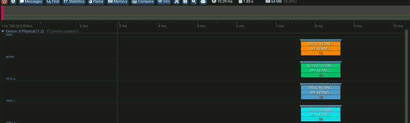
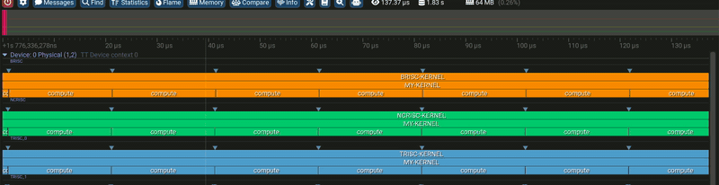
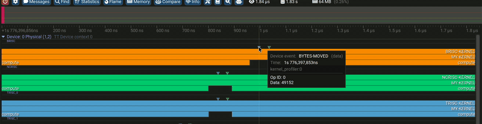

# Streaming profiler in the Tracy GUI

The three device-side instrumentation primitives. For each: the device code, the host callback
that receives it (the consumer contract from
[../../STREAMING_PROFILER.md](../../STREAMING_PROFILER.md) — register with
`perf_debug::register_consumer`, one batch per delivery, records discriminated by `meta.type`),
and how it renders in Tracy. All three GIFs come from one 50-iteration demo kernel combining
the snippets below (~20 us of work per iteration); one GPU context per worker core, one row
per RISC.

## 1. Zone scope — `DeviceZoneScopedN`

Device:

```cpp
void kernel_main() {
    DeviceZoneScopedN("MY-KERNEL");    // one zone spanning the whole kernel
    for (uint32_t it = 0; it < N_ITERS; it++) {
        DeviceZoneScopedN("compute");  // nested zone: opens here...
        do_compute();                  // ~20 us of work
    }                                  // ...closes at the end of the scope
}
```

Host callback — a zone arrives as ONE record, whole, when it closes:

```cpp
perf_debug::ZoneNameMirror names;   // id -> name; grows as kernels JIT-load
auto h = perf_debug::register_consumer("zone-sink", [&](const perf_debug::PerfDebugRecordBatch& b) {
    names.refresh();
    for (const auto& r : b.records) {
        if (r.meta.type != perf_debug::PerfDebugRecType::Zone) continue;
        fmt::print("{}: start={} dur={} cycles (lane {}, op {})\n",
            names.lookup(r.id),          // "compute"
            r.data.zone.start, r.data.zone.duration, r.meta.lane, r.prog);
    }
});
```



A named RAII scope, alive until the end of its `{}`. Zones nest: every RISC row shows
`*-KERNEL` (the firmware wrapper) with `MY-KERNEL` under it and the per-iteration `compute`
zones one level deeper. Hovering shows the name and GPU execution time (~20 us here).

## 2. Timestamped data — `DeviceTimestampedData`

Device:

```cpp
uint64_t bytes_moved = 0;
for (uint32_t it = 0; it < N_ITERS; it++) {
    do_compute();
    bytes_moved += 2048;                                // any runtime value
    DeviceTimestampedData("BYTES-MOVED", bytes_moved);  // stamped with the device time
}
```

Host callback — a `Data` record carries the timestamp; its payload follows as
`Ext` (word count) + `Cont` (one uint64 each) records on the same lane:

```cpp
auto h = perf_debug::register_consumer("data-sink", [&](const perf_debug::PerfDebugRecordBatch& b) {
    names.refresh();
    for (const auto& r : b.records) {
        switch (r.meta.type) {
            case perf_debug::PerfDebugRecType::Data:  // marker: name id + device timestamp
                pending = {names.lookup(r.id), r.data.ts};   // "BYTES-MOVED"
                break;
            case perf_debug::PerfDebugRecType::Cont:  // one uint64 of its payload
                fmt::print("{} @ {}: value={}\n", pending.name, pending.ts, r.data.payload);
                break;
            default: break;
        }
    }
});
```



A point event carrying a 64-bit runtime value. Renders as a triangle above the row; the tooltip
shows name, timestamp, and the value — here `Data: 49152` = `bytes_moved` after 24 iterations.

## 3. Flag — `DeviceFlag`

Device:

```cpp
for (uint32_t it = 0; it < N_ITERS; it++) {
    DeviceFlag("LOOP-START");   // a named instant, no payload
    do_compute();
}
```

Host callback — an `Event` record is complete by itself: name id + timestamp, no payload:

```cpp
auto h = perf_debug::register_consumer("flag-sink", [&](const perf_debug::PerfDebugRecordBatch& b) {
    names.refresh();
    for (const auto& r : b.records) {
        if (r.meta.type != perf_debug::PerfDebugRecType::Event) continue;
        fmt::print("{} @ {} (lane {})\n",
            names.lookup(r.id), r.data.ts, r.meta.lane);     // "LOOP-START" @ device time
    }
});
```



The payload-free point event: a name and a device timestamp, nothing else. Use it to put a
moment (phase boundary, retry, error path) on the timeline. Here one `LOOP-START` per
iteration, next to that iteration's `BYTES-MOVED` on the same row.
