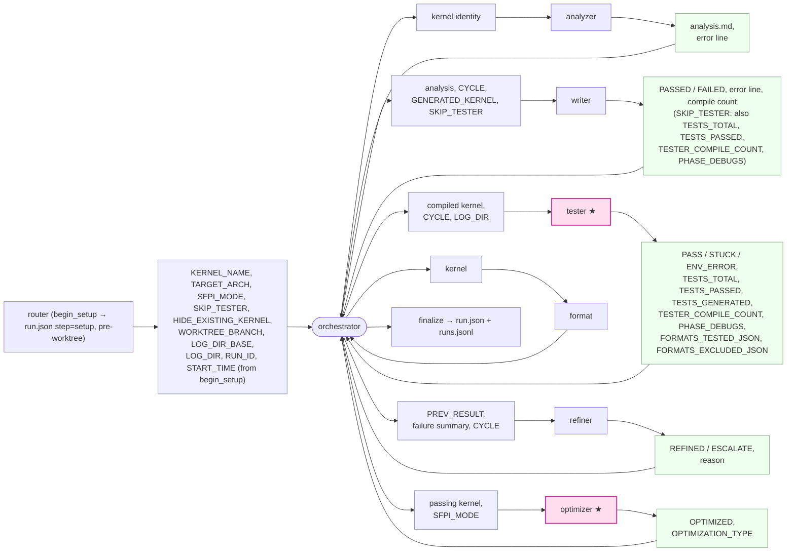
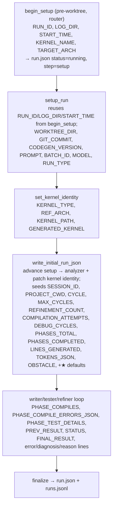

# Quasar CodeGen — `state.py` Dependency Graph

`boot` = `--worktree-dir` file · `run` = `--log-dir "$LOG_DIR"` file.
`★` = agent must write those keys back into `run`.
`SKIP_TESTER` (boolean, from router; default `false`): when true the writer validates the kernel against its existing tests in a 5-run fix loop and writes the `★` tester counts itself; the orchestrator skips the tester and refiner and routes the writer's PASSED/FAILED straight to optimizer / failed.
`HIDE_EXISTING_KERNEL` (boolean, from router; default `false`): when true, `execute_step_hide_existing_kernel` (Step 2b) git-removes and commits the target op's existing files on the worktree branch before the analyzer runs, so the pipeline regenerates blind. `execute_step_setup_run` mirrors it from `boot` into `run` exactly like `SKIP_TESTER`.

## Orchestrator ⇄ agents

Left box into an agent = what it consumes · right box out = what it produces.

## Orchestrator internal state (run file, in order)

