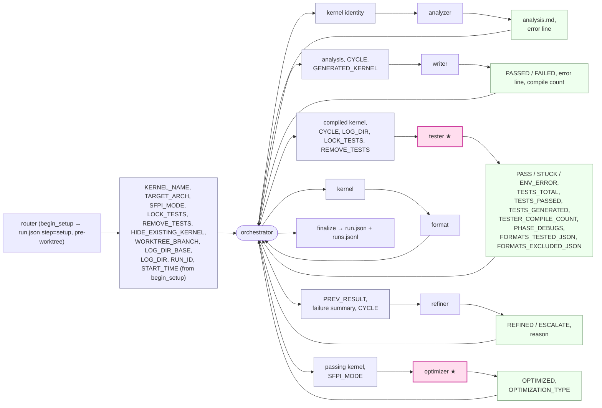
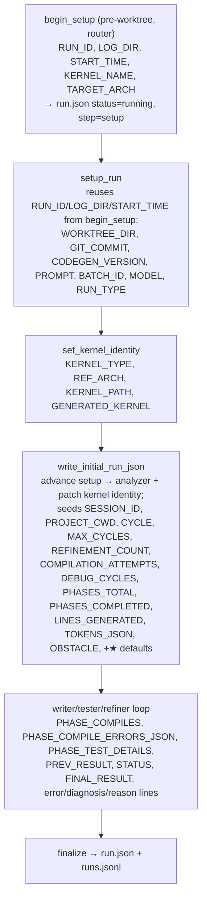

# Quasar CodeGen — `state.py` Dependency Graph

`boot` = `--worktree-dir` file · `run` = `--log-dir "$LOG_DIR"` file.
`★` = agent must write those keys back into `run`.
`LOCK_TESTS` (boolean, from router; default `false`): when true the tester runs test-locked — it treats the existing test as the immutable source of truth, authors or modifies no test, and only runs it and debugs the kernel; the writer→tester→refiner loop is otherwise unchanged.
`REMOVE_TESTS` (boolean, from router; default `false`): when true, `execute_step_remove_existing_tests` (Step 2c) git-removes and commits the op's dedicated arch-specific test files on the worktree branch before the analyzer runs, and the tester authors the test fresh from the analysis spec; overrides `LOCK_TESTS`. `execute_step_setup_run` mirrors it from `boot` into `run` exactly like `LOCK_TESTS`.
`HIDE_EXISTING_KERNEL` (boolean, from router; default `false`): when true, `execute_step_hide_existing_kernel` (Step 2b) git-removes and commits the target op's existing files on the worktree branch before the analyzer runs, so the pipeline regenerates blind. The same commit repoints test includes of the hidden header at `GENERATED_KERNEL` and records them in `REPOINTED_INCLUDES`. `execute_step_setup_run` mirrors it from `boot` into `run` exactly like `LOCK_TESTS`.
`PERF_COMPARE` (boolean, from router; default `true`) and `PERF_REGRESS_PCT` (number, from router; default `2.0`): opt-out and regression threshold for the perf comparison against the original kernel. The comparison itself is gated on `HIDE_EXISTING_KERNEL=true` and `LOCK_TESTS=true` with `REMOVE_TESTS` unset.

### Perf comparison keys (all in `run`)

Written by `execute_step_perf_baseline` (Step 2a): `PERF_ENABLED` (false with `PERF_REASON` when the gate fails, no module collects the op, or the baseline run fails), `PERF_MODULE`, `PERF_K`, `PERF_TEST_ID` (representative node id), `PERF_METRIC` (`mean(MATH_ISOLATE)` for SFPU, else `mean(L1_TO_L1)`), `PERF_BASELINE_CSV`, `PERF_MAX_ATTEMPTS`, `PERF_REGRESS_PCT`.

Written by the optimizer through the step helpers: `execute_step_perf_measure` sets `PERF_LAST_*`, bumps `PERF_ATTEMPTS` for `attempt_*` labels, and prints `action=keep|neutral|revert|retry`; `execute_step_perf_keep` sets `PERF_BEST_*` (csv, label, full, verdicts, deltas, cycles, variant tally, worst key), snapshots the kernel to `$LOG_DIR/perf_best_*`, bumps `PERF_KEPT` for `attempt_*` labels, and after a full sweep also records the confirmed kernel (`PERF_FULL_CSV`, `PERF_CONFIRMED_LABEL`, `$LOG_DIR/perf_confirmed*`) and re-aims `PERF_TEST_ID` at the least-improved variant; `execute_step_perf_revert [label]` restores `perf_best_*` for an attempt (counting it if unmeasured) or, for `final`, restores the confirmed kernel and makes it best-so-far again.

Written by `execute_step_perf_finalize` (Step 6b): `PERF_VERDICT` (median variant), `PERF_VERDICT_NOTE` (regressed variants) and the run.json `perf` object, which also carries `verdict_worst_case`. `execute_step_finalize_run` re-emits the object so a run that never reached the optimizer still records `enabled: false` with its reason.

## Orchestrator ⇄ agents

Left box into an agent = what it consumes · right box out = what it produces.

```mermaid
flowchart LR
  ROUTER["router (begin_setup → run.json step=setup, pre-worktree)"] --> RB["KERNEL_NAME, TARGET_ARCH, SFPI_MODE, LOCK_TESTS, REMOVE_TESTS, HIDE_EXISTING_KERNEL,<br/>WORKTREE_BRANCH, LOG_DIR_BASE,<br/>LOG_DIR, RUN_ID, START_TIME (from begin_setup)"] --> ORCH(["orchestrator"])

  ORCH --> aI["kernel identity"] --> ANA["analyzer"] --> aO["analysis.md,<br/>error line"] --> ORCH
  ORCH --> wI["analysis, CYCLE,<br/>GENERATED_KERNEL"] --> WR["writer"] --> wO["PASSED / FAILED, error line, compile count"] --> ORCH
  ORCH --> tI["compiled kernel,<br/>CYCLE, LOG_DIR, LOCK_TESTS, REMOVE_TESTS"] --> TST["tester ★"] --> tO["PASS / STUCK / ENV_ERROR,<br/>TESTS_TOTAL, TESTS_PASSED, TESTS_GENERATED,<br/>TESTER_COMPILE_COUNT, PHASE_DEBUGS,<br/>FORMATS_TESTED_JSON, FORMATS_EXCLUDED_JSON"] --> ORCH
  ORCH --> rI["PREV_RESULT,<br/>failure summary, CYCLE"] --> RE["refiner"] --> rO["REFINED / ESCALATE,<br/>reason"] --> ORCH
  ORCH --> oI["passing kernel,<br/>SFPI_MODE"] --> OP["optimizer ★"] --> oO["OPTIMIZED,<br/>OPTIMIZATION_TYPE"] --> ORCH
  ORCH --> fI["kernel"] --> FM["format"] --> ORCH

  ORCH --> FIN["finalize → run.json + runs.jsonl"]

  classDef inb fill:#eef,stroke:#88a;
  classDef outb fill:#efe,stroke:#8a8;
  classDef star fill:#fde,stroke:#c39,stroke-width:2px;
  class RB,aI,wI,tI,rI,oI,fI inb;
  class aO,wO,tO,rO,oO outb;
  class TST,OP star;
```

## Orchestrator internal state (run file, in order)

```mermaid
flowchart TB
  Z["begin_setup (pre-worktree, router)<br/>RUN_ID, LOG_DIR, START_TIME, KERNEL_NAME, TARGET_ARCH<br/>→ run.json status=running, step=setup"]
  A["setup_run<br/>reuses RUN_ID/LOG_DIR/START_TIME from begin_setup;<br/>WORKTREE_DIR, GIT_COMMIT, CODEGEN_VERSION, PROMPT, BATCH_ID, MODEL, RUN_TYPE"]
  B["set_kernel_identity<br/>KERNEL_TYPE, REF_ARCH, KERNEL_PATH, GENERATED_KERNEL"]
  C["write_initial_run_json<br/>advance setup → analyzer + patch kernel identity;<br/>seeds SESSION_ID, PROJECT_CWD, CYCLE, MAX_CYCLES, REFINEMENT_COUNT,<br/>COMPILATION_ATTEMPTS, DEBUG_CYCLES, PHASES_TOTAL, PHASES_COMPLETED,<br/>LINES_GENERATED, TOKENS_JSON, OBSTACLE, +★ defaults"]
  D["writer/tester/refiner loop<br/>PHASE_COMPILES, PHASE_COMPILE_ERRORS_JSON, PHASE_TEST_DETAILS,<br/>PREV_RESULT, STATUS, FINAL_RESULT, error/diagnosis/reason lines"]
  E["finalize → run.json + runs.jsonl"]
  Z --> A --> B --> C --> D --> E
```
