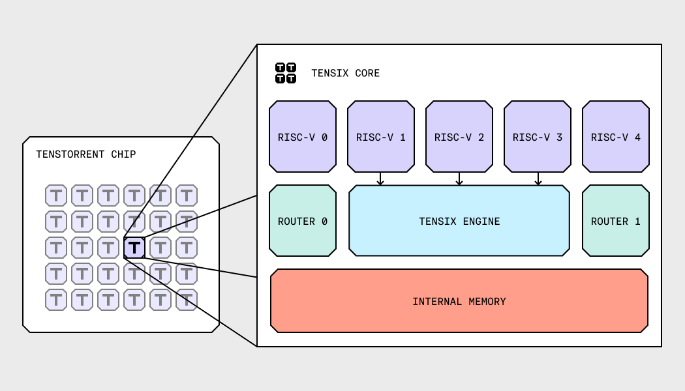
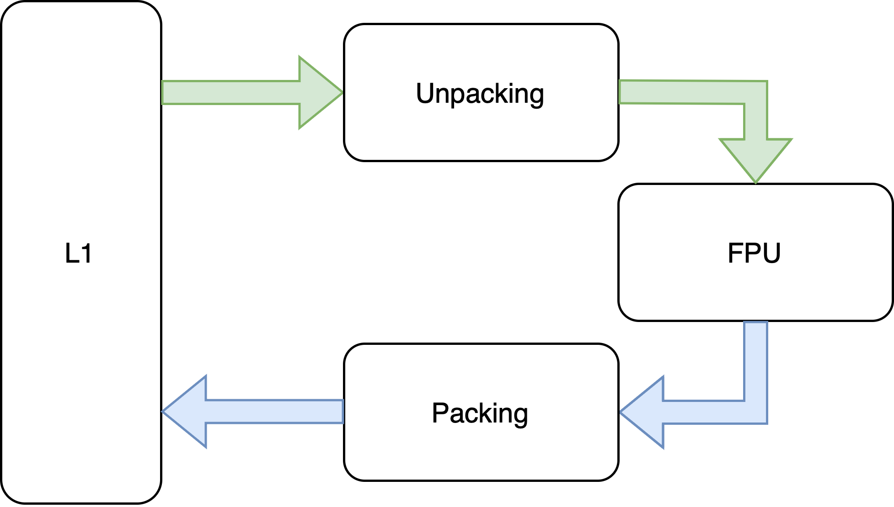
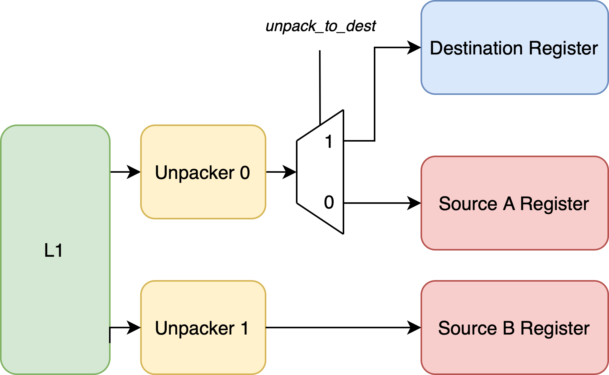
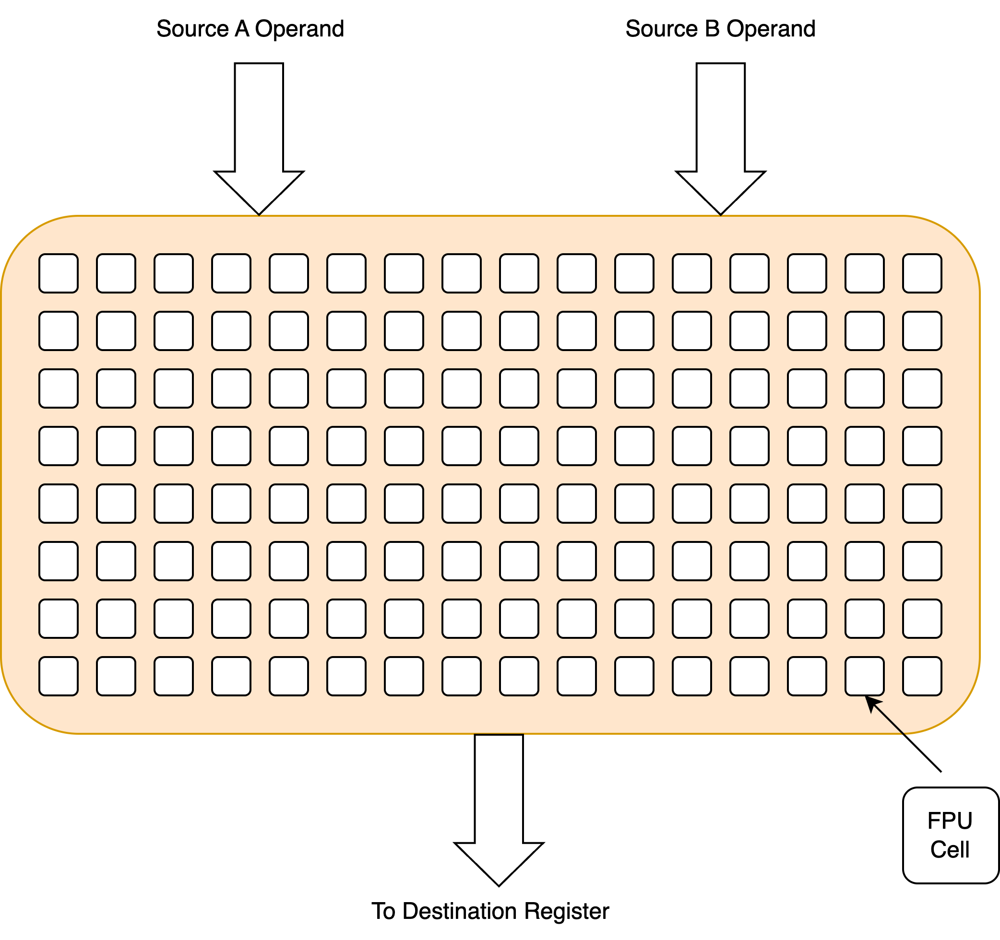

# Getting started with Tensix Core and Low-level Kernels

## Introduction

Low-Level Kernels (LLKs) form the foundational layer in the Tenstorrent software stack. LLKs directly drive hardware to perform matrix and vector operations that are fundamental to machine learning computations. This document provides an overview of Tensix Core functions.

## Tensix Core

Tenstorrent chips are architected as a matrix of Tensix Cores. Figure 1 shows the top-level diagram of a Tensix Core:

   
  <em>Figure 1: Top-level diagram of Tensix Core</em>  

Tensix Core consists of four major parts:

1. Internal SRAM (L1) Memory - Stores input/output tensors and program code for all RISC-V processors within the core.
2. Two Routers - Manage data movement between Tensix Cores and DRAM across the chip.
3. Five RISC-V Processors:
   * NCRISC and BRISC - Handle NOC communication for board setup.
   * Three TRISCs - Control the Tensix Engine through specialized Tensix instructions.
4. Tensix Engine - Hardware accelerator controlled by TRISC processors, optimized for matrix computations essential to AI/ML operations.

LLKs primarily operate by transferring data to and from L1 memory, and programming the Tensix Engine to perform various operations on the stored data.

## Tensix Engine

The Tensix Engine is a multi-threaded, single-issue, in-order processor that uses a custom instruction set architecture known as the Tensix ISA. It is run by three concurrent threads, each managed by a dedicated TRISC processor. The Tensix ISA differs from the RISC-V instruction set; instructions are issued by RISC-V cores and then executed by the Tensix Engine.

Figure 2 represents a simplified top-level architecture of the Tensix Engine:

   
  <em>Figure 2: Top-level architecture of Tensix Engine</em>  

Figure 3 illustrates the common data flow within the Tensix Engine:
1. Input data arrives in L1 memory.
2. Data is unpacked into source registers.
3. FPU processes data from source registers.
4. Results are written to destination registers.
5. Processed data is packed and written back to L1 memory.

Alternatively, the data can be processed within SFPU, which requires operands to be stored in the Destination register rather than in the Source registers.

   
  <em>Figure 3: Data flow inside Tensix Core</em>

## Inputs

When describing input tensors, each data element in the tensor is referred to as a *datum*. Figure 4 shows an example of a 32x64 input tensor, where each square represents a single datum.

   
  <em>Figure 4: An example of 32x64 input tensor</em>  

Input tensors can be stored in L1 memory using two formats:

1. Row-major order - Data is stored sequentially row by row, the conventional format for tensor storage.
2. Tile order - A specialized storage format optimized for operations performed by the Tensix Cores.

Row-major order follows the standard linear memory layout, where elements are stored sequentially row by row regardless of tensor dimensions.

   
  <em>Figure 5: Row-major order of input data</em>  

For optimal LLK performance, input data must be arranged in 32×32 tiles. Each tile is divided into four 16×16 sections called faces, labeled F0 to F3 in row-major order. Within each face, data is also stored in row-major order. LLKs handle the transformation of input data from its original data layout into tile order before performing computations.

   
  <em>Figure 6: Input data in tile order</em>

## Data formats

Input and output tensors support multiple storage formats, enabling developers to select the optimal precision for their application. The complete list of supported formats is available in [the official data format table](https://docs.tenstorrent.com/pybuda/latest/dataformats.html).

Important considerations:
- All formats can be stored in L1 memory.
- Only a subset of formats are supported in Source and Destination registers, leading to automatic conversions in unpacker/packer.

## Math fidelity

The Tensix hardware can use a limited number of bits for multiplication operations. To utilize all the bits from the datums of a particular data format, several multiplication phases might be required to achieve full precision.
[Math fidelity](https://docs.tenstorrent.com/pybuda/latest/dataformats.html) is a key concept in achieving computational accuracy. Tensix Cores support up to four fidelity phases depending on the data format. Tenstorrent allows developers to choose the fidelity level for some operations, balancing accuracy requirements with performance for their specific application.

## Unpacker

The Unpacker is a DMA engine that transfers data between L1 memory and source/destination registers. The Tensix architecture implements two unpackers:
- Unpacker 0: Connected to Source A register and Destination register.
- Unpacker 1: Connected to Source B register.

  
   
  <em>Figure 7: Unpackers</em>  

Unpackers feature hardware-accelerated data format conversion through specialized components called gaskets, eliminating software overhead. TRISC0 controls both unpackers through a subset of the Tensix instruction set.

## Source Operand Register files (Source A and Source B)

Source registers are two-dimensional structures which are double-buffered. Both Source A and Source B comprise of two memory banks, which can store one tile each. Key characteristics:

- Store unpacked data from their respective unpackers in limited accuracy (up to 19-bit data elements in current architectures).
- Maintain high throughput and support pipelined execution through double buffering.

## Floating Point Unit (FPU)

The Floating Point Unit (FPU) serves as the primary computational engine within the Tensix Engine, executing the majority of mathematical operations.

   
  <em>Figure 8: Floating Point Unit</em>  

The FPU operates on data from Source A and Source B registers, storing results in the Destination register. It is architected as a matrix of FPU cells - multifunctional units that combine multipliers and adders, working with accumulators in the Destination register.
Each FPU cell supports four operations:

1. Accumulated dot product.
2. Accumulated element-wise addition.
3. Accumulated element-wise multiplication.
4. Element-wise addition.

The FPU is controlled through a dedicated set of Tensix instructions issued by TRISC1.

## Special FPU (SFPU)

SFPU provides specialized operations beyond FPU capabilities. As a SIMD engine, it executes identical operations on multiple data points in parallel. Unlike FPU, SFPU can only read from and write to Destination register. It is a load/store architecture, meaning that it cannot operate directly on data stored in the Destination register - it requires the data to be loaded in its internal registers, and stored back to Destination register. SFPU supports:

- 32-bit input calculations.
- Straightforward SW implementation of complex mathematical functions (sigmoid, exponential, reciprocal, etc.).

SFPU data flow requirements:

- Input operands must reside in the Destination register.
- Data can be moved to Destination register through:
  - FPU transfer from Source A/B registers.
  - Direct unpacking from L1 memory via Unpacker 0.
- Results are stored back in the Destination register.

SFPU is instantiated within FPU, meaning that the same processor used for issuing FPU instructions (TRISC1) is in charge of issuing SFPU instructions.

## Destination Operand Register file

Destination register stores the results of FPU calculations and the operands and results of SFPU calculations. Destination register can, depending on the configuration and the data format, store between four and sixteen tiles. Another important feature is that, unlike Source registers, Destination register can be configured to store 32-bit data elements.

## Packer

The Packer is a DMA engine that transfers data from the Destination register to L1 memory. Like the Unpackers, it implements hardware-accelerated data conversion through gaskets. TRISC2 controls the Packer through its dedicated instruction set.

## Low-Level Kernel Operations

LLK operations encapsulate the utilization of the previously described hardware blocks. These operations are categorized by their resource usage into three groups:

1. Unpack operations - Data movement from L1 to source registers or destination register.
2. Math operations - Computational tasks using FPU/SFPU.
3. Pack operations - Data movement from destination register to L1.

### LLK Unpack Operations (Table 1)

Table 1 contains all unpack operations currently implemented for Tensix:

| LLK Header | Description |
|:-----------|:------------|
| `llk_unpack_A.h` | Unpacks a single tile from L1 into Source A register. Used for unary operations. |
| `llk_unpack_AB.h` | Unpacks two tiles from L1 into Source A and Source B registers. Used for binary operations. |
| `llk_unpack_AB_matmul.h` | Optimizes matrix multiplication by unpacking tiles into Source A and B with register reuse. |
| `llk_unpack_reduce.h` | Unpacks a single tile into Source A and a scalar value into Source B for reduction operations. |
| `llk_unpack_tilize.h` | Converts row-major input data into tile format during unpacking. |
| `llk_unpack_untilize.h` | Converts tiled data back to row-major format during unpacking. |
---

### LLK Math Operations (Table 2)

Table 2 contains all math operations currently implemented for Tensix:

| LLK Header | Description |
|:-----------|:------------|
| `llk_math_eltwise_unary_datacopy.h` | Transfers a tile from Source A/B to Destination register using FPU. |
| `llk_math_eltwise_unary_sfpu.h` | Executes unary operations on a tile data in the Destination register using SFPU. |
| `llk_math_eltwise_binary.h` | Performs element-wise operations (add/sub/mul) on Source A and B tiles using FPU, storing results in Destination register. |
| `llk_math_eltwise_reduce.h` | Computes global maximum or average from Source A using scalar values from Source B via FPU. |
| `llk_math_eltwise_matmul.h` | Performs matrix multiplication between Source A and Source B tiles using FPU. |
---

### LLK Pack Operations (Table 3)

Table 3 contains all pack operations currently implemented for Tensix:

| LLK Header | Description |
|:-----------|:------------|
| `llk_pack.h` | Transfers a tile from Destination register to L1 memory, maintaining tile format. |
| `llk_pack_untilize.h` | Transfers a tile from Destination register to L1 memory, converting to row-major format. |
---
