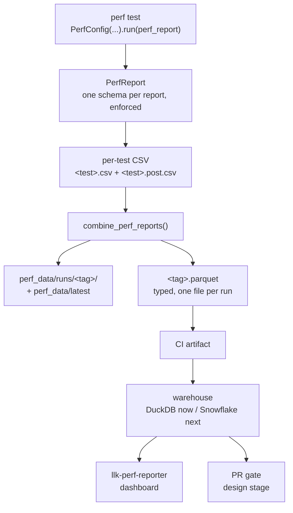

# LLK perf infrastructure: what changed, and why

This document records the state of the LLK performance infrastructure. It shows
the state before the work, the state now, the tools we added, and the plans for
the database, the dashboard, and the merge gate.

Companion document: [rules.md](rules.md) — the procedures a developer follows.

---

## Contents

- [1. The problem](#1-the-problem)
- [2. Before and now](#2-before-and-now)
- [3. The pipeline today](#3-the-pipeline-today)
- [4. The layers](#4-the-layers)
  - [4.1 One owner for every header name](#41-one-owner-for-every-header-name)
  - [4.2 The per-test catalog and the drift gate](#42-the-per-test-catalog-and-the-drift-gate)
  - [4.3 The published table](#43-the-published-table)
  - [4.4 Parquet: one typed file per run](#44-parquet-one-typed-file-per-run)
  - [4.5 One directory per run](#45-one-directory-per-run)
  - [4.6 Historical migration](#46-historical-migration)
  - [4.7 The gates](#47-the-gates)
- [5. The tools](#5-the-tools)
  - [In the repository](#in-the-repository)
  - [Developer tools (`.claude/`)](#developer-tools-claude)
  - [Study tools (on `nstojictt/llk-perf-noise-baseline`)](#study-tools-on-nstojicttllk-perf-noise-baseline)
  - [Harness options we added](#harness-options-we-added)
  - [Ownership](#ownership)
- [6. Merged work](#6-merged-work)
- [7. Open work](#7-open-work)
- [8. The database plan](#8-the-database-plan)
  - [The seam](#the-seam)
  - [The table](#the-table)
  - [Open items on the database](#open-items-on-the-database)
- [9. The dashboard plan](#9-the-dashboard-plan)
  - [Dashboard work queued](#dashboard-work-queued)
- [10. The gate plan, and the evidence behind it](#10-the-gate-plan-and-the-evidence-behind-it)
  - [Cost](#cost)
  - [Noise](#noise)
  - [The two defensible thresholds](#the-two-defensible-thresholds)
  - [The blocker: matmul is bistable](#the-blocker-matmul-is-bistable)
  - [What is not established](#what-is-not-established)
- [11. Design principles we settled on](#11-design-principles-we-settled-on)

---

## 1. The problem

The LLK test suite measured performance and wrote CSV files. That was all.

Nobody could answer the one question that matters: **did this change make LLK
slower?** To answer it you need history, and history needs a stable schema. The
CSV files had no stable schema.

Six concrete defects:

1. **Header names were string literals in four modules.** `perf.py`,
   `metrics.py`, `profiler.py`, and `fuser_config.py` each built column names
   from inline strings. A rename in one place did not reach the others.
2. **Nothing checked the column names.** A test could change its columns in
   silence. Two runs of the same test were no longer comparable, and nobody knew.
3. **Two parameters could produce the same column.** Two parameter classes that
   declare the same field name produce two columns with one header. `pandas`
   renames the second to `<name>.1`. The data is then wrong, not absent.
4. **Every run wrote into one shared directory.** A second run overwrote the
   first. Worse: a narrower second run left the first run's test directories in
   place, so the tree looked complete but held a blend of two runs.
5. **CSV was the only output.** CSV has no types. `value_bits` could hold
   `"2.0f"`. There was no table anyone could load into a database.
6. **No baseline, no threshold, no gate.** The only comparison script defaulted
   to 5% — a number nobody had measured.

---

## 2. Before and now

| Concern | Before | Now |
|---|---|---|
| Column names | String literals in 4 modules | One owner: `helpers/perf/schema.py` |
| Per-test columns | Unrecorded | Golden catalog with a version: `helpers/perf/test_schemas.py` |
| Column drift | Silent | `test_perf_header_gate.py` fails the PR with a per-test diff |
| Duplicate columns | `pandas` renamed them to `<name>.1` | Three uniqueness gates fail the PR |
| Published table | None | 82-column wide nullable schema: `helpers/perf/wide_schema.py` |
| Types | None (text) | `int64` / `float64` / `bool` / `string`, enforced by Arrow |
| Run output | One shared `perf_data/` | `perf_data/runs/<tag>/` per run, plus a `latest` symlink |
| Machine-readable output | None | One typed `<tag>.parquet` per run |
| Run provenance | None | `commit_sha`, `arch`, `run_id`, `timestamp`, `pipeline`, `pr_number` |
| Historical data | Loose CSV archives | `helpers/perf/migrate.py` converts them into the same schema |
| Database | None | Storage seam: DuckDB now, Snowflake next |
| Dashboard | None | `llk-perf-reporter`: scan, trends, branch compare, param impact |
| Local regression check | None | `perf-regression-check`: any two commits, one test |
| Threshold evidence | None | Measured noise baseline over ~1.9 million values |
| Hardware needed to test the pipeline | Yes | No. Every schema and Parquet test runs without a chip. |

---

## 3. The pipeline today



Two facts about this pipeline are easy to get wrong:

- **`<test>.csv` holds raw loop totals.** The per-tile figure exists only in
  `<test>.post.csv`. The Parquet stores the raw form, because per-tile is
  derivable: divide `mean(<RUN_TYPE>)` by `loop_factor * tile_cnt`. Both are
  columns.
- **One Parquet holds every test of one run.** It is not one file per test. The
  wide schema is what makes that possible: each test fills its own columns, and
  the rest stay NULL.

---

## 4. The layers

### 4.1 One owner for every header name

`helpers/perf/schema.py` holds every header name and every header builder:

```python
stat_column("L1_TO_L1", "mean")   # -> "mean(L1_TO_L1)"
metric_column("L1_TO_L1", "x")    # -> "L1_TO_L1_x"
text_size_column("L1_TO_L1")      # -> "TEXT_SIZE(L1_TO_L1)"
counter_base("FPU", "FPU_COUNTER")  # -> "FPU.FPU_COUNTER"
```

It also holds `FORMAT_HEADERS`, `FLAG_HEADERS`, `MARKER`, and the two catalogs
that keep the metric vocabulary honest: `RUN_TYPE_NAMES` and `METRIC_BASES`.

The module imports no device library. It loads without hardware. Every gate
depends on that property.

### 4.2 The per-test catalog and the drift gate

`helpers/perf/test_schemas.py` holds one entry per perf test:

```python
"perf_eltwise_binary": {
    "version": 4,
    "columns": [ ...14 sorted column names... ],
    "aliases": {"formats.sfpu_math": "formats.sfpu_src"},
    "test_name_aliases": {
        "perf_eltwise_binary": "perf_eltwise_binary",
        "perf_eltwise_binary_fpu": "perf_eltwise_binary",
    },
},
```

`test_perf_header_gate.py` re-derives each test's columns from the source with
`ast`, then compares them to this catalog. A mismatch fails with a per-test diff:

```
  'perf_eltwise_binary' (schema v4): +['my_new_column'] -[]
```

Four fields, four jobs:

| Field | Job |
|---|---|
| `columns` | The reviewed column set. A change is a reviewed diff, never a surprise. |
| `version` | Two reports of the same test are comparable if the version matches. |
| `aliases` | Old column name to new. A downstream reader can follow a rename. |
| `test_name_aliases` | Old test name to current. A rename does not lose the history. |

The gate covers 23 WH/BH perf tests and 18 Quasar perf tests. Quasar tests derive
from their sibling `test_*_quasar.py`, which is where `PerfConfig` is called.

`test_name_aliases` has a strict rule: the current name must map to itself. A
developer who renames a test in place, and forgets this map, fails the gate —
the identity entry would still point at the old name.

### 4.3 The published table

`helpers/perf/wide_schema.py` declares `DB_SCHEMA`: 82 columns, one row per test
configuration per run. This is the table the data team receives, and the exact
schema the Parquet is written with.

Each column declares its origin:

```python
Column("math_fidelity", "string", True, "configuration")            # origin="test"
Column("commit_sha", "string", False, "provenance", origin="ci")    # stamped by CI
```

Two views derive from that one list:

- `OUTPUT_SCHEMA` — the 75 `origin="test"` columns. A report is validated
  against these.
- `PROVENANCE` — the 7 `origin="ci"` columns. The publish layer stamps them.

One source of truth, two views. A column cannot exist in one and not the other.

Every column except `marker` and the mandatory provenance keys is nullable. That
is what lets 23 tests with different sweeps share one table. New columns join as
nullable, so v1 does not have to be complete.

Quasar has its own table in `wide_schema_quasar.py`. Quasar columns never enter
the WH/BH table, and WH/BH columns never enter a Quasar batch.

### 4.4 Parquet: one typed file per run

`helpers/perf/parquet.py` has two entry points and one shared core:

```
live run   -> {test_name: DataFrame} ------\
                                            >-- build_run_batch -> to_table -> run.parquet
CSV files  -> convert_csvs_to_parquet ----/
```

`build_run_batch` does four things:

1. **stamp provenance** — add `test_name` and the run context.
2. **concat** — stack every test's rows into one frame.
3. **to_table** — align to the schema (missing columns become NULL, extras drop,
   order fixed), then cast each column to its declared Arrow type.
4. **validate_batch** — every non-nullable column must be fully populated.

The converter is strict by default. If a column is not in the schema, or a value
does not fit its declared type, it raises **before** it writes. No lossy file
reaches the archive.

`parquet_to_csvs` reverses the batch into per-test CSVs. With the default
options, a round trip reproduces the same batch. That is how the pipeline tests
prove the conversion is lossless.

### 4.5 One directory per run

`TestConfig.perf_run_dir()` returns `perf_data/runs/<tag>/`. `perf_data/latest`
is a symlink to the newest run.

Details that matter:

- **The tag is a filesystem concern only.** It never reaches the published table.
  CI sets `PERF_RUN_TAG` itself, because only the workflow can see the shard
  index. The local fallback is `local-<UTC timestamp>`.
- **`run_id` is a different thing.** It is a `ROW_KEY` column, and every shard of
  one CI workflow shares it by design. A re-run keeps `GITHUB_RUN_ID` and bumps
  `GITHUB_RUN_ATTEMPT`, so attempt 2 publishes as `<run>-2`. Attempt 1 stays
  bare, so rows already archived keep the identity they were published with.
- **The `latest` swap is atomic.** The link is created under a temporary name and
  renamed. A reader sees the old run or the new one, never nothing.
- **Local history is bounded.** `PERF_KEEP_RUNS` defaults to 10. The archive is
  the published Parquet, not this directory.
- **Prune cannot delete the current run.** The run that just finished is
  protected by name, not by being the newest. A clock that jumped backwards must
  not be able to remove it.

### 4.6 Historical migration

`helpers/perf/migrate.py` converts an archive of past runs into the same schema,
one Parquet per run, and reuses the same converter. Three properties:

- **Deterministic.** Same archive, same batches, same report. No clocks.
- **Lenient.** A dirty run never aborts the migration. It is recorded as
  `failed` and skipped, and every other run still migrates.
- **Idempotent.** Each batch is written to a temporary file and renamed, so a
  crash mid-write leaves nothing a later pass mistakes for complete.

Provenance comes from an optional `run_meta.json` sidecar. Anything it omits
falls back to the folder name.

### 4.7 The gates

Five hardware-free gates guard the schema. They run with the LLK pytest suites.

| Gate | What it catches |
|---|---|
| `test_perf_test_schemas_match` (+ `_qsr`) | A test's columns drifted from the catalog |
| `test_test_name_aliases_*` | A test was renamed without updating the alias map |
| `test_run_type_names_match_source` | A `PerfRunType` member was added or renamed |
| `test_metric_bases_match_source` | An efficiency metric name changed |
| `test_parameter_field_names_are_globally_unique` | Two parameter classes share a field name |
| `test_no_shadowed_parameter_class` | A parameter class is declared twice with different fields |
| `test_no_parameter_field_equals_a_fixed_header` | A field name collides with a reserved header |

Plus `test_perf_report_hw_free.py`, which runs the **real** report code with the
device seams stubbed. The static gate reads source with `ast` and cannot see a
parameter built at run time. This test can, because the columns come from the
real code path.

---

## 5. The tools

### In the repository

| Tool | Purpose |
|---|---|
| `helpers/perf/` | The package: `core`, `schema`, `wide_schema`, `wide_schema_quasar`, `parquet`, `migrate`, `publish_run`, `test_schemas` |
| `publish_run` CLI | One run's CSVs to one typed `run.parquet`, with CI provenance |
| `migrate` CLI | A historical archive to one Parquet per run |
| `perf_schema_derive.py` | Static column derivation with `ast`. No device imports. |
| `compare_test_and_perf.py` | Audit a perf sweep against its functional counterpart |

### Developer tools (`.claude/`)

| Tool | Purpose |
|---|---|
| `perf-regression-check` skill | Compare one perf test between any two commits, on your machine |
| `perf_compare_commits.sh` | The script behind it: sparse worktrees, caching, interleaved iterations |
| `perf-report` skill | Produce a trustworthy report end to end, with provenance |
| `perf-parameter-impact` skill | Analyze a finished `.post.csv` |
| `perf-optimization-audit` skill | Audit a kernel change for a suspect optimization |
| `quasar-perf-test` skill | Create or repair a Quasar perf test |

`perf-regression-check` deserves a note. It gives four guarantees so the
developer does not have to think about them:

1. **Your checkout is never touched.** Each commit gets a sparse worktree with
   its own build tree. A dirty tree is fine. An interrupt cannot leave you on a
   detached HEAD.
2. **Only committed code is measured.** The script says so plainly.
3. **Runs are cached** per (arch, test, variant, commit). Comparing A-vs-B then
   B-vs-C only sweeps C. Cached runs from another host are refused, because
   cycles from another machine are not comparable.
4. **Iterations are interleaved** baseline, current, baseline, current. Machine
   drift hits both sides equally.

### Study tools (on `nstojictt/llk-perf-noise-baseline`)

| Tool | Purpose |
|---|---|
| `perf_gate_budget.sh` | Wall-clock cost of each run-type configuration |
| `run_perf_noise_baseline.sh` | N runs of one commit, snapshots `perf_data` each time |
| `perf_noise_analysis.py` | Per-point movement statistics |
| `perf_outlier_investigation.py` | Characterises the points a rule flags |
| `perf_noise_plots.py` | Plots, so the 21 MB point CSVs need not be committed |

### Harness options we added

| Option | Purpose |
|---|---|
| `--perf-run-types` | Scope a sweep to a subset of run types. The main cost lever. **Not yet on `main`** — it lives on `nstojictt/perf-gate-budget`. |
| `--record-test-order` | Record which test ran on which worker, in which order |
| `--test-order-file` + `--rewind-runner` | Replay that exact sequence |
| `--speed-of-light` | Fold runtime parameters into the template list |
| `PERF_KEEP_RUNS` | How many run directories to retain locally |
| `WIPE_BUILD=1` | Force a cold build, to measure compile cost |

`--record-test-order` and `--rewind-runner` are what let us exclude core
placement, execution order, and concurrency as causes of a measurement anomaly.
They turned a hypothesis into a controlled experiment.

### Ownership

`.github/CODEOWNERS` restricts the perf infrastructure. Any change to
`helpers/perf*`, `**/perf_*.py`, or `**/test_perf_*.py` needs a review from the
named owners. The schema is a contract with the data team; it cannot drift
through an unreviewed edit.

---

## 6. Merged work

| PR | What it changed |
|---|---|
| #50988 | Profiler buffer overrun: reserve 2 words per open zone |
| #51483 | Centralize perf-CSV header construction into one module |
| #51484 | Golden header catalog plus the drift gate |
| #51485 | Fix duplicate headers, enforce uniqueness |
| #51594 | Shared wide nullable perf-report schema (v1) |
| #51737 | CSV to Parquet conversion |
| #51951 | Historical CSV to Parquet migration |
| #52058 | Catalog hotfix for the `formats.sfpu_math` rename |
| #52706 | Group the perf helpers under `helpers/perf/` |
| #52821 | Explicit CODEOWNERS for the perf infrastructure |
| #52850 | Developer tool for a regression check |
| #53019 | `publish_run`: one run's CSVs to one typed `run.parquet` |
| #53020 | CI emits Parquet beside the CSVs in the perf artifact |
| #53132 | Fix an import left behind by the package reorganization |
| #53552 | `perf-regression-check`: compare a test between any two commits |
| #53660 | Separate test outputs per run |

Related team work in the same area: #53934 aligned WH/BH test naming and updated
the catalog keys; #54186 keeps the LLK artifact tree on a collect-only pass;
#54297 hardened the LLK PR review workflow.

## 7. Open work

| PR / branch | State |
|---|---|
| #53928 | One Parquet writer per run, named from the run tag. Open. |
| #53021 | Perf warehouse storage seam: DuckDB stand-in plus Snowflake backend. Open. |
| #51954 | Compare-to-history plus a full-pipeline integration test. Open. |
| #51953 | Parquet to HTML dashboard. Superseded by `llk-perf-reporter`. |
| #53752 | Design: LLK perf regression PR gate. Open. |
| #52914 | Warehouse sandbox. Prototype, not for merge. |
| `nstojictt/llk-perf-noise-baseline` | The noise and cost study. Not proposed for merge. |

---

## 8. The database plan

### The seam

`helpers/perf/warehouse.py` (PR #53021) defines one interface:

```python
class PerfWarehouse:
    def load(self, parquet_path: str) -> int: ...   # ingest one run's batch
    def query(self, sql: str) -> pd.DataFrame: ...  # analytical read
```

`get_warehouse()` selects a backend from the `PERF_WAREHOUSE` environment
variable. Downstream code — publish, compare, dashboard, gate — depends only on
the interface. No caller knows which database is behind it.

Two backends:

- **`DuckDBWarehouse`** — local, Parquet-native. It exists so the whole pipeline
  can be built and tested before the Snowflake table exists.
- **`SnowflakeWarehouse`** — the real target. `write_pandas` to load,
  `fetch_pandas` to query. The connector is imported lazily, so the module loads
  without it.

Retiring the stand-in is a three-line change: delete `warehouse_duckdb.py`, drop
the `duckdb` branch in the factory, remove `duckdb` from requirements. Nothing
downstream changes.

The Snowflake path is already proven against the `fakesnow` emulator, and the
end-to-end flow — load two nightly runs, flag a seeded +20% regression, render a
dashboard — is proven over DuckDB.

### The table

One table, `llk_perf`, whose physical schema is `DB_SCHEMA`. One row is one test
configuration in one run.

Row key: `test_name`, `commit_sha`, `arch`, `run_id`, plus the sweep-parameter
columns. `run_id` includes the workflow attempt, so a re-run cannot publish a
second, different measurement under the same key.

### Open items on the database

- **Ingest path.** `write_pandas` today. If the data team prefers a stage plus
  `COPY INTO`, or Snowpipe, only `SnowflakeWarehouse.load` changes.
- **Counter and metric columns.** Deferred (issue #51249). They join the table as
  nullable once a counter run captures their exact names.
- **Column canonicalization.** Deferred (issue #51245). Some columns name the
  same thing differently across tests: `c_dimm` / `k_dimm` / `r_dimm` against
  `in0_c_dim` / `ct_dim`; `formats.input_A` against `input_format`. Picking one
  canonical name per concept needs sign-off, so they are not merged yet.

---

## 9. The dashboard plan

We built a Parquet-to-HTML dashboard first (PR #51953), then dropped it. The
internal **LLK Perf Reporter** already reads perf data and renders it, and it
reads the warehouse directly, so it never imports our code. That is the right
seam: our job is to publish a clean table, not to draw charts.

The reporter answers one kind of question: **did this get slower, and who made it
slower?** Its tabs:

| Tab | Question |
|---|---|
| **Scan** | What regressed last night? |
| **Trends** | How did this number move over time? |
| **Branch** | Did my branch regress anything? |
| **Param impact** | What does this parameter cost me? |
| **Stage breakdown** | Is this config unpack-, math-, or pack-bound? |
| **Single View / Compare** | What is in this one file? |

The regression method is a per-point z-score against a baseline of recent
nightlies, not a fixed percentage:

- baseline = median of the history, excluding its most recent run
- noise = 1.4826 x MAD, floored at 0.3% of the baseline
- flag when the deviation exceeds k sigma (default 3)
- `sustained` = the shift held for two or more runs
- ranking prefers **one-sided** groups, where every config moved the same way,
  because balanced movement is noise

This method caught a real +4% matmul UNPACK regression that a fixed 5% threshold
missed.

Scan also reports a **coverage** line: configs and tests that stopped or started
running between the two runs. A config that stopped running looks exactly like an
improvement. Read that line first.

### Dashboard work queued

- Give **Trends** the same median plus k-MAD band and the `sustained` rule. It
  still uses the older step-based noise band.
- **Per-op code-cause mapping**: map each test to its kernel files, seeded from
  the test `.cpp` includes, so the "LLK was touched" signal is per test rather
  than one aggregate flag.
- **Stage-aware culprit scoring**: combine which stage regressed with which files
  a commit touched.
- **Automated bisect**: dispatch perf on midpoint commits. Needs on-demand runs.
- **Change-point detection**, and drill-down from a (test, metric) group to its
  configs.
- Permalinks, test search, export, per-stage bottleneck.

---

## 10. The gate plan, and the evidence behind it

The goal is a PR gate that fails a change which makes LLK slower.

Proposed flow (PR #53752):

1. A PR with LLK changes opens.
2. The perf workflow runs.
3. The gate workflow compares the result against the Snowflake baseline for the
   branch point.
4. A regression blocks the merge.
5. After the merge, the sanity workflow publishes the new baseline.

A gate needs a threshold, and a threshold needs measurement. We measured it.

### Cost

Wall clock, one card, cold build tree:

| Configuration | Run types | Blackhole | Wormhole |
|---|---|--:|--:|
| full | all declared | 19:41 | 30:14 |
| isolates | UNPACK, MATH, PACK | 12:40 | 18:45 |
| l1 | `L1_TO_L1` only | 6:17 | 9:19 |

The two architectures run on separate runners in parallel, so gate latency is the
Wormhole figure: about **9 minutes** for `L1_TO_L1`, **19 minutes** for isolates.
A non-SoL gate is affordable.

Compile is 65 to 79% of every configuration. `tt-llk` is header-only, so a PR
that touches a kernel header invalidates nearly every ELF. A build cache helps
only PRs that do not touch LLK. The way to cut cost is fewer test variants.

### Noise

We ran the same commit five times, then ten times, and measured how far each
point moved between its best and worst run. The code never changed, so every
movement is measurement noise, and anything a gate would fail on is a false
alarm by definition.

Findings:

1. **Measurement is largely deterministic.** Most points return identical cycle
   counts across runs.
2. **Ordinary noise is a fixed ~25 cycles.** It matters only for the few-hundred
   cycle `INIT` and `UNINIT` markers. On a 250,000-cycle `TILE_LOOP` it is 0.01%.
3. **No single number describes both components.** The fixed part is constant in
   cycles; the proportional part is constant in percent. A percentage alone must
   be at least 7% to survive 25 cycles landing on a small `INIT`. A cycle count
   alone must be at least 5,000 to survive 2% on a large `TILE_LOOP`. Both are
   useless. Requiring **both clauses** bounds each component in its own unit.
4. **`MATH_ISOLATE` and `UNPACK_ISOLATE` are gate-ready** on both architectures:
   zero false failures across 396,142 measurements.
5. **Repeating runs does not help.** Averaging two runs per side leaves the p99
   essentially unchanged. Most points are bit-identical between runs.

### The two defensible thresholds

**With a cycle clause** — flag when a number is more than **2% slower AND more
than 50 cycles slower**. Zero false failures on Blackhole `L1_TO_L1`,
`MATH_ISOLATE`, `UNPACK_ISOLATE`, and on all non-matmul Wormhole `L1_TO_L1`.

**Percentage only** — flag when a number is more than **2% slower**, applied to
`TILE_LOOP` and `KERNEL` only. Excluding `INIT` and `UNINIT` removes the
small-number problem at the source, so no cycle clause is needed. Worst observed
movement is 1.59%.

We suggest that improvements which clear the same threshold are **reported but
not failed**. A large unexplained speedup often means a test stopped doing its
work. The information is free; the false failures are not.

### The blocker: matmul is bistable

Both thresholds exclude matmul, which is 88% of the `L1_TO_L1` sweep. That is the
honest cost of shipping today.

Matmul measurements land on one of two discrete values, 2 to 6% apart on
`L1_TO_L1` and up to 24% on `PACK_ISOLATE`, at low probability per run. It is not
jitter. Four configurations whose normal values spread over 758 cycles collapse
onto values 48 cycles apart in the alternate state — fifteen times tighter. If
this were measurement error it would scale with the thing measured. It does not.
It is a **state the hardware enters**, and it costs about the same wherever it
happens.

We excluded everything the harness controls:

| Hypothesis | Verdict | Method |
|---|---|---|
| A sweep parameter causes it | Excluded | No parameter separates flagged from clean. The worst value still leaves 99.3% clean, and two matmul tests disagree about which setting is worst. |
| A fixed set of bad configurations | Excluded | Only 30 of 53 flagged points reappeared in a ten-run study, which found 53 new ones. The flagged set is a sample, not a list. |
| One bad run | Excluded | The odd value spreads evenly across all ten runs. |
| Core placement, order, concurrency | Excluded | Replaying one recorded order at `-n 1` on core (0,0) reproduces the rate: 0.101% against a parallel baseline of 0.141%. |
| Cold build / first-run effect | Excluded | Both replays warm. |

What survives: **only measurements that involve the packer are ever affected.**
`MATH_ISOLATE` and `UNPACK_ISOLATE` are clean across 396,142 measurements.
`PACK_ISOLATE` and `L1_TO_L1` carry every failure.

One narrower statement is well supported by the format data:

> The instability lives in the standard floating-point pack path. The block-float
> path does not have it.

`Bfp8_b` output flags at 0.03%; `Float16_b` at 6.27%. `Bfp8_b` is also the
*cheapest* format for the packer, which refutes the obvious "the packer has
slack, so it races" story. `Bfp8_b` is the one format that does not use the
standard floating-point pack path.

This is a hardware or kernel question, not a threshold question. No threshold can
absorb it, repeating runs does not average it out, and an exception list is not
reproducible. Hardware counters are the way forward: timing cannot separate a
packer that is *waiting* from one that is *working*, and that is the whole
question.

### What is not established

1. **The mechanism inside the packer.** The `MATH_PACK` handshake is the most
   plausible site: it is the only place the packer waits, and `SyncHalf` raises
   the rate 4x over `SyncFull`. Nothing is confirmed.
2. **Whether the noise reproduces across machines and days.** Every number is one
   card in one session. All of it is a **lower bound** on what a real gate sees.
3. **How large real regressions are.** The study constrains the threshold from
   below only. The upper bound needs the commit history.

---

## 11. Design principles we settled on

These are the rules we kept returning to. They explain most of the code.

1. **One source of truth per concept.** One module owns header names. One list
   defines the published table, and the two views derive from it. Nothing is
   declared twice.
2. **Every convention has a gate.** A rule that is only written down is a rule
   that drifts. Each rule in [rules.md](rules.md) has a test that fails when it
   is broken, with a message that says what to do.
3. **Fail loud, before writing.** The converter raises on drift before it writes
   a file. A lossy batch never reaches the archive. The alternative — a NULLed
   value — is indistinguishable downstream from a column a test never emitted.
4. **Nothing is ever written twice.** One directory per run. One immutable
   Parquet per run. A second invocation cannot mix into the first.
5. **Test the pipeline without hardware.** Every schema, Parquet, migration, and
   report test runs on a laptop. A pipeline you can only test on silicon is a
   pipeline you do not test.
6. **Keep the seam thin.** The warehouse is an interface with two methods. The
   dashboard reads the table, not our code. Each part can be replaced alone.
7. **Measure before you set a number.** The gate threshold comes from ~1.9
   million measured values, not from a round number.
