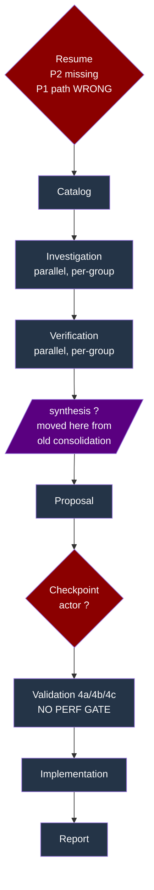
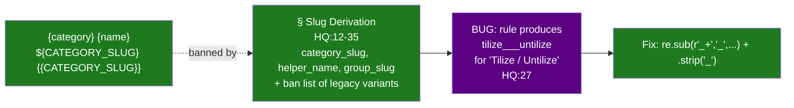
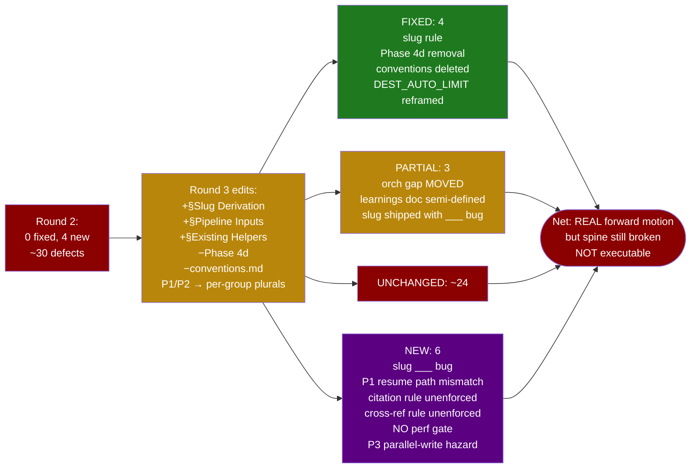
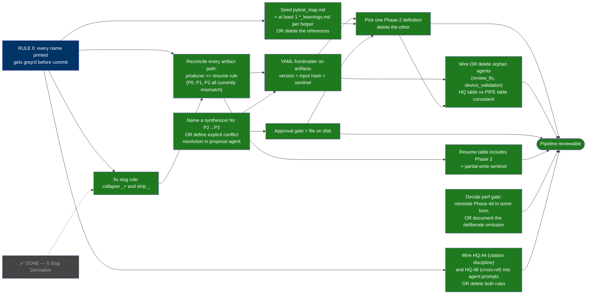

# Pipeline Shortcomings — Visual Map (Round 3)

After Round 3 edit cycle:
- 4 FIXED (slug rule landed, Phase 4d cleanly deleted, conventions doc deleted, DEST_AUTO_LIMIT citation reframed)
- 3 PARTIAL (orchestrator gap moved not closed, learnings doc semi-defined, slug variables defined but resume path inconsistent)
- ~24 UNCHANGED
- 6 NEW (slug `tilize___untilize` bug, resume path mismatch, citation rule unenforced, cross-ref rule unenforced, no perf gate, Phase 2→3 parallel-write hazard)

Legend:

- ✅ specified, executable
- ⚠️ underspecified / drift risk
- ❌ blocker / missing / contradicted
- 🆕 NEW defect introduced this cycle
- 🆗 FIXED this cycle
- 💀 orphaned / deleted

---

## 0. THE WHOLE PICTURE (one diagram, every defect)

Pipeline phases on center spine. Above each phase = local defects. Below = cross-cutting failures touching multiple phases. Right = outcomes.

```mermaid
flowchart TB
    classDef phase fill:#243447,color:#fff,stroke:#5a7,stroke-width:2px
    classDef bad fill:#8b0000,color:#fff,stroke:#5a0000
    classDef new fill:#5a0080,color:#fff,stroke:#3a0050
    classDef fixed fill:#1f7a1f,color:#fff,stroke:#0a3
    classDef ghost fill:#444,color:#fff,stroke-dasharray:4 4,stroke:#888
    classDef warn fill:#b8860b,color:#fff

    %% ───────── DEFECTS ABOVE EACH PHASE ─────────
    subgraph DEFECTS_PER_PHASE [Per-phase defects]
      direction TB
      D0a[output path mismatch<br/>PIPE:50 says flat<br/>PIPE:23 resume looks in dir]:::bad
      D0b[cross-reference rule<br/>HQ:48 unenforced<br/>catalog agent never greps<br/>existing helpers]:::new
      D1a[parallel agents race<br/>still on pytest_map.md]:::bad
      D1b[resume path BROKEN<br/>writes agent_logs/CS/GS_inv.md<br/>resume looks for CS_inv.md]:::new
      D2a[Phase 2 missing from<br/>resume table PIPE:23-26]:::bad
      D2b[two contradictory<br/>Phase-2 defs<br/>PIPE:82 vs HQ:306]:::bad
      D2c[parallel per-group writes<br/>conflict-resolution rule<br/>missing for downstream]:::new
      D3a[checkpoint actor undefined<br/>PIPE:119]:::bad
      D3b[orchestrator gap MOVED<br/>from P1→2 to P2→3<br/>PIPE:104 input plural<br/>no synthesizer named]:::new
      D3c[citation rule unenforced<br/>HQ:44 says agents must cite<br/>proposal agent does not]:::new
      D3d[learnings doc<br/>no path no schema<br/>only eltwise_helper_lessons<br/>exists with non-canonical name]:::bad
      D4a[no iteration cap<br/>PIPE:228-235]:::bad
      D4b[markdown feedback<br/>not typed]:::bad
      D4c[orphan agents listed HQ<br/>omitted from PIPE table<br/>review_fix device_validation]:::bad
      D4d[test-change gate<br/>vs 4c emits 7 variants]:::bad
      D4e[empty pytest dir<br/>tests/ttnn/unit_tests/<br/>kernel_lib only __pycache__]:::bad
      D4f[NO PERF GATE<br/>4d deleted no replacement<br/>3x overhead ships silently]:::new
      D5a[no commit-discipline]:::bad
      D5b[Migration Steps vs Phase 5<br/>collide on 'migrate Tier 1'<br/>HQ:123 vs PIPE:171-184]:::bad
      D6[no schema, no consumer<br/>resume does not read it<br/>PIPE:188-199]:::bad
    end

    %% ───────── PIPELINE SPINE ─────────
    Start([Operator runs pipeline]):::warn
    Resume{Resume detection<br/>PIPE:21-28<br/>no staleness no hash<br/>no partial-write sentinel<br/>Phase 2 missing<br/>P1 path mismatch}:::bad
    P0[Phase 0<br/>Catalog]:::phase
    P1[Phase 1<br/>Investigation<br/>PARALLEL per group<br/>per-group output now]:::phase
    P2[Phase 2<br/>Verification<br/>PARALLEL per group<br/>per-group output now]:::phase
    P3[Phase 3<br/>Proposal<br/>reads N files no synthesizer]:::phase
    CP{Checkpoint<br/>PIPE:119}:::bad
    P4[Phase 4<br/>Validation<br/>4a→4b→4c only<br/>4d DELETED]:::phase
    P5[Phase 5<br/>Implementation]:::phase
    P6[Phase 6<br/>Report]:::phase

    Start --> Resume
    Resume --> P0
    Resume -.skip P0.-> P1
    Resume -.skip 0+1.-> P3
    Resume -.skip 0+1+2+3.-> P4
    P0 --> P1 --> P2 --> P3 --> CP --> P4 --> P5 --> P6

    P4 -. fail loops back .-> P3

    %% defect hookups
    D0a --- P0
    D0b --- P0
    D1a --- P1
    D1b --- P1
    D2a --- Resume
    D2b --- P2
    D2c --- P2
    D3a --- CP
    D3b --- P3
    D3c --- P3
    D3d --- P3
    D4a --- P4
    D4b --- P4
    D4c --- P4
    D4d --- P4
    D4e --- P4
    D4f --- P4
    D5a --- P5
    D5b --- P5
    D6  --- P6

    %% ───────── CROSS-CUTTING FAILURES BELOW ─────────
    subgraph CROSS [Cross-cutting failures]
      direction TB
      X1[slug rule SHIPS BUG<br/>tilize___untilize triple _<br/>HQ:27 needs _+ collapse]:::new
      X2[breadcrumb path drift<br/>catalog_agent flat<br/>PIPE expects dir]:::bad
      X3[pytest_map.md MISSING<br/>'single source of truth'<br/>does not exist on disk]:::bad
      X4[scripts/logging exists<br/>agents hand-roll echo<br/>two breadcrumb formats]:::warn
      X5[anti-patterns duplicated<br/>HQ:285-292 + HQ:302-315]:::bad
      X6[Blackhole skip flag<br/>has no source HQ:110]:::bad
      X7[no abort/cleanup contract]:::bad
      X8[HQ table lists 7 agents<br/>PIPE table lists 5<br/>internal contradiction]:::bad
    end

    X1 --- Resume
    X1 --- P0
    X1 --- P1
    X1 --- P2
    X1 --- P3
    X2 --- P0
    X2 --- P1
    X2 --- Resume
    X3 --- P1
    X3 --- P4
    X3 --- P5
    X4 --- P0
    X4 --- P1
    X5 --- P5
    X6 --- P0
    X6 --- P4
    X7 --- Resume
    X8 --- P4

    %% ───────── OUTCOME ─────────
    Out1([Fresh run<br/>NON-EXECUTABLE<br/>hangs at CP, vapor refs, no perf gate]):::bad
    Out2([Resume run<br/>NON-EXECUTABLE<br/>P1 path mismatch, P2 invisible]):::bad
    P6 --> Out1
    P6 --> Out2

    %% Wins
    subgraph WINS [Round 3 wins]
      direction TB
      W1[Slug Derivation §<br/>HQ:12-35<br/>defined + ban list]:::fixed
      W2[Phase 4d deleted cleanly<br/>no dangling refs]:::fixed
      W3[conventions.md deleted<br/>git status: D]:::fixed
      W4[Pipeline Inputs §<br/>category_name + optional<br/>learnings doc]:::fixed
    end
```



Defects in this graph: **27** (21 per-phase + 8 cross-cutting − 2 wins absorbed by FIXED). Plus 4 wins this cycle.

---

## 1. Phase flow with defect overlay (post-Round-3)

Same as §0 spine but per-phase only.



Visualizing the **moved orchestrator gap**: Round 2 had it at Phase 1→2 ("orchestrator consolidates"). Round 3 deleted that step but Phase 3 still has to reconcile N per-group files — synthesizer just renamed and inherited unspecified.

---

## 2. Slug graph — FIXED but with a bug (post-Round-3)



---

## 3. Breadcrumb / artifact path drift (POST-Round-3)

```
Path                                                  Producer                       Resume detection
──────────────────────────────────────────────────────────────────────────────────────────────────────
agent_logs/{category_slug}/                           PIPE:34 declares (dir)          PIPE:23 reads (dir)   ✅ MATCH
agent_logs/{category_slug}/{group_slug}_              PIPE:78 writes (dir + group)    PIPE:24 reads          ❌ MISMATCH
  investigation.md                                                                    {category_slug}_investigation.md
                                                                                      ↑ no group_slug, no path
{category_slug}_catalog.md                            PIPE:50 declares (flat)         PIPE:23 reads (dir)   ❌ MISMATCH
                                                                                      agent_logs/CS/catalog_*.md
${CATEGORY_SLUG}_catalog_breadcrumbs.jsonl            llk_catalog_agent:24 (flat)     PIPE:34 (dir)         ❌ MISMATCH

Net: resume detection greps for files Phase 1 / Phase 0 never write. Phase 1 always re-runs.
```

---

## 4. Infrastructure claimed vs present (POST-Round-3)

```
                        CLAIMED in HQ / PIPE                              STATE
─────────────────────────────────────────────────────────────────────────────────────
pytest_map.md                                                              ❌ STILL MISSING
"per-helper learnings doc" path / schema                                   ❌ undefined
                                                                              only eltwise_helper_lessons.md
                                                                              filename does not match any rule
{tilize,untilize,reduce,matmul}_helpers (HQ:92)                            ✅ now read as helper_name slugs
                                                                              per § Slug Derivation HQ:31
tests/ttnn/unit_tests/kernel_lib/*.py                                      ❌ ONLY __pycache__
                                                                              .pyc names show tests once existed
tt_metal/third_party/tt-agents/scripts/logging/                            ⚠️ exists, 9 scripts, uninvoked
ttnn/cpp/ttnn/kernel_lib/dest_helpers.hpp / DEST_AUTO_LIMIT                ✅ exists, used 17 sites/11 files
binary_op_helpers.{hpp,inl}                                                ✅ exists
sfpu_helpers / sfpu_chain                                                  ✅ exists
ttnn/cpp/ttnn/kernel_lib/agents/llk_helpers_conventions.md                 💀 DELETED git rm
Phase 4d (perf gate)                                                       💀 DELETED no replacement
                                                                              → no overhead criterion anywhere
```

---

## 5. Resume state machine (POST-Round-3 — broken P1)

```mermaid
stateDiagram-v2
    [*] --> CheckOutputs

    CheckOutputs --> SkipP0: catalog_*.md exists
    note right of CheckOutputs
        BUG: no staleness check
        BUG: no partial-write check
        BUG: Phase 2 NOT in table
        BUG: approval not persisted
    end note

    SkipP0 --> CheckP1: try investigation
    CheckP1 --> P1Always: NEW BUG —
    note right of P1Always
        Resume rule (PIPE:24) looks for
          {category_slug}_investigation.md
        Phase 1 actually writes to
          agent_logs/{category_slug}/
            {group_slug}_investigation.md
        Match always fails. Phase 1
        always re-runs unnecessarily.
    end note

    SkipP0 --> SkipP3: proposal.md exists
    SkipP3 --> SkipP4: .hpp + .inl exist
    note right of SkipP4
        BUG: half-written .hpp passes.
        Resume jumps to validation
        against broken code.
    end note
    SkipP4 --> Done

    CheckOutputs --> P0: nothing exists
    P0 --> P1 --> P2 --> P3 --> P4 --> P5 --> P6 --> Done

    P4 --> P3: feedback loop
    note right of P4
        BUG: no iteration cap
        BUG: markdown patches not typed
        BUG: counter not persisted across resume
    end note
```

---

## 6. pytest_map.md race (UNCHANGED)

```
            Phase 1 + Phase 2 BOTH parallel, per-group
            ─────────────────────────────────────────────────────
            agent[group_a] ──┐
            agent[group_b] ──┤
            agent[group_c] ──┼──► append row ──►  pytest_map.md  ◄── DOES NOT EXIST
            agent[group_d] ──┤                                       no lock, no protocol
            agent[group_e] ──┘

            Outcomes (if file existed):
              • lost rows
              • git merge conflicts
              • stale rows survive resume

            New in Round 3: Phase 2 verification ALSO parallel per-group.
            If two groups verify the same shared claim and disagree
            (CONFIRMED vs INCORRECT), there is no resolution rule for Phase 3.
```

---

## 7. Orphaned agents (UNCHANGED + new contradiction)

```
HQ:60-69 lists 7 agents.  PIPE:205-212 Agent Reference table lists 5.
                          → INTERNAL CONTRADICTION between HQ and PIPE.

  llk_catalog_agent                Phase 0   ✅ both tables, wired
  llk_investigation_agent          Phase 1   ✅ both tables, wired
  llk_verification_agent           Phase 2   ✅ both tables, wired
  llk_helper_proposal_agent        Phase 3   ✅ both tables, wired
  llk_validation_agent             Phase 4   ✅ both tables, wired
  llk_review_fix_agent             "within validation"
                                   ⚠️ HQ:68 lists; PIPE:205-212 omits; never invoked
  llk_device_validation_agent      "within validation"
                                   ⚠️ HQ:69 lists; PIPE:205-212 omits; never invoked
                                                            self-describes as "NOT standalone,
                                                            referenced by Stage 5 review-fix"
                                                            — Stage 5 does not exist.
```

---

## 8. Two-document confusion: HQ Migration Steps vs PIPE Phases (UNCHANGED)

```
              HQ "Kernel Migration Steps"          PIPE "Phases"
              ─────────────────────────────        ─────────────────────
              Step 1  Audit                        Phase 0  Catalog
              Step 2  Gate-check helper API        Phase 1  Investigation
              Step 3  Write migration              Phase 2  Verification
              Step 4  Verify on device   ◄────┐    Phase 3  Proposal
              Step 5  Record                  │    Phase 4  Validation  ◄── same #4
                                              │    Phase 5  Implementation
                                              │    Phase 6  Report

              + HQ Pipeline Self-Maintenance § (HQ:306) refers to its OWN
                "Phase 2 (helper-driven rewrite + validation)" —
                which is PIPE Phases 4+5.

              → THREE numbering schemes still ship.
```

---

## 9. Defect heatmap — Round 1 → 2 → 3

```
                                    R1     R2     R3 (post-edit)
                                    ──     ──     ─────────────
Slug names                          ❌     ❌     🆗 FIXED (modulo ___bug)
Breadcrumb paths                    ❌     ❌     ❌ unchanged
Orchestrator gap                    ❌     ❌     🆕 MOVED P1→2 → P2→3
Phase-3 checkpoint                  ❌     ❌     ❌ unchanged
Feedback iteration cap              ❌     ❌     ❌ unchanged
Test-change gate vs 4c              ❌     ❌     ❌ unchanged
Arch flag (Blackhole)               ❌     ❌     ❌ unchanged
Missing infra (pytest_map.md)       ❌     ❌     ❌ unchanged
pytest_map.md race                  ❌     ❌     ❌ unchanged
Staleness / version                 ❌     ❌     ❌ unchanged
Partial-write detect                ❌     ❌     ❌ unchanged
Phase 2 in resume table             ❌     ❌     ❌ unchanged
Approval persisted                  ❌     ❌     ❌ unchanged
Two "Phase 2" defns                 ❌     ❌     ❌ unchanged
Migration vs Pipeline collision     ❌     ❌     ❌ unchanged
Orphan agents review_fix/dev_val    ❌     ❌     ❌ + new HQ↔PIPE table contradiction
Phase 6 schema                      ❌     ❌     ❌ unchanged
Commit discipline                   ❌     ❌     ❌ unchanged
Abort/cleanup contract              ❌     ❌     ❌ unchanged
Suites table empty cite             ❌     ⚠️     ❌ glob still cited
Infra-regression rule               ⚠️     💀     💀 still deleted, not relocated
DEST_AUTO_LIMIT citations           ⚠️     🆕     🆗 reframed via slug rule
matmul_helpers/reduce_helpers       –      🆕     🆗 reframed via slug rule
conventions.md orphan               –      🆕     🆗 deleted
binary_op/sfpu citations dropped    –      🆕     🆗 reframed via slug rule
─── R3 NEW ────────────────────────────────────────────────────────
slug rule ___ bug                   –      –      🆕❌ tilize___untilize
P1 resume path mismatch             –      –      🆕❌ resume reads wrong path
citation rule unenforced            –      –      🆕❌ HQ:44 no impl
existing-surface rule unenforced    –      –      🆕❌ HQ:48 no impl
Phase 4d deleted, no perf gate      –      –      🆕❌ silent overhead
P2 parallel-write inherited at P3   –      –      🆕❌ no conflict-resolution
─────────────────────────────────────────────────────────────────────
TOTAL FIXED                         –      0      4  (slug, 4d, conv, dest_auto)
TOTAL PARTIAL                       –      1      3  (orch moved, learnings, slug)
TOTAL UNCHANGED                     –     ~27    ~24
TOTAL NEW                           –      4      6
```

---

## 10. Edit-cycle outcome summary (Round 3)



---

## 11. Min-fix dependency order (REVISED for Round 3)



**Key change vs Round 2 graph:**
- F0 (Slug Derivation) marked DONE.
- New F0a: slug rule has bug (`tilize___untilize`); needs `_+` collapse.
- F2 (synthesizer) replaces "Define orchestrator" — same gap, moved one phase right.
- F9 (perf gate decision) added — Phase 4d gone, replacement absent.
- F10 added — citation + cross-ref rules need enforcement or removal.
