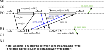
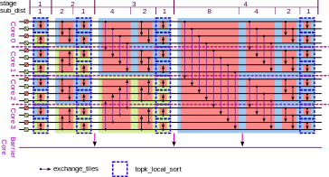

# TTNN Sort

## Overview

The TTNN Sort operation is a high-performance sorting algorithm optimized for execution on Tenstorrent hardware. It is primarily based on the Bitonic Sort technique and is designed to work efficiently with tensor data divided into tiles.

The sorting is performed along a specified dimension of the input tensor, typically requiring data to be rearranged such that the sort dimension is the innermost dimension. To maximize hardware utilization, the operation offers multiple strategies that leverage the parallelism available in the architecture.

## Brief Functional Description

The TTNN Sort operation sorts the elements of an input tensor along a specified dimension in ascending or descending order. If no dimension is specified, the last dimension of the tensor is used by default.

The operation returns both the sorted tensor and the indices representing the original positions of the sorted elements.

### Arguments

- input_tensor (Tensor): The input tensor to be sorted.
- dim (int, optional): The dimension along which to sort. Defaults to -1 (last dimension).
- descending (bool, optional): If True, sorts in descending order. Defaults to False.
- stable (bool, optional): If True, ensures stable sorting (preserves order of equal elements). Defaults to False. Note: Currently not supported.
- memory_config (MemoryConfig, optional): Specifies memory configuration for the output tensor. Defaults to None.
- out (tuple of Tensors, optional): Preallocated tensors for the sorted values and indices. Defaults to None.

### Usage

#### TTNN

```python
import ttnn

# Create a TTNN tensor
input_tensor = ttnn.Tensor([3, 1, 2])

# Sort in ascending order
sorted_tensor, indices = ttnn.sort(input_tensor)

# Sort in descending order
sorted_tensor_desc, indices_desc = ttnn.sort(input_tensor, descending=True)

# Sort along a specific dimension
input_tensor_2d = ttnn.Tensor([[3, 1, 2], [6, 5, 4]])
sorted_tensor_dim, indices_dim = ttnn.sort(input_tensor_2d, dim=1)
```

#### Metalium

```cpp
// Create input tensor
const ttnn::Tensor input_tensor = ...

// Set sorting dim
const int8_t dim = -1;

// Set sorting params
const bool descending = false;
const bool stable = false;

// Optional params
std::optional<std::tuple<ttnn::Tensor&, ttnn::Tensor&>> optional_output_tensors;
const std::optional<ttnn::MemoryConfig> memory_config;

std::vector<Tensor> sorted_tensors = ttnn::sort(queue_id, input_tensor, dim, descending, stable, memory_config, optional_output_tensors);
```

### Usage Limitations

- Supported index tensor types: `uint32`, `uint16`,
- Supported value tensor types: `uint16`, `bfloat16`,
- `stable=True` is not supported in this implementation.

## Strategy Comparison Overview

The TTNN Sort operation provides three sorting strategies, each optimized for different tensor sizes and hardware resource constraints. The choice of strategy reflects a trade-off between **performance**, **scalability**, and **resource utilization**.

| Strategy                   | Description                                                                                                  | Strengths                                                                                                | Weaknesses                                                          | Typical Use Case                              |
| -------------------------- | ------------------------------------------------------------------------------------------------------------ | -------------------------------------------------------------------------------------------------------- | ------------------------------------------------------------------- | --------------------------------------------- |
| **Single Row Single Core** | Each core sorts an entire row of tiles independently.                                     | Simple, low coordination overhead, efficient for small tensors.                                          | Limited to rows with ≤64 tiles; cannot handle larger tensors.       | Small tensors (≤64 tiles per sort row).       |
| **Cross Core Data Exchange**                 | Each core processes multiple tiles locally; fast cross-core L1-to-L1 communication is used only when needed. | **Fastest option** due to interior NoC-based communication; minimal DRAM usage; excellent parallelism.   | Scalability limited by number of cores and L1 memory size per core. | Medium tensors where speed is key.            |
| **Single Row Multi Core**  | Multiple cores collaboratively sort a single row in parallel across Bitonic Sort stages.                     | **Most scalable and reliable**—works for arbitrarily large tensors; ensures sorting can always complete. | Higher synchronization overhead; typically slower than Cross Core Data Exchange.      | Very large tensors exceeding Cross Core Data Exchange capacity. |

### Key Points:

* **Cross Core Data Exchange** is the **fastest strategy** because it minimizes expensive DRAM access by using **internal core-to-core (L1-to-L1) communication** over the on-chip **Network-on-Chip (NoC)**. However, its scalability is bounded by:

  * The **number of available cores**.
  * The **L1 memory size** of each core.
* **Single Row Multi Core** is the **most scalable and robust** strategy. It guarantees sorting of **tensors of any size**, regardless of how large they are, though it may be slower due to increased synchronization and DRAM involvement. This strategy ensures that even extremely large tensors are always supported.
* **Single Row Single Core** is efficient for small tensors where the entire sort fits easily within one core's working memory.

## Strategies description

### Single Row Single Core

This sorting algorithm is based on Bitonic Sort and operates on input data arranged in tiles. Sorting is performed row by row, with each row processed by a single core. This strategy is used for small tensors where the number of tiles to be sorted does not exceed 64.

#### Overview:

1. **Tile Initialization**:

   * A full row of tiles (`Wt` tiles) is loaded from memory bank to CB.
   * Index tiles are generated to track the original positions of data elements.

2. **Sorting Mechanism**:

   * Sorting is executed using `ckernel::topk_local_sort`, which:

     * Sorts two tiles in-place.
     * Updates corresponding index tiles.
   * As the sorting operates on columns, tiles are transposed before and after sorting to maintain correct data orientation.
   * The number of tiles in the row (`Wt`) must be a multiple of 64 (i.e., `2 * Tile_Width (32)`) for compatibility.

3. **Bitonic Sequence Formation**:

   * The function `sort_Wt_tiles_row_to_bitonic_sequence`:

     * Sorts pairs of tiles alternately in ascending and descending order.
     * Creates an initial sequence suitable for Bitonic Sort.

4. **Bitonic Sort**:

   * Multiple merge stages refine the ordering of tile pairs until the entire row is sorted.
   * Each stage involves pairwise tile sorting, with updated tile index calculations.

5. **Multicore Calculation**:

   * Each row (`Wt` tiles) is assigned to a core.
   * If there are more rows (`Ht`) than available cores, rows are distributed such that each core processes multiple rows.

6. **Final Steps**:

   * After sorting, tiles are transposed back to the target dimension.
   * The sorted result is written back to memory bank.


#### Example:

Sorting a 64×128 matrix, represented as 2×4 tiles:

```
Tiles:
T0 T1 T2 T3
T4 T5 T6 T7
```

* **Workload Distribution**:

  * Core 0: T0, T1, T2, T3
  * Core 1: T4, T5, T6, T7

* **Bitonic Sort Steps**:

  1. Pairwise sorting:

     * T0 ↔ T1 (ascending)
     * T2 ↔ T3 (descending)
  2. Cross-pair sorting:

     * T0 ↔ T2 (ascending), T1 ↔ T3 (ascending)
  3. Final pair sorting:

     * T0 ↔ T1 (ascending), T2 ↔ T3 (ascending)

* Sorted data is transposed back and written to DRAM.

---

### Cross Core Data Exchange

The Cross Core Data Exchange strategy combines the advantages of both single-core and multi-core sorting approaches to maximize performance and hardware efficiency on Tenstorrent devices. It allows each core to process multiple tiles locally while enabling cross-core communication only when necessary.

#### Overview:

* Each core is assigned a batch of tiles, which it keeps in its **L1 memory** for the duration of the sorting operation.
* The number of tiles per core depends on:

  * The total number of available cores.
  * The size and datatype of the tensors.
* The goal is to minimize cross-core communication by performing as much sorting as possible locally within each core's memory.

#### Tile Assignment Strategies:

The Cross Core Data Exchange approach supports two strategies for assigning tiles to cores:

1. **Max-Core Utilization (USE_AS_MANY_CORES)**:

   * Distributes tiles across the maximum number of cores to maximize parallelism.
   * Each core handles a smaller number of tiles, leading to lower latency.
   * This strategy is always faster, but it consumes more cores from the very beginning—even for small tensors.
   * Recommended when minimizing execution time is the top priority and sufficient hardware resources are available.

2. **Fixed Tile Per Core (FILL_CORES_FIRST)**:

   * Assigns a fixed number of tiles to each core based on input datatype and tile size.
   * Fewer cores are used, with each core processing a larger chunk of data.
   * This approach reduces synchronization overhead and is more resource-efficient for smaller tensors.
   * Suitable when it is important to conserve core usage or when hardware resources are limited.

**Note:** Both strategies achieve the same performance when all available cores are utilized. When some cores are not utilized, the choice is a tradeoff: USE_AS_MANY_CORES delivers higher speed at the cost of greater core usage, while FILL_CORES_FIRST is slower but uses fewer resources.

#### Sorting Mechanism:

1. **Local Sorting**:

   * Tiles assigned to a core are loaded from the memory bank into the core's L1 memory.
   * Inside the core:

     * Tiles are first sorted into a bitonic sequence.
     * The core continues merging and sorting tiles as long as all necessary tiles for the current stage reside locally in its L1.
   * This maximizes intra-core processing without communication overhead.

2. **Cross-Core Tile Exchange**:

   * When a sorting stage requires a tile that resides in another core’s L1 memory, a tile exchange process is triggered.
   * The steps involved:

     * The compute kernel on the source core sends the tile to its reader kernel.
     * The reader kernel transmits the tile over the NoC (Network-on-Chip) to the destination core’s reader kernel.
     * The destination reader kernel passes the tile to its local compute kernel.
     * The whole mechanism works the other way round, delivering data from the second core to the base core.
   * This mechanism enables direct L1-to-L1 memory exchange between cores without the need for DRAM access.

    

3. **Sorting with Exchanged Tiles**:

   * After receiving the remote tile, the core continues the Bitonic sorting step using both the local tile and the newly received remote tile.
   * This allows the sorting sequence to progress across tile batches that were initially on different cores.

4. **Synchronization**:

   * A designated leader core (core ID 0) coordinates the work:

     * It synchronizes all participating cores at key stages of the sort.
     * Ensures consistency and correct progression through Bitonic stages.



---

### Single Row Multi Core

This strategy implements a parallel Bitonic Sort for a single row of tiles using multiple cores simultaneously, improving performance for large datasets. This strategy is used for extra large tensors which sorting dimension exceeds *number_of_available_cores* * *cores_processed_in_each_core_memory* in the approach used by the Cross Core Data Exchange strategy.

#### Overview:

* Sorting is performed in stages, processing tile pairs at each stage.
* Multiple cores collaborate by sorting different tile pairs in parallel.
* A coordinator core manages synchronization and stage progression.

#### Detailed Steps:

1. **Initialization**:

   * The coordinator core sets up:

     * The index tensor.
     * The output memory bank, used for both final results and temporary storage.

2. **Bitonic Sort Stages**:

   * The row is sorted over multiple stages:

     * Cores are assigned tile pairs based on their ID and current stage.
     * If the number of tile pairs exceeds available cores, cores handle multiple pairs.
     * The coordinator core:

       * Signals other cores to start processing.
       * Waits for completion signals from all cores before progressing.
     * Each participating core:

       * Reads assigned tile pairs (both values and indices).
       * Sorts them in ascending or descending order as required.
       * Writes results back to the output bank.

3. **Completion**:

   * The process is repeated for each stage until the row is fully sorted.
   * The procedure is then applied to each row in the `Ht` dimension.

#### Additional Notes:

* The algorithm ensures efficient workload distribution, with dynamic assignment based on core count and data size.
* Synchronization is managed using semaphores to guarantee consistency.
* The coordinator core ensures correct sequencing and memory integrity throughout the operation.


---

© Tenstorrent AI ULC 2025
