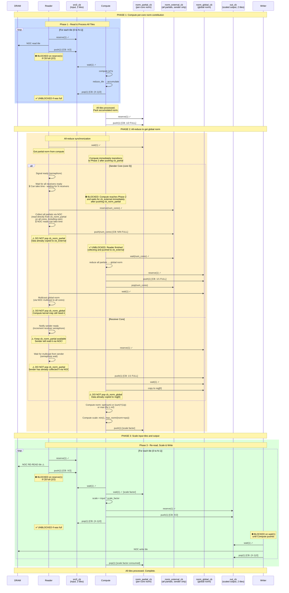

```mermaid
sequenceDiagram
    participant DRAM
    participant Reader
    participant CB_src0 as src0_cb<br/>(input, 2 tiles)
    participant Compute
    participant CB_partial as norm_partial_cb<br/>(per-core norm)
    participant CB_external as norm_external_cb<br/>(all partials, sender only)
    participant CB_global as norm_global_cb<br/>(global norm)
    participant CB_out as out_cb<br/>(scaled output, 2 tiles)
    participant Writer

    Note over DRAM,Writer: PHASE 1: Compute per-core norm contribution

    rect rgb(200, 220, 255)
        Note over Reader,Compute: Phase 1 - Read & Process All Tiles

        loop For each tile (0 to N-1)
            Reader->>CB_src0: reserve(1) ✓
            Reader->>DRAM: NOC read tile
            Reader->>CB_src0: push(1) [CB: X/2]

            Note over Reader: ⛔ BLOCKED on reserve(1)<br/>if CB full (2/2)

            Compute->>CB_src0: wait(1) ✓
            Compute->>Compute: compute |x|^p
            Compute->>Compute: reduce_tile → accumulate
            Compute->>CB_src0: pop(1) [CB: (X-1)/2]

            Note over Reader: ✅ UNBLOCKED if was full
        end
    end

    Note over Compute: All tiles processed.<br/>Pack accumulated norm.

    Compute->>CB_partial: reserve(1) ✓
    Compute->>CB_partial: push(1) [CB: 1/2 FULL]

    Note over DRAM,Writer: PHASE 2: All-reduce to get global norm

    rect rgb(255, 240, 200)
        Note over Reader,Compute: All-reduce synchronization

        Reader->>CB_partial: wait(1) ✓
        Note over Reader: Got partial norm from compute

        Note over Compute: Compute immediately transitions<br/>to Phase 2 after pushing cb_partial

        alt Sender Core (core 0)
            Reader->>Reader: Signal ready (semaphore)
            Reader->>Reader: Wait for all receivers ready<br/>⏳ Can take time - waiting for N receivers

            Note over Compute: ⛔ BLOCKED: Compute reaches Phase 2<br/>and waits for cb_external immediately<br/>after pushing cb_norm_partial

            Reader->>CB_external: reserve(num_cores) ✓
            Reader->>Reader: Collect all partials via NOC<br/>(read directly from cb_norm_partial<br/>on all cores, including own)<br/>⏳ NOC reads can take time
            Reader->>CB_external: push(num_cores) [CB: N/N FULL]
            Note over Reader: ⚠️ DO NOT pop cb_norm_partial<br/>Data already copied to cb_external

            Note over Compute: ✅ UNBLOCKED: Reader finished<br/>collecting and pushed to cb_external

            Compute->>CB_external: wait(num_cores) ✓
            Compute->>Compute: reduce all partials → global norm
            Compute->>CB_global: reserve(1) ✓
            Compute->>CB_global: push(1) [CB: 1/1 FULL]
            Compute->>CB_external: pop(num_cores)

            Reader->>CB_global: wait(1) ✓
            Reader->>Reader: Multicast global norm<br/>(via NOC multicast to all cores)
            Note over Reader: ⚠️ DO NOT pop cb_norm_global<br/>Compute kernel may still need it
        else Receiver Core
            Reader->>Reader: Notify sender ready<br/>(increment receiver semaphore)
            Note over Reader: ⚠️ Keep cb_norm_partial available<br/>Sender will read it via NOC!
            Reader->>CB_global: reserve(1) ✓
            Reader->>Reader: Wait for multicast from sender<br/>(semaphore wait)
            Note over Reader: ⚠️ DO NOT pop cb_norm_partial<br/>Sender has already collected it via NOC
            Reader->>CB_global: push(1) [CB: 1/1 FULL]

            Compute->>CB_global: wait(1) ✓
            Compute->>CB_global: copy to reg[0]
            Note over Compute: ⚠️ DO NOT pop cb_norm_global<br/>Data already copied to reg[0]
        end

        Compute->>Compute: Compute norm: sqrt(sum) or (sum)^(1/p)<br/>or max (for L-inf)
        Compute->>Compute: Compute scale: min(1, max_norm/(norm+eps))
        Compute->>CB_partial: push(1) [scale factor]
    end

    Note over DRAM,Writer: PHASE 3: Scale input tiles and output

    rect rgb(220, 255, 220)
        Note over Reader,Writer: Phase 3 - Re-read, Scale & Write

        loop For each tile (0 to N-1)
            Reader->>CB_src0: reserve(1) ✓
            Reader->>DRAM: NOC RE-READ tile ⚠️
            Reader->>CB_src0: push(1) [CB: X/2]

            Note over Reader: ⛔ BLOCKED on reserve(1)<br/>if CB full (2/2)

            Compute->>CB_src0: wait(1) ✓
            Compute->>CB_partial: wait(1) ✓ [scale factor]
            Compute->>Compute: scale = input * scale_factor
            Compute->>CB_out: reserve(1) ✓
            Compute->>CB_out: push(1) [CB: X/2]
            Compute->>CB_src0: pop(1) [CB: (X-1)/2]

            Note over Reader: ✅ UNBLOCKED if was full

            Note over Writer: ⛔ BLOCKED on wait(1)<br/>until Compute pushes

            Writer->>CB_out: wait(1) ✓
            Writer->>DRAM: NOC write tile
            Writer->>CB_out: pop(1) [CB: (X-1)/2]
        end

        Compute->>CB_partial: pop(1) [scale factor consumed]
    end

    Note over DRAM,Writer: All tiles processed. Complete.
```
