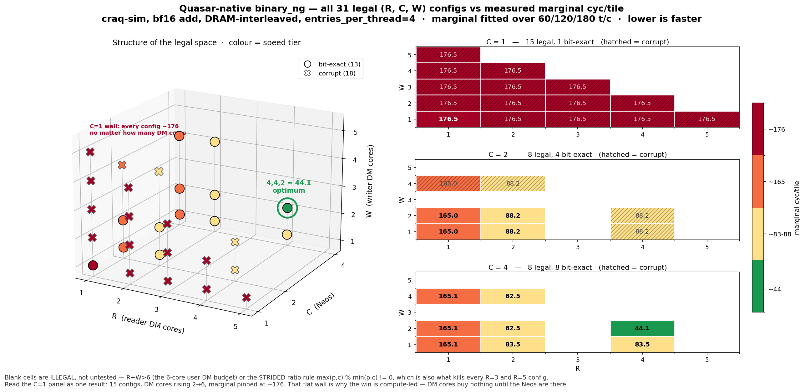

# Quasar-native `binary_ng` — status

> **Committed for the record.** This is an engineering record of the Quasar-native `binary_ng` effort, not
> user documentation. Two kinds of reference in here point outside the repository and are expected to
> dangle for a reader who was not on the original branch:
> - `debug/attrib/*` — the diagnostic drivers, sweeps and plotting scripts. `debug/` is deliberately
>   untracked; the numbers they produced are reproduced inline here.
> - `.link_to_claude/plans/*` — the implementation plan, the specialist review findings, and the
>   measurement-discipline notes, which stayed out of the repo.
>
> Corrections and withdrawn claims are kept in place rather than deleted. Several conclusions here were
> wrong for days before being caught, and the record of how is the more useful half of the document.

*Slide-style status deck. Each `---` is a slide. Keep slides to one screen.*
***Chronological: newest week first.***

**Two platforms, and the distinction runs through everything below.** *craq-sim* is a fast functional
simulator (~15 s/run, deterministic) with no transfer latency and no contention — it is where all development
happens. The *hardware emulator* is the closest thing to real behaviour we can get; it is available but far
less accessible, so it is spent deliberately and rarely. **Never mix numbers from the two.**

# ► Week of 2026-08-27 — Milestone 1 measured

## 1. TL;DR — kill criterion cleared, premise validated

The founding question was whether Quasar's idle engines are worth exploiting for elementwise ops: the
baseline used **2 of 6** DM cores and **1 of 4** Tensix. Answer: **yes**, by a wide margin.

`R=4, C=4, W=2` — all 6 user DM cores, all 4 Neos — delivers a measured **2.70x** at the 1280-tile
benchmark shape, rising to **4.00x** as tensors grow past the fixed launch cost — **exactly the theoretical ceiling** —
**bit-exact**, against a
**1.30x** go/no-go criterion. **GO.**

Also this week: rebased onto main (302 commits; tt-llk #1678 landed, so `C > 1` is live), Tasks 4 and 5
landed (thread-generic kernels + host wiring), and the full legal `(R,C,W)` space was measured
exhaustively for correctness.

---

## 2. The legal space, and a platform defect

31 of 108 `(R,C,W)` candidates are legal — where **the 108 already has `C ∈ {1,2,4}` applied**, so it is
the raw 6³ = 216 grid after the platform's compute rule, and the 31 measures DM-budget and stride
attrition only. Full ladder, per-`R` breakdown and why `R=3` is legal-but-never-usable: design §3.3.1,
reproducible via `debug/attrib/enumerate_legal_space.py`. All 31 measured for correctness at 60
tiles/cluster, one process each, bit-exact vs a torch golden with a routing assertion:

| | count | outcome |
|---|---|---|
| `R <= C` and `W <= C` | **13** | all bit-exact, `mismatch = 0` |
| `R > C` or `W > C` | **18** | all wrong, 43%–84% of elements |

**31 of 31 agree; 0 disagreements.** A DFB whose **DM cores outnumber its Tensix cores** silently returns
wrong data — no hang, no error. Localised per tile: exactly `C` of the `n` DM sub-streams are serviced,
the other `n - C` receive nothing valid. Upstream DFB gtests never cover `producers != consumers` with a
Tensix on the narrow side.

Does **not** block the optimum (`4,4,2` satisfies the rule) but **does** block the general case, since
which config wins is op-specific. Report ready to file.

**It also shapes every perf number below**, which is why this slide comes first. `C >= max(R,W)` is now a
correctness constraint, not a tuning choice, so **no legal config varies the compute axis independently**
— the entire cost model rests on the 18 illegal ones (slide 9). Those 18 were measured for perf as well
as correctness, and they are the only reason the compute term is known at all.

---

## 3. Two numbers, and why both

`span(T) = prologue + marginal × T`, fitted over **60 → 180 tiles/cluster**, where the curve is straight
(three points, max residual 3.3 cycles on spans of 3.7k–32.9k).

| basis | `1,1,1` | `4,4,2` | speedup | what it is |
|---|---|---|---|---|
| **marginal** (slope of span vs T) | 176.50 | 44.12 | **4.00x** | steady-state cost per tile; prologue-free |
| span @ 180 t/c (5760 tiles) | 180.76 | 50.26 | 3.60x | raw `span/T`; large-tensor observation |
| **span @ 40 t/c (1280 tiles)** | 195.68 | 72.42 | **2.70x** | raw `span/T`; what you observe at the benchmark shape |

Both bases are correct and they are not interchangeable — the span basis is always the smaller number,
because the prologue is a larger fraction of the faster config's total. **Marginal perf gain is more
illustrative, but span perf gain is more real:** the marginal isolates steady-state scaling and is the
only basis on which different thread counts are comparable, while the span basis is what somebody running
the op at a given size actually gets. Definitions and the rule for naming the basis: design §2.1.

**4.00x is the ceiling, not a coincidence.** Going `1,1,1 → 4,4,2` shrinks the three roofline terms by
(reader 4x, compute 4x, **writer only 2x**), so no cost model of the form `f(Rc/R, Cc/C, Wc/W)` can
exceed 4x. Measured: `176.50 / 44.12 = 4.0005`. The constants were pinned independently — `Cc` from the
`C=1` plateau, `Rc`/`Wc` from the `R=1` and `W=1` rows — so landing on the cap is a check the data could
have failed, not a construction.

The gap between 4.00x and 2.70x is prologue: `4,4,2` carries the larger fixed cost (1106 vs 767 cycles —
more cores to launch and rendezvous), which is 38% of its span at 40 tiles/cluster. It amortises away —
3.60x by 180 tiles/cluster. **Quote 2.70x as the measured result at the benchmark shape; 4.00x is the
asymptote.**

> **Correction, 2026-08-28.** These were previously 174.30 / 41.70 / **4.18x**, from a two-point slope
> over 20 → 40 tiles/cluster. The span curve **bends** in that range, and the bias scales with
> prologue/slope — 1.3% at `1,1,1` but 5.8% at `4,4,2` — which manufactured an apparent 4.18x above a
> hard 4.0 ceiling. Two points cannot detect this: they fit a line through anything. Slide 8 records how
> the disconfirming evidence was already in hand and was misread.

---

## 4. Full measured table — the 13 correctness-clean configs

Marginal = slope of `span` vs tiles/cluster, fitted over **60/120/180** (the linear region), `span` =
per-cluster KERNEL-zone span median over 32 clusters, `entries_per_thread = 4`. **Units differ**:
marginal and raw@60 are cyc/tile; **prologue is absolute cycles** (the fit's intercept). `binds` names
the roofline term that sets the value.

| R | C | W | DM | Neo | marginal | speedup | binds | raw @60 | prologue |
|---|---|---|---|---|---|---|---|---|---|
| **4** | **4** | **2** | 6 | 4 | **44.12** | **4.00x** | cmp | 62.55 | 1106 |
| 2 | 4 | 2 | 4 | 4 | 82.53 | 2.14x | rdr | 102.62 | 1205 |
| 2 | 4 | 4 | 6 | 4 | 82.53 | 2.14x | rdr | 103.33 | 1248 |
| 2 | 4 | 1 | 3 | 4 | 83.53 | 2.11x | wtr | 105.62 | 1325 |
| 4 | 4 | 1 | 5 | 4 | 83.53 | 2.11x | wtr | 104.48 | 1257 |
| 2 | 2 | 1 | 3 | 2 | 88.25 | 2.00x | cmp | 104.25 | 962 |
| 2 | 2 | 2 | 4 | 2 | 88.25 | 2.00x | cmp | 102.53 | 858 |
| 1 | 2 | 1 | 2 | 2 | 165.00 | 1.07x | rdr | 184.63 | 1179 |
| 1 | 2 | 2 | 3 | 2 | 165.00 | 1.07x | rdr | 184.93 | 1197 |
| 1 | 4 | 1 | 2 | 4 | 165.07 | 1.07x | rdr | 188.92 | 1431 |
| 1 | 4 | 2 | 3 | 4 | 165.07 | 1.07x | rdr | 189.42 | 1461 |
| 1 | 4 | 4 | 5 | 4 | 165.07 | 1.07x | rdr | 189.92 | 1491 |
| 1 | 1 | 1 | 2 | 1 | 176.50 | 1.00x | cmp | 189.28 | 767 |

**Every config sits exactly on its binding term** — `176.5/C`, `165/R` or `83.5/W`, to within 0.04%.
That is sharper than the old two-point table, which showed three fuzzy tiers; the tiers were never
fuzzy, the measurement was. Cheapest per tier: `1,1,1` (2 DM) → `2,2,1` (3 DM) → `4,4,2` (6 DM).

**Along the balanced frontier scaling is exactly linear.** `2,2,1` (3 DM, 2 Neo) 88.25 → `4,4,2`
(6 DM, 4 Neo) 44.12 = **2.0002x on exactly 2x the engines**.

**`R=3` is legal but never usable, which is not the same as banned.** The platform bans `C=3`
(`program_spec.cpp:763`), not `R=3`. The DFB stride rule then needs `max(R,C) % min(R,C) == 0`, so `R=3`
admits only `C=1` — three legal configs (`3,1,1`, `3,1,2`, `3,1,3`), all of which the slide-2 defect
corrupts because `C=1 < max(R,W)`. Same shape at `R=5` (`5,1,1` only). So the usable ladder is
`R = 1, 2, 4` and 4-or-5-DM-core allocations buy nothing.

---

## 5. Exhaustive 31-config space — correctness and perf

**Correctness** for all 31 at 48x40 (60 tiles/cluster), one process each, bit-exact vs a torch golden
with a routing assertion. **Perf** = marginal fitted over 60/120/180 tiles/cluster; all 31 admitted at
every point, `occ:OK route:OK` throughout. `pred` is `max(165.0/R, 176.5/C, 83.5/W)` and `binds` names
the term that sets it. Rules and rejection counts: design §3.3.1.

The **DFB** columns give each config's endpoint shape in the notation the upstream gtest matrix uses:
`<producers>S x <consumers>S`, where `S` = the STRIDED access pattern (thread *t* takes every *N*-th
entry). Every endpoint we bind is STRIDED on both sides, so the letters never vary — the counts do:
`in0`/`in1` are `(R, C)` DM→Tensix, `out` is `(C, W)` Tensix→DM. **† = no `DFB_TEST_2_0` declares that
shape** (8 of 62 cells). Generated by `debug/attrib/add_access_pattern_column.py`, which parses the
declarations out of `test_dataflow_buffer_base.cpp` rather than transcribing them.

**A shape without † is run upstream, not checked upstream.** The DM→Tensix tests assert only that the
program ran — the consumer `copy_tile`s each entry into dest and discards it, and
`dfb_test_common.hpp:539-540` states the L1 verification is omitted. So `†` marks a coverage gap and its
absence marks nothing; see the note under the table.

| pred | binds | R,C,W | DM | Neo | in0/in1 DFB | out DFB | marginal | correctness |
|---|---|---|---|---|---|---|---|---|
| 44.12 | **cmp** | **4,4,2** | 6 | 4 | 4Sx4S | 4Sx2S | **44.12** | **PASS — OPTIMUM** |
| 82.50 | rdr | 2,4,2 | 4 | 4 | 2Sx4S | 4Sx2S | 82.53 | PASS |
| 82.50 | rdr | 2,4,4 | 6 | 4 | 2Sx4S | 4Sx4S | 82.53 | PASS |
| 83.50 | wtr | 2,4,1 | 3 | 4 | 2Sx4S | 4Sx1S | 83.53 | PASS |
| 83.50 | wtr | 4,4,1 | 5 | 4 | 4Sx4S | 4Sx1S | 83.53 | PASS |
| 88.25 | **cmp** | 2,2,1 | 3 | 2 | 2Sx2S † | 2Sx1S | 88.25 | PASS |
| 88.25 | **cmp** | 2,2,2 | 4 | 2 | 2Sx2S † | 2Sx2S † | 88.25 | PASS |
| 88.25 | **cmp** | 4,2,1 | 5 | 2 | 4Sx2S | 2Sx1S | 88.23 | **FAIL** 43.3% |
| 88.25 | **cmp** | 2,2,4 | 6 | 2 | 2Sx2S † | 2Sx4S | 88.25 | **FAIL** 50.0% |
| 88.25 | **cmp** | 4,2,2 | 6 | 2 | 4Sx2S | 2Sx2S † | 88.23 | **FAIL** 43.3% |
| 165.00 | rdr | 1,2,1 | 2 | 2 | 1Sx2S | 2Sx1S | 165.00 | PASS |
| 165.00 | rdr | 1,4,1 | 2 | 4 | 1Sx4S | 4Sx1S | 165.07 | PASS |
| 165.00 | rdr | 1,2,2 | 3 | 2 | 1Sx2S | 2Sx2S † | 165.00 | PASS |
| 165.00 | rdr | 1,4,2 | 3 | 4 | 1Sx4S | 4Sx2S | 165.07 | PASS |
| 165.00 | rdr | 1,2,4 | 5 | 2 | 1Sx2S | 2Sx4S | 165.00 | **FAIL** 50.0% |
| 165.00 | rdr | 1,4,4 | 5 | 4 | 1Sx4S | 4Sx4S | 165.07 | PASS |
| 176.50 | **cmp** | 1,1,1 | 2 | 1 | 1Sx1S | 1Sx1S | 176.50 | PASS |
| 176.50 | **cmp** | 1,1,2 | 3 | 1 | 1Sx1S | 1Sx2S | 176.50 | **FAIL** 50.0% |
| 176.50 | **cmp** | 2,1,1 | 3 | 1 | 2Sx1S | 1Sx1S | 176.50 | **FAIL** 46.6% |
| 176.50 | **cmp** | 1,1,3 | 4 | 1 | 1Sx1S | 1Sx3S | 176.50 | **FAIL** 66.6% |
| 176.50 | **cmp** | 2,1,2 | 4 | 1 | 2Sx1S | 1Sx2S | 176.50 | **FAIL** 50.4% |
| 176.50 | **cmp** | 3,1,1 | 4 | 1 | 3Sx1S | 1Sx1S | 176.50 | **FAIL** 61.6% |
| 176.50 | **cmp** | 1,1,4 | 5 | 1 | 1Sx1S | 1Sx4S | 176.50 | **FAIL** 74.9% |
| 176.50 | **cmp** | 2,1,3 | 5 | 1 | 2Sx1S | 1Sx3S | 176.50 | **FAIL** 84.0% |
| 176.50 | **cmp** | 3,1,2 | 5 | 1 | 3Sx1S | 1Sx2S | 176.50 | **FAIL** 81.6% |
| 176.50 | **cmp** | 4,1,1 | 5 | 1 | 4Sx1S | 1Sx1S | 176.47 | **FAIL** 69.9% |
| 176.50 | **cmp** | 1,1,5 | 6 | 1 | 1Sx1S | 1Sx5S † | 176.50 | **FAIL** 79.9% |
| 176.50 | **cmp** | 2,1,4 | 6 | 1 | 2Sx1S | 1Sx4S | 176.50 | **FAIL** 74.9% |
| 176.50 | **cmp** | 3,1,3 | 6 | 1 | 3Sx1S | 1Sx3S | 176.50 | **FAIL** 66.6% |
| 176.50 | **cmp** | 4,1,2 | 6 | 1 | 4Sx1S | 1Sx2S | 176.47 | **FAIL** 73.3% |
| 176.50 | **cmp** | 5,1,1 | 6 | 1 | 5Sx1S † | 1Sx1S | 176.50 | **FAIL** 73.3% |

**13 usable, 18 corrupt. 31 of 31 agree with `R <= C and W <= C`; 0 disagreements.**

**The DFB columns explain why this defect survived upstream — and it is not a missing shape.**
`DMTensixTest1xDFB4Sx1S`, `2Sx1S`, `3Sx1S`, `6Sx1S`, `6Sx2S` and `4Sx2S` all exist and pass, and those
are precisely the shapes `4,1,1`, `2,1,1`, `3,1,1`, `5,1,1`(≈), `4,2,*` corrupt here. The gap is not
coverage but **verification**: no DM→Tensix test looks at the delivered bytes. Nor would a hang or
timeout catch it — our corrupt runs complete at the same marginal cyc/tile as the clean ones, because
the credit count is right and only the payload is wrong. † correlates with nothing: `2,2,1` and `2,2,2`
carry uncovered `2Sx2S` endpoints and **pass**, while every covered `nSx1S` shape at `C=1` fails.

**The model is now exact, not approximate: 31 of 31 within 0.04%.** The `pred` column and the `marginal`
column agree everywhere, so there is nothing left to explain — the four ~6% "misses" in the previous
version were the two-point artifact, not a real overlap effect.

**Read the `C=1` block as one result.** Fifteen configs, DM cores rising 2 → 6, marginal pinned at
**176.47–176.50 — a spread of 0.017%**. Adding four DM cores at `C=1` is worth **1.000x**, measured.
That block is why the compute term is identified (slide 9) and why the win is compute-led (slide 7).

**Corrupt timings are still timings** — the trip count and the tensor written are unchanged, only the
data is wrong. And they cost nothing measurable: the corrupt `C=1` configs sit at 176.47–176.50 against
the one clean `C=1` config at **176.50**.

---

## 6. The whole space in one figure

**Three things the tables above do not show at a glance.** The `C=1` panel is a solid wall: 15 configs,
DM cores rising 2 → 6 across and up, marginal pinned between 173.8 and 176.7 — spending the entire DM
budget buys nothing without Neos. Correctness improves monotonically with `C` (**1 of 15** bit-exact at
`C=1`, 4 of 8 at `C=2`, **8 of 8** at `C=4`), which is the slide-2 defect seen from the other side. And
the single green cell sits at the *edge* of the legal region — `4,4,2` has no slack in any direction.

**Blank cells are illegal, not untested:** `R+W > 6` cuts the upper-right triangle, and the STRIDED
ratio rule empties the `R=3` and `R=5` columns. Hatching marks corrupt output, not slowness.

Regenerate with `python debug/attrib/plot_rcw_space.py <this-dir>/rcw_space.png`; the data is
asserted against this deck's own table.

---

## 7. What it tells us

- **The win is compute-led and DM-enabled, and it is exactly at the ceiling.** `marginal =
  max(165.0/R, 176.5/C, 83.5/W)`, per-stage cost **compute 176.5 > reader 165.0 > writer 83.5**
  cyc/tile. Two single-axis steps, both measured:

  | step | held at | ratio |
  |---|---|---|
  | DM cores **2 → 6** | `C=1` | **1.000x** — nothing, to three digits |
  | `C 1 → 4` | `R=4, W=2` | **4.000x** — the `1/C` limit, exactly |

  `1.000 × 4.000 = 4.00`. **All six DM cores are worth nothing until the Neos are there** — at `C=1`
  the marginal is 176.47–176.50 across 15 configs spanning 2 → 6 DM cores, a spread of 0.017%.
- **Per-axis attribution is path-dependent.** The same `C 1→4` step is worth **1.07x** taken first (at
  `R=W=1` the reader caps you at 165) and **4.000x** taken last. "What did the Neos buy" has no
  order-independent answer; "is every term below target" does.
- **An axis is worth 2x only while it binds, and exactly 1.000x when it does not** — single-axis steps
  between bit-exact endpoints:

  | step | held at | ratio | why |
  |---|---|---|---|
  | `R 1→2` | `C=4, W=2` | **2.000x** | reader binds throughout |
  | `R 2→4` | `C=4, W=2` | 1.871x | *partial* — compute takes over at 44.12 |
  | `W 1→2` | `R=4, C=4` | 1.893x | *partial* — same reason |
  | `R 2→4` | `C=4, W=1` | **1.000x** | writer binds at 83.5 |
  | `W 1→2` | `R=1, C=4` | **1.000x** | reader binds at 165 |

  The two partial steps are the roofline working correctly: at `4,4,2` compute binds at 44.12, so
  neither DM axis can deliver its full 2x. Under the old two-point numbers both read as ~2.0x, which
  looked tidier and was wrong.
- **Along the balanced frontier, scaling is exactly linear in hardware.** `2,2,1` (3 DM, 2 Neo) 88.25 →
  `4,4,2` (6 DM, 4 Neo) 44.12 — **2x the engines, 2.0002x the throughput**.
- **`4,4,2` is not "use everything" — it is the exact match to 4 Neos, with zero slack.** Four Neos put
  the compute floor at `176.5/4 = 44.12`. To stay under it the reader needs `R >= 165/44.12 = 3.74 → 4`
  and the writer `W >= 83.5/44.12 = 1.89 → 2`. That is `R+W = 6` — **precisely the user DM budget, fully
  consumed, nothing spare.** The structure generalises to other binary ops; the constants do not, and a
  compute-heavier op would need more Neos than exist.
- **Hardware validation is now the gating question, not feasibility.**

---

## 8. Caveats, and open

- **craq-sim models no contention** — 4.00x is an upper bound, and this op is DM-bound, precisely what
  contention degrades. Not a silicon forecast.
- Numbers are bf16 `add`. A compute-heavier binary op shifts the optimum toward higher `C`.
- **Task 6's remaining two gates ran 2026-08-28 and both pass.** Work-split: the `RD_BAR` sum per core is
  **320 at both 1 and 4 reader threads** — a duplicating implementation would report 4x — with `max/min`
  across threads **1.000**, so work is genuinely split in equal shares. Stall signature: `unpack`, `pack`
  and `sfpu` stalls are **exactly 0**, so the bottleneck did not move to output-DFB backpressure; per
  active-core-cycle, semaphore stall density *fell* 34% while span fell 2.70x. Raw record:
  `debug/attrib/milestone1_results.md`.
- Both gates' own thresholds turned out to be unusable as written — one keys on a stale constant, the
  other divides by an undefined core count and would reject the baseline. Replaced with equivalents that
  do not depend on either; the plan records the fix.

**Process correction worth recording.** Five conclusions were reversed this week, the costliest from a
diagnostic that encoded tile indices into a **bf16** tensor — bf16 is exact only to 256, so the rounding
read back as misplaced tiles and produced a false "Milestone 1 is blocked". The suite's existing
bit-exact oracle had been disagreeing with it the whole time. Rules distilled into
`.link_to_claude/plans/measurement-discipline.md`; the top one is **validate a new instrument on a known-good and known-bad
case before trusting it**, which would have caught this in one run.

A sixth and a seventh, both found while writing this deck. **Attributing the end-to-end speedup to axes flipped three
times** — "all DM, not compute", then `1.97 × 2.12` via the corrupt `4,2,2`, then "no attribution exists"
— because a roofline has no fixed per-axis split; slide 7 now states the path-dependence instead of
picking a side. And **`Cc` was withdrawn on a bad inference**: I capped it at 167 from `4,4,2` assuming
exact `1/C` scaling, which is the single config where the model is 6% off, then concluded the constant was
unidentifiable. It was identifiable — in the 18 configs I had declined to measure.

**An eighth, found on 2026-08-28 and the most consequential:** every marginal in this deck was a
**two-point slope over 20 → 40 tiles/cluster**, and the span curve bends there. Re-fitted over 60/120/180
the headline asymptote falls **4.18x → 4.00x**, the cost model goes from "27/31 within 1.3%, four misses
at 5-7%" to **31/31 within 0.04%**, and two findings vanish entirely (slide 9). Two points cannot detect
curvature — they fit a line through anything. **And the disconfirming evidence was already in hand:** a
range-independence check had shown 174.30 over 20→40 against 176.60 over 30→60, and I recorded that as
"range-independent to 1.3%". On a deterministic simulator a 1.3% gap has no noise to hide in. It was the
bend, and I filed it as agreement.

**The rule that would have caught the seventh: measure the region your model cannot see, even when the
outputs there are known-wrong.** "It returns wrong data" is not the same as "it yields no information",
and "dominated by a passing config" answers a tuning question, not a modelling one. 36 sim runs, ~25
minutes, and the compute term went from unidentified to ±1%.

---

## 9. The cost model — exact, and only the corrupt configs could pin it

`marginal = max(165.0/R, 176.5/C, 83.5/W)` cyc/tile. **31 of 31 configs within 0.04%.**

| term | per-core cost | how it is pinned |
|---|---|---|
| reader | **165.0** | the `R=1` rows: `1,2,x` measure 165.00 |
| **compute** | **176.5** | **15 configs at `C=1`, spread 0.017% while DM cores go 2 → 6** |
| writer | **83.5** | `2,4,1` / `4,4,1` measure 83.53 with the writer binding |

**Measuring the corrupt configs is what identified the compute term** — the legal space cannot, because
correctness forces `C >= max(R,W)`, so `176.5/C <= 176.5/R` and the compute term never binds there. The
18 corrupt configs are the **only** region with `C < max(R,W)`. Wrong data does not mean wrong timing:
the compute trip count is `num_tiles / C` regardless of what flows, and the writer writes a full tensor
either way, so all the work still happens.

| `C=1`, 15 configs | |
|---|---|
| marginal | **176.47 – 176.50**, spread **0.017%** |
| DM cores spanned | 2 → 6 (`R` 1→5, `W` 1→5) |
| DM terms spanned | 165.0 down to **41.25** |

`4,1,2` is the decisive row: reader term 41.25, writer term 41.75 — both 4x below — and it still
measures **176.47**. So 176.5 is the compute stage, cleanly separated from data movement, and **compute
is the most expensive stage**, above the reader's 165.0.

**`Cc` history — five statements, and only the last is both measured and unbiased.** 139 (fitted on a
corrupt config; withdrawn), 175 (fitted on `1,1,1` where reader and compute sit within 6%; unsound
basis), "unidentifiable, `<= 167`" (inferred from `4,4,2` assuming exact `1/C` — wrong), 176.1
(measured 15 ways, but every value a two-point slope across a bend), and now **176.5, fitted over the
linear region on three points with a max residual of 3.3 cycles**.

**Two things the corrected data deletes rather than revises:**
- **"The model is ~6% pessimistic at the balance point."** It is not. The four alleged misses now read
  +0.00%, +0.00%, +0.00%, +0.01%. There is no overlap bonus; the roofline is a hard `max()` and it holds.
- **"Corruption costs ~1.3%."** It costs nothing measurable — the corrupt `C=1` configs sit at
  176.47–176.50 against the clean `1,1,1` at 176.50. That estimate was `176.11/174.30`, and 174.30 was
  the artifact.

**Adding Neos that do not bind still costs raw performance** at small shapes: more Neos raise the
prologue (767 at `1,1,1` → 1106 at `4,4,2` → 1491 at `1,4,4`), which is why raw@40 lags the asymptote.

**Open:** no *legal* config isolates `C` at `R=4` — `4,2,1` and `4,2,2` are both corrupt. They measure
88.23, i.e. exactly `176.5/2`, so the model covers them; but that is corrupt-source data, and a working
`4,2,2` remains the only clean discriminator.

---

## 10. Roadmap — restructured into milestones

Supersedes the flat `F1–F12` list on 08-21 slide 10. **`M#.#` is the sequence; `F#` is the stable
identity** — F-labels are cross-referenced throughout the design doc and never get renumbered, so both
columns stay. (`F#` in the review-findings doc is an unrelated namespace.)

| M# | F# | item | note |
|---|---|---|---|
| **1.0** | — | **phase-1 slice + thread sweep — DONE** | bf16 `add`, TILE, interleaved, no bcast, even divisibility. `4,4,2` optimum, criterion cleared |
| 1.1 | F1 | uneven tile counts | every later milestone inherits the restriction otherwise |
| 1.2 | F2 | rest of FPU op set (sub, mul) | `multiply` is fidelity-dependent |
| 1.3 | F3 | sharded / borrowed operands | zero NoC ⇒ isolates the compute levers |
| 1.4 | F4 | mixed layouts | falls out of F3 |
| 1.5 | F5 | fp32 + SFPU (divide) | **bit-exact oracle expires here** |
| 1.6 | F7 | activations (lhs/rhs/post) | re-measure cyc/tile; `binary_tiles_init` added cost since our branch point |
| **2.0** | — | **milestone 2 — once F7 lands** | dtype/layout/memory/activation-complete for whole-tile operands |
| 2.1 | F13 | **outer-dim broadcast** | **a regression, not a feature** — `kernels_dfb/` has it, `kernels_qsr/` lost it; until it lands every broadcast `add` falls back |
| 2.2 | F8 | subtile broadcast ROW/COL/SCALAR | gated on `#51291` |
| 2.3 | F9 | mixed broadcast | keep the ROW-via-LLK / COL-via-reader-fill hybrid |
| 2.4 | F10 | tensor-scalar | writer fills `in1` once |
| 2.5 | F14 | **per-operand reader allocation** | **emulator-only** — no roofline gain (per-core reads are `T/2` either way); the case is DRAM/NoC locality, which craq-sim cannot price. Hypothesis: tile-split pairs `in0[k]`/`in1[k]` on the **same bank**. Proportional allocation matters from F4 (mixed layouts) onward, not just broadcast. STRIDED rule limits splits to `p in {1,2,4}` at `C=4` |
| 2.6 | F15 | **in-flight concurrency** (`implicit_sync`, ring depth, batching) | **emulator-only, same campaign as F14** — craq-sim says <=1.10x / 1.02x / 1.08x but two of three are **floors**: latency-hiding levers, and craq-sim has no latency. One axis, not three (`capacity >= 2n`). Writer batching is a known negative |
| **3.0** | — | **milestone 3 — once F10 lands** | broadcast-complete; the rest is the long tail |
| 3.1 | F11 | row-major | 16-byte RM shard-width alignment |
| 3.2 | F12 | where / quantization / int32 | own kernel families; int32 blocked on the DFB-compute bug |
| 3.3 | F6 | MX formats | **last**; cost is dominated by work outside this op |

**The boundaries are where the op changes kind.** Milestone 1 is "the same op, wider" — more dtypes,
layouts, memory configs, fused activations, but always whole tiles addressed one-to-one. Milestone 2
changes how a tile is *addressed* (broadcast). Milestone 3 is the long tail: a different physical
layout, op families with their own kernels, and a format TTNN cannot represent yet.

**F6 last** is a decision, not a derivation — explicit call 2026-08-22; its cost sits outside this op.

**F13 opens Milestone 2 because it is a regression, not a feature.** `SubtileBroadcastType::NONE` compares H
and W only, so outer dims are a separate axis that a `no_bcast` kernel still has to carry — the shared
`kernels_dfb/` path does, and `kernels_qsr/` lost it when Task 4 collapsed the stride cascade (an
unmandated narrowing of the copy; design §3.4.1). Correctness is safe today — the gate rejects those
shapes, the fallback runs, verified bit-exact — but **every broadcast `add` gets zero benefit from the
native path**, and leading-dim broadcast is common (bias add, residual with a unit batch dim). That
caps the reachable model-level win. It sits with the other broadcast work rather than being ranked
against it — which is also what makes Milestone 3's "broadcast-complete" literally true.

**Cross-cutting, before any of this is production-ready:** validate fast dispatch for DFB-bearing specs,
then the hardening pass — strict gate, CI wiring, env-var default flip, knobs into the program hash.

---

# ► Week of 2026-08-21 — design + measurement phase

Period covered: design + measurement. **Implementation plan not yet written — deliberately.**

---

## 1. TL;DR

- **Designed** a Quasar-native `binary_ng` program factory (multi-DM, multi-Tensix) behind the existing
  `program_factory_t` variant seam, so the current functional path stays live as a reference arm.
- **Measured a baseline** on craq-sim: **213.72 cyc/tile**, using **2 of 6** DM cores and **1 of 4** Tensix
  engines, with the one active Tensix ~96 % stalled. That idle hardware is the entire premise of the project.
- **Investigated what craq-sim can and cannot measure** — and it changed the plan, twice.
- **Measured every tunable knob reachable without new code.** Each moves craq-sim by **<=1.10x**
  (~1.17x combined) — **but that is a statement about craq-sim, not about the knobs.** Two of the three are
  latency-hiding levers, and craq-sim has no latency to hide, so it cannot value them at all. Their real size
  is **unknown** and only the emulator can settle it.
- => **The project rests on the two levers that cannot be measured without building the factory:**
  - **DM thread count** (`R`, `W`) — 2 of 6 cores used today. Testable as soon as the factory exists.
  - **Compute thread count** (`C`) — 1 of 4 Tensix engines used today. Blocked on an upstream LLK fix
    (tt-llk #1678) expected imminently, so treat it as available for planning purposes.

---

## 2. Deliverables

| artifact | lines | what it is |
|---|---|---|
| `QUASAR_NATIVE_RESEARCH.md` | 911 | **Research base.** The machine, the Metal 2.0 API surface, prior-art file map, measured baseline, craq-sim capability, landmines, lever ranking |
| `QUASAR_NATIVE_DESIGN.md` | 1197 | **Design spec.** Scope, success criteria, architecture, dataflow, failure modes, correctness, measurement protocol, roadmap |
| measurement harness | — | Depth sweep, batch sweep, profiler summarizer — all under `debug/` |
| **tt-llk issue #1678** | — | Filed upstream: `bfd_state` shared across all 4 Neos — blocks `compute_threads > 1` |

Both documents went through **two review rounds, 10 specialist passes**. Four blockers found; five findings
independently confirmed by two reviewers each. All evidence archived with file:line citations.

---

## 3. Measured baseline (craq-sim, 32x40 tiles, bf16 DRAM-interleaved `add`)

| quantity | value |
|---|---|
| per-core kernel span | 8549 cycles -> **213.72 cyc/tile** |
| marginal cost | **187.0 cyc/tile**, exactly linear across 5 shape rungs |
| DM cores active | **2 of 6** (`DM2` reader, `DM3` writer) |
| Tensix engines active | **1 of 4**; within it TRISC3 runs **16 cycles** — SFPU wholly unused |
| Tensix utilisation | ~**96 % stalled** — compute is starved, not busy |
| all-operands-sharded roofline | 64.6 cyc/tile => **3.31x headroom** (craq-sim basis) |

**Reproducible and deterministic:** bit-identical across runs (sim clock 17934), ~15 s per run. Re-verified
after every experiment.

---

## 4. craq-sim: what it can and cannot measure

Verified against simulator source, not assumed.

**Faithful:** instruction issue on DM cores (1/cycle), thread parallelism, determinism, DM cache coherence.

**Not modelled:** NoC/DRAM transfer cost (a host `memcpy` inside the issue instruction), barrier cost
(pre-satisfied), contention or queueing of any kind, store ordering, cache *timing*.

**The one-sentence rule that predicts every bias:**

> **craq-sim over-reports levers that remove instructions and under-reports levers that hide latency.**

Consequences we hit in practice:

- Three traps that produce *wrong* conclusions rather than missing ones (ring-full instruction replay faking a
  depth knee; deterministic races making a green multi-thread run evidence-free; no-contention linear scaling).
- **And one in our own harness**: the profiler CSV has no dispatch key, so two dispatches in one process
  leave a *per-core blend* of two shapes — now guarded against.
- Tensix is **not** 1 instr/cycle (up to 3), so compute-thread sweeps sit on a different scale than DM sweeps.

---

## 5. Knobs: what craq-sim can and cannot value

| lever | craq-sim result | is that a bound? | emulator expectation |
|---|---|---|---|
| DFB call batching (reader, n=2) | **1.08x** | **neither — two-sided** | unknown — removes instructions (sim = upper) *and* raises NoC concurrency (sim = lower) |
| `implicit_sync` | **<=1.10x** | **a floor, not a ceiling** | **potentially large** — a barrier is free on craq-sim, a real stall on the emulator |
| `entries_per_thread` (ring depth) | **1.02x** | **a floor, not a ceiling** | **potentially large** — depth hides transfer latency; craq-sim has none |
| **DM threads `R`, `W`** | **unmeasured** | will be a **ceiling** | <= sim — NoC ports, DRAM bank conflicts, txn-id rendezvous, DM0 ISR |
| **Compute threads `C`** | **unmeasured** | will be a **ceiling** | <= sim; blocked on tt-llk #1678, expected imminently |

*Reading the third column:* a **ceiling** means craq-sim flatters the lever and the emulator will be no
better. A **floor** means craq-sim cannot see the lever's real mechanism, so the emulator could be much
better. **So the two small numbers in rows 2-3 are not verdicts on those knobs — they are the simulator
declining to answer.**

Batching the **writer** is actively negative — `wait_front(n)` delays `pop_front` and starves compute of ring
slots, degrading monotonically to 1.02x at n=8.

---

## 6. The three small levers are actually one lever

| knob | what it controls |
|---|---|
| `entries_per_thread` -> `capacity` | how many slots exist to receive in-flight data |
| batch `n` | how many transfers are issued before waiting |
| `implicit_sync` | removes the wait entirely |

All three are facets of **how many tile transfers are in flight at once**, and they are *not* independent —
`capacity >= 2n` is required for any overlap at all.

**So it is not three coincidences that all three measured ~nothing on craq-sim. It is one cause:** in-flight
concurrency cannot pay when a transfer costs zero cycles. On the emulator they are one lever with three knobs,
and they may be large.

=> Emulator campaign sweeps **in-flight concurrency as one axis**, thread counts as the other.

---

## 7. Expected performance

**On craq-sim**, the three measured knobs compose to **~1.17x** (they overlap, so they do not multiply).
**That is the craq-sim figure only, and it is a floor for two of the three** — do not present it as the
expected gain from those knobs on hardware.

Given that, **thread parallelism** — `R`, `W`, and `C` once unblocked — must supply:

| target | threads must deliver |
|---|---|
| **gate floor, 1.54x** | **1.32x** |
| stretch, 2x | 1.71x |
| craq-sim ceiling, 3.31x | 2.83x |

**Reasonable to expect the gate.** Going 2 DM cores -> 6 is 3x more resource, so 1.32x is **under half of
ideal scaling on the DM side alone** — before counting the 3 idle Tensix engines. Nothing measured argues against threads — the measurements
eliminated the *alternatives*, which concentrates the hypothesis rather than weakening it. The founding premise
is untouched.

**Reasons for caution, both unmeasured:** at depth 2 the two DM cores measurably **ping-pong**, so if threads
do not break that serialization they disappoint too; and any craq-sim result is an upper bound for the
emulator.

---

---

## 8. Kill criterion

> **The criterion is on thread parallelism as a whole.** If `R`/`W` *and* `C` together fail to clear ~1.3x on
> craq-sim (total under ~1.5x), stop and report that rather than proceeding to the 12 roadmap follow-ons.

- `R`/`W` is measurable first and gives the early read. A poor `R`/`W` result alone is a **pause**, not a kill,
  because `C` is the other half of the same premise and unblocks shortly.
- **Asymmetric — only the stop direction is sound.** craq-sim applies no contention, so it is an *upper* bound
  for threads: a craq-sim failure is a real failure, but a craq-sim pass proves nothing about the emulator. Use
  it to stop early, never to declare success.

This reframes the project: not "build a 3.3x native path" but **"determine whether multi-engine threading is
worth anything on this op shape"** — one open question, cheap to answer, with a defined exit.

---

## 9. Status and next step

**Done:** research base, design spec (v3, measured), measurement harness, baseline, craq-sim capability study,
all reachable knobs measured, one upstream LLK issue filed.

**Not done, deliberately:** the implementation plan. Every knob was measured first, because several
early estimates were overturned once run — writing the plan earlier would have baked those in as premises.

**Next:**

1. Implementation plan. Commit 1 is a mechanical copy of the existing factory plus the three deviations that
   make it compile, link and be selectable; Milestone 0 reproduces 8549 to prove the copy is faithful.
2. **Milestone 1 is the thread sweep** — `R`/`W` immediately, `C` as soon as #1678 lands. This is the first
   question the implementation answers, not the last, because it either validates the premise or triggers the
   kill criterion.
3. One emulator campaign afterwards, sweeping in-flight concurrency and thread counts — the only place the
   latency-hiding levers can be valued at all.

---

## 10. Roadmap after phase 1

**Phase-1 admitted slice:** no-broadcast tensor-tensor, TILE 32x32, **bf16**, FPU `add`, all three operands
**DRAM-interleaved**, no activations, **even divisibility**. Everything below widens that.

**All twelve are gated on the kill criterion (slide 8).** If thread parallelism does not pay, none start.

**Label order is not priority order** — labels are stable identifiers, so they do not get renumbered when
priority changes. **F6 (MX formats) is the lowest priority of the twelve; do it last.** And **F1 is not
Milestone-0 or phase-1 work** — it is the first follow-on *after* the criterion is cleared.

| # | follow-on | why there |
|---|---|---|
| F1 | **Uneven tile counts** | First follow-on once the criterion is cleared — every later phase inherits the restriction otherwise. Explicitly out of Milestone 0 / phase 1 |
| F2 | **Rest of FPU op set** (subtract, multiply) | Gate widening; `multiply` is fidelity-dependent |
| F3 | **Sharded / borrowed operands** | Zero NoC, so it isolates the compute levers. High model relevance (ResNet residual add) |
| F4 | **Mixed layouts** | Falls out of F3; kernels already parameterise per operand |
| F5 | **fp32 + SFPU ops** (divide) | New compute path; the bit-exact oracle expires here |
| F6 | **MX formats** — **lowest priority, do last** | Quasar replaces all BFP with MX. Needs a new TTNN `DataType` *and* IDMA gasket support — the one follow-on whose cost is dominated by work outside this op |
| F7 | **Activations** (lhs/rhs/post) | Compute-side self-loop DFBs, credit-balanced by construction |
| F8 | **Subtile broadcast** ROW/COL/SCALAR | `ALL` consumer access + remapper fan-out; gated on a release-fence fix |
| F9 | **Mixed broadcast** | Preserve the ROW-via-LLK / COL-via-reader-fill hybrid |
| F10 | **Tensor-scalar** | Writer fills `in1` once; same fence dependency as F8 |
| F11 | **Row-major** | Quasar needs explicit 16-byte RM shard-width alignment |
| F12 | **where / quantization / int32** | Furthest out; int32 blocked on a DFB-compute bug |

**Cross-cutting, before any of this is production-ready:** validate **fast dispatch** for DFB-bearing specs,
then the hardening pass — strict gate, CI wiring, env-var default flip, knobs into the program hash.

---

## 11. Risks and open items

| item | status |
|---|---|
| `compute_threads > 1` | Blocked on tt-llk #1678 (`bfd_state` shared across Neos), **expected imminently**. Does not block phase 1 — `R=4/C=1/W=2` is legal and already uses the full DM budget |
| `TT_METAL_LLK_ASSERTS` at `C>1` | Unreliable — `llk_tdma_guard` is also shared across Neos, so the recommended bring-up tool degrades exactly when multi-Tensix debugging needs it |
| Ceilings craq-sim cannot show | Shared txn-id rendezvous and DM0's single ISR core serving every credit — invisible on craq-sim and stressed exactly by `R=4/W=2` |
| Data verification gap | **No test in the tree data-verifies a multi-thread STRIDED producer.** Our oracle would be the first, with no independent cross-check |
| Emulator campaign | Entirely unexercised. Access is limited, so it must be scoped tightly and run once |
| Uneven tile counts | Out of phase-1 scope by decision; even divisibility is also what makes the DFB drain safe, so lifting it is real work, not a relaxation |
