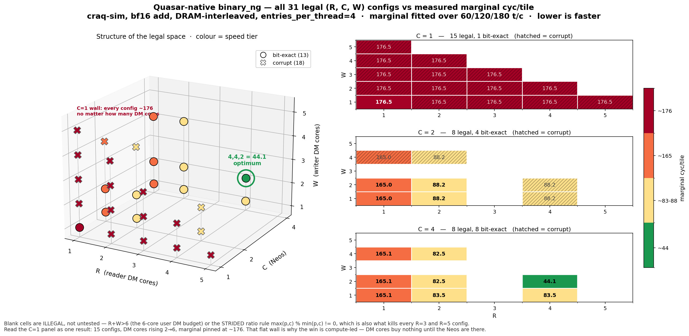

# Quasar-native `binary_ng` — status

> **Committed for the record.** This is an engineering record of the Quasar-native `binary_ng` effort, not
> user documentation. Two kinds of reference in here point outside the repository and are expected to
> dangle for a reader who was not on the original branch:
> - `debug/attrib/*` — the diagnostic drivers, sweeps and plotting scripts. `debug/` is deliberately
>   untracked; the numbers they produced are reproduced inline here.
> - `.link_to_claude/plans/*` — the implementation plan, the specialist review findings, and the
>   measurement-discipline notes, which stayed out of the repo.
>
>
*Slide-style status deck. Each `---` is a slide. Keep slides to one screen.*
***Chronological: newest week first.***

Two platforms, and the distinction runs through everything below.** *craq-sim* is a fast functional
simulator (~15 s/run, deterministic) with no transfer latency and no contention — it is where all development
happens. The *hardware emulator* is the closest thing to real behaviour we can get; it is available but far
less accessible, so it is spent deliberately and rarely. **Never mix numbers from the two.**

# ► Week of 2026-10-05 — F4 part 1: the fast paths are the rule, and the knobs are overrides

## 1. TL;DR

- **With every knob unset, the native factory runs the rule** (dchen: the best option by rule, no perf
  measurement): 4 compute threads; where the operands move over the NoC, a reader thread per compute thread
  and the writer threads the 6 DM cores leave (4,4,2); where all are borrowed, 1,4,1; DM batch 8 and compute
  batch 8, in rings of 16 entries per thread. Before, unset meant 1,1,1, depth 2 and DM batch 1, with a
  compute batch of 8 only when everything was borrowed at ring stride 1.
- **The knobs stay, as overrides.** A set knob replaces only its own value. R and W follow the effective C,
  so `TTNN_QSR_COMPUTE_THREADS=2` alone runs 2,2,2.
- **`TTNN_QSR_NATIVE=1` alone now gives wrong output on most shapes**, by design: above ring stride 1 a
  compute batch packs wrong until the pack path applies the ring stride per tile. On the 32x40 benchmark
  896 of 1280 tiles are wrong. The flag stays opt-in. `TTNN_QSR_TILES_PER_CYCLE=1` runs the rule's program
  with the compute batch at 1, and it is bit-exact.
- **Verified** (slide 3): the native module 79 passed, 1 skipped and 11 strict expected failures, each wrong
  on exactly its predicted tiles; 78 of 78 suite cases in both bit-exact configs and native off.

---

## 2. Design

- **One function holds the rule**, `resolve_native_config(tuning, NativeMoves{inputs, output})`. The gate
  checks the STRIDED ratio on the NoC path's values, and the factory resolves its program after the borrow
  decision. Every message names each value's source: `dm_batch=8 (rule)`,
  `entries_per_thread=8 (TTNN_QSR_ENTRIES_PER_THREAD)`. The settings line at startup does the same.
- **Compute batching needs R <= C and W <= C.** A compute thread beside more DM threads owns several tile
  counters of that ring, and a batch reads or fills one counter. On craq-sim 9f6314bf, R2C1W1 and R1C1W2 hung
  at batch 8 and ran exact at batch 1. The rule gives 1 there, and a set batch above 1 there is refused. The
  DM kernels have no such limit: they walk the counters in order.
- **Routing at the rule's C = 4**: an L1-interleaved slice is borrowed only when 4 divides its tiles per bank,
  else the op takes the NoC path; an L1 shard that 4 does not divide runs its last tiles in the tail rings.
  Both behaviours existed at C = 4; only the default moved.
- **Open: L1.** The NoC path's three rule rings take 384 KiB per cluster, against 12 KiB at the old default.
  Nothing shrinks them yet, so a NoC-path op whose L1 buffers leave less room fails with "clash with L1
  buffers".

---

## 3. Verification

- **Tests predict their output.** A Python mirror of the rule and of the pack-stride defect gives each case
  its wrong 32x32 tiles from its configuration: in-process tests from the invocation's knobs, the arms from
  their own. A nonzero prediction makes the test a strict expected failure that passes only on exactly those
  tile counts. Bit-exact arms set `TTNN_QSR_TILES_PER_CYCLE=1`, or 1,1,1, or one tile per transfer.
- **RED** (craq-sim ad401613, old build, first version of the tests): 38 failed, 44 passed, 1 skipped,
  exactly the tests that assert the rule. Examples: 1 Neo where the rule needs 4; exact output where the rule
  predicts 896 wrong tiles. The guards and log cases added after review assert messages that only the new
  code prints.
- **GREEN** (ad401613): the native module 79 passed, 1 skipped, 11 strict expected failures native ON, and
  1 / 90 OFF; 78 of 78 suite cases with the rule's threads at compute batch 1, with 1,1,1 at the rule's
  batches, and native off; clang-tidy 0 findings, with a control that reported 1. On 9f6314bf, R2C1W1,
  R1C1W2 and R4C2 under the rule ran exact over 288, 512 and 2080 tiles, and a set batch of 8 at R2C1 was
  refused.
- **code-review-tt**: request changes, then approve after a second pass. Applied: the compute batch rule
  above, exact tile counts in place of a 1-point element tolerance, tests for the DM-core limit (a set W,
  and a set R that leaves no DM core for a writer), a device check that a borrowed program ignores set
  reader and writer counts, the writer rule `min(C, 6 - R)`, and pre-commit fixes. Open: the L1 fit
  (slide 2), for dchen.

---

# ► Week of 2026-09-29, part 2 — DRAM-sharded operands run on the native NoC path

## 1. TL;DR

- **DRAM-sharded operands run on the native factory**, alone or beside DRAM- and L1-interleaved
  operands: height, width and block sharding, even and uneven. Only L1 can back a DFB, so a DRAM shard is
  never borrowed. The reader and the writer move it by page id through its sharding-aware
  TensorAccessor, as they move an interleaved operand. The change is in the gate only.
- **Before, these ops did not run on Quasar at all.** Both the native and the Metal 2.0 gates rejected a
  DRAM shard, and the descriptor fallback stops with `DataMovementKernel is not supported on Quasar`.
  The Metal 2.0 gate is unchanged, so with `TTNN_QSR_NATIVE` unset they still stop there.
- **Still outside the native factory:** an L1 shard beside a DRAM shard or an interleaved operand (the
  mixed-layout milestone), and ND sharding.
- **Verified** (slide 3): RED 2 of 2; GREEN 9 of 9 on craq-sim 9f6314bf and on ad401613; the native
  module 68 passed, 1 skipped, 2 expected failures native ON, and 1 / 70 OFF; 78 of 78 suite cases through
  each factory; clang-tidy 0 findings, with a control that reported 1.

---

## 2. Design: the gate admits a DRAM shard as a NoC operand

- **Gate** (`matches_quasar_native_slice`): with an L1 shard among the operands, the rule is unchanged:
  all three are L1 shards with one memory config, and the factory borrows them. Without an L1 shard, each
  operand must be interleaved or a DRAM shard with a 2D shard spec (`noc_operand_ok`). The 2D spec is
  needed because the factory's shard helpers (`is_uneven`) dereference it.
- **Factory and kernels: no change.** The Quasar `is_native_L1_sharding` returns false for any DRAM
  operand, and the slice check needs three L1-interleaved operands. So the factory takes the NoC path:
  `split_work_to_cores` over the worker grid and a TensorBinding per operand, for which Metal 2.0 emits
  DRAM-sharded TensorAccessor args. The writer needs no shard-row wrap: each core writes a linear page
  range, and the accessor maps each page to its shard.
- **A DRAM shard grid is in DRAM-bank coordinates** (craq-sim: `dram_grid_size` is 2 x 1).
  `get_worker_grid`, the same code as production, finds the sub-device by numeric overlap with the Tensix
  workers, so it works because both grids start at (0, 0). A test pins that the op spreads over all 32
  clusters, not over one cluster per DRAM bank.
- **Simulator:** craq-sim builds before 9f6314bf re-map DRAM streams as if they were interleaved (removed
  in craq-sim #335), which can corrupt a single-bank stream such as a DRAM shard's. These cases passed on
  both builds.
- **Not measured** (the rule picks the path, no perf work): the sharded accessor divides per page, and on
  silicon a DRAM shard is one bank, so a thread's run of pages from one shard hits one bank.

---

## 3. Verification

- **RED** (craq-sim 9f6314bf, before the gate change): both new tests failed on the descriptor's
  `TT_FATAL: DataMovementKernel is not supported on Quasar`.
- **GREEN, 9 of 9 on craq-sim 9f6314bf and on ad401613:**
  - `test_native_dram_sharded_is_bit_exact` at 1,1,1, 1,4,1 and 4,4,2, each with DM batch 1 and 8, over 16
    ops per child: every layout alone and beside another placement (a mapping error that a, b and c share
    would still give c = a + b), a DRAM-sharded output from interleaved inputs, a 1024-tile case for full
    DM batches, a cache-hit repeat and an in-place `add_`.
  - `test_native_dram_sharded_spreads_over_the_worker_grid` on 3 cases: the device profiler shows 32
    clusters, each with 6 DM cores and 4 Neos at 4,4,2.
- **Regression** (craq-sim ad401613): the native module 68 passed, 1 skipped, 2 expected failures native
  ON, and 1 / 70 OFF; 78 of 78 suite cases through each factory. The arm scripts' routing check now also
  fails on any binary_ng kernel outside `kernels_qsr/` and `kernels_dfb/`, such as the descriptor's.
- **code-review-tt**: approve after fixes, all applied except one test, which would pin that an L1 shard
  beside a DRAM shard stays off the native factory. It needs a harness mode that expects the descriptor's
  failure, and the mixed-layout milestone changes that case anyway.

---

# ► Week of 2026-09-29 — F16: L1-interleaved operands borrowed in place; the default `1,1,1` runs at 46.75 cyc/tile

## 1. TL;DR

- **Three L1-interleaved operands are borrowed on the native factory** (F16). Bank k of an
  L1-interleaved tensor holds its pages k, k+32, k+64, ... back to back, and each cluster owns one bank.
  So each cluster computes its slices of a, b and c in place, as it does a shard: the reader publishes
  credits, the writer has nothing to do, and no tile moves over the NoC. The change is host-only; the
  kernels are F3's (slide 2).
- **No tail rings** (dchen): a slice is borrowed only when the compute count divides it, and any other
  slice keeps the NoC path. For L1-interleaved the alternative to a tail is the NoC path at the same
  slope, so on craq-sim a tail would cost about 800 cycles of latency and gain no throughput (slide 2).
  The decision rests on the tail rings being temporary: they go away for every layout with tt-metal#57623.
- **At the default tuning, `1,1,1`, an L1-interleaved add goes from `773 + 185.00*T` to
  `1021 + 46.75*T`**: 3.96x on throughput and 3.14x on latency at 64 tiles per cluster, because a
  borrowed ring lets the compute batch. That is within 0.50 cyc/tile of the tuned NoC path (`4,4,2`,
  46.25), on 2 DM cores and 1 Neo instead of 6 and 4 (slide 3).
- **At the tuned `4,4,2` the slope stays within 0.25 cyc/tile** (46.25 to 46.50), as for shards:
  craq-sim charges nothing for transport. The program runs as `1,4,1`, with 268 cycles less fixed cost
  and 4 of 6 DM cores per cluster free. `1,4,1` itself goes from reader-bound 166.00 to 46.50. The
  borrowed slices cost what F3's borrowed shards cost, within 5 cycles.
- **On silicon the mesh bisection would bind the NoC path** (slide 4). Half of all L1-interleaved
  traffic crosses the four links in the middle of the mesh, a floor of 48.0 cyc/tile at any N, so the
  NoC path's batched 26.44 cannot be reached there. The borrowed path moves no NoC bytes: at `4,4,2`
  N=8 it is predicted at about 4.1x the NoC path (11.69 against 48.0), once #56194 lands. On craq-sim,
  which has no NoC timing, the NoC path's DM cores bind it from the first batching step: at `4,4,2` N=2
  the borrowed path is 1.61x faster, while the port would be only 56% busy.
- **Verified** (slide 5): RED, 3 of 3 borrow tests failed on the DM count alone; GREEN 15 of 15; the
  native module 59 passed, 1 skipped, 2 expected failures native ON, and 1 / 61 OFF; 78 of 78 suite
  cases through each factory. A build without the gate's worker-grid checks failed both sub-grid tests.

---

## 2. Design: a bank slice is a shard, with no tail

**Why it works.**
- Page `i` of an interleaved buffer lives in bank `i mod N`, at `address + (i / N) * aligned_page_size`,
  and each worker core owns one L1 bank at offset 0. So `buffer->address()`, which the runtime attaches
  to a borrowed DFB on every core, is where each core's slice starts.
- a, b and c map page `i` to the same bank, so one core's three slices hold the same page indices,
  whatever bank id the allocator gave the core (it shuffles them). An elementwise op is right on every
  core, and the placement only has to cover every core that holds a bank.
- Every bank reserves `ceil(P/N)` pages. A bank with one real page fewer computes one pad slot inside
  its allocation, which no page reads: F3's rule for uneven shards.
- The kernels need no change. The borrowed branches read only the tile count, never a tile id, and with
  no tail the writer has nothing to do.

**The gate** (`l1_interleaved_borrow_tiles`): a, b and c are L1 (not L1_SMALL), interleaved and tiled;
each page stride equals its tile size; one allocator and one page count; the op's worker grid is exactly
the cores that hold the allocator's L1 banks, so a sub-device grid keeps the NoC path; and
`S = ceil(P/N)` divides by the tuned `C`. The reader and the writer then run one thread each, as for
shards. Tensor-scalar stays out: it counts as broadcast (dchen), and the factory takes none.

**No tail rings.** In F3 the tail rings beat running fewer Neos, by 4x or 2x on throughput. For
L1-interleaved the alternative already runs four Neos at the same slope. Recorded craq-sim fits, N=1:

| tile count per cluster | borrow + tail rings (09-22) | NoC path `4,4,2` | borrow minus NoC |
|---|---|---|---|
| `S mod 4 = 0` | `851 + 46.50*T` | `1119 + 46.25*T` | about -250 cycles |
| `S mod 4 = 1` or `2` | `1910` or `1929 + 46.50*T` | the same | about +800 cycles (derived) |
| `S` = 1, 2, 3 | 1694, 1790, 1894 | about 1165-1258 (derived) | about +600 cycles (derived) |

"Derived" applies the NoC fit from 64/128/192 at other tile counts. So on craq-sim a tail costs latency
and buys no throughput, and tailed slices keep the NoC path. On silicon the NoC path meets the cut at
48.0 (slide 4), so there a tail would pay back above about 530 tiles per cluster at N=1 (derived, with the
cut as the NoC path's slope). The decision rests on the tail rings being temporary. At `C = 4` only page
counts `P` in `[128m - 31, 128m]` divide, one in four; at `C = 1` every one does.

---

## 3. Measured: the NoC path against borrowed slices, on one basis

craq-sim `ad401613`, L1-interleaved over the 8x4 grid, 64/128/192 tiles per cluster (32 banks), span
fit as in every recorded number. Each arm ran with the same environment before and after the change,
except the default `1,1,1` row: its NoC-path figure is the `TILES_PER_CYCLE=1` arm, which the code runs
as the default, because the NoC path batches only with the knob.

| arm | NoC path (before) | borrowed (after) | throughput | span at 64 t/c |
|---|---|---|---|---|
| `1,1,1`, the default (N = min(8, S) when borrowed) | `773 + 185.00*T` | `1021 + 46.75*T` | 3.96x | 12613 → 4013 |
| `1,1,1` N=8, both knobs | `1390 + 94.62*T` | `1021 + 46.75*T` | 2.02x | 7446 → 4013 |
| `1,1,1` N=1 | `773 + 185.00*T` | `754 + 186.00*T` | 0.99x | 12613 → 12658 |
| `1,4,1` N=1 | `1324 + 166.00*T` | `847 + 46.50*T` | 3.57x | 11948 → 3823 |
| `4,4,2` N=1, the tuned config | `1115 + 46.25*T` | `847 + 46.50*T`, as `1,4,1` | 0.99x | 4075 → 3823 |
| control: DRAM `4,4,2` N=1 | `1115 + 46.25*T` | `1115 + 46.25*T` | unchanged | 4075 → 4075 |

- **A borrowed slice costs what a borrowed shard costs**: F3 measured `757 + 186.00*T`, `851 + 46.50*T`
  and `1016 + 46.75*T` on this basis. On craq-sim, placement does not enter.
- **Batching acts on the compute chain alone**, as for shards: 186.00 to 46.75 at `C = 1`. The NoC path
  stopped at 94.62 because a DM chain bound it.
- **The control holds**: the DRAM arm is identical to the cycle, so the NoC path is untouched. The
  NoC-path fits sit 3 to 129 cycles of fixed cost below the 09-22 records (DRAM-interleaved), with the
  same slopes, after two rebases, so this slide compares only against its own control.
- **On silicon** (a prediction, not a measurement): the borrowed part moves no byte through the NIU or
  across the mesh. Slide 4 prices both pipes for the NoC path.

---

## 4. NoC: on silicon the mesh bisection binds the NoC path; the borrowed path moves no NoC bytes

craq-sim charges nothing for transport, so the NoC is absent from its cycles. This slide puts the NoC
model next to the measured cycles at `4,4,2`, on 64/128/192 tiles per cluster. The NoC path was measured
on L1 operands directly, with the borrow disabled in a temporary build; it equals the DRAM arm to the
cycle. Both N=8 outputs are wrong until #56194, so those rows are timing only.

| `4,4,2` | craq-sim | port (floor 24.0) | bisection (floor 48.0) | predicted on silicon |
|---|---|---|---|---|
| NoC path, N=1 | `1115 + 46.25*T` | 52% | 104% | about 48.0: the bisection |
| NoC path, N=8, both knobs | `1817 + 26.44*T` | 91% | 182% | about 48.0: the bisection |
| borrowed, N=1 (runs as `1,4,1`) | `847 + 46.50*T` | 0 | 0 | 46.50: the compute chain |
| borrowed, N=8 (runs as `1,4,1`) | `1114 + 11.69*T` | 0 | 0 | 11.69: the compute chain |

The port and bisection columns give the load at the simulated rate as a share of each pipe's capacity.

- **The port.** On the NoC path a cluster fetches 4096 B and writes 2048 B per tile, and serves the same
  amounts to the clusters that read and write its bank, so 6144 B pass its NIU port each way. At
  256 B/cyc that is a floor of 24.0 cyc/tile, which no configuration reaches first.
- **The bisection.** The 8x4 mesh has one NoC, and the cut between the fourth and fifth columns severs
  four links of 256 B/cyc each way. Each cluster spreads its pages evenly over all 32 banks, and 16 of
  those banks sit across the cut, so exactly half of all traffic crosses it: 49,152 B each way per round
  of 32 tiles, a floor of 48.0 cyc/tile at any N. It binds by 4% at N=1 and by 1.8x at N=8, so on silicon the NoC path
  gains nothing from batching.
- **The borrowed path** moves no byte through the NIU or across the cut. Its L1 traffic uses the Tensix
  unpacker and packer ports (20 read and 12 write per cluster), whose floor is about 3 cyc/tile. At N=8
  it is predicted at about 4.1x the NoC path's throughput on silicon (11.69 against 48.0), against 2.26x
  on craq-sim.
- **A correction.** The 09-17 slide put the bisection load at about 105% on its basis (44.00-44.12
  cyc/tile, 60/120/180 tiles per cluster), from a floor of about 46.5 cyc/tile. That count took half of
  the remote traffic (31/32 of the total). Half of all traffic crosses, so the floor is 48.0: 109% on that
  basis, and 104% on this slide's.
- **Limits of the model.** It counts link bandwidth only. Router contention and packet overhead would
  slow the NoC path further, so 48.0 is its best case. It treats the NoC clock (1.35 GHz) and the Tensix
  clock (about 1.4 GHz) as one, an error near 4%.

**Where the NoC path binds on craq-sim, and the NoC load at that point.** craq-sim has no NoC timing:
`qsr_rocc_issue_cmd_buf` copies each transfer inside the issue instruction, and only DFB flow control
stalls it. So on craq-sim only the DM cores' work per tile can bind the NoC path: command-buffer setup,
address math, DFB credits and completion polling. Both knobs, ring depth 2N, 64/128/192 tiles per
cluster. The NoC path ran on DRAM operands, which equal the L1 NoC path to the cycle (checked at N=1 and
N=8 for both configs). The loads are the NoC path's, at the craq-sim rate: port = 24.0 / slope, and
bisection = 48.0 / slope. The borrowed path moves no NoC bytes.

| config | N | NoC path | borrowed | borrowed faster by | port | bisection |
|---|---|---|---|---|---|---|
| `4,4,2` | 1 | 46.25 | 46.50 | none | 52% | 104% |
| `4,4,2` | **2** | **42.75** | **26.50** | **1.61x** | **56%** | **112%** |
| `4,4,2` | 4 | 31.88 | 16.62 | 1.92x | 75% | 151% |
| `4,4,2` | 8 | 26.44 | 11.69 | 2.26x | 91% | 182% |
| `1,1,1` | 1 | 185.00 | 186.00 | none | 13% | 26% |
| `1,1,1` | **2** | **141.50** | **111.00** | **1.27x** | **17%** | **34%** |
| `1,1,1` | 4 | 110.25 | 66.50 | 1.66x | 22% | 44% |
| `1,1,1` | 8 | 94.62 | 46.75 | 2.02x | 25% | 51% |

- **The NoC path binds from the first batching step.** Batching makes the compute almost 4x faster
  (46.50 to 11.69), but the DM work that drives the NoC only 1.75x (46.25 to 26.44). `4,4,2` already
  uses all six DM cores (R + W <= 6), so the NoC path has no thread left to add.
- **At that point no link is full.** At `4,4,2` N=2 the port would be 56% busy, and at `1,1,1` N=2 only
  17%. The DM cores bind first. The bisection demand is already 112% at `4,4,2`, but craq-sim does not
  charge for it.
- **On silicon the bisection binds first**, at 48.0 cyc/tile. When it saturates, each port is 50% busy.
- Unbatched, the M1 rule holds: the compute binds only with about one reader thread per Neo and one
  writer thread per two Neos. `1,4,1` runs its NoC path at 166.00 against 46.50 borrowed (3.57x), at 14%
  of the port.
- The `4,4,2` rows above N=1 are timing only: both outputs are wrong until #56194. `1,1,1` has ring
  stride 1, which #56194 does not affect.

---

## 5. Verification

- RED first: `test_native_l1_interleaved_borrows_in_place` at tuned `4,4,2` failed 3 of 3 on the DM count
  alone, 6 DM cores per cluster with 4 Neos and bit-exact output. The two paths bind the same
  `kernels_qsr/` sources, so the routing check cannot tell them apart; the thread count, read from the
  device profiler, can. The five NoC-path cases passed with 6, which validates the count on a known case.
- GREEN, 15 of 15. All 13 cases are bit-exact at `1,1,1`, `1,2,1`, `1,4,1` and `4,4,2`. The profiler
  tests run at `4,4,2`, and each also checks how many cores ran the op.
  - Borrowed: 128 and 256 tiles, 100 and 250 tiles (a pad slot on the high banks), a cache repeat at new
    addresses, and an in-place `add_`. Three of them (128, 250 and the `add_`) show 2 DM cores and 4 Neos
    on each of the 32 bank cores. An F3 borrowed shard on 4 cores, a known case that does not pass
    through this gate, also shows 2.
  - The NoC path at `C = 4`, with 6 DM cores: 160 and 64 tiles (5 and 2 per bank) on 32 cores, 8 tiles
    (1 per bank) on 8 cores, a 4x4 sub-grid on 16 cores, and a DRAM a, b or c.
- The mutation check. A temporary build without the gate's two worker-grid checks failed both sub-grid
  tests: at `4,4,2` it borrowed on the 16 sub-grid cores and left the other 16 banks uncomputed, so 2 DM
  cores ran and 65,476 of 131,072 elements differed. The factory was then restored byte for byte, rebuilt,
  and both tests passed again.
- The native module: 59 passed, 1 skipped, 2 expected failures native ON; 1 passed, 61 skipped OFF.
- The no-broadcast, ResNet-add and descriptor cache-hit suites, through both factories: 78 / 78 each.
  Native ON, the cache-hit test's L1 case now borrows 8 tiles over 32 banks, so 24 clusters compute a
  pad slot only, and it hits the program cache at new addresses. The profiler shows it: at `1,1,1` its
  shape runs on all 32 bank cores, and the same shape in DRAM, on the NoC path, runs on 8.
- 32 cases of those files were deselected: fp32 takes the SFPU path, which stalls on `ad401613`
  (craq-sim #326), and the activation and SFPU cases abort it on SFPGT. None of them reaches the native
  factory, which takes no activations and no SFPU op; neither do the activation, broadcast and scalar
  files. Two earlier runs stopped on these defects: the 671 cases of all six other files on the fp32
  stall, and the three files without the activation filter on the SFPGT abort.
- clang-tidy on the factory: 0 findings, from the compile database without PCH flags. A control copy
  with one planted redundant `? true : false` reported exactly that finding, so the check runs live.

---

## 6. Next

1. **F4 mixed layouts**: gate widening only; the NoC kernels already take sharded pages through the
   accessor.
2. **Per-operand borrow**, for example a and b borrowed and c written over the NoC to DRAM: it needs a
   strided NoC walk, `page = k + j*N`, in place of today's linear `start_tile_id + k`. A kernel change;
   measure first.
3. **`1,4,1` at N=8 once #56194 lands**, now for slices as well as shards.
4. **Remove the tail rings once the DFB supports a capacity per tile counter** (tt-metal#57623). Then
   every L1-interleaved slice borrows, not only those that divide by `C`.
5. **Move the development simulator to `9f6314bf` or later.** It fixes the fp32 stall and the SFPGT
   abort, the two defects that narrowed this week's suite run.

---

# ► Week of 2026-09-22 — F3: borrowed L1 shards run native; `1,4,1` equals `4,4,2`; `1,4,1` at N=8 measures 11.69 cyc/tile

## 1. TL;DR

- **Borrowed L1-sharded operands run on the native factory** (F3). When all three operands are L1
  shards with one memory config, each DFB is the resident shard: the reader publishes credits, the writer
  has nothing to do for the borrowed part, and none of it moves over the NoC. Only the 1-3 tiles past
  the largest multiple of `C` are copied, through the tail rings (slide 6). Height, block and width shards are bit-exact at `1,1,1`, `1,4,1` and
  `4,4,2`; the module is 44 passed, 1 skipped and 2 expected failures native ON, and 1 / 46 OFF; the
  ResNet-add and sharded no-broadcast suites pass through both factories, 24 / 24, and the
  mixed-layout suites 44 / 44 (slide 4).
- **The stride guard is lifted, and borrowed `1,4,1` at N=8 measures `1231 + 11.69*T`**: 3.98x the
  throughput of N=1 (`851 + 46.50*T`). It is exactly `1,1,1` at N=8 (46.75) divided by `C = 4`: the
  four Neos split the batched compute chain evenly. The output is wrong until tt-metal#56194: 74.9% of
  elements, where the pack defect's model predicts 75%. Two strict expected-failure tests hold that
  state (slide 5).
- **`1,4,1` is the borrowed configuration.** Measured while a tuned `4,4,2` still ran four readers and
  two writers, the two had the same slope to the digit, 46.50. `R` and `W` move no data for the
  borrowed part, so only `C` enters, and four DM cores per cluster are freed (slide 3). The factory
  therefore runs every borrowed program with one reader and one writer thread: a tuned `4,4,2` runs as
  `1,4,1`, which fits `851 + 46.50*T`.
- **Compute batching is worth 3.98x on the compute chain**: `1,1,1` at N=1 is 186.00 cyc/tile and at
  the default N=8 it is 46.75. Interleaved `1,1,1` at N=8 is DM-bound at 94.62 on the same basis;
  borrowed has no DM chain to bind (slide 3).
- **A basis caveat, recorded for every later comparison.** Interleaved `4,4,2` N=1 fits 44.00 on
  60/120/180 tiles per cluster and 46.25 on 64/128/192; `1,1,1` fits 176.00 (176.5 in the cost model)
  and 185.00. HEAD's kernels fit the same 46.25 and 185.00 on 64/128/192, so the shift is the basis
  and not this change. The slope depends on the tile-count basis by about 5%, so borrowed and
  interleaved are compared here on one basis only: on 64/128/192 the two are within 1 cyc/tile at
  `C = 1` and within 0.25 at `C = 4`.
- **One rule shapes the whole feature**: a borrowed ring is the shard, and the DFB host requires its
  entry count to divide by `max(producers, consumers)`. So the factory always runs the tuned compute
  count: the borrowed ring takes the largest multiple of it, and the 1-3 tiles past it go through three
  small owned tail rings (slide 6); a shard of 1-3 tiles goes through the rings whole. The tail rings
  stay until the DFB can give each tile counter its own capacity. The reader and the writer run one
  thread each. Every borrowed shape stays native.
- **Reviews found two real defects, both in the shared predicate**: `is_native_L1_sharding` compared
  only the grids of input and output shards, so inputs height-sharded and an output width-sharded on
  one grid were borrowed in place by both factories and came out wrong (12274 of 16384 elements). The
  first fix compared the shard spec, and the PR review found that this is still not enough: height
  inputs and a block output with an identical shard spec put the second shard on different cores (2046
  of 4096 elements wrong on craq-sim, and a near-constant output on the real Wormhole). The predicate
  now compares the full memory config. Mixed-layout cases that run without the native flag hold both,
  in the WH and BH nightly jobs as well (slide 4).

---

## 2. Design: the gate rule, and one push per counter

Three things blocked the borrowed path: the gate rejected every sharded operand, the native kernels had
no borrowed branch, and the factory set `num_tiles_per_cycle = min(8, S)` whenever all operands were
borrowed, which above `1,1,1` batches at a ring stride above 1, where the pack path loses tiles (#56194).

**Gate and thread counts.** Sharded operands are admitted when all three are L1-sharded tiled shards
with one memory config (`get_shard_volumes` reports all three), at any per-core tile count `S`.
A borrowed DFB has `num_entries = S`, cannot be rounded up past its backing shard, and the DFB host
asserts that `S` divides by `max(producers, consumers)`. So the factory picks the thread counts per
program: the compute always runs the tuned `C`, the borrowed rings take the first `S - (S mod C)`
tiles, and the leftover tiles go through the tail rings (slide 6); a shard smaller than `C` has no
borrowed ring. The reader and writer run one thread each, since they copy only the tail tiles. Both
ring strides then equal the compute count and divide the borrowed part by construction. At `C = 4`,
every shard runs on four Neos. Mixed layouts stay on the fallback (F4). The shared
predicate behind `get_shard_volumes` now requires the output's exact memory config on every sharded
input, not only its grid or its shard spec: in-place borrowing cannot be right when core i's input
shards and its output shard cover different tiles, and every factory that borrows inherits the check.

**Reader and writer.** The reference kernels publish with one `reserve_back(S)`, `push_back(S)`, which
is right only for one thread on one counter: `push_back(n)` credits the active counter and rotates once,
so a bulk push of `S` on a counter of capacity `S / max` never completes. The native kernels publish per
counter. Thread `t` owns `num_tcs` counters; counter `c` holds the tiles from `t + c*T` in steps of
`num_tcs*T`, so its count is the closed form of the counter-major walk, and with the divisibility rule
every count is exactly the counter's capacity. The writer does no credit work for the borrowed part
(below). In both kernels the NoC path is the pre-F3 code, byte for byte, behind `#else`.

**Why not one push, as on WH and BH.** On WH and BH the borrowed reader publishes the whole shard in one
call: one `reserve_back(S)` and one `push_back(S)` in `kernels_ng/dataflow/reader_interleaved_no_bcast.cpp`.
That works because the buffer there is a circular buffer with one credit counter, fed by one reader
RISC. On Quasar a ring shared by several threads is split into `max(P,C)` tile counters of
`S / max(P,C)` entries each. `reserve_back(n)` asks the active counter for `n` free entries, and
`push_back(n)` credits that counter and then rotates to the next. So a single `reserve_back(S)` asks one
counter for more than it holds: with the watcher on, the DFB's capacity assert fires; otherwise the
thread waits forever. Each thread therefore publishes its counters one at a time, `S / max(P,C)` entries
each. At `1,1,1` there is one counter of `S` entries, and the loop reduces to the single WH/BH push. That
is also why the single-threaded fallback keeps its one-call publish.

**Why the writer does nothing for the borrowed part, as on WH and BH.** The WH/BH writer does no credit work for a sharded
output, and the native Quasar writer now does none either. The protocol never needs the output's credits
drained. Each kernel launch resets every tile counter and rewrites its capacity before the buffer is
marked ready, so no credit state reaches the next program. The pack thread's firmware calls
`tensix_sync()`, which blocks until the Tensix core is idle, before it reports done, so every packed tile
is in L1 when the program completes. And the borrowed ring is the whole shard, so the compute never waits
for freed space. The writer used to drain only because it then called `finish()`, which on a DM consumer
waits until every posted tile is acked. Without a drain, that `finish()` is a race. On craq-sim it
returned at once when it ran before the compute's first post, and it hung when the writer was delayed
past that post. With neither the drain nor `finish()`, the borrowed path is bit-exact at `1,1,1`,
`1,4,1` and `4,4,2`, including a repeated shape in one process. The writer's interleaved path is
byte-identical to the one before F3. The single-threaded fallback writer still drains, in one call.
The first borrowed measurements were made while the writer still drained: `1,4,1` fit
`1002 + 46.50*T` at N=1 and `1406 + 11.69*T` at N=8. Remeasured with the idle
writer, borrowed `1,4,1` fits `939 + 46.75*T` at N=1 and `1358 + 11.69*T` at N=8. The N=1 slope moves
by 0.54%, and the N=8 slope does not move. The intercept is lower because the per-cluster span now
ends when the last pack thread returns, where it used to end at the writer's last pop, just after that
thread's final post. After the second review the reader's borrowed branch sets up its own buffers, so
that its NoC path is the pre-F3 code again. Borrowed `1,4,1` then fits `851 + 46.50*T` at N=1 and
`1231 + 11.69*T` at N=8, the shipped numbers that the other slides quote; `1,1,1` is unchanged at
`757 + 186.00*T` and `1016 + 46.75*T`. An A/B of the
two reader versions on one build reproduced both `1,4,1` fits exactly, so the reorder moved them. How
it does so inside the simulator is not traced; the N=8 slope, 11.69, holds.

**Batch default.** On the borrowed path `num_tiles_per_cycle` defaults to `min(8, S)` only when both
ring strides are 1, else 1, until #56194. A borrowed ring is walked exactly once, so a batch never wraps
and `S % n` is not required; the knob's double-buffer and wrap guards are skipped for it. Above stride
1 the knob runs with a warning and wrong output (slide 5).

**Consequences.** No thread draws zero tiles on the borrowed path, since the borrowed part divides by the
ring stride. Every borrowed shape runs native, and every shard keeps all `C` Neos (slide 6). At the same
batch size, four Neos measure 4.00x one Neo (46.50 against 186.00 at N=1, 11.69 against 46.75 at N=8).
A shard of 1 tile per core goes through the tail rings on four Neos, three on padding.

---

## 3. Measured: borrowed against interleaved on one basis

craq-sim `ad401613`, block shards over the full 8x4 grid, 64/128/192 tiles per cluster, span fit as in
every recorded number. The borrowed column is the shipped code. The interleaved arms were rerun on the
same basis in the session of the first borrowed measurement, and their NoC path has not changed since.

| config | interleaved (DRAM) | borrowed (L1 block shards) |
|---|---|---|
| `1,1,1` N=1 | `776 + 185.00*T` | `757 + 186.00*T` |
| `1,4,1` N=1 | `1450 + 166.00*T` | `851 + 46.50*T` |
| `4,4,2` N=1 | `1119 + 46.25*T` | runs as `1,4,1` |
| `1,1,1` N=8, both knobs (the borrowed default) | `1519 + 94.62*T`, DM-bound | `1016 + 46.75*T` |
| `1,4,1` N=8, compute knob, output wrong until #56194 | not measured | `1231 + 11.69*T` (slide 5) |

Before a tuned `4,4,2` ran as `1,4,1`, with the draining writer of slide 2, `4,4,2` fit
`1021 + 46.50*T` and `1,4,1` fit `1002 + 46.50*T`: the same slope, so the rule costs no throughput.

Three readings. **The cycle count does not move with placement on craq-sim**: borrowed and interleaved
agree within 1 cyc/tile at the same `C`, because the simulator charges nothing for transport either way.
What moves is the roof: the DRAM floor of ~349 cyc/tile and the NoC port both vanish, so 46.50 is a
silicon prediction here and an upper bound everywhere else (week of 09-10, slide 6). **The thread budget
collapses**: interleaved `1,4,1` is reader-bound at 166.00 and needs `4,4,2` to reach 46.25; borrowed
`1,4,1` reaches 46.50 with two DM cores. **Batching acts on the compute chain alone**: 186.00 → 46.75
at `C = 1`, a 3.98x on throughput, where the interleaved pipeline stopped at 94.62 because a DM chain
bound it. At `C = 4` the same batch measures 11.69 (slide 5); its output is right once #56194 lets the
pack apply the ring stride.

The basis caveat: the recorded 44.00 and 176.00 came from 60/120/180. On 64/128/192 the same interleaved
arms fit 46.25 and 185.00, with HEAD's kernels and with this change's kernels alike, to the digit in
prologue and slope. So the shift is the basis and not the kernel edit, and the NoC path is confirmed
unchanged. All fits are exact (zero residual): the per-tile cost depends on the tile-count basis by
about 5%. Compare only within one basis.

---

## 4. Verification

- RED first: the four native arms failed on routing alone (`kernels_qsr` 0, `kernels_dfb` 12) with
  bit-exact output, and the fallback test passed as predicted. GREEN after the kernels and the gate:
  5 of 5.
- Module native ON 44 passed, 1 skipped, 2 expected failures (slide 5); OFF 1 passed / 46 skipped. The
  count includes the tail-ring tests of slide 6.
- `test_binary_ng_no_bcast.py -k sharded` and `test_binary_ng_resnet_add.py`: 24 / 24 native ON, where
  every all-sharded bf16 ADD without activations now routes to `kernels_qsr` at the default `1,1,1`
  with `n = min(8, S)`; 24 / 24 native OFF. The mixed-layout, mixed-grid and interleaved-output cases,
  which the predicate change can re-route: 44 / 44 through each factory, with the cases of the third
  review and the PR review.
- Shards: 16 tiles per core height, block and width; 12 (one full chunk of 8 plus a tail of 4); 1 and
  2 per core, including the uneven column whose boundary core holds a partial shard; height inputs with
  a width output on one grid, which must fall back and stay bit-exact.
- Uneven shards, where the tensor does not divide into whole shards and the last clusters hold fewer
  real tiles: height and width with 1 real tile of 4 on the last cluster, and block corners with 1 of 4
  and 1 of 16, at `1,1,1`, `1,4,1` and `4,4,2`, routed native and bit-exact. Shards that do not divide
  by 4 -- 1, 2, 6, 9 and 10 tiles per core, including an uneven width shard and a shard grid of four
  clusters of which two hold no real tile -- stay native and bit-exact at all three splits. Every
  cluster processes its full shard, so the kernels never see the smaller count; at `1,4,1` three of
  the four compute threads on a last cluster with one real tile work only on padding.
- **Review** (the local reviewer with the PR-bot parity pass) found the shard-spec hole above and four
  smaller items, all applied: the factory reads the shard tile count from the gate's helper instead of a
  second derivation; the basis claim was isolated by rerunning HEAD's kernels; two output-tensor guards
  that `compute_output_specs` already covers were deleted; `sharded_operand_ok` lost an argument every
  caller derived from the same object.
- **The `2,1,2` arm, DM side 2 against Tensix side 1 on both rings, is bit-exact on craq-sim `9f6314bf`
  for borrowed and interleaved operands, and wrong on `ad401613` for both**, about half the elements.
  That is the simulator defect recorded in the week of 09-03, now shown independent of NoC fill. The arm
  stays out of the committed module until the simulator in use moves past it. Since the second review,
  a borrowed program runs one reader and one writer thread, so its DM side never outnumbers its Tensix
  side and that defect cannot reach it.
- **Second review** (code-review-tt with the PR-bot parity pass) found no defect in any admitted
  configuration. Applied:
  - one reader and one writer thread on the borrowed path;
  - three entries in the borrowed shard set: a repeat of an earlier spec while its tensors are still
    alive (a program-cache hit that must rebind the borrowed shards to the new buffers), an in-place
    `add_`, and 256 tiles per core;
  - the two strict expected failures accept only the pack defect's own signature (slide 5);
  - the reader's NoC path restored to the pre-F3 code, byte for byte;
  - comments that still said the gate checks divisibility, that the borrow rule is grid equality, or
    that the borrowed writer drains.
- **Third review** (code-review-tt with the PR-bot parity pass, after the tail rings) found no defect
  in any admitted configuration. Applied:
  - a same-grid mixed-layout case in `test_binary_ng_no_bcast.py` (height inputs, a width output),
    which runs without the native flag. With the spec check reverted to grids, it failed through both
    factories (PCC 0.06); with the check, it passes;
  - the DM-ring guards (the DM batch against the ring depth, and the 255-entry limit) now skip
    borrowed programs, which build none of those rings;
  - a compile guard that refuses a fused RELU as well as an activation chain on the tail path;
  - `sharded_operand_ok` in a unity-build-safe namespace;
  - the profiler test strips the DPRINT and streaming-profiler variables that the runtime refuses next
    to the device profiler, and skips on a build without Tracy;
  - comments and docs that the tail rings made stale.
- **Rebase onto main** found a conflict that the text merge and the host build did not show: main's
  fused-activation SrcA fix made the shared Quasar preprocess helper name `dfb::pre_lhs`, and a program
  with no borrowed ring has no such DFB, so every shard smaller than `C` failed to JIT-compile. The
  compute kernel now includes that helper only when a borrowed ring exists. The default `1,1,1` suites
  never build tail rings, so only the native module caught it.
- **PR review** (the PR bots and an AI-assisted review by blozano-tt) found a second hole in the shared
  predicate. Height inputs and a block output on one 2x2 grid had identical shard specs, but the second
  shard sits on `(1,0)` in one layout and on `(0,1)` in the other. The spec-only check borrowed them in
  place: 2046 of 4096 elements wrong on craq-sim through both factories, and a near-constant output on
  the real Wormhole through the Metal 2.0 factory. Applied:
  - the predicate compares the full memory config when both are sharded, before the uneven-shard branch,
    so that branch is covered too; the comment says why `b` needs no check of its own;
  - new cases that run without the native flag: `H.H.B@same-spec`, `H.H.Hcol@same-grid` (row-major
    inputs into a column-major output), and a supplied output tensor whose config differs from
    `memory_config`. The same-spec and output-tensor cases failed before the fix on craq-sim and on the
    real Wormhole; the orientation case passed before too, since the shard spec holds the orientation;
  - the borrowed rings of `a`, `b` and `c` take one count, since borrowing needs one config.

  Kept by decision: the batching-above-stride-1 warning, rather than a refusal with an opt-in; and the
  `TTNN_QSR_NATIVE` skip, because the WH and BH nightly jobs collect this directory and the native
  factory does not run there.
- Two more `ad401613` limits met on the way, neither ours: fp32 add stalls in UnpackToDest, and an lhs
  RELU activation aborts the simulator on an undecoded SFPGT. Both are fixed in later craq-sim.

---

## 5. The stride guard lifted: `1,4,1` at N=8, and two expected failures

The factory refused compute batching above ring stride 1, because the pack path loses tiles there
(#56194). That refusal is now a warning with the same condition, so the knob runs and its timing can be
measured. The default derivation is unchanged: it batches only at stride 1, so no default
configuration produces wrong output.

| borrowed `1,4,1`, 64/128/192 tiles per cluster | fit | output |
|---|---|---|
| N=1, the default | `851 + 46.50*T` | bit-exact |
| N=8, `TTNN_QSR_TILES_PER_CYCLE=8` | `1231 + 11.69*T` | 74.9% of elements wrong |

- **Throughput 3.98x; latency 1.93x at 64 tiles per cluster, 2.81x at 192.** The slope falls from
  46.50 to 11.69. The span gains less at small counts because the batched arm pays about 380 cycles
  more fixed cost.
- **The slope is the compute chain divided by `C`, exactly**: `1,1,1` at N=8 measures 46.75, and
  46.75 divided by `C = 4` is 11.69. The DM side does no per-tile work on this path, so nothing else
  enters. The 4 is the thread count, not a batching factor: the batching gain is the separate 3.98x,
  and that number was measured, not predicted.
- **The per-stage model under-predicted batching.** It took 131 of the 176.5-cycle compute chain as
  amortizable and predicted 61.9 per Neo at N=8, so 15.5 at `C = 4` (60/120/180 basis). Measured:
  46.75 and 11.69 (64/128/192 basis, about 5% higher at N=1, which does not close the gap). Fitted to
  `a/N + b`, 186.00 at N=1 and 46.75 at N=8 give about 159 of 186 amortizable: a derived split under the
  model's form, not a measurement.
- **The timing is measured with the defect present.** The pack still issues one pack per tile, only at
  the wrong addresses, so the number stands for the fixed pack unless the fix adds per-tile cost. The
  error count confirms that the batched path ran: a batch of 8 at stride 4 covers ceil(8/4) = 2 slots,
  so 75% of each batch is lost, against 74.9% measured.

**Tests.** Each arm script exits 2 only when every op ran, routed as expected, and produced wrong
output, and `_check_arm` turns exit 2 into `_WrongOutput`. Two tests carry
`xfail(raises=_WrongOutput, strict=True)`: `test_native_tiles_per_cycle_above_stride_one` (interleaved
`4,4,2`, both knobs at 8) and `test_native_borrowed_tiles_per_cycle_above_stride_one` (borrowed
`1,4,1`, N=8). A hang, a refusal or a fallback still fails them. When the pack fix lands they pass,
`strict` turns that into a failure, and the markers come off. RED was watched first: against the
guarded build both failed on the guard's message, not as expected failures. The guard test lost its
stride arm; its four ring-depth arms still refuse.

Wrong output alone is not enough: each test also requires the pack defect's own signature. A batch of
`n` tiles at ring stride `s` lands `ceil(n/s)` of them, and each thread's share runs in full batches and
one tail, which predicts the fraction of wrong elements per shape:

| test | shape | predicted | measured |
|---|---|---|---|
| interleaved `4,4,2` | 288 tiles, 9 per cluster | 55.56% | 55.51% |
| interleaved `4,4,2` | 2080 tiles, 65 per cluster | 73.85% | 73.78% |
| borrowed `1,4,1` | 64 tiles per core | 75.00% | 74.94% |

A shape more than 1 percentage point away fails the test, so a second defect cannot hide behind the
first.

---

## 6. Tail rings: every shard of 4 or more tiles runs on four Neos

A borrowed ring must divide by the compute count `C`, so a shard of `S` tiles with `S mod C != 0` used to
run on fewer Neos. Now the factory always runs the tuned `C` (one rule for every shard: dchen, "a single
rule always use c=4 is easier to manage") and splits the shard:

- The borrowed rings hold the first `S - r` tiles, where `r = S mod C`: a multiple of `C`. A shard
  smaller than `C` has no borrowed ring, and all of it is the tail.
- Three owned rings of `C` entries each (`in0_tail`, `in1_tail`, `out_tail`) carry the `r` leftover
  tiles. The reader copies them out of the shard with a local NoC loopback read, which stays inside the
  shard, one entry per compute thread; the entries past `r` stay padding. Each compute thread runs its
  main tiles, then one tail entry. The writer copies the `r` real results back into the output shard,
  just past the borrowed part, and drops the padding. The shard's L1 base comes from a
  `LocalTensorAccessor` binding on each borrowed tensor, which the runtime keeps current on a cache hit.
- The tail code compiles in only when `TAIL_TILES > 0`, and the borrowed-ring code only when
  `HAS_MAIN_RING`. The NoC paths of the reader and the writer stay the pre-F3 code, byte for byte.

**The tail rings are interim.** They exist only because the DFB gives every tile counter of a ring the
same capacity. tt-metal#57623 asks for a capacity per tile counter. The DFB owner replied that the
uniform capacity was chosen for simplicity, that a per-counter capacity can be looked into now that it
has a use case, and that it looks possible in the implicit-sync path as well. With it, a borrowed ring
holds the whole shard, and the tail rings, their L1 and their kernel paths go away.

**One trap, known from the activation path.** On Quasar `pack_tile(i, dfb)` keeps writing to the ring
that the packer was set up for, whatever id it gets. The first build packed each thread's tail result
into the borrowed output ring, which wrapped onto that thread's first tile. A probe with tile-indexed
values showed it: tile 0 of a 9-tile shard held tile 8's result, and tile 8 held zeros. `pack_init` on the
tail output ring before the tail pack fixed it, as `eltwise_utils_dfb.hpp` already does for the
activation rings.

**Measured** (craq-sim `ad401613`, tuned `4,4,2` borrowed, so `1,4,1`, N=1, block shards 1 tile tall over
8x4; the profiler shows 4 Neos and 2 DM cores on every cluster):

| shard tile counts | before | tail rings |
|---|---|---|
| 65/129/193 (`r = 1`) | `C = 1`: `757 + 186.00*T` | `1910 + 46.50*T` |
| 66/130/194 (`r = 2`) | `C = 2`: `851 + 93.00*T` | `1929 + 46.50*T` |
| 64/128/192 (`r = 0`) | `C = 4`: `851 + 46.50*T` | `851 + 46.50*T`, unchanged |

- **Throughput at the same batch size: 4.00x for `S mod 4 = 1`, 2.00x for `S mod 4 = 2`.**
- **The tail costs about 1070 cycles of fixed time** (latency, not throughput). On one 65-tile cluster
  against a 64-tile one the profiler shows the reader starting about 470 cycles later, since it now sets
  up 8 more producer tile counters before its kernel starts. That start is not on the critical path:
  with the copy-in moved to the writer instead, the fit stayed `1910 + 46.50*T` to the cycle, and shards
  of 1-3 tiles got 420-560 cycles slower, because the writer then set up all three tail rings alone.
  The cost sits on the compute side: one more tile per Neo (about 210) plus the setup of the tail
  rings and the tail block. The writer's copy-out ends 20 cycles after the compute.
- **So the tail rings pay off above a size.** Derived from the fits, not measured at those sizes: at
  N=1 they pass the `C = 1` path above about 9 tiles and the `C = 2` path above about 23. Against the
  path an `S mod 4 = 1` shard took before them, `C = 1` at its default N=8 (`1152 + 46.75*T`), they
  have the same slope and about 760 cycles more intercept until #56194 lets `C = 4` batch, where
  `C = 4` measured 11.69 cyc/tile at N=8.
- **Shards of 1-3 tiles pay the fixed cost with nothing to amortize it.** On one build, shards of 1, 2
  and 3 tiles take 1694, 1790 and 1894 cycles through the tail rings on four Neos, against 1132, 1178
  and 1258 in place on the one or two Neos that divide them: about 50% more, about 600 cycles per op.
  The unit test `test_binary_ng_resnet_add.py` uses 1-tile shards. The ResNet model's own residual add
  fuses a RELU, which the native gate does not admit, so this cost does not reach the model today.

**Tests.** `test_native_borrowed_indivisible_shards_use_every_compute_thread` (shards of 1, 2, 3, 6, 7
and 67 tiles at tuned `1,4,1`) reads the Neo count from the device profiler, one shard per child; it
failed first with 1 or 2 Neos, for the shards of 4 or more tiles and again for the 1-3 tile shards once
the single rule replaced the small-shard exception. The indivisible-shard test gained shards of 3, 5, 7
and 67 tiles, an in-place `add_` with a tail, a cache repeat with a tail, and a tuned `1,2,1` arm (2-entry
tail rings).

---

## 7. Next

1. **Borrow-from-interleaved** (a cluster's share of an L1-interleaved tensor is contiguous in its own
   bank), then **F4 mixed layouts**, which is gate widening only: the NoC kernels already take sharded
   pages through the accessor.
2. **`1,4,1` at N=8 once #56194 lands**: 11.69 cyc/tile measured with the defect present. The two
   expected-failure tests are the tripwire. When they turn into strict failures, remove the markers
   and let the default derivation batch above stride 1.
3. **Done 2026-09-24: every borrowed shard keeps all `C` Neos** through the tail rings (slide 6).
4. **Remove the tail rings once the DFB supports a capacity per tile counter** (tt-metal#57623; the
   DFB owner will look into it, slide 6). Then a borrowed ring holds the whole shard, and the tail's
   fixed cost goes with it. Until then the tail rings are not tuned further: moving the copy-in to the
   writer was measured and saved nothing (slide 6).
5. **Move the development simulator to `9f6314bf` or later.** It fixes the DM-outnumbers-Tensix
   corruption, the fp32 stall and the SFPGT abort, runs implicit sync (craq-sim#338 closed), and would
   let `2,1,2` and the other 18 DM-heavy configurations back into the committed module.
6. **Implicit sync**: adopt it for the coming removal of the opt-out; expect no throughput change
   against `dm_batch = E/2`.

---

# ► Week of 2026-09-17 — dataflow batching works everywhere; `4,4,2` N=8 runs at 1.66x; a walk regression caught and fixed

## 1. TL;DR

- **Dataflow batching works at every clean `(R,C,W)`** with a counter-major walk (slide 3, research
  §5.0.13): 13 configs x N in {1,2,4,8} x 5 shapes = **260 runs bit-exact**. Only compute batching is
  constrained, by tt-metal#56194.
- **`4,4,2` with both knobs at N=8 runs and measures 26.56 cyc/tile against 44.00 — 1.66x.** The output
  is wrong because of tt-metal#56194 (compute batching above stride 1), which is now the **only** blocker
  and gates the largest speedup available to the op. Left for the LLK team as filed, by decision; the
  issue's own priority text under-rates it.
- **L1-interleaved needs no code: the same kernels route native and batch identically** (slide 2). Every
  gate on the path is a layout test, not a buffer-type test. NoC port utilisation at the operating point
  is 54% and cannot bind (needs m <= 24 cyc/tile; the compute floor is 44.12). A mesh-bisection model
  lands at 105%, too thin a margin to act on. A bank-aligned work split was built, verified bit-exact,
  and **reverted** for lack of demonstrated benefit (slide 4).
- **Review found a live corruption path I introduced** (`entries_per_thread % dm_batch == 0` was
  missing) **and a 16.5% regression on the shipping configuration** from the new walk. Both fixed;
  `4,4,2` N=1 is byte-identical to HEAD again, `1115 + 44.00*T` (slide 4).
- **`4,4,2` at N=1 remains the default and the best *correct* configuration.**

---

## 2. L1-interleaved: nothing to port

`MemoryConfig::is_sharded()` switches on layout only; `BufferType` is never tested on this path, and
`grep DRAM kernels_qsr/` is empty. So `L1_MEMORY_CONFIG` is admitted by the native gate today. Verified:
5 arms x 4 shapes bit-exact, mixed a=L1/b=DRAM included. Marginals are identical to the digit to
DRAM-interleaved at N=1 and N=8 (`773 + 176.00*T`, `1566 + 93.53*T`), because craq-sim charges nothing
for either placement. What changes is the roof, not the cycles: `d = 0`, so the ~349 cyc/tile DRAM floor
does not apply. The port carries 139 B/cyc in each direction (54%) because each cluster is both client
and server. A DRAM-sharded fourth case was estimated, not measured: ~290 vs 349, a 20% move inside a
regime that is lost either way.

---

## 3. Batching: the counter-major walk

`push_back(n)` credits the active tile counter and rotates `tc_idx` by one, so a DM role that owns K
counters batches *within* each counter and rotates *between* them. Counter `c` holds the tiles
`thread_id + c*T` spaced `K*T` apart, so a batch drawn from one counter strides by `K*T`, not `T`. The
reader owns `K = C/R` counters and the writer `K = C/W` when compute is the wider side, else one. A walk
that strides by `T` asks a counter for tiles it is never credited and **hangs** (credit-count error);
#56194 **corrupts** (address error). Different kinds of failure.

**Implementation:** two-level walk, `num_tcs` as a compile-time arg mirroring the DFB's
`calculate_num_tile_counters`. Model: a flat walk permutes 24/56 cases, the counter-major walk 0/56.
Device: 260 runs bit-exact. Control: the flat walk hangs at `4,4,2` N=8. `4,4,2` N=8 with both knobs:
`1929 + 26.56*T` vs HEAD's `1115 + 44.00*T` — **1.66x**, writer binds. Blocked by #56194 alone;
correctness of the combination is unverified until it lands. A full batch needs `N * C * 32` tiles
(1024 at `4,4,2`); below that the compute kernel runs its tiles as one short batch, silently.

**Four kinds of constraint, and only one is architecture:** hardware limits (`C <= 4`, `R + W <= 6`),
DFB implementation limits (STRIDED rings, the integer ratio rule), a filed bug (#56194), and the shape of
our own kernel. Name the kind before calling a configuration illegal; a `TT_FATAL` of our own is not
evidence of a hardware limit.

---

## 4. Review, the guard, the revert, and the regression

`code-review-tt` verified the two-level walk independently: reader and writer both reduce to lane
`i mod C`, position `i div C`, matching the DFB pairing. Must-fix applied:
- **`entries_per_thread % dm_batch == 0`.** A batch writes n slots and the ring wraps only afterwards.
  The sweep used depth 16 with N in {1,2,4,8}, all divisors, so it could not have caught this.
- **Two debug knobs deleted**, one of which bypassed a corruption guard for perf measurement.
- **Bank-aligned split reverted**, preserved as a patch. No demonstrated benefit, and it gave
  `start_tile_id` a second meaning.
- **Hoisting the batch count improved N=8 28.72 -> 26.56 but regressed N=1 44.00 -> 51.25.** The nested
  loop shape costs ~19 cyc/tile on the writer, and W=2 doubles it in the marginal. An `if constexpr` on
  the count changed nothing to the digit. Fixed by keeping HEAD's flat loop verbatim at `dm_batch == 1`;
  verified by A/B against HEAD's kernels on the same basis — JIT makes that free.

---

## 5. Review follow-up on PR #57065 (2026-09-21)

The draft PR drew four automated findings (Copilot, the gh-aw skills reviewers, Cycode). Disposition:

| finding | class | fix |
|---|---|---|
| the factory re-derives the DFB's per-role tile-counter count (`C/R`, `C/W`) and passes it as a compile-time arg | duplicated derivation | kept, by decision: the two lines mirror `calculate_num_tile_counters`, and the DFB's own `TT_FATAL` plus the gate's `ratio_ok` guard any divergence. The factory's two ratio `TT_FATAL`s are deleted — the gate makes them unreachable. A `DataflowBuffer` getter for `num_tcs_to_rr` was built, tested (extent probe) and reverted from this PR: it touches `tt_metal/hw/inc/` and would pull the runtime owners into the review. Proposed as its own small PR; conv2d reads the same field through `internal/` today. |
| O(dm_batch) loop to count the last short batch | nit | closed form `n = ceil((D - first) / tile_step)`; `full_limit` bounds it below `dm_batch`, the loop bound above zero. Both walk models pass (49,920 configs; 0/56 permutations). |
| `TTNN_QSR_TILES_PER_CYCLE` and the five batching `TT_FATAL`s had no test | coverage gap | `test_native_tiles_per_cycle_is_bit_exact` (compute-only and both-knobs at `1,1,1`; per-cluster 1 / 9 / 64 / 65 tiles reach a lone short batch, full+tail, full without tail, and a ring wrap); `test_native_batching_guards_refuse` asserts each guard's own message. |
| Cycode: parameters spliced into a `python -c` script | SAST, false positive in substance | the child script is a constant; parameters arrive as JSON in the environment. |

Module after the fixes, same tree, craq-sim `ad401613`: native ON **28 passed, 1 skipped** in 159 s;
native OFF 1 passed, 28 skipped. `4,4,2` N=1 is untouched: the `dm_batch == 1` path is byte-identical.

---

## 6. Next

1. **F3 — borrowed L1-sharded on the native path.** The host side is fully wired (defines emitted,
   borrow decision, placement); the kernels need the `#if SRC_SHARDED` / `DST_SHARDED` branches from the
   reference. The prize is C=4 with compute batching on the borrowed path (~15.5 cyc/tile), gated on
   #56194.
2. **Re-reviewed 2026-09-17.** No code defect found; the walk, the DFB pairing and the wrap premise were
   verified independently. Two non-code findings fixed: the test comment overstated its coverage (no run
   had wrapped a ring under batching — a 65 tiles/cluster shape now does), and this list was stale.
   Ready to stage.
3. Applied after the first review: D2(a) local guards stating the DFB pairing assumption (removed again
   on 2026-09-21 — unreachable behind the gate's `ratio_ok`, slide 5), LOW-4
   (`any_knob_set` now includes the batch knobs), NIT-2 (committed test
   `test_native_dm_batch_above_one_counter_is_bit_exact`, two arms at `dm_batch=8`).

---

# ► Week of 2026-09-10 — batching measured; DRAM priced against the real spec and the op is memory-bound

## 1. TL;DR

- **Multi-tile batching measured on craq-sim: +81.2% throughput / +46.1% latency at `1,1,1`**
  (176.50 → 97.39 cyc/tile), all three stages batched at N=8, **bit-exact at every N and every shape
  tested**. This was scheduled as M2.6/F15 and marked emulator-only; it was pulled forward and craq-sim
  priced it after all (slide 2).
- **The two batch knobs ship together, and only compute batching is constrained.** Compute batching
  corrupts above ring stride 1 (tt-metal#56194, slide 3), so with both knobs on it is correct at `1,1,1`
  today. Dataflow batching works at every clean `(R,C,W)` (week of 2026-09-17, slide 3).
- **`4,4,2` at N=1 remains the best correct configuration measured and stays the default.** Until
  #56194 lands, both knobs together are correct only at `1,1,1`. `2,2,2` at N=8 projects to **48.70
  cyc/tile against `4,4,2`'s measured 44.12** — 90% of the throughput on 60% of the engines, an option for
  engine-constrained placement; `4,4,2` at N=8 measures 26.56 (week of 2026-09-17, slide 3).
- **One defect filed: tt-metal#56194** — the metal LLK pack path ignores the DFB ring stride when
  batching, silently corrupting up to `1 - ceil(N/S)/N` of every batch. Root-caused to one line, with
  the sibling code that does it correctly. **Real bug; it gates `4,4,2` N=8** (slide 3).
- **Latest `main` qualified against latest craq-sim, and a device-open regression found: tt-metal#55838**
  — filed 09-08, **fixed and closed 09-09** (slide 4).
- Reader/writer kernel walk rewritten to remove per-batch arithmetic: shipped path unchanged to the
  digit, N=8 path 97.39 → **93.53** cyc/tile.
- **DRAM priced against the real spec, and it changes the headline (slide 6).** Quasar is GDDR7 at
  **1.0 TB/s** (QSR1.A1 target). At nominal the DRAM-feasible marginal is **349 cyc/tile** — so for
  DRAM-interleaved operands **this op is memory-bound at every legal config and the 4.00x does not reach
  the wall clock**. WH and BH are worse per engine. **L1-sharded (F3) is the only regime where any of
  this work is observable on silicon.**

---

## 2. Batching measured at `1,1,1`: 1.81x, and one bug

Held ring depth at `2N` throughout so double-buffering *in units of batches* is constant and the only
variable is tiles per credit exchange. At `1,1,1`, bf16 interleaved `add`:

| `1,1,1` | depth | marginal | prologue | span @ 40 t/c | throughput | latency @ 40 t/c |
|---|---:|---:|---:|---:|---:|---:|
| dm=1, N=1 — baseline | 4 | 176.50 | 773 | 7833 | — | — |
| dm=1, N=2 — compute only | 4 | 165.00 | 1139 | 7739 | +7.0% | +1.2% |
| **dm=2, N=1 — dataflow only** | 4 | **176.50** | 831 | — | **0.0%** | — |
| dm=2, N=2 — all three | 4 | 139.00 | 1139 | 6699 | +27.0% | +16.9% |
| dm=4, N=4 — all three | 8 | 113.50 | 1246 | 5788 | +55.5% | +35.3% |
| **dm=8, N=8 — all three** | 16 | **97.39** | 1466 | **5363** | **+81.2%** | **+46.1%** |

**The two single-stage rows are diagnostics, not configurations.** Batching one stage alone is never
shippable — compute must not consume faster than the reader supplies — and they are in the table only
because each lands on a value the roofline *predicts exactly*, which is what makes the N=8 row credible:
compute-only sits on the reader roof (165.00), having stopped binding and handed the pipeline over;
dataflow-only returns *exactly* 0.0%, because `max()` ignores a non-binding stage. Break-even also
improves with N (8.8 t/c at N=8), so the prologue objection to batching was really an objection to
batching *too little*.

**Where the knobs are correct today.** The knobs cannot be used separately — compute must not consume
faster than the reader supplies — and compute batching writes wrong data above ring stride 1 (slide 3),
so both knobs together are correct at `1,1,1` only until the pack fix lands. Dataflow batching alone is
correct at every clean `(R,C,W)` (week of 2026-09-17, slide 3).

**What batching is worth at the frontier.** Batching compresses roofs that have slack above the next one
down. At `4,4,2` the three roofs sit within **7%** of each other at N=1, so compressing the compute chain
hands the roofline to the writer: 26.56 cyc/tile at N=8, 1.66x, writer-bound (week of 2026-09-17,
slide 3). `2,2,2` keeps the 2.11x spread, which is why the same lever is worth 1.81x at `1,1,1` and, by
the model, at `2,2,2`. **Threading is the primary lever; batching buys the same throughput on fewer
engines, and more throughput at the frontier once #56194 lands.**

**And N itself is a narrow knob — this was instrumentation, not a lever hunt.** **N>1 requires the two
operand shapes to be EQUAL and the operands L1-sharded.** Any broadcast puts N back to 1: subtile because
compute indexes inside the tile, outer-dim because it is handled by the *interleaved* reader re-reading
through zeroed strides, while N>1 is gated on sharding and the sharded reader pushes only its own shard
(`reader_interleaved_no_bcast.cpp`, `#if SRC_SHARDED`). Mind which way the implication runs: our `no_bcast` kernel is
selected on `SubtileBroadcastType::NONE`, which is the **broader** condition — `shapes equal` ⊂
`subtile NONE`, so the kernel serves equal shapes, but NONE does **not** imply equal shapes (an outer-dim
broadcast passes it). What narrows NONE down to equal shapes in production's gate is the sharding half:
`is_native_L1_sharding` admits all-three-sharded only when `a.logical_shape() == b->logical_shape()`
(`binary_ng_utils.cpp:806`). So: any broadcast → N=1;
DRAM-interleaved → N=1 on WH/BH (the Quasar-native knobs are the first to batch it); **L1-sharded with
equal shapes → N=8**, one case of three, where the reader merely pushes resident tiles and the whole gain
is compute-side. **Our kernels
support neither broadcast kind yet** (outer-dim 2.1 / F13, subtile 2.2 / F8), so every measurement this
week is on dense shapes. Varying N is how the per-tile credit constant gets separated from the rest of
the chain — which is what pinned the `C` roof as a delivery roof — so read 1.81x as a cost-model
measurement first.

**Net effect on what we ship today: none.** `4,4,2` at N=1 stays the default until #56194 lands. This
week's 1.81x at `1,1,1` is a result about the cost model, plus an option to hold in reserve. The
deliverable once the fix lands is `4,4,2` N=8 (week of 2026-09-17, slide 3); `2,2,2` N=8 is an
engine-constrained option, not the target.

---

## 3. tt-metal#56194 — batched pack ignores the DFB ring stride

**Filed. Not ours; it gates `4,4,2` N=8.** Batching more than one tile per credit exchange writes tiles
to the wrong L1 offsets whenever the ring is strided, silently corrupting most of each batch. It is in
the metal-side LLK pack layer (`hw/ckernels/quasar/metal/llk_api/`) — not tt-llk, not craq-sim — and it is
plain integer arithmetic, so silicon behaves the same way.

Nothing we ship today touches it: `4,4,2` at N=1 has stride 4 but batch 1, and the defect needs both
above 1. It is also a **latent trap for the next caller** — the API offers a batched pack, STRIDED is a
documented pattern, and no test in the DFB suite combines them.

Root cause, corruption-rate model and the predicted-vs-measured check are in the issue and in
`QUASAR_NATIVE_RESEARCH.md` §5.0.10-§5.0.11.

---

## 4. Latest `main` qualified against latest craq-sim — tt-metal#55838 filed and fixed

Re-qualified the branch's premises against current `main` with a current craq-sim, rather than continuing
to measure at the pre-merge anchor. That surfaced a hard stop: **#54415's mechanical rename of the
overlay constants (`NOC_V2_* -> NOC_OVERLAY_*`) left `NOC_V2_WR_RESP_VC` dangling at two sites**, so
every Quasar JIT firmware build failed and **no Quasar device could be opened at all** on `main`.

| | |
|---|---|
| sites | `quasar/noc_nonblocking_api_v2.h:377` (`noc_fast_atomic_cas4`), `test_kernels/dataflow/noc_atomic_ops_probe.cpp:24` |
| regression range | last good `19c654e02b8^`, first bad `19c654e02b8` (#54415) |
| filed / closed | **2026-09-08 / 2026-09-09** |

**Why the PR's own verification could not catch it.** #54415 checked byte-identity of compiled V2
objects, which is a sound check that structurally cannot cover these two sites: `noc_fast_atomic_cas4` is
a template nothing instantiates, so it emits no object code, and the probe kernel is JIT-compiled only
when that one test runs. It is a hard error rather than a silent one because the device toolchain is
GCC 15.1.0, which enforces two-phase lookup on non-dependent names in uninstantiated template bodies.

With the two-line fix applied locally, firmware built, the device opened, and the `binary_ng` Quasar
suite reproduced the pre-#54415 reference measurements **exactly** — so the rename disturbed nothing else.

**This is the second time a new `main` presented as "Quasar is broken" and the cause was a JIT firmware
build failure at device-open** (`NOC_API_V1` from #51597 was the first). Standing rule extended: on any
rebase, open a device *before* interpreting any test result.

---

## 5. Roofline analysis — what the model now says

Consolidated the perf reasoning into a single user-facing roofline page, and the analysis produced three
results that change how numbers get quoted:

1. **Batching and threading act on different parts of the model.** Threading divides every roof; batching
   shrinks the constants. So batching's value is a function of how *unbalanced* a config already is, and
   it decays exactly as threading does its job. This is why 1.81x at `1,1,1` does not transfer to
   `4,4,2`, and why guessing by scaling the cut was wrong.
2. **Batching is the in-flight lever, and craq-sim cannot price that half.** With the barrier hoisted, N
   reads are concurrently outstanding rather than one, so bytes airborne go 4 KB → 32 KB at `1,1,1`
   (3.4% → 22.2% of the saturation model). craq-sim charges nothing for transfers, so **on the dataflow
   side +81.2% is a floor, not a ceiling.**
3. **A named lever is still untried.** The company's O2O study puts the issue/transport crossover at
   ~2.36 KB and our tile is 2048 B — just below it. Batching raises the *number* of outstanding requests;
   it does **not** cross that knee, since each request is still one 2 KB tile. Coalescing two tiles into
   one 4 KB read is a separate, unbuilt change.

**Reporting basis, labelled at point of use.** Two categories are distinguished wherever a number
appears: *measured*, and *projected* (with the assumption named). The `1,1,1` in-flight rise is measured,
**3.4% → 22.2%**. The `4,4,2` N=8 figures here (12.5% → 53%) are projected from the model; the
configuration itself is measured in the week of 2026-09-17 (slide 3).

---

## 6. DRAM priced against the real spec — the op is memory-bound on silicon

Pinned the missing denominator from company sources rather than the repo. **Quasar is GDDR7: QSR1.A1 is
8 × 128 = 1.0 TB/s (target), QSR3.A2 is 12 × 128 = 1.5 TB/s, and the bring-up board is 2 × 128 =
256 GB/s** (*Grendel I Packages*, Confluence) — the bring-up figure being exactly the 2-channel
descriptor craq-sim carries. Clocks from the *Quasar HAS* Table 9 (preliminary): NoC 0.76 / 1.33 / 1.55 GHz.

At nominal (1.33 GHz, 1.0 TB/s, η = 0.75) the **DRAM-feasible marginal is 349 cyc/tile**, against
craq-sim's 176.50 at `1,1,1` and 44.12 at `4,4,2`. Swept over all 18 corners of (3 clocks × 3 SKUs ×
2 efficiencies): **`2,2,2` and `4,4,2` survive in 0 of 18**; `1,1,1` in 4, each needing the 0.55 V clock
or the 12-channel SKU. Each cluster's DRAM share is **17.6 B/cyc — 6.9% of its own 256 B/cyc NoC port**,
and one DM core at the measured ~24 B/cyc already exceeds it.

⇒ **For DRAM-interleaved operands this op is memory-bound at every legal config, and the 4.00x does not
reach the wall clock.** It stands as an instruction-and-issue result; it is not deliverable in that
memory configuration.

**And this is the op, not the chip — WH and BH are worse per engine:**

| arch | DRAM | per engine | DRAM floor |
|---|---:|---:|---:|
| Wormhole N150 | 288 GB/s | 4.5 B/cyc | 1365 cyc/tile |
| Blackhole Galaxy | 512 | **3.4** | **1782** |
| Quasar QSR1.A1 | 1000 | 5.9 | 261 |

**Blackhole is worse per core than Wormhole** — 1.7x the cores against 1.8x the bandwidth at 1.35x the
clock. **For a DRAM-bound elementwise op, adding cores has never helped on any generation.** Quasar's
per-engine gain over WH is only 1.3x; bandwidth tracked the compute increase.

**Two consequences worth acting on.** Sweeping cluster count against both ceilings: **the NoC port reads
54% at every grid size** — per-cluster demand is set by the marginal, so the cluster count cancels, and a
cluster cannot pull enough from DRAM to stress its own port. **But the NoC does not take over when DRAM
drops out — with all three operands borrowed (co-resident L1 shards on a matching grid) the reader and
writer do no transfer work at all** (`factory:46`), so DRAM *and* NoC are both zero and the compute chain
`176.5/C` is the only thing left. A NoC read returns only for a *non-matching* shard grid, or with
broadcast at milestone 2. **Consequence worth noting: in the borrowed case craq-sim's missing transport
model costs nothing, because there is no transport — the 4.00x is a prediction there, not a ceiling.** And **~4 clusters saturate DRAM while still running at the full
simulated 44.12**: 11.03 cyc per total tile against the full grid's 10.90, so **28 of 32 clusters
contribute ~1%**.

⇒ **Placement recommendation for a DRAM-interleaved shape: ~4 clusters, not 32.** Same wall time, 28
clusters freed for concurrent work or fusion. **Threading matters more in that placement, not less** —
with four clusters you want maximum threads on each, which is exactly `4,4,2`. The config we tuned is
right; the **grid** is oversized. It is a worker-grid argument, not a kernel change, so it is the
cheapest thing on the list to test.

⇒ **Strongest argument yet for F3, and not the one we had.** Not that sharding is faster or that batching
pays there: **with all three operands borrowed the op touches neither DRAM nor the NoC**, so it is the
only regime where this op is not transport-bound at all — and therefore the only one where anything
measured in weeks 1-3 is observable on silicon, *and* the only one where craq-sim is a predictive
instrument rather than an upper bound. Full derivation: research §5.0.12.

---

## 7. Next

**The critical path is the milestone ladder, and slide 6 sharpens which rung matters.** `4,4,2` N=1 is
the default and the best config; the perf question for M1 is closed on instruction count. But since a
DRAM-interleaved shape is memory-bound on silicon regardless of threading, **F3 (sharded/borrowed) is
promoted from a coverage item to the item that makes the M1 result visible at all.**

1. **Resume the M1 ladder: F2 (sub, mul) → F3 (sharded/borrowed) → F4 (mixed layouts).** F3 is also where
   batching pays most — a borrowed L1 shard has no DM chain to amortise, so the whole gain lands on the
   compute chain (about 15.5 cyc/tile at `C=4` once #56194 lands; the ring stride is unchanged by
   borrowing, so the pack fix is still needed).
2. **Rebase onto current `main`** now that #55838 is closed and the multi-thread hang is fixed upstream.
   Then re-run the known-good sanity case before taking any measurement.
3. **Decide whether the batching knobs ship — and consider making interleaved N>1 permanent while the
   code is fresh.** `TTNN_QSR_TILES_PER_CYCLE` / `TTNN_QSR_DM_BATCH` and the batched kernels are
   unstaged and unreviewed; `code-review-tt` before any staging. Promoting them from env knobs to a
   factory branch (interleaved + no-broadcast, any clean `(R,C,W)`, with `entries_per_thread` a
   multiple of `2N`) is small
   and gated so the default is untouched — and it would make Quasar the first architecture to support
   the case, which no other has. It buys speed at `4,4,2` once #56194 lands.
4. **Quasar craq-sim CI** — still blocked on the craq-sim release process. #54415 and #56194 are both
   defects a sim merge gate would have caught.
5. **tt-metal#56194** — filed; it gates `4,4,2` N=8 (week of 2026-09-17, slide 3). Offer a regression
   test alongside it, since the gap is coverage as much as code.

---

# ► Week of 2026-09-03 — Milestone 1.0 shipped; 1.1 measured 34/34; a main regression found (since fixed)

## 1. TL;DR

- *
- Milestone 1.0 is merged.** PR #55000, squashed as `d66f111add3`. The Quasar-native factory, its
  kernels and the three record docs are on main.
- Fixed metal host 2.0 production binary_ng issue #54138
- **Two defects filed**, one to each owner: craq-sim#338 (implicit sync unimplemented) and
  tt-metal#55276 (chained-DFB corruption — the 18-config data corruption).
- **Milestone 1.1 correctness is answered: 34 of 34 bit-exact**, full coverage matrix, on a
  **one-line** kernel fix. Uneven tile counts work, **including zero-work threads** (slide 3).
- **A third defect found, in main itself:** multi-threaded Quasar DFB **hung** on `origin/main` while
  passing at our pre-merge anchor. Attributed by bisection (slide 4). **RESOLVED 2026-09-10 — fixed
  upstream on latest main.** Not rebasing yet: the branch runs clean at its anchor, so the rebase is
  scheduling, not a blocker. M1.1 is no longer gated on it.

Also: reviewed the 1.0 perf analysis for inaccuracies and corrected the docs in place

Also: attemped to support quasar CI, but currently blocked by craq-sim release procedure.

---

## 2. Two defects filed, routed by owner

| issue | what | why that owner |
|---|---|---|
| **craq-sim#338** | Implicit sync is **not implemented**: `PER_TR_ID_IP_*` reads 0 unconditionally, and DFB credit posting is `posted++` per transaction keyed only on `(tensix_id, counter)` — no txn-ID dimension, no threshold. The host computes the whole txn-ID apparatus and the simulator discards it. | Two named, verified simulator gaps. An existing upstream test is already red on an unmodified tree. |
| **tt-metal#55276** | Two DFBs chained through a Tensix stage silently return wrong data when a DM endpoint outnumbers the Tensix side — the 18-of-31 config corruption, reproduced in a standalone gtest with no TTNN. | Two of the three candidate layers are tt-metal code, and the one mechanism we can name is host-side: `tile_counter_allocator_` is a member of `ProgramImpl`, so it is **program-scoped, not per-DFB** — both DFBs on a cluster draw counters from one allocator. |

Both carry a reproducer that applies to `origin/main`. The tests stayed **unstaged by decision**: these
DFB gtests run in no CI list, so merging them would add tests nothing executes.

---

## 3. Milestone 1.1 / F1 — measured: 34 of 34 bit-exact on a one-line fix

**The whole change is one line.** The compute kernel's `my_tiles = num_tiles / get_num_threads()`
truncated, so `Tc % C != 0` left entries unconsumed and the writer waited forever. It becomes
`num_tiles / N + (get_my_thread_id() < num_tiles % N ? 1 : 0)` — the share the DFB already hands
consumer thread `c`. Reader and writer needed nothing: their strided loops are already uneven-safe, and
per-cluster unequal counts were already plumbed through `split_work_to_cores` (metal's "core" is a
whole Quasar cluster).

**Result: 34/34 PASS, `mismatch = 0` on every case, native routing asserted throughout.** The full
matrix below was run one process per case, on the pre-merge anchor `8e3f13a177b` (main itself cannot run
multi-threaded — slide 4).

**Two predictions from source analysis that the data falsified:**

- **The empty-thread deadlock does not happen — the barrier is unreachable on our path.** The only
  `sync_threads` in the DFB path (`dataflow_buffer.inl:390`) lives inside `handle_final_credits`, whose
  two callers are both guarded by `ptiles_read_ > 0` / `ctiles_written_ > 0`. Those counters are
  incremented *only* by `commit_implicit_read`/`commit_implicit_write` (`:538`, `:572`), reached only
  from the **implicit-sync** overloads. **Our factory hardcodes explicit sync, so both are permanently 0
  and no thread ever calls it.** The deadlock needs an asymmetry — some threads arriving, one not — and
  nobody arrives. Empty threads aren't handled; they never matter. *The hazard is still real for
  implicit sync (M2.6), which craq-sim cannot run anyway (craq-sim#338).*

**Coverage rests on two independent levels**, which is what makes a small matrix sufficient:

1. **Cluster level** — `split_work_to_cores` yields at most two groups differing by 1.
2. **Thread level** — depends *only* on each cluster's count `Tc`, so `T = 32·Tc` isolates it completely.

### Level 2 — thread level, all clusters identical (`T = 32·Tc`), at `(4,4,2)` — **all PASS**

| `Tc` | `T` | R=4 → | C=4 → | W=2 → | what only this case exercises |
|---:|---:|---|---|---|---|
| 1 | 32 | 1,0,0,0 | 1,0,0,0 | 1,0 | empties on **all three** axes |
| 2 | 64 | 1,1,0,0 | 1,1,0,0 | 1,1 | empties on R/C while **W is exactly even** |
| 3 | 96 | 1,1,1,0 | 1,1,1,0 | 2,1 | a **single** empty thread + tail on W |
| **4** | **128** | 1,1,1,1 | 1,1,1,1 | 2,2 | today's minimum legal shape — even everywhere |
| 5 | 160 | 2,1,1,1 | 2,1,1,1 | 3,2 | tail on all three, **no** empties |
| 6 | 192 | 2,2,1,1 | 2,2,1,1 | 3,3 | tail on R/C while W is even, no empties |
| 7 | 224 | 2,2,2,1 | 2,2,2,1 | 4,3 | tail on all three, opposite parity |
| 8 | 256 | 2,2,2,2 | even | 4,4 | even, ring **exactly** full |
| 9 | 288 | 3,2,2,2 | 3,2,2,2 | 5,4 | first tail that **wraps** the ring |
| 40 | 1280 | 10 each | 10 each | 20,20 | even, deep wrap — the perf shape |
| 41 | 1312 | 11,10,10,10 | same | 21,20 | tail at depth, deep wrap |

`Tc=2` and `Tc=6` are the discriminating pair: both leave W exactly even while R and C are ragged, one
with empty threads and one without — which separates the truncating divide from the empty-thread case.
A single ragged shape conflates them.

### Level 1 — cluster level — **all PASS**

| `T` | clusters | per-cluster | exercises |
|---:|---:|---|---|
| 1 | 1 | 1 | single cluster, 3 empty readers |
| 31 | 31 | 1 each | **fewer clusters than the grid** — one cluster gets no kernel at all |
| 33 | 32 | one 2, thirty-one 1 | two groups **and** empties |
| 129 | 32 | one 5, thirty-one 4 | two groups, tails, no empties |
| 1281 | 32 | one 41, thirty-one 40 | two groups at perf scale |

**`(4,4,2)` cannot be the only config.** Its input DFBs are entirely `num_tcs_to_rr = 1`, so it never
reaches the `handle_final_credits` tail branch. `1,4,4` and `4,4,1` drive `N=4` with one thread owning
every counter — first-class cases, not sanity checks. Config coverage, all PASS:

| config | cases | reaches |
|---|---:|---|
| `4,4,2` | 16 | full Level-2 `Tc` sweep + all Level-1 splits |
| `1,4,4` | 6 | `num_tcs_to_rr = 4` on the **producer** side |
| `4,4,1` | 6 | `num_tcs_to_rr = 4` on the **consumer** side |
| `2,4,2` | 4 | `N = 2` on **both** sides at once |
| `1,1,1` | 2 | degenerate control — every `N = 1` |

**Any `T` is constructible** as `[1, 1, 32, T·32]` — legitimate because the reader walks
`page = start_tile_id + k`, so behaviour depends on `T` alone, not on how it factors.

**F1 is now implemented, not just measured.** The divisibility gate is **deleted** — not bypassed —
so `matches_quasar_native_slice` requires only a non-empty output and a non-empty worker grid; the
`lcm(R,C,W)` computation that existed solely to serve it is gone. Eleven ragged shapes and a
cache-interference case are **checked in** to `test_binary_ng_quasar_native.py`, each asserting native
routing from `kernels.yaml` so a silent fallback cannot pass. 14 passed with the knob on, and the
fallback arm is unaffected (1 passed, 14 skipped with it off).

Program-cache behaviour is asserted rather than assumed: the op has no `compute_program_hash` override,
so the framework hashes tensor specs and different shapes take different entries — the new test walks
even → ragged → even → empty-thread → even in **one process** and re-checks each.

**Two caveats stand.** This is craq-sim, which prices data movement at zero, so 34/34 bit-exact is a
correctness result and says nothing about what uneven work *costs*. And none of it can land while main
hangs multi-threaded (slide 4).

Full write-up: `.link_to_claude/plans/quasar-m1-1-uneven-tiles.md`.

---

## 4. BLOCKER — two regressions in main; Quasar multi-thread does not run there

Two independent problems, found after resetting the branch onto main. **Neither is visible to CI**,
because Quasar tests run only on real WH/BH — never craq-sim.

**4.1 No Quasar DFB kernel compiles (confirmed, patched locally).** `831426fef6f` (#51597) appended
`&& !defined(NOC_API_V1)` to both include guards in `dataflow_buffer.h`, and `jit_build/build.cpp:220`
defines `NOC_API_V1` for Quasar-on-`.so`-simulator — so craq-sim builds take the **tt-1xx (Gen1)**
headers. Reproduced on the untouched upstream nightly test. The impl-selection guard is collateral: the
commit only meant to hide the *zeroing* API, and used the correct skip-pattern for `noc_zero_dram.inl`
but not for the other two.

**4.2 Multi-threaded DFB hangs on main — ATTRIBUTED by bisection. RESOLVED upstream 2026-09-10.**

> **Resolution:** fixed on latest main; multi-threaded Quasar DFB runs again. The bisection record below
> is kept because it is how the defect was localised, and because the *reason it went unnoticed* has not
> changed: no CI gate runs Quasar multi-thread on craq-sim (§1). The branch is not rebased — it runs clean
> at its anchor, so the rebase is scheduling rather than a blocker.

Same test, same simulator (`ad401613`), same env; the only variable is the commit:

| commit | native `4,4,2`, 1280 tiles | |
|---|---|---|
| **`8e3f13a177b`** — our pre-merge branch head | **PASS 4.83 s** | the anchor; docs' `44.12 cyc/tile` reproduce here |
| **`origin/main`** `d2f4b3afeca` | **HANG** — 101% CPU, indefinite | |

⇒ **main regressed multi-threaded Quasar DFB** somewhere between the branch's base and today.

Ruled out by direct test rather than reasoning: our kernel edits (reverted, still hangs); the probe and
its shape (reproduces on the untouched upstream nightly test); the two simulator scheduling env vars;
and **craq-sim version** — identical hang on `9ed8f797` and `ad401613`. On main, native `1,1,1` passes
(6.91 s) and the non-native path passes (7.15 s), so the surviving difference is *one thread vs many*.

**Note the merge commit is not a safe anchor.** `831426fef6f` landed 2026-09-01, a day before PR #55000
merged, so `d66f111add3` inherits 4.1 as well. The last commit that runs Quasar multi-thread on craq-sim
is the pre-merge branch head. Next step is bisecting main between the branch base and `d2f4b3afeca`.

---

## 5. Quasar has no craq-sim CI, and it cost us twice this week

The Quasar regression lists (`tests/scripts/quasar/quasar_regression_tests.yaml`,
`quasar_sim_regresion_tests.yaml`) are explicit per-test allowlists, and nightly runs Quasar only on real
WH/BH SKUs. So **nothing in CI ever executes a Quasar DFB test on craq-sim.**

Two regressions this week landed in main and sat there unnoticed as a direct result: the `NOC_API_V1`
guard breakage (4.1), and an upstream implicit-sync test that is already red on an unmodified tree
(craq-sim#338). Both were found by hand, locally.

**Local experiment on the version axis:** craq-sim was 13 commits stale (2026-08-26 against a Sep-3
main). We updated to `ad401613`, rebuilt, and re-tested — then rebuilt again at the old `9ed8f797` to
test causality. Result: the skew was real housekeeping but **not** the cause of 4.2. Version skew has now
bitten three times, and this instance presented as a **silent spin**, not the loud
`UnimplementedFunctionality` abort of the earlier two — the more dangerous form, since it is
indistinguishable from the DFB deadlocks we actually hunt.

**Standing rule adopted:** after any rebase onto main, run a known-good sanity case *and* check craq-sim
is current, before taking any new measurement.

---

## 6. Next

1. **Bisect 4.2** between the branch base and `d2f4b3afeca`. It is the critical path: nothing merges
   while main cannot run Quasar multi-thread, and it is a regression against a shipped feature.
2. **Report 4.1 upstream** — small, well-evidenced, unblocks every craq-sim user. Local patch ready.
---

# ► Week of 2026-08-27 — Milestone 1 measured

## 1. TL;DR — go/no-go threshold cleared, premise validated

The founding question was whether Quasar's idle engines are worth exploiting for elementwise ops: the
baseline used **2 of 6** DM cores and **1 of 4** Tensix. Answer: **yes**, by a wide margin.

`R=4, C=4, W=2` — all 6 user DM cores, all 4 Neos — delivers a measured **2.70x latency gain** at the
1280-tile benchmark shape (re-measured 2026-09-09 as 2.69x), on a **4.00x throughput gain** that the
latency gain approaches as tensors grow past the fixed launch cost — **exactly the theoretical ceiling** —
**bit-exact**, against a **1.30x** go/no-go criterion. Baseline is the native factory at `1,1,1`
(Milestone-1 code). **GO.**

Also this week: rebased onto main (302 commits; tt-llk #1678 landed, so `C > 1` is live), and craq-sim blocker issue #319 has been fixed. Tasks 4 and 5
landed (thread-generic kernels + host wiring), and the full legal `(R,C,W)` space was measured
exhaustively for correctness.

---

## 2. The legal space, and a platform defect

31 of 108 `(R,C,W)` candidates are legal — where **the 108 already has `C ∈ {1,2,4}` applied**,  and the 31 measures DM-budget and stride
attrition only. More detailes how 31 is legal is from design doc §3.3.1,
reproducible via `debug/attrib/enumerate_legal_space.py`. All 31 measured for correctness at 60
tiles/cluster, one process each, bit-exact vs a torch golden with a routing assertion:

| | count | outcome |
|---|---|---|
| `R <= C` and `W <= C` | **13** | all bit-exact, `mismatch = 0` |
| `R > C` or `W > C` | **18** | all wrong, 43%–84% of elements |

**31 of 31 agree; 0 disagreements.** A DFB whose **DM cores outnumber its Tensix cores** silently returns
wrong data — no hang, no error. Localised per tile: exactly `C` of the `n` DM sub-streams are serviced,
the other `n - C` receive nothing valid. Upstream DFB gtests never cover `producers != consumers` with a
Tensix on the narrow side. Issue is being filed to craq-sim for fix.

Those 18 were measured for perf as well
as correctness, and they are the only reason the compute term is known at all.

---

## 3. Throughput gain and latency gain — two different quantities

Both arms are the **Quasar-native factory** (Milestone 1): identical kernels and factory, thread counts
set to `1,1,1` for the baseline, so the ratio isolates threading and nothing else. The Milestone-0
`metal_v2` measurement (§3 of the 2026-08-27 entry) is a **history record** and is never a denominator
for perf gains. Basis rule: design §2.1.

`span(T) = prologue + marginal × T`. Measured spans, median over 32 clusters, both arms, one sim session:

| tiles/cluster | total tiles | `1,1,1` span | `4,4,2` span | **latency gain** |
|---:|---:|---:|---:|---:|
| 40 | 1280 | 7813 | 2909 | **2.69x** |
| 60 | 1920 | 11333 | 3751 | 3.02x |
| 120 | 3840 | 21893 | 6395 | 3.42x |
| 180 | 5760 | 32453 | 9031 | 3.59x |
| ∞ | — | — | — | 4.00x |

Fitted over 60/120/180 (the straight region): `1,1,1` = **773 + 176.00·T**, `4,4,2` = **1112 + 44.00·T**.
The `1,1,1` arm is exactly linear (both 60-cycle steps are 10560); `4,4,2` least-squares to 44.00 with a
±0.07 spread. Reproduces the earlier independent fit (176.50/44.12, prologue 767/1106) within 0.3%.

| the gain | value | basis | what it answers |
|---|---:|---|---|
| **throughput gain** | **4.00x** | `176.00 / 44.00`, slope ratio | how much faster tiles retire in steady state |
| **latency gain** | **2.69x** | `7813 / 2909`, span ratio @ 1280 tiles | how much sooner the op finishes at the benchmark shape |

**They are not two readings of one number.** Throughput is a rate: its gain is the slope ratio and carries
no prologue, so it is size-independent. Latency is the time to finish a fixed tensor: its gain is
`(773 + 176T) / (1112 + 44T)`, which climbs monotonically with `T` and approaches 4.00x without reaching
it. **Throughput gain is the ceiling; latency gain is what is delivered at a stated size.** Quote the
latency gain for a result and name the size; quote the throughput gain as the asymptote — never the
reverse, and never either one unlabelled.

**4.00x is the ceiling, not a coincidence.** Going `1,1,1 → 4,4,2` shrinks the three roofline terms by
(reader 4x, compute 4x, **writer only 2x**), so no cost model of the form `f(Rc/R, Cc/C, Wc/W)` can
exceed 4x. Measured twice on independent fits: `176.50 / 44.12 = 4.0005` and `176.00 / 44.00 = 4.0000`.
The constants were pinned independently — `Cc` from the `C=1` plateau, `Rc`/`Wc` from the `R=1` and `W=1`
rows — so landing on the cap is a check the data could have failed, not a construction. Note the *ratio*
reproduced to 4 digits across the two fits even though the absolute constants moved 0.3%.

**The whole gap between the two gains is prologue.** `4,4,2` carries the larger fixed cost (1112 vs 773
cycles — more cores to launch and rendezvous), and at 40 tiles/cluster that is **38% of its span**. So the
faster config pays a bigger entry fee, which is why the latency gain starts well below the ceiling and
climbs as the body grows: 2.69x → 3.02x → 3.42x → 3.59x over 40 → 180 tiles/cluster. **Quote 2.69x as the
measured result at the benchmark shape; 4.00x is the asymptote.**

---

## 4. Full measured table — the 13 correctness-clean configs

Marginal = slope of `span` vs tiles/cluster, fitted over **60/120/180** (the linear region), `span` =
per-cluster KERNEL-zone span median over 32 clusters, `entries_per_thread = 4`. **Units differ**:
marginal and raw@60 are cyc/tile; **prologue is absolute cycles** (the fit's intercept). `bound` names
the roofline term that sets the value — read it as reader-bound / compute-bound / writer-bound.

| R | C | W | DM | Neo | marginal | speedup | bound | raw @60 | prologue |
|---|---|---|---|---|---|---|---|---|---|
| **4** | **4** | **2** | 6 | 4 | **44.12** | **4.00x** | cmp | 62.55 | 1106 |
| 2 | 4 | 2 | 4 | 4 | 82.53 | 2.14x | rdr | 102.62 | 1205 |
| 2 | 4 | 4 | 6 | 4 | 82.53 | 2.14x | rdr | 103.33 | 1248 |
| 2 | 4 | 1 | 3 | 4 | 83.53 | 2.11x | wtr | 105.62 | 1325 |
| 4 | 4 | 1 | 5 | 4 | 83.53 | 2.11x | wtr | 104.48 | 1257 |
| 2 | 2 | 1 | 3 | 2 | 88.25 | 2.00x | cmp | 104.25 | 962 |
| 2 | 2 | 2 | 4 | 2 | 88.25 | 2.00x | cmp | 102.53 | 858 |
| 1 | 2 | 1 | 2 | 2 | 165.00 | 1.07x | rdr | 184.63 | 1179 |
| 1 | 2 | 2 | 3 | 2 | 165.00 | 1.07x | rdr | 184.93 | 1197 |
| 1 | 4 | 1 | 2 | 4 | 165.07 | 1.07x | rdr | 188.92 | 1431 |
| 1 | 4 | 2 | 3 | 4 | 165.07 | 1.07x | rdr | 189.42 | 1461 |
| 1 | 4 | 4 | 5 | 4 | 165.07 | 1.07x | rdr | 189.92 | 1491 |
| 1 | 1 | 1 | 2 | 1 | 176.50 | 1.00x | cmp | 189.28 | 767 |

**Every config sits exactly on its binding term** — `176.5/C`, `165/R` or `83.5/W`, to within 0.04%.
That is sharper than the old two-point table, which showed three fuzzy tiers; the tiers were never
fuzzy, the measurement was. Cheapest per tier: `1,1,1` (2 DM) → `2,2,1` (3 DM) → `4,4,2` (6 DM).

**Along the balanced frontier scaling is exactly linear.** `2,2,1` (3 DM, 2 Neo) 88.25 → `4,4,2`
(6 DM, 4 Neo) 44.12 = **2.0002x on exactly 2x the engines**.

---

## 5. Exhaustive 31-config space — correctness and perf

**Correctness** for all 31 at 48x40 (60 tiles/cluster), one process each, bit-exact vs a torch golden
with a routing assertion. **Perf** = marginal fitted over 60/120/180 tiles/cluster; all 31 admitted at
every point, `occ:OK route:OK` throughout. `pred` is `max(165.0/R, 176.5/C, 83.5/W)` and `bound` names
the term that sets it — reader-bound / compute-bound / writer-bound. Rules and rejection counts:
design §3.3.1.

The **DFB** columns give each config's endpoint shape in the notation the upstream gtest matrix uses:
`<producers>S x <consumers>S`, where `S` = the STRIDED access pattern (thread *t* takes every *N*-th
entry). Every endpoint we bind is STRIDED on both sides, so the letters never vary — the counts do:
`in0`/`in1` are `(R, C)` DM→Tensix, `out` is `(C, W)` Tensix→DM. **† = no `DFB_TEST_2_0` declares that
shape** (8 of 62 cells). Generated by `debug/attrib/add_access_pattern_column.py`, which parses the
declarations out of `test_dataflow_buffer_base.cpp` rather than transcribing them.

**A shape without † is run upstream, not checked upstream.** The DM→Tensix tests assert only that the
program ran — the consumer `copy_tile`s each entry into dest and discards it, and
`dfb_test_common.hpp:539-540` states the L1 verification is omitted. So `†` marks a coverage gap and its
absence marks nothing; see the note under the table.

| pred | bound | R,C,W | DM | Neo | in0/in1 DFB | out DFB | marginal | correctness |
|---|---|---|---|---|---|---|---|---|
| 44.12 | **cmp** | **4,4,2** | 6 | 4 | 4Sx4S | 4Sx2S | **44.12** | **PASS — OPTIMUM** |
| 82.50 | rdr | 2,4,2 | 4 | 4 | 2Sx4S | 4Sx2S | 82.53 | PASS |
| 82.50 | rdr | 2,4,4 | 6 | 4 | 2Sx4S | 4Sx4S | 82.53 | PASS |
| 83.50 | wtr | 2,4,1 | 3 | 4 | 2Sx4S | 4Sx1S | 83.53 | PASS |
| 83.50 | wtr | 4,4,1 | 5 | 4 | 4Sx4S | 4Sx1S | 83.53 | PASS |
| 88.25 | **cmp** | 2,2,1 | 3 | 2 | 2Sx2S † | 2Sx1S | 88.25 | PASS |
| 88.25 | **cmp** | 2,2,2 | 4 | 2 | 2Sx2S † | 2Sx2S † | 88.25 | PASS |
| 88.25 | **cmp** | 4,2,1 | 5 | 2 | 4Sx2S | 2Sx1S | 88.23 | **FAIL** 43.3% |
| 88.25 | **cmp** | 2,2,4 | 6 | 2 | 2Sx2S † | 2Sx4S | 88.25 | **FAIL** 50.0% |
| 88.25 | **cmp** | 4,2,2 | 6 | 2 | 4Sx2S | 2Sx2S † | 88.23 | **FAIL** 43.3% |
| 165.00 | rdr | 1,2,1 | 2 | 2 | 1Sx2S | 2Sx1S | 165.00 | PASS |
| 165.00 | rdr | 1,4,1 | 2 | 4 | 1Sx4S | 4Sx1S | 165.07 | PASS |
| 165.00 | rdr | 1,2,2 | 3 | 2 | 1Sx2S | 2Sx2S † | 165.00 | PASS |
| 165.00 | rdr | 1,4,2 | 3 | 4 | 1Sx4S | 4Sx2S | 165.07 | PASS |
| 165.00 | rdr | 1,2,4 | 5 | 2 | 1Sx2S | 2Sx4S | 165.00 | **FAIL** 50.0% |
| 165.00 | rdr | 1,4,4 | 5 | 4 | 1Sx4S | 4Sx4S | 165.07 | PASS |
| 176.50 | **cmp** | 1,1,1 | 2 | 1 | 1Sx1S | 1Sx1S | 176.50 | PASS |
| 176.50 | **cmp** | 1,1,2 | 3 | 1 | 1Sx1S | 1Sx2S | 176.50 | **FAIL** 50.0% |
| 176.50 | **cmp** | 2,1,1 | 3 | 1 | 2Sx1S | 1Sx1S | 176.50 | **FAIL** 46.6% |
| 176.50 | **cmp** | 1,1,3 | 4 | 1 | 1Sx1S | 1Sx3S | 176.50 | **FAIL** 66.6% |
| 176.50 | **cmp** | 2,1,2 | 4 | 1 | 2Sx1S | 1Sx2S | 176.50 | **FAIL** 50.4% |
| 176.50 | **cmp** | 3,1,1 | 4 | 1 | 3Sx1S | 1Sx1S | 176.50 | **FAIL** 61.6% |
| 176.50 | **cmp** | 1,1,4 | 5 | 1 | 1Sx1S | 1Sx4S | 176.50 | **FAIL** 74.9% |
| 176.50 | **cmp** | 2,1,3 | 5 | 1 | 2Sx1S | 1Sx3S | 176.50 | **FAIL** 84.0% |
| 176.50 | **cmp** | 3,1,2 | 5 | 1 | 3Sx1S | 1Sx2S | 176.50 | **FAIL** 81.6% |
| 176.50 | **cmp** | 4,1,1 | 5 | 1 | 4Sx1S | 1Sx1S | 176.47 | **FAIL** 69.9% |
| 176.50 | **cmp** | 1,1,5 | 6 | 1 | 1Sx1S | 1Sx5S † | 176.50 | **FAIL** 79.9% |
| 176.50 | **cmp** | 2,1,4 | 6 | 1 | 2Sx1S | 1Sx4S | 176.50 | **FAIL** 74.9% |
| 176.50 | **cmp** | 3,1,3 | 6 | 1 | 3Sx1S | 1Sx3S | 176.50 | **FAIL** 66.6% |
| 176.50 | **cmp** | 4,1,2 | 6 | 1 | 4Sx1S | 1Sx2S | 176.47 | **FAIL** 73.3% |
| 176.50 | **cmp** | 5,1,1 | 6 | 1 | 5Sx1S † | 1Sx1S | 176.50 | **FAIL** 73.3% |

**13 usable, 18 corrupt. 31 of 31 agree with `R <= C and W <= C`; 0 disagreements.**

**The DFB columns explain why this defect survived upstream — and it is not a missing shape.**
`DMTensixTest1xDFB4Sx1S`, `2Sx1S`, `3Sx1S`, `6Sx1S`, `6Sx2S` and `4Sx2S` all exist and pass, and those
are precisely the shapes `4,1,1`, `2,1,1`, `3,1,1`, `5,1,1`(≈), `4,2,*` corrupt here. The gap is not
coverage but **verification**: no DM→Tensix test looks at the delivered bytes. Nor would a hang or
timeout catch it — our corrupt runs complete at the same marginal cyc/tile as the clean ones, because
the credit count is right and only the payload is wrong. † correlates with nothing: `2,2,1` and `2,2,2`
carry uncovered `2Sx2S` endpoints and **pass**, while every covered `nSx1S` shape at `C=1` fails.

**The model is now exact, not approximate: 31 of 31 within 0.04%.** The `pred` column and the `marginal`
column agree everywhere, so there is nothing left to explain — the four ~6% "misses" in the previous
version were the two-point artifact, not a real overlap effect.

**Read the `C=1` block as one result.** Fifteen configs, DM cores rising 2 → 6, marginal pinned at
**176.47–176.50 — a spread of 0.017%**. Adding four DM cores at `C=1` is worth **1.000x**, measured.
That block is why the compute term is identified (slide 8) and why the win is compute-led (slide 7).

**Corrupt timings are still timings** — the trip count and the tensor written are unchanged, only the
data is wrong. And they cost nothing measurable: the corrupt `C=1` configs sit at 176.47–176.50 against
the one clean `C=1` config at **176.50**.

---

## 6. The whole space in one figure

**Three things the tables above do not show at a glance.** The `C=1` panel is a solid wall: 15 configs,
DM cores rising 2 → 6 across and up, marginal pinned between 173.8 and 176.7 — spending the entire DM
budget buys nothing without Neos. Correctness improves monotonically with `C` (**1 of 15** bit-exact at
`C=1`, 4 of 8 at `C=2`, **8 of 8** at `C=4`), which is the slide-2 defect seen from the other side. And
the single green cell sits at the *edge* of the legal region — `4,4,2` has no slack in any direction.

**Blank cells are illegal, not untested:** `R+W > 6` cuts the upper-right triangle, and the STRIDED
ratio rule empties the `R=3` and `R=5` columns. Hatching marks corrupt output, not slowness.

Regenerate with `python debug/attrib/plot_rcw_space.py <this-dir>/rcw_space.png`; the data is
asserted against this deck's own table.

---

## 7. What it tells us

- **The win is compute-led and DM-enabled, and it is exactly at the ceiling.** `marginal =
  max(165.0/R, 176.5/C, 83.5/W)`, per-stage cost **compute 176.5 > reader 165.0 > writer 83.5**
  cyc/tile. Two single-axis steps, both measured:

  | step | held at | ratio |
  |---|---|---|
  | DM cores **2 → 6** | `C=1` | **1.000x** — nothing, to three digits |
  | `C 1 → 4` | `R=4, W=2` | **4.000x** — the `1/C` limit, exactly |

  `1.000 × 4.000 = 4.00`. **All six DM cores are worth nothing until the Neos are there** — at `C=1`
  the marginal is 176.47–176.50 across 15 configs spanning 2 → 6 DM cores, a spread of 0.017%.
- **Per-axis attribution is path-dependent.** The same `C 1→4` step is worth **1.07x** taken first (at
  `R=W=1` the reader caps you at 165) and **4.000x** taken last. "What did the Neos buy" has no
  order-independent answer; "is every term below target" does.
- **An axis is worth 2x only while it binds, and exactly 1.000x when it does not** — single-axis steps
  between bit-exact endpoints:

  | step | held at | ratio | why |
  |---|---|---|---|
  | `R 1→2` | `C=4, W=2` | **2.000x** | reader binds throughout |
  | `R 2→4` | `C=4, W=2` | 1.871x | *partial* — compute takes over at 44.12 |
  | `W 1→2` | `R=4, C=4` | 1.893x | *partial* — same reason |
  | `R 2→4` | `C=4, W=1` | **1.000x** | writer binds at 83.5 |
  | `W 1→2` | `R=1, C=4` | **1.000x** | reader binds at 165 |

  The two partial steps are the roofline working correctly: at `4,4,2` compute binds at 44.12, so
  neither DM axis can deliver its full 2x.
- **Along the balanced frontier, scaling is exactly linear in hardware.** `2,2,1` (3 DM, 2 Neo) 88.25 →
  `4,4,2` (6 DM, 4 Neo) 44.12 — **2x the engines, 2.0002x the throughput**.
- **`4,4,2` is not "use everything" — it is the exact match to 4 Neos, with zero slack.** Four Neos put
  the compute floor at `176.5/4 = 44.12`. To stay under it the reader needs `R >= 165/44.12 = 3.74 → 4`
  and the writer `W >= 83.5/44.12 = 1.89 → 2`. That is `R+W = 6` — **precisely the user DM budget, fully
  consumed, nothing spare.** The structure generalises to other binary ops; the constants do not, and a
  compute-heavier op would need more Neos than exist.
- **Hardware validation is now the gating question, not feasibility.**

---

## 8. The cost model — exact, and only the corrupt configs could pin it

`marginal = max(165.0/R, 176.5/C, 83.5/W)` cyc/tile. **31 of 31 configs within 0.04%.**

| term | single-thread cyc/tile | how it is pinned |
|---|---|---|
| reader | **165.0** | the `R=1` rows: `1,2,x` measure 165.00 |
| **compute** | **176.5** | **15 configs at `C=1`, spread 0.017% while DM cores go 2 → 6** |
| writer | **83.5** | `2,4,1` / `4,4,1` measure 83.53 with the writer binding |

**Measuring the corrupt configs is what identified the compute term** — the legal space cannot, because
correctness forces `C >= max(R,W)`, so `176.5/C <= 176.5/R` and the compute term never binds there. The
18 corrupt configs are the **only** region with `C < max(R,W)`. Wrong data does not mean wrong timing:
the compute trip count is `num_tiles / C` regardless of what flows, and the writer writes a full tensor
either way, so all the work still happens.

| `C=1`, 15 configs | |
|---|---|
| marginal | **176.47 – 176.50**, spread **0.017%** |
| DM cores spanned | 2 → 6 (`R` 1→5, `W` 1→5) |
| DM terms spanned | 165.0 down to **41.25** |

`4,1,2` is the decisive row: reader term 41.25, writer term 41.75 — both 4x below — and it still
measures **176.47**. So 176.5 is the compute stage, cleanly separated from data movement, and **compute
is the most expensive stage**, above the reader's 165.0.

**`Cc = 176.5`, fitted over the linear region on three points with a max residual of 3.3 cycles.** It is
identifiable only from the 18 corrupt configs, because they are the only region where the compute term
binds; a fit taken on `1,1,1` alone is unsound, since reader and compute sit within 6% of each other there.

**The roofline is a hard `max()` with no overlap bonus** — every config sits on its binding term to within
0.04%, so there is no balance-point bonus to model. **And corruption costs nothing measurable:** the
corrupt `C=1` configs sit at 176.47-176.50 against the clean `1,1,1` at 176.50.

**Adding Neos that do not bind still costs raw performance** at small shapes: more Neos raise the
prologue (767 at `1,1,1` → 1106 at `4,4,2` → 1491 at `1,4,4`), which is why raw@40 lags the asymptote.

**Open:** no *legal* config isolates `C` at `R=4` — `4,2,1` and `4,2,2` are both corrupt. They measure
88.23, i.e. exactly `176.5/2`, so the model covers them; but that is corrupt-source data, and a working
`4,2,2` remains the only clean discriminator.

---

## 9. Roadmap — restructured into milestones

Supersedes the flat `F1–F12` list on 08-21 slide 10. **`M#.#` is the sequence; `F#` is the stable
identity** — F-labels are cross-referenced throughout the design doc and never get renumbered, so both
columns stay. (`F#` in the review-findings doc is an unrelated namespace.)

| M# | F# | item | note |
|---|---|---|---|
| **1.0** | — | **phase-1 slice + thread sweep — DONE** | bf16 `add`, TILE, interleaved, no bcast, even divisibility. `4,4,2` optimum, criterion cleared |
| **1.1** | F1 | **uneven tile counts — DONE 2026-09-04** | gate deleted; one-line compute-kernel fix; 34/34 bit-exact incl. zero-work threads. Cannot land while main hangs |
| 1.2 | F2 | rest of FPU op set (sub, mul) | `multiply` is fidelity-dependent |
| 1.3 | F3 | sharded / borrowed operands | zero NoC ⇒ isolates the compute levers |
| 1.4 | F4 | mixed layouts | falls out of F3 |
| 1.5 | F5 | fp32 + SFPU (divide) | **bit-exact oracle expires here** |
| 1.6 | F7 | activations (lhs/rhs/post) | re-measure cyc/tile; `binary_tiles_init` added cost since our branch point |
| **2.0** | — | **milestone 2 — once F7 lands** | dtype/layout/memory/activation-complete for whole-tile operands |
| 2.1 | F13 | **outer-dim broadcast** | **a regression, not a feature** — `kernels_dfb/` has it, `kernels_qsr/` lost it; until it lands every broadcast `add` falls back |
| 2.2 | F8 | subtile broadcast ROW/COL/SCALAR | gated on `#51291` |
| 2.3 | F9 | mixed broadcast | keep the ROW-via-LLK / COL-via-reader-fill hybrid |
| 2.4 | F10 | tensor-scalar | writer fills `in1` once |
| 2.5 | F14 | **per-operand reader allocation** | **emulator-only** — no roofline gain (per-core reads are `T/2` either way); the case is DRAM/NoC locality, which craq-sim cannot price. Hypothesis: tile-split pairs `in0[k]`/`in1[k]` on the **same bank**. Proportional allocation matters from F4 (mixed layouts) onward, not just broadcast. STRIDED rule limits splits to `p in {1,2,4}` at `C=4` |
| 2.6 | F15 | **in-flight concurrency** (`implicit_sync`, ring depth, batching) | **batching PULLED FORWARD and measured on craq-sim: 1.81x at `1,1,1`, n=1 -> n=8** (research §5.0.8-§5.0.13) — the "no latency to hide" reasoning held for `implicit_sync` and ring depth, not for batching. **The two knobs ship together.** Dataflow batching works at every clean `(R,C,W)` with a counter-major walk (a batch from one counter strides by `num_tcs * num_threads`; 260 runs bit-exact). Compute batching is correct only at ring stride 1 until tt-metal#56194 lands. **The deliverable is `4,4,2` n=8: 26.56 cyc/tile measured vs n=1's 44.00 on the same basis — 1.66x — blocked only by #56194**, which therefore gates the op's largest available speedup. `2,2,2` n=8 (48.70 projected) is an engine-constrained option. **Above stride 1 compute batching is not "blocked" — it DATA-CORRUPTS, silently.** At `2,2,2` n=8 the dataflow half is bit-exact; the compute half writes 50% of each batch to the wrong L1 offset and returns wrong data with no error, hang or warning. Our factory `TT_FATAL`s so the corruption cannot escape, which is the only reason it looks like a refusal. ONE bug: the metal LLK pack path adds +1 entry per tile where the cursor converter divides by `stride_size_tiles`, so a batch of n at stride S covers only `ceil(n/S)` slots (**tt-metal#56194**, `hw/ckernels/quasar/metal/llk_api/llk_pack_tile_api.h:58-74`). `implicit_sync` and ring depth remain emulator-only, same campaign as F14. One axis, not three (`capacity >= 2n`). Writer batching is a known negative |
| **3.0** | — | **milestone 3 — once F10 lands** | broadcast-complete; the rest is the long tail |
| 3.1 | F11 | row-major | 16-byte RM shard-width alignment |
| 3.2 | F12 | where / quantization / int32 | own kernel families; int32 blocked on the DFB-compute bug |
| 3.3 | F6 | MX formats | **last**; cost is dominated by work outside this op |

**The boundaries are where the op changes kind.** Milestone 1 is "the same op, wider" — more dtypes,
layouts, memory configs, fused activations, but always whole tiles addressed one-to-one. Milestone 2
changes how a tile is *addressed* (broadcast). Milestone 3 is the long tail: a different physical
layout, op families with their own kernels, and a format TTNN cannot represent yet.

**F6 last** is a decision, not a derivation — explicit call 2026-08-22; its cost sits outside this op.

**F13 opens Milestone 2 because it is a regression, not a feature.** `SubtileBroadcastType::NONE` compares H
and W only, so outer dims are a separate axis that a `no_bcast` kernel still has to carry — the shared
`kernels_dfb/` path does, and `kernels_qsr/` lost it when Task 4 collapsed the stride cascade (an
unmandated narrowing of the copy; design §3.4.1). Correctness is safe today — the gate rejects those
shapes, the fallback runs, verified bit-exact — but **every broadcast `add` gets zero benefit from the
native path**, and leading-dim broadcast is common (bias add, residual with a unit batch dim). That
caps the reachable model-level win. It sits with the other broadcast work rather than being ranked
against it — which is also what makes Milestone 3's "broadcast-complete" literally true.

**Cross-cutting, before any of this is production-ready:** validate fast dispatch for DFB-bearing specs,
then the hardening pass — strict gate, CI wiring, env-var default flip, knobs into the program hash.

---

## 10. Caveats, and open

- **craq-sim models no contention** — 4.00x is an upper bound, and this op is DM-bound, precisely what
  contention degrades. Not a silicon forecast.
- Numbers are bf16 `add`. A compute-heavier binary op shifts the optimum toward higher `C`.
- **Task 6's remaining two gates ran 2026-08-28 and both pass.** Work-split: the `RD_BAR` sum per core is
  **320 at both 1 and 4 reader threads** — a duplicating implementation would report 4x — with `max/min`
  across threads **1.000**, so work is genuinely split in equal shares. Stall signature: `unpack`, `pack`
  and `sfpu` stalls are **exactly 0**, so the bottleneck did not move to output-DFB backpressure; per
  active-core-cycle, semaphore stall density *fell* 34% while span fell 2.70x. Raw record:
  `debug/attrib/milestone1_results.md`.
- Both gates' own thresholds turned out to be unusable as written — one keys on a stale constant, the
  other divides by an undefined core count and would reject the baseline. Replaced with equivalents that
  do not depend on either; the plan records the fix.

**Measurement protocol this week established.** Fit the marginal over at least three tile counts in a
verified-linear region and check the successive differences are equal; build every golden from the
operands as the device holds them rather than from intended values; and check any result against a
theoretical bound where one exists. Design §2.1 carries these as requirements.

---

# ► Week of 2026-08-21 — design + measurement phase

Period covered: design + measurement. **Implementation plan not yet written — deliberately.**

---

## 1. TL;DR

- **Designed** a Quasar-native `binary_ng` program factory (multi-DM, multi-Tensix) behind the existing
  `program_factory_t` variant seam, so the current functional path stays live as a reference arm.
- **Measured a baseline** on craq-sim: **213.72 cyc/tile**, using **2 of 6** DM cores and **1 of 4** Tensix
  engines, with the one active Tensix ~96 % stalled. That idle hardware is the entire premise of the project.
  (This is the `metal_v2` arm — a Milestone-0 **history record**; later perf gains all divide by the
  native factory at `1,1,1`, never by this.)
- **Investigated what craq-sim can and cannot measure** — and it changed the plan, twice.
- **Measured every tunable knob reachable without new code.** Each moves craq-sim by **<=1.10x**
  (~1.17x combined) — **but that is a statement about craq-sim, not about the knobs.** Two of the three are
  latency-hiding levers, and craq-sim has no latency to hide, so it cannot value them at all. Their real size
  is **unknown** and only the emulator can settle it.
- => **The project rests on the two levers that cannot be measured without building the factory:**
  - **DM thread count** (`R`, `W`) — 2 of 6 cores used today. Testable as soon as the factory exists.
  - **Compute thread count** (`C`) — 1 of 4 Tensix engines used today. Blocked on an upstream LLK fix
    (tt-llk #1678) expected imminently, so treat it as available for planning purposes.

---

## 2. Deliverables

| artifact | lines | what it is |
|---|---|---|
| `QUASAR_NATIVE_RESEARCH.md` | 911 | **Research base.** The machine, the Metal 2.0 API surface, prior-art file map, measured baseline, craq-sim capability, landmines, lever ranking |
| `QUASAR_NATIVE_DESIGN.md` | 1197 | **Design spec.** Scope, success criteria, architecture, dataflow, failure modes, correctness, measurement protocol, roadmap |
| measurement harness | — | Depth sweep, batch sweep, profiler summarizer — all under `debug/` |
| **tt-llk issue #1678** | — | Filed upstream: `bfd_state` shared across all 4 Neos — blocks `compute_threads > 1` |

Both documents went through **two review rounds, 10 specialist passes**. Four blockers found; five findings
independently confirmed by two reviewers each. All evidence archived with file:line citations.

---

## 3. Measured baseline — the `metal_v2` arm (Milestone 0), craq-sim, 32x40 tiles, bf16 DRAM-interleaved `add`

| quantity | value |
|---|---|
| per-cluster kernel span | 8549 cycles -> **213.72 cyc/tile** |
| marginal cost | **187.0 cyc/tile**, exactly linear across 5 shape rungs |
| DM cores active | **2 of 6** (`DM2` reader, `DM3` writer) |
| Tensix engines active | **1 of 4**; within it TRISC3 runs **16 cycles** — SFPU wholly unused |
| Tensix utilisation | ~**96 % stalled** — compute is starved, not busy |
| all-operands-sharded roofline | 64.6 cyc/tile => **3.31x headroom** (craq-sim basis) |

**History record (Milestone 0): every number in this table is the `metal_v2` factory**, the arm
Milestone 0 reproduces. **Perf gains are never computed against it** — the baseline for every gain in
these docs is the **native factory at `1,1,1`** (176.00 marginal / 7813 span @ 40 t/c). The
187.00 → 176.00 delta is the F13 stride-cascade price (research §5.0.2), a cost record, not part of any
gain.

**Reproducible and deterministic:** bit-identical across runs (sim clock 17934), ~15 s per run. Re-verified
after every experiment.

---

## 4. craq-sim: what it can and cannot measure

Verified against simulator source, not assumed.

**Faithful:** instruction issue on DM cores (1/cycle), thread parallelism, determinism, DM cache coherence.

**Not modelled:** NoC/DRAM transfer cost (a host `memcpy` inside the issue instruction), barrier cost
(pre-satisfied), contention or queueing of any kind, store ordering, cache *timing*.

**The one-sentence rule that predicts every bias:**

> **craq-sim over-reports levers that remove instructions and under-reports levers that hide latency.**

Consequences we hit in practice:

- Three traps that produce *wrong* conclusions rather than missing ones (ring-full instruction replay faking a
  depth knee; deterministic races making a green multi-thread run evidence-free; no-contention linear scaling).
- **And one in our own harness**: the profiler CSV has no dispatch key, so two dispatches in one process
  leave a *per-cluster blend* of two shapes — now guarded against.
- Tensix is **not** 1 instr/cycle (up to 3), so compute-thread sweeps sit on a different scale than DM sweeps.

---

## 5. Knobs: what craq-sim can and cannot value

| lever | craq-sim result | is that a bound? | emulator expectation |
|---|---|---|---|
| DFB call batching (reader, n=2) | **1.08x** | **neither — two-sided** | unknown — removes instructions (sim = upper) *and* raises NoC concurrency (sim = lower) |
| `implicit_sync` | **<=1.10x** | **a floor, not a ceiling** | **potentially large** — a barrier is free on craq-sim, a real stall on the emulator |
| `entries_per_thread` (ring depth) | **1.02x** | **a floor, not a ceiling** | **potentially large** — depth hides transfer latency; craq-sim has none |
| **DM threads `R`, `W`** | **unmeasured** | will be a **ceiling** | <= sim — NoC ports, DRAM bank conflicts, txn-id rendezvous, DM0 ISR |
| **Compute threads `C`** | **unmeasured** | will be a **ceiling** | <= sim; blocked on tt-llk #1678, expected imminently |

*Reading the third column:* a **ceiling** means craq-sim flatters the lever and the emulator will be no
better. A **floor** means craq-sim cannot see the lever's real mechanism, so the emulator could be much
better. **So the two small numbers in rows 2-3 are not verdicts on those knobs — they are the simulator
declining to answer.**

Batching the **writer** is actively negative — `wait_front(n)` delays `pop_front` and starves compute of ring
slots, degrading monotonically to 1.02x at n=8.

---

## 6. The three small levers are actually one lever

| knob | what it controls |
|---|---|
| `entries_per_thread` -> `capacity` | how many slots exist to receive in-flight data |
| batch `n` | how many transfers are issued before waiting |
| `implicit_sync` | removes the wait entirely |

All three are facets of **how many tile transfers are in flight at once**, and they are *not* independent —
`capacity >= 2n` is required for any overlap at all.

**So it is not three coincidences that all three measured ~nothing on craq-sim. It is one cause:** in-flight
concurrency cannot pay when a transfer costs zero cycles. On the emulator they are one lever with three knobs,
and they may be large.

=> Emulator campaign sweeps **in-flight concurrency as one axis**, thread counts as the other.

---

## 7. Expected performance

**On craq-sim**, the three measured knobs compose to **~1.17x** (they overlap, so they do not multiply).
**That is the craq-sim figure only, and it is a floor for two of the three** — do not present it as the
expected gain from those knobs on hardware.

Given that, **thread parallelism** — `R`, `W`, and `C` once unblocked — must supply:

| target | threads must deliver |
|---|---|
| **gate floor, 1.54x** | **1.32x** |
| stretch, 2x | 1.71x |
| craq-sim ceiling, 3.31x | 2.83x |

**Reasonable to expect the gate.** Going 2 DM cores -> 6 is 3x more resource, so 1.32x is **under half of
ideal scaling on the DM side alone** — before counting the 3 idle Tensix engines. Nothing measured argues against threads — the measurements
eliminated the *alternatives*, which concentrates the hypothesis rather than weakening it. The founding premise
is untouched.

**Reasons for caution, both unmeasured:** at depth 2 the two DM cores measurably **ping-pong**, so if threads
do not break that serialization they disappoint too; and any craq-sim result is an upper bound for the
emulator.

---

---

## 8. Go/no-go threshold

> **The criterion is on thread parallelism as a whole.** If `R`/`W` *and* `C` together fail to clear ~1.3x on
> craq-sim (total under ~1.5x), stop and report that rather than proceeding to the 12 roadmap follow-ons.

- `R`/`W` is measurable first and gives the early read. A poor `R`/`W` result alone is a **pause**, not a kill,
  because `C` is the other half of the same premise and unblocks shortly.
- **Asymmetric — only the stop direction is sound.** craq-sim applies no contention, so it is an *upper* bound
  for threads: a craq-sim failure is a real failure, but a craq-sim pass proves nothing about the emulator. Use
  it to stop early, never to declare success.

This reframes the project: not "build a 3.3x native path" but **"determine whether multi-engine threading is
worth anything on this op shape"** — one open question, cheap to answer, with a defined exit.

---

## 9. Status and next step

**Done:** research base, design spec (v3, measured), measurement harness, baseline, craq-sim capability study,
all reachable knobs measured, one upstream LLK issue filed.

**Not done, deliberately:** the implementation plan. Every knob was measured first, because several
early estimates were overturned once run — writing the plan earlier would have baked those in as premises.

**Next:**

1. Implementation plan. Commit 1 is a mechanical copy of the existing factory plus the three deviations that
   make it compile, link and be selectable; Milestone 0 reproduces 8549 to prove the copy is faithful.
2. **Milestone 1 is the thread sweep** — `R`/`W` immediately, `C` as soon as #1678 lands. This is the first
   question the implementation answers, not the last, because it either validates the premise or triggers the
   go/no-go threshold.
3. One emulator campaign afterwards, sweeping in-flight concurrency and thread counts — the only place the
   latency-hiding levers can be valued at all.

---

## 10. Roadmap after phase 1

**Phase-1 admitted slice:** no-broadcast tensor-tensor, TILE 32x32, **bf16**, FPU `add`, all three operands
**DRAM-interleaved**, no activations, **even divisibility**. Everything below widens that.

**All twelve are gated on the go/no-go threshold (slide 8).** If thread parallelism does not pay, none start.

**Label order is not priority order** — labels are stable identifiers, so they do not get renumbered when
priority changes. **F6 (MX formats) is the lowest priority of the twelve; do it last.** And **F1 is not
Milestone-0 or phase-1 work** — it is the first follow-on *after* the criterion is cleared.

| # | follow-on | why there |
|---|---|---|
| F1 | **Uneven tile counts** | First follow-on once the criterion is cleared — every later phase inherits the restriction otherwise. Explicitly out of Milestone 0 / phase 1 |
| F2 | **Rest of FPU op set** (subtract, multiply) | Gate widening; `multiply` is fidelity-dependent |
| F3 | **Sharded / borrowed operands** | Zero NoC, so it isolates the compute levers. High model relevance (ResNet residual add) |
| F4 | **Mixed layouts** | Falls out of F3; kernels already parameterise per operand |
| F5 | **fp32 + SFPU ops** (divide) | New compute path; the bit-exact oracle expires here |
| F6 | **MX formats** — **lowest priority, do last** | Quasar replaces all BFP with MX. Needs a new TTNN `DataType` *and* IDMA gasket support — the one follow-on whose cost is dominated by work outside this op |
| F7 | **Activations** (lhs/rhs/post) | Compute-side self-loop DFBs, credit-balanced by construction |
| F8 | **Subtile broadcast** ROW/COL/SCALAR | `ALL` consumer access + remapper fan-out; gated on a release-fence fix |
| F9 | **Mixed broadcast** | Preserve the ROW-via-LLK / COL-via-reader-fill hybrid |
| F10 | **Tensor-scalar** | Writer fills `in1` once; same fence dependency as F8 |
| F11 | **Row-major** | Quasar needs explicit 16-byte RM shard-width alignment |
| F12 | **where / quantization / int32** | Furthest out; int32 blocked on a DFB-compute bug |

**Cross-cutting, before any of this is production-ready:** validate **fast dispatch** for DFB-bearing specs,
then the hardening pass — strict gate, CI wiring, env-var default flip, knobs into the program hash.

---

## 11. Risks and open items

| item | status |
|---|---|
| `compute_threads > 1` | Blocked on tt-llk #1678 (`bfd_state` shared across Neos), **expected imminently**. Does not block phase 1 — `R=4/C=1/W=2` is legal and already uses the full DM budget |
| `TT_METAL_LLK_ASSERTS` at `C>1` | Unreliable — `llk_tdma_guard` is also shared across Neos, so the recommended bring-up tool degrades exactly when multi-Tensix debugging needs it |
| Ceilings craq-sim cannot show | Shared txn-id rendezvous and DM0's single ISR core serving every credit — invisible on craq-sim and stressed exactly by `R=4/W=2` |
| Data verification gap | **No test in the tree data-verifies a multi-thread STRIDED producer.** Our oracle would be the first, with no independent cross-check |
| Emulator campaign | Entirely unexercised. Access is limited, so it must be scoped tightly and run once |
| Uneven tile counts | Out of phase-1 scope by decision; even divisibility is also what makes the DFB drain safe, so lifting it is real work, not a relaxation |
