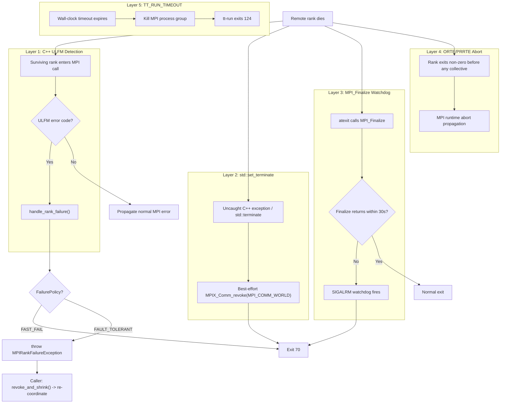
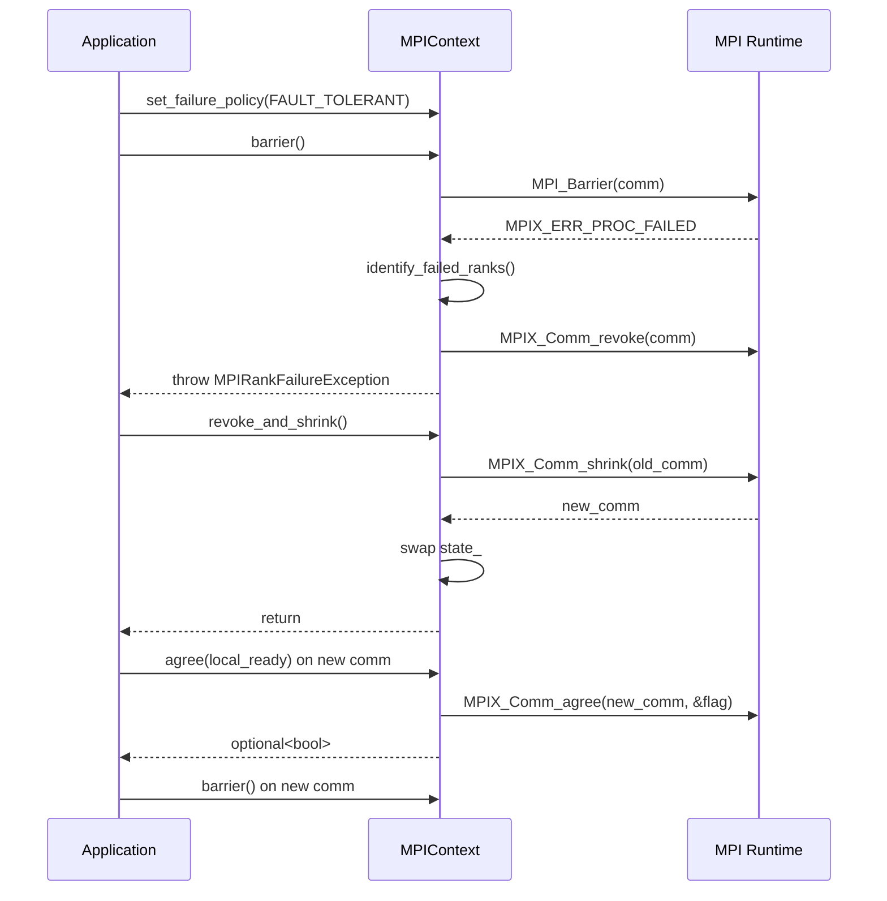

# ULFM Support in tt-metal Multihost

User Level Failure Mitigation (ULFM) lets surviving MPI ranks detect and react
to remote rank failures instead of hanging indefinitely at the next collective.
In this branch, tt-metal layers several mechanisms so that a remote crash turns
into a controlled fast exit or an explicit recovery path rather than a
best-effort CI timeout.

The current stack is:

1. **C++ ULFM detection** - detects rank failure at most `MPIContext` call sites
2. **`std::set_terminate` handler** - catches uncaught C++ failures outside normal MPI returns
3. **`MPI_Finalize` watchdog** - prevents teardown hangs in `atexit`
4. **ORTE/PRRTE abort-on-non-zero** - propagates early process crashes before a collective reports failure
5. **Process-level timeout** - last-resort `TT_RUN_TIMEOUT` backstop
6. **Python mpi4py wrapper** - ULFM handling for Python-level collectives



## How It Works

### Layer 1 - C++ ULFM Error Detection

File: `tt_metal/distributed/multihost/mpi_distributed_context.cpp`

Most `MPIContext` member functions snapshot the current communicator state and
route MPI return codes through `MPI_CHECK_STATE(...)`, which delegates to
`mpi_check_ctx(...)`. When Open MPI returns a ULFM error code
(`MPIX_ERR_PROC_FAILED`, `MPIX_ERR_PROC_FAILED_PENDING`, or
`MPIX_ERR_REVOKED`), `handle_rank_failure()`:

1. Attempts `MPIX_Comm_failure_ack()` and `MPIX_Comm_failure_get_acked()` to
   identify failed world ranks
2. Caches any successfully identified ranks before revoke
3. Marks the communicator locally revoked
4. Calls `MPIX_Comm_revoke()` so blocked survivors unblock
5. Prints a structured diagnostic to stderr
6. Dispatches to the active `FailurePolicy`

Under `FAST_FAIL` (the default), the process calls `_exit(70)` immediately so
it does not run `MPI_Finalize()` on a revoked communicator. Under
`FAULT_TOLERANT`, it throws `MPIRankFailureException` so application code can
coordinate recovery.

Important call-site exceptions:

- `MPIRequest::wait()`, `test()`, and `cancel()` use plain `MPI_CHECK`, not the
  ULFM-aware `mpi_check_ctx(...)` path.
- `MPIContext::abort()` calls `MPI_Abort()` directly.

### Layer 2 - `std::set_terminate` Handler

File: `tt_metal/distributed/multihost/mpi_distributed_context.cpp`

Layer 1 only runs when MPI returns an error code. Non-MPI fatal failures such
as uncaught C++ exceptions, thread-pool exceptions, OOMs, or filesystem errors
can kill one rank without another rank ever seeing an MPI return value.

`init_env()` installs `std::set_terminate(mpi_terminate_handler)`. On an
uncaught C++ exception or explicit `std::terminate()`, the handler:

- best-effort revokes `MPI_COMM_WORLD` when ULFM is compiled in
- prints a structured fatal banner
- calls `_exit(70)`

This is distinct from the watchdog path below: `mpi_terminate_handler()` runs
in normal thread context, so the best-effort `MPIX_Comm_revoke()` is valid
there.

Limitation: exceptions that are caught by pytest, pybind11, or other language
bindings are not "uncaught C++ exceptions", so they will not hit this layer.

### Layer 3 - `MPI_Finalize` Watchdog

File: `tt_metal/distributed/multihost/mpi_distributed_context.cpp`

A common multihost hang pattern is:

1. one rank hits a non-MPI failure
2. the exception is caught during Python/test teardown
3. the process exits normally
4. `atexit` reaches `MPI_Finalize()`
5. `MPI_Finalize()` blocks forever waiting for peers that are dead or nowhere
   near finalize yet

The implementation installs the signal handler once during `init_env()`, then
arms a watchdog only around the `atexit` `MPI_Finalize()` call:

```cpp
struct sigaction sa = {};
sa.sa_handler = mpi_finalize_alarm_handler;
sigaction(SIGALRM, &sa, nullptr);

std::atexit([] {
    AlarmGuard guard(MPI_FINALIZE_TIMEOUT_SECS);
    MPI_Finalize();
});
```

If `MPI_Finalize()` does not return within 30 seconds,
`mpi_finalize_alarm_handler()` writes a short diagnostic and `_exit(70)`.

Unlike the terminate handler, this signal handler does **not** call
`MPIX_Comm_revoke()`: it must remain async-signal-safe.

### Layer 4 - ORTE/PRRTE Abort on Non-Zero Exit

File: `ttnn/ttnn/distributed/ttrun.py`

If a rank crashes before any collective observes the failure, ULFM has nothing
to report yet. In its default multihost configuration, `tt-run` adds the Open
MPI runtime knob that tells the launcher to abort the rest of the job when one
rank exits non-zero:

- Open MPI 4.x: `orte_abort_on_non_zero_status`
- Open MPI 5.x / PRRTE: `prte_abort_on_non_zero_status`

`tt-run` detects the Open MPI major version from `mpirun --version` and falls
back to the `orte_` spelling when detection fails. `--bare` disables this
default multihost bundle.

### Layer 5 - Process-Level Timeout

File: `ttnn/ttnn/distributed/ttrun.py`

Set `TT_RUN_TIMEOUT=<seconds>` in the environment to enable a wall-clock
backstop. `tt-run` calls `proc.wait(timeout=N)` and, if that times out, kills
the MPI process group and exits with code `124`.

This is the last line of defense for cases that do not naturally exit:
infinite loops, non-MPI deadlocks, or ranks stuck in device I/O.

### Layer 6 - Python mpi4py Wrapper

File: `ttnn/ttnn/distributed/mpi_fault.py`

For Python-level MPI usage:

- `install_ulfm_handler(comm)` sets `MPI.ERRORS_RETURN` whenever `mpi4py` is
  available, so MPI errors are returned to Python instead of immediately
  aborting the process.
- `ulfm_guard(comm, operation_name, policy)` catches ULFM error codes when the
  linked `mpi4py` build exposes them.
- `policy="fast_fail"` prints a structured diagnostic, best-effort revokes the
  communicator if `Revoke()` exists, and `os._exit(70)`.
- `policy="fault_tolerant"` raises `MPIRankFailureError` and leaves revoke /
  shrink coordination to the caller.

Degradation behavior is intentionally narrow:

- If `mpi4py` is missing, `install_ulfm_handler()` is a no-op and
  `ulfm_guard()` simply yields.
- If `mpi4py` is present but ULFM-specific methods or error constants are
  missing, `install_ulfm_handler()` still sets `ERRORS_RETURN`, but ULFM-
  specific failed-rank discovery and revoke behavior are unavailable.

## Exit Codes

| Code | Meaning | Produced by |
| --- | --- | --- |
| `70` | ULFM fast-fail / controlled fast exit | `handle_rank_failure()`, `mpi_terminate_handler()`, `mpi_finalize_alarm_handler()`, and Python `_ulfm_fast_fail()` |
| `124` | Wall-clock timeout | `TT_RUN_TIMEOUT` path in `ttnn/ttnn/distributed/ttrun.py` |

`tt-run` interprets exit `70` as a rank-failure fast-fail category and exit
`124` as a launcher timeout. In practice, `70` means "we detected a failure or
teardown hang and chose to exit immediately"; `124` means the outer wall-clock
watchdog fired.

## Switching to Fault-Tolerant Mode

The default `FAST_FAIL` policy is deliberate: it gives CI and tooling a clean,
deterministic shutdown. `FAULT_TOLERANT` is for recovery-aware applications that
want to keep running on a shrunken communicator.



### C++

```cpp
#include "tt_metal/distributed/multihost/mpi_distributed_context.hpp"

using namespace tt::tt_metal::distributed::multihost;

ctx->set_failure_policy(FailurePolicy::FAULT_TOLERANT);

try {
    ctx->barrier();
} catch (const MPIRankFailureException& e) {
    // e.failed_ranks() -> comma-separated world ranks, e.g. "2, 5"
    // e.error_code()   -> raw MPI error code
    // e.rank()         -> detecting rank

    ctx->revoke_and_shrink();  // required before any further MPI ops

    auto agreed = ctx->agree(true);
    if (agreed.has_value() && !agreed.value()) {
        // Survivors disagreed about next-step readiness.
    }

    // ctx now points at a new communicator that excludes dead ranks.
    // Rebuild rank-indexed state before continuing.
}
```

### Python

The example below assumes a ULFM-enabled `mpi4py` build that exposes
`Shrink()`, and optionally `Revoke()`:

```python
from mpi4py import MPI
from ttnn.distributed.mpi_fault import (
    MPIRankFailureError,
    install_ulfm_handler,
    ulfm_guard,
)

comm = MPI.COMM_WORLD
install_ulfm_handler(comm)

try:
    with ulfm_guard(comm, "allreduce", policy="fault_tolerant"):
        comm.Allreduce(sendbuf, recvbuf, op=MPI.SUM)
except MPIRankFailureError as e:
    # e.failed_ranks -> list[int] when rank discovery succeeded
    # e.rank         -> detecting rank
    # e.error_code   -> raw MPI error code
    if hasattr(comm, "Revoke"):
        comm.Revoke()
    new_comm = comm.Shrink()
    # Rebuild data structures against new_comm and continue.
```

### Key points

- `set_failure_policy(FAULT_TOLERANT)` or `policy="fault_tolerant"` must be
  selected before the collective that may fail.
- In C++, `handle_rank_failure()` revokes before it throws. After catching
  `MPIRankFailureException`, you must call `revoke_and_shrink()` before using
  that communicator again.
- In Python, `ulfm_guard(..., policy="fault_tolerant")` raises
  `MPIRankFailureError` but does **not** revoke for you. Recovery coordination
  stays with caller code.
- Shrink creates a new communicator with new rank numbers. Update any
  rank-indexed state accordingly.

## Recovery Invariants and Caveats

The current recovery implementation in
`tt_metal/distributed/multihost/mpi_distributed_context.hpp` has a few
important invariants that application code should understand:

- `snapshot_state()` returns a `shared_ptr<CommunicatorState>` under
  `comm_mutex_`, then MPI entry points release the mutex before entering MPI.
  This keeps old communicator handles alive while `revoke_and_shrink()` swaps in
  a new `state_`.
- That snapshot model guarantees handle lifetime, not transparent concurrent
  recovery. In-flight operations may still complete on the pre-shrink
  communicator or observe `MPIX_ERR_REVOKED`.
- `revoke_and_shrink()` is single-caller by design. `shrink_in_progress_`
  rejects concurrent or re-entrant shrink calls.
- `agree(bool)` wraps `MPIX_Comm_agree()`. It returns the logical AND across
  surviving ranks, and returns `std::nullopt` when ULFM support is unavailable.
- `failed_ranks()` is best-effort. On `MPIX_ERR_REVOKED` paths it may need to
  fall back to cached pre-revoke data, and it can still return an empty set if
  rank identification failed before revoke propagation. The reliable fallback is
  to compare communicator size before and after `revoke_and_shrink()`.
- `is_revoked()` is a local snapshot only. It is set during failure handling and
  cleared after a successful shrink installs a healthy communicator.

## Runtime Requirements

- The C++ fault-tolerant path is compiled only when the Open MPI headers expose
  ULFM extensions. That capability is surfaced by
  `MPIContext::supports_fault_tolerance()`.
- `set_failure_policy(FAULT_TOLERANT)` throws when that C++ ULFM support is not
  present.
- Python helpers require `mpi4py`; full Python revoke / failed-rank / shrink
  behavior additionally requires a ULFM-capable `mpi4py` build.
- `tt-run` prefers `mpirun-ulfm` when it is present on `PATH`, but falls back to
  plain `mpirun` when it is not.
- `tt-run` only appends `--with-ft ulfm` when the selected launcher basename
  contains `ulfm`.
- By default, `tt-run` adds the ORTE/PRRTE abort-on-non-zero MCA parameter so
  launcher-level crash propagation stays enabled. `--bare` disables that
  default bundle.

## Observability and Triage

Branch-specific multihost tooling changes that matter when debugging ULFM
failures:

- `ttnn/ttnn/distributed/ttrun.py` now sets `TT_METAL_LOGS_PATH` to the launch
  directory by default, rank-scopes `TT_METAL_LOGS_PATH` and
  `TT_METAL_JIT_SCRATCH`, and keeps `TT_METAL_CACHE` shared by default.
- `tt_metal/llrt/rtoptions.cpp` caches the MPI rank early and derives the
  effective Inspector RPC port as `base_port + world_rank`, with an overflow
  guard.
- `tt_metal/llrt/rtoptions.cpp` also places Inspector output under a per-rank
  logs root, so post-failure triage can recover the right rank directory.

For the deeper log-path and triage story, see:

- `tt_metal/programming_examples/distributed/README.md`
- `docs/source/tt-metalium/tools/triage.rst`

## Automated Test Coverage

There is an automated ULFM / launcher / triage harness in physical multihost
CI:

- Workflow/job: `.github/workflows/multi-host-physical.yaml` ->
  `tooling-and-mpi-t3k`
- Entry script: `tests/scripts/multihost/run_dual_t3k_tooling_tests.sh`

Current coverage includes:

- `tests/ttnn/distributed/test_ttrun_env_passthrough.py` for launcher env
  propagation and rank-scoped path handling
- `tests/tt_metal/multihost/run_fault_tolerance_tests.sh` for multihost C++
  ULFM recovery tests
- `tests/tt_metal/multihost/run_single_node_ulfm_tests.sh` for the single-node
  control-plane paths: exit `70`, finalize watchdog, terminate handler,
  `agree()`, `failed_ranks()`, `is_revoked()`, and policy switching
- `tests/ttnn/distributed/test_ttrun_exit_codes.py` for exit-code
  interpretation and ORTE/PRRTE selection
- `tests/ttnn/distributed/test_mpi_fault_python.py` for Python ULFM wrapper
  behavior
- `tools/tests/triage/test_parse_inspector_logs_paths.py`,
  `test_multihost_rank_resolution.py`, and
  `test_multihost_rank_resolution_mpi.py` for rank-aware triage path resolution
- `tools/tests/triage/test_triage.py` as a non-blocking integration test when
  Inspector and supporting tooling are available

Current gaps:

- The `tooling-and-mpi-t3k` job is gated by the `multihost_tooling` manual
  workflow input, so it is not yet part of every scheduled multihost run.
- Coverage is strongest for T3K plus targeted single-node synthetic tests, not
  every multihost topology or recovery loop.

## Known Limitations

- `MPIRequest::wait()`, `test()`, and `cancel()` do not go through the same
  ULFM-aware dispatch path as most `MPIContext` member functions.
- A rank that is alive but not exiting will not trigger the ORTE/PRRTE
  non-zero-exit propagation path. Use `TT_RUN_TIMEOUT` as the backstop.
- In Python fault-tolerant mode, missing `Revoke()`, `Get_failed()`, or
  `Shrink()` methods in `mpi4py` limit how much recovery the helper can do.
- `revoke_and_shrink()` is an expensive collective across survivors. Do not put
  it on a hot path.

## Relevant Files

- `tt_metal/distributed/multihost/mpi_distributed_context.hpp`
- `tt_metal/distributed/multihost/mpi_distributed_context.cpp`
- `tt_metal/api/tt-metalium/distributed_context.hpp`
- `ttnn/ttnn/distributed/ttrun.py`
- `ttnn/ttnn/distributed/mpi_fault.py`
- `tt_metal/llrt/rtoptions.hpp`
- `tt_metal/llrt/rtoptions.cpp`
- `tests/scripts/multihost/run_dual_t3k_tooling_tests.sh`
- `tests/tt_metal/multihost/run_single_node_ulfm_tests.sh`

## Additional Manual Validation

### Verify launcher selection and ULFM flags

```bash
# tt-run logs the resolved mpirun command during a real launch.
# If it selected mpirun-ulfm, expect --with-ft ulfm.
# If it fell back to plain mpirun, do not expect that flag automatically.
python ttnn/ttnn/distributed/ttrun.py -n 2 -- python -c "print('hello')"
```

### Test TT_RUN_TIMEOUT

```bash
TT_RUN_TIMEOUT=10 python ttnn/ttnn/distributed/ttrun.py -n 2 -- python -c "import time; time.sleep(999)"
# Expected: tt-run kills the process group and exits 124
echo $?
```

### Simulate a rank crash

```bash
cat > /tmp/crash_rank0.py <<'EOF'
from mpi4py import MPI
import ctypes
import time

rank = MPI.COMM_WORLD.Get_rank()
if rank == 0:
    time.sleep(1)
    ctypes.string_at(0)
else:
    MPI.COMM_WORLD.Barrier()
EOF

python ttnn/ttnn/distributed/ttrun.py -n 2 -- python /tmp/crash_rank0.py
# Expected on a ULFM-capable runtime: surviving rank logs a ULFM diagnostic and exits 70
```
