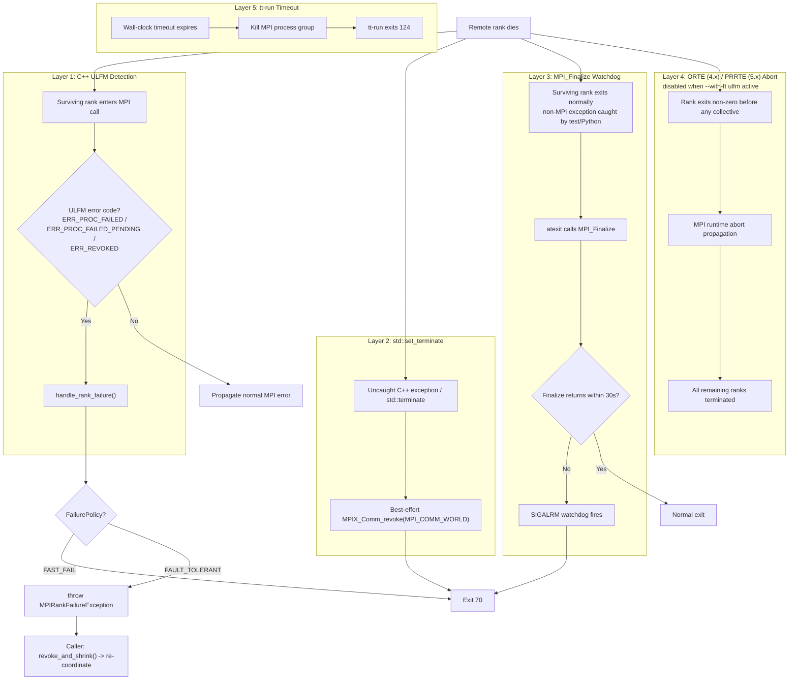
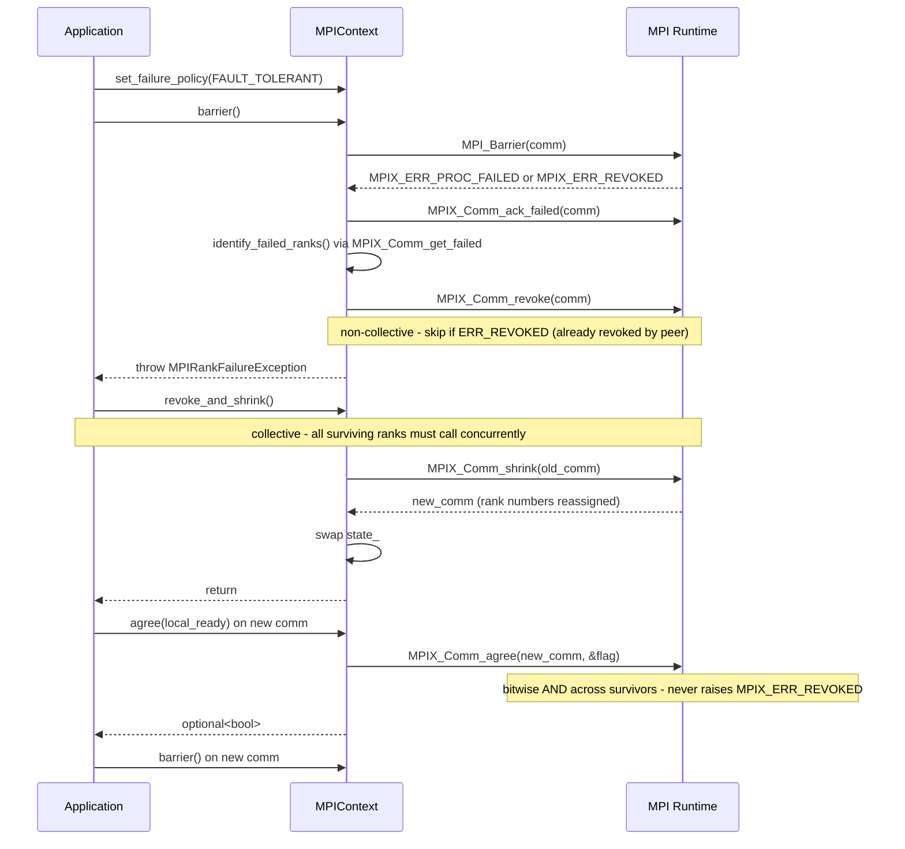

# ULFM Support in tt-metal Multihost

User Level Fault Mitigation (ULFM) lets surviving MPI ranks detect and react
to remote rank failures instead of hanging indefinitely at the next collective.
tt-metal layers several mechanisms so that a remote crash turns into a
controlled fast exit or an explicit recovery path rather than a CI timeout.

Supplemental References:

[OpenMPI Official Docs](https://docs.open-mpi.org/en/v5.0.x/features/ulfm.html)

[Implicit Actions and Non-blocking Failure Recovery with MPI](https://arxiv.org/pdf/2212.08755)

The current stack is:

1. **C++ ULFM detection** - detects rank failure at most `MPIContext` call sites
2. **`std::set_terminate` handler** - catches uncaught C++ failures outside normal MPI returns
3. **[`MPI_Finalize`](https://docs.open-mpi.org/en/v5.0.x/man-openmpi/man3/MPI_Finalize.3.html) watchdog** - prevents teardown hangs in `atexit`
4. **ORTE/PRRTE abort-on-non-zero** - propagates early process crashes before a collective reports failure
5. **Process-level timeout** - last-resort `--timeout <seconds>` backstop
6. **Python mpi4py wrapper** - ULFM handling for Python-level collectives

This also adds structured diagnostic emission in
`tt_metal/distributed/multihost/mpi_failure_diagnostics.{hpp,cpp}` and a CI
wrapper in `tests/scripts/multihost/ulfm_github_workflow_wrappers.sh` that
promotes those diagnostics to GitHub Actions annotations.



## How It Works

### Layer 1 - C++ ULFM Error Detection

File: `tt_metal/distributed/multihost/mpi_distributed_context.cpp`

Most `MPIContext` member functions snapshot the current communicator state and
route MPI return codes through `MPI_CHECK_STATE(...)`, which delegates to
`mpi_check_ctx(...)`. When Open MPI returns a ULFM error code
(`MPIX_ERR_PROC_FAILED`, `MPIX_ERR_PROC_FAILED_PENDING`, or
`MPIX_ERR_REVOKED`), `handle_rank_failure()`:

1. Attempts [`MPIX_Comm_ack_failed()`](https://docs.open-mpi.org/en/v5.0.x/man-openmpi/man3/MPIX_Comm_ack_failed.3.html) and [`MPIX_Comm_get_failed()`](https://docs.open-mpi.org/en/v5.0.x/man-openmpi/man3/MPIX_Comm_get_failed.3.html) to
   identify failed world ranks
2. Caches any successfully identified ranks before revoke
3. Marks the communicator locally revoked
4. Calls [`MPIX_Comm_revoke()`](https://docs.open-mpi.org/en/v5.0.x/man-openmpi/man3/MPIX_Comm_revoke.3.html) so blocked survivors unblock
5. Prints a structured diagnostic to stderr
6. Dispatches to the active `FailurePolicy`

Under `FAST_FAIL` (the default), the process calls `_exit(70)` immediately so
it does not run [`MPI_Finalize()`](https://docs.open-mpi.org/en/v5.0.x/man-openmpi/man3/MPI_Finalize.3.html) on a revoked communicator. Under
`FAULT_TOLERANT`, it throws `MPIRankFailureException` so application code can
coordinate recovery.

Important call-site exceptions:

- `MPIContext::abort()` calls [`MPI_Abort()`](https://docs.open-mpi.org/en/v5.0.x/man-openmpi/man3/MPI_Abort.3.html) directly.

Non-blocking completions: `MPIRequest::wait()`, `test()`, and `cancel()` route
return codes through the same `mpi_check_ctx(...)` path as other `MPIContext`
operations. Each request captures an `MPIRequestCommSnapshot` at post time so
revocation targets the communicator the operation used (not a later shrunk
communicator). If the owning `MPIContext` has been destroyed, the code falls
back to plain `mpi_check(...)`.

### Process-wide side effects (embedding)

`init_env()` configures **global process behavior**: `std::set_terminate`,
`sigaction(SIGALRM, ...)`, and an `atexit` handler that arms `alarm(2)` around
[`MPI_Finalize`](https://docs.open-mpi.org/en/v5.0.x/man-openmpi/man3/MPI_Finalize.3.html). Embedding tt-metal MPI in a larger host that relies on its own
terminate handler, `SIGALRM`, or `alarm` semantics may require coordination or
avoiding `MPIContext::create` in that process.

### Layer 2 - `std::set_terminate` Handler

File: `tt_metal/distributed/multihost/mpi_distributed_context.cpp`

Layer 1 only runs when MPI returns an error code. Non-MPI fatal failures such
as uncaught C++ exceptions, thread-pool exceptions, OOMs, or filesystem errors
can kill one rank without another rank ever seeing an MPI return value.

`init_env()` installs `std::set_terminate(mpi_terminate_handler)`. On an
uncaught C++ exception or explicit `std::terminate()`, the handler:

- best-effort revokes `MPI_COMM_WORLD` when ULFM is compiled in
- prints a structured fatal banner
- calls `_exit(70)`

This is distinct from the watchdog path below: `mpi_terminate_handler()` runs
in normal thread context, so the best-effort [`MPIX_Comm_revoke()`](https://docs.open-mpi.org/en/v5.0.x/man-openmpi/man3/MPIX_Comm_revoke.3.html) is valid
there.

Limitation: exceptions that are caught by pytest, pybind11, or other language
bindings are not "uncaught C++ exceptions", so they will not hit this layer.

The same applies to **GoogleTest**: by default it catches test-body exceptions, so
`TT_FATAL` and other throws from test code never reach `std::terminate` and will
not trigger `mpi_terminate_handler`.

### Layer 3 - [`MPI_Finalize`](https://docs.open-mpi.org/en/v5.0.x/man-openmpi/man3/MPI_Finalize.3.html) Watchdog

File: `tt_metal/distributed/multihost/mpi_distributed_context.cpp`

A common multihost hang pattern is:

1. one rank hits a non-MPI failure
2. the exception is caught during Python/test teardown
3. the process exits normally
4. `atexit` reaches [`MPI_Finalize()`](https://docs.open-mpi.org/en/v5.0.x/man-openmpi/man3/MPI_Finalize.3.html)
5. [`MPI_Finalize()`](https://docs.open-mpi.org/en/v5.0.x/man-openmpi/man3/MPI_Finalize.3.html) blocks forever waiting for peers that are dead or nowhere
   near finalize yet

The implementation installs the signal handler once during `init_env()`, then
arms a watchdog only around the `atexit` [`MPI_Finalize()`](https://docs.open-mpi.org/en/v5.0.x/man-openmpi/man3/MPI_Finalize.3.html) call:

```cpp
struct sigaction sa = {};
sa.sa_handler = mpi_finalize_alarm_handler;
sigaction(SIGALRM, &sa, nullptr);

std::atexit([] {
    AlarmGuard guard(MPI_FINALIZE_TIMEOUT_SECS);
    MPI_Finalize();
});
```

If [`MPI_Finalize()`](https://docs.open-mpi.org/en/v5.0.x/man-openmpi/man3/MPI_Finalize.3.html) does not return within 30 seconds,
`mpi_finalize_alarm_handler()` writes a short diagnostic and `_exit(70)`.

Unlike the terminate handler, this signal handler does **not** call
[`MPIX_Comm_revoke()`](https://docs.open-mpi.org/en/v5.0.x/man-openmpi/man3/MPIX_Comm_revoke.3.html): it must remain async-signal-safe.

### Layer 4 - ORTE (4.x) / PRRTE (5.x) Abort on Non-Zero Exit

File: `ttnn/ttnn/distributed/ttrun.py`

If a rank crashes before any collective observes the failure, ULFM has nothing
to report yet. In its default multihost configuration, `tt-run` adds the Open
MPI runtime knob that tells the launcher to abort the rest of the job when one
rank exits non-zero:

- Open MPI 4.x (ORTE): `orte_abort_on_non_zero_status`
- Open MPI 5.x (PRRTE): `prte_abort_non_zero_exit`

`tt-run` detects the Open MPI major version from `mpirun --version` and falls
back to the `orte_` spelling when detection fails. `--bare` disables this
default multihost bundle.

### Layer 5 - Process-Level Timeout (`--timeout`)

File: `ttnn/ttnn/distributed/ttrun.py`

Pass `--timeout <seconds>` to `tt-run` to enable a wall-clock backstop.
`tt-run` calls `proc.wait(timeout=N)` and, if that times out, kills the MPI
process group and exits with code `124`.

This is the last line of defense for cases that do not naturally exit:
infinite loops, non-MPI deadlocks, or ranks stuck in device I/O.

### Layer 6 - Python mpi4py Wrapper

File: `ttnn/ttnn/distributed/mpi_fault.py`

For Python-level MPI usage:

- `install_ulfm_handler(comm=None)` sets `MPI.ERRORS_RETURN` on the provided
  communicator, defaulting to `MPI.COMM_WORLD`, whenever `mpi4py` is available
  so MPI errors are returned to Python instead of immediately aborting the
  process.
- `ulfm_guard(comm, operation_name="collective", policy=UlfmFailurePolicy.FAST_FAIL)`
  catches ULFM error codes when the linked `mpi4py` build exposes them. The
  `policy` argument is a `UlfmFailurePolicy` enum value, not a string.
- `UlfmFailurePolicy.FAST_FAIL` prints a structured diagnostic, best-effort revokes the
  communicator if `Revoke()` exists, and `os._exit(70)`.
- `UlfmFailurePolicy.FAULT_TOLERANT` raises `MPIRankFailureError` and leaves revoke /
  shrink coordination to the caller.

Degradation behavior is intentionally narrow:

- If `mpi4py` is missing, `install_ulfm_handler()` is a no-op and
  `ulfm_guard()` simply yields.
- If `mpi4py` is present but ULFM-specific methods or error constants are
  missing, `install_ulfm_handler()` still sets `ERRORS_RETURN`, but
  `ulfm_guard()` re-raises the raw `MPI.Exception` instead of translating it to
  `MPIRankFailureError`; ULFM-specific failed-rank discovery and revoke
  behavior are unavailable.

## Exit Codes

| Code | Meaning | Produced by |
| --- | --- | --- |
| `70` | ULFM fast-fail / controlled fast exit | `handle_rank_failure()`, `mpi_terminate_handler()`, `mpi_finalize_alarm_handler()`, and Python `_ulfm_fast_fail()` |
| `124` | Wall-clock timeout | `--timeout <seconds>` path in `ttnn/ttnn/distributed/ttrun.py` |

`tt-run` interprets exit `70` as a rank-failure fast-fail category and exit
`124` as a launcher timeout. In practice, `70` means "we detected a failure or
teardown hang and chose to exit immediately"; `124` means the outer wall-clock
watchdog fired.

Exit code `70` (`EX_SOFTWARE`) is borrowed from BSD `sysexits.h`, where it is
defined as "an internal software error has been detected". It was chosen here
because it is distinctive enough to be unambiguous in CI logs yet universally
recognized as a software-level failure — unlike arbitrary numbers it has a
documented meaning outside this codebase.

## Switching to Fault-Tolerant Mode

The default `FAST_FAIL` policy is deliberate: it gives CI and tooling a clean,
deterministic shutdown. `FAULT_TOLERANT` is for recovery-aware applications that
want to keep running on a shrunken communicator.



### C++

```cpp
#include "tt_metal/distributed/multihost/mpi_distributed_context.hpp"

using namespace tt::tt_metal::distributed::multihost;

ctx->set_failure_policy(FailurePolicy::FAULT_TOLERANT);

try {
    ctx->barrier();
} catch (const MPIRankFailureException& e) {
    // e.failed_ranks() -> comma-separated world ranks, e.g. "2, 5"
    // e.error_code()   -> raw MPI error code
    // e.rank()         -> detecting rank

    ctx->revoke_and_shrink();  // required before any further MPI ops

    auto agreed = ctx->agree(true);
    if (agreed.has_value() && !agreed.value()) {
        // Survivors disagreed about next-step readiness.
    }

    // ctx now points at a new communicator that excludes dead ranks.
    // Rebuild rank-indexed state before continuing.
}
```

### Python

The example below assumes a ULFM-enabled `mpi4py` build that exposes
`Shrink()`, and ideally `Revoke()` / `Get_failed()`:

```python
from mpi4py import MPI
from ttnn.distributed.mpi_fault import (
    MPIRankFailureError,
    UlfmFailurePolicy,
    install_ulfm_handler,
    ulfm_guard,
)

comm = MPI.COMM_WORLD
install_ulfm_handler(comm)

try:
    with ulfm_guard(comm, "allreduce", policy=UlfmFailurePolicy.FAULT_TOLERANT):
        comm.Allreduce(sendbuf, recvbuf, op=MPI.SUM)
except MPIRankFailureError as e:
    # e.failed_ranks -> list[int] when rank discovery succeeded
    # e.rank         -> detecting rank
    # e.error_code   -> raw MPI error code
    if hasattr(comm, "Revoke"):
        comm.Revoke()
    new_comm = comm.Shrink()
    # Rebuild data structures against new_comm and continue.
```

### Key points

- `set_failure_policy(FAULT_TOLERANT)` or
  `policy=UlfmFailurePolicy.FAULT_TOLERANT` must be selected before the
  collective that may fail. In Python, `policy` is an enum value, not
  `"fault_tolerant"`.
- In C++, `handle_rank_failure()` revokes before it throws. After catching
  `MPIRankFailureException`, you must call `revoke_and_shrink()` before using
  that communicator again.
- In Python, `ulfm_guard(..., policy=UlfmFailurePolicy.FAULT_TOLERANT)` raises
  `MPIRankFailureError` but does **not** revoke for you. Recovery coordination
  stays with caller code.
- Shrink creates a new communicator with new rank numbers. Update any
  rank-indexed state accordingly.

## Recovery Invariants and Caveats

The current recovery implementation in
`tt_metal/distributed/multihost/mpi_distributed_context.hpp` has a few
important invariants that application code should understand:

- `snapshot_state()` returns a `shared_ptr<CommunicatorState>` under
  `comm_mutex_`, then MPI entry points release the mutex before entering MPI.
  This keeps old communicator handles alive while `revoke_and_shrink()` swaps in
  a new `state_`.
- That snapshot model guarantees handle lifetime, not transparent concurrent
  recovery. In-flight operations may still complete on the pre-shrink
  communicator or observe `MPIX_ERR_REVOKED`.
- `revoke_and_shrink()` is single-caller by design. `shrink_in_progress_`
  rejects concurrent or re-entrant shrink calls.
- `agree(bool)` wraps [`MPIX_Comm_agree()`](https://docs.open-mpi.org/en/v5.0.x/man-openmpi/man3/MPIX_Comm_agree.3.html). It performs a *bitwise AND* across
  surviving ranks (not a logical AND — passing `1` from all survivors yields `1`,
  but mixed `1`/`0` inputs produce `0`). Returns `std::nullopt` when ULFM
  support is unavailable. Note: [`MPIX_Comm_agree`](https://docs.open-mpi.org/en/v5.0.x/man-openmpi/man3/MPIX_Comm_agree.3.html) never raises
  `MPIX_ERR_REVOKED`, even on a revoked communicator — it is safe to call
  directly after catching `MPIX_ERR_REVOKED`.
- `failed_ranks()` is best-effort. On `MPIX_ERR_REVOKED` paths it may need to
  fall back to cached pre-revoke data, and it can still return an empty set if
  rank identification failed before revoke propagation. The reliable fallback is
  to compare communicator size before and after `revoke_and_shrink()`.
- `is_revoked()` is a local snapshot only. It is set during failure handling and
  cleared after a successful shrink installs a healthy communicator.

## Runtime Requirements

- The C++ fault-tolerant path is compiled only when the Open MPI headers expose
  ULFM extensions. This branch centralizes that probe in
  `tt_metal/distributed/multihost/mpi_ulfm_config.hpp` as `OMPI_HAS_ULFM`, and
  surfaces the result at runtime via `MPIContext::supports_fault_tolerance()`.
- `set_failure_policy(FAULT_TOLERANT)` throws when that C++ ULFM support is not
  present.
- Python helpers require `mpi4py`; full Python revoke / failed-rank / shrink
  behavior additionally requires a ULFM-capable `mpi4py` build.
- `tt-run` prefers `mpirun-ulfm` when it is present on `PATH`, but falls back to
  plain `mpirun` when it is not.
- `tt-run` only appends `--with-ft ulfm` when the selected launcher basename
  contains `ulfm`. However, `--with-ft ulfm` is a valid flag for any OpenMPI
  5.x `mpirun` binary, not only the `mpirun-ulfm` wrapper — the wrapper is
  simply a convenience that pre-selects ULFM.
- By default, `tt-run` adds the ORTE (4.x) / PRRTE (5.x) abort-on-non-zero MCA
  parameter so launcher-level crash propagation stays enabled. `--bare` disables
  that default bundle.
- **Transport constraint**: OpenMPI ULFM requires the `ob1` PML (point-to-point
  messaging layer). The default `ucx` PML does not support ULFM. Pass
  `--mca pml ob1` (or equivalent MCA config) when launching with ULFM; omitting
  this on UCX-default builds silently disables fault tolerance.
- **Failure detection latency**: The time between a rank crash and a surviving
  rank observing a ULFM error code is governed by heartbeat / keepalive MCA
  parameters. Key knobs:
  - `mpi_keepalive_timeout` (seconds, default 20) — heartbeat timeout before
    marking a peer failed
  - `oob_tcp_keepalive_time`, `oob_tcp_keepalive_intvl`,
    `oob_tcp_keepalive_probes` — TCP-level keepalive tuning for the OOB channel
  Lower these for faster detection in test environments; raise them on lossy
  networks to avoid false positives.

## Observability and Triage

Multihost tooling changes that matter when debugging ULFM failures:

- `ttnn/ttnn/distributed/ttrun.py` sets `TT_METAL_LOGS_PATH` to the launch
  directory by default, provides a default `TT_METAL_JIT_SCRATCH`, and keeps
  `TT_METAL_CACHE` shared by default.
- [FUTURE] Rank-scoping `TT_METAL_LOGS_PATH` and `TT_METAL_JIT_SCRATCH` via
  `<hostname>_rank_<N>` exists in helper/test code, but it is currently
  disabled behind `ENABLE_RANK_SCOPED_ENV_VARS = False`.
- `tt_metal/distributed/multihost/mpi_failure_diagnostics.cpp` emits stable
  one-line `ULFM detected a rank failure; ...` records for remote ULFM
  failures, local `std::terminate`, and the [`MPI_Finalize`](https://docs.open-mpi.org/en/v5.0.x/man-openmpi/man3/MPI_Finalize.3.html) watchdog. These are
  the structured fields that the shell smoke tests and CI grep for.
- `tests/scripts/multihost/ulfm_github_workflow_wrappers.sh` promotes those
  structured lines to GitHub Actions annotations: `policy=fast_fail` becomes
  `::error`; `policy=fault_tolerant` becomes `::warning`.
- Hostname attribution: diagnostics prefer
  `RUNNER_NAME` over generic container names, and the changed multihost
  workflows no longer force Docker `--hostname=mpirun-host`, which helps
  preserve real host identity in logs and annotations.

## Automated Test Coverage

There is an automated ULFM / launcher / annotation harness in physical
multihost CI:

- Workflow/job: `.github/workflows/multi-host-physical.yaml` ->
  `tooling-and-mpi-t3k`
- Entry script: `tests/scripts/multihost/run_dual_t3k_tooling_tests.sh`

Current coverage includes:

- `tests/ttnn/distributed/test_ttrun_env_passthrough.py` for launcher env
  propagation, default `TT_METAL_LOGS_PATH` / `TT_METAL_JIT_SCRATCH` setup,
  and shared `TT_METAL_CACHE` behavior
- [FUTURE] The same file also contains rank-scoped path assertions, but those
  cases are currently gated/skipped while `ENABLE_RANK_SCOPED_ENV_VARS`
  remains false in this carveout
- `tests/tt_metal/multihost/run_multihost_ulfm_annotation_tests.sh` for multihost
  structured diagnostic smoke tests, including FAST_FAIL `::error` and
  FAULT_TOLERANT `::warning` annotation paths
- `tests/tt_metal/multihost/run_fault_tolerance_tests.sh` for the selected
  multihost C++ ULFM recovery filters run under `mpirun`
- `tests/tt_metal/multihost/run_single_node_ulfm_tests.sh` for the single-node
  control-plane paths: exit `70`, structured FAST_FAIL diagnostics,
  finalize watchdog, terminate handler, `agree()`, `failed_ranks()`,
  `is_revoked()`, and policy switching
- `tests/ttnn/distributed/test_ttrun_exit_codes.py` for exit-code
  interpretation and ORTE/PRRTE selection
- `tests/ttnn/distributed/test_mpi_fault_python.py` for Python ULFM wrapper
  behavior

Current gaps:

- The `tooling-and-mpi-t3k` job is gated by the `multihost_tooling` manual
  workflow input, so it is not yet part of every scheduled multihost run.
- `run_fault_tolerance_tests.sh` intentionally runs a targeted subset of the
  `ulfm_tests.cpp` surface; the rest of the control-plane coverage is split
  into `run_single_node_ulfm_tests.sh`.
- Coverage is strongest for T3K plus targeted single-node synthetic tests, not
  every multihost topology or recovery loop.

## Known Limitations

- Multihost jobs that use GoogleTest with MPI must pass **`--gtest_catch_exceptions=0`**
  (or set the equivalent environment variable) so one rank cannot continue after a
  C++ exception while others block in collectives. The shared launch flags live in
  `tests/scripts/multihost/multihost_gtest_env.sh`, sourced by
  `run_dual_galaxy_tests.sh`, `run_dual_t3k_tests.sh`, `run_quad_bh_lb_tests.sh`,
  `run_dual_bh_lb_tests.sh`, and `run_quad_galaxy_tests.sh`.
- `MPIRequest::wait()`, `test()`, and `cancel()` use the ULFM-aware dispatch
  path only while their owning `MPIContext` is still alive. If `owner_.lock()`
  fails, they fall back to plain `mpi_check(...)`.
- A rank that is alive but not exiting will not trigger the ORTE/PRRTE
  non-zero-exit propagation path. Use `--timeout <seconds>` as the backstop.
- In Python fault-tolerant mode, missing `Revoke()`, `Get_failed()`, or
  `Shrink()` methods in `mpi4py` limit how much recovery the helper can do.
  ULFM-capable `mpi4py` builds also expose `Ack_failed()` (maps to
  [`MPIX_Comm_ack_failed`](https://docs.open-mpi.org/en/v5.0.x/man-openmpi/man3/MPIX_Comm_ack_failed.3.html)) which can be called before `Get_failed()` to ensure
  pending failures are acknowledged before querying the failed group.
- `revoke_and_shrink()` is an expensive collective across survivors. Do not put
  it on a hot path.
