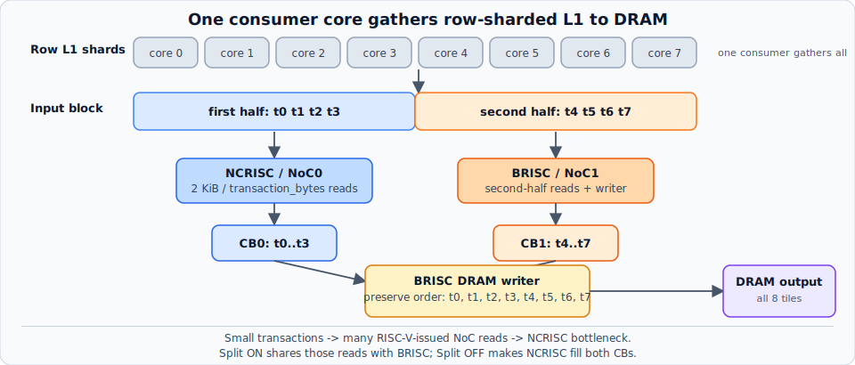

# split_reader



**Trick:** when a *single* data-movement RISC-V is the bottleneck because it is saturated **issuing**
NoC read transactions, split those independent reads between NCRISC and BRISC so the issue work runs
in parallel. In this example the existing BRISC writer also reads half of each block before writing
the unchanged tensor to DRAM.

Consider this pattern once you have measured that one reader RISC-V is issue-bound — it is on the
critical path and its time goes to issuing NoC commands — the reads partition without changing data
dependencies or order, and the other data-movement RISC-V has spare capacity. It is *not* a general
"make reads faster" trick: it does nothing unless a data-movement RISC-V is itself the bottleneck,
so confirm you are RISC-V-issue-bound first. Small transactions, row-sharded L1 input, and the
copy-only workload are just what make that bottleneck easy to create and isolate here.

**Op:** `row_gather_copy(input, split_reader=False|True, num_cores=N, block_tiles=B,
transaction_bytes=T)` — one consumer core gathers a tensor height-sharded across an L1 source row
and copies it to DRAM with the same shape, values, and tile order.

## Data path

Sources are logical cores `(0,0)..(N-1,0)` and the only consumer is `(0,1)`. With the default
`block_tiles=8`, every streaming block is handled as follows:

```text
row-sharded L1 block: [t0 t1 t2 t3 | t4 t5 t6 t7]

split off:
  NCRISC reads t0..t7 -> CB0/CB1
  BRISC writes        -> DRAM [t0 t1 t2 t3 t4 t5 t6 t7]

split on:
  NCRISC reads t0..t3 -> CB0
  BRISC  reads t4..t7 -> CB1
  BRISC writes        -> DRAM [t0 t1 t2 t3 t4 t5 t6 t7]
```

The blocks only bound buffering and assign read work. They do not transform the output. There is
no shuffle, interleave, accumulation, or Tensix compute kernel.

## RISC-V bottleneck signal

`transaction_bytes` is the knob this example uses to *manufacture* a RISC-V-issue bottleneck — it is
not the point of the optimization. It controls how many NoC reads reconstruct each 2 KiB tile, and
must be a multiple of 16 and divide 2,048. At the default 64 B, 8 source cores with 8 tiles each
issue:

```text
64 gathered tiles * 32 transactions/tile = 2,048 NoC reads/launch
```

The transferred bytes never change. Smaller transactions increase the number of NoC commands that
NCRISC must issue. The primary signal is therefore the NCRISC kernel lifetime: it grows as the read
count grows even though the payload is fixed. Once that RISC-V becomes the bottleneck, split mode
lets BRISC issue half of those reads concurrently. Larger transactions remove most of that RISC-V
issue work, so the fixed writer and data-transfer work dominate and the split-reader gain shrinks.
Both modes read the same tensor and perform the same original-order DRAM writes.

## Measured result

Wormhole B0, 8 source cores, 8 tiles/source, 8 tiles/block, 5 warmup + 20 timed launches per point:

```text
 transaction  NoC reads   off NCRISC   on NCRISC   on BRISC  off device  on device   speedup
       32 B       4096     146303.2     74854.8    84739.8    147427.2    84767.1     1.74x
       64 B       2048      82415.9     43319.5    50895.2     83488.8    50925.7     1.64x
      128 B       1024      50434.9     29264.6    34809.9     51507.7    34837.6     1.48x
      256 B        512      34802.6     21928.8    26396.8     35836.3    26434.4     1.36x
      512 B        256      27276.9     18553.7    22523.0     28317.8    22563.5     1.26x
     1024 B        128      24350.0     17314.9    21121.6     25385.4    21163.8     1.20x
     2048 B         64      24051.2     17008.3    20740.8     25085.1    20787.0     1.21x
```

All times are ns/op. `off NCRISC` is the direct signal for the single-RISC read bottleneck: it
rises from 24.1 us to 146.3 us as the read count for the same 128 KiB payload grows from 64 to 4,096.
At 4,096 reads, split mode distributes that work across NCRISC and BRISC and reduces device time
from 147.4 us to 84.8 us. Per-RISC profiler values are kernel lifetimes, so they include NoC
barriers and CB waits rather than representing instruction-level utilization.

See [`report.md`](report.md) for the measurement stamp.

## Run it

```bash
python -m ttnn.operations.examples.split_reader \
  --cores 8 --tiles-per-core 8 --block-tiles 8 \
  --transaction-bytes 32 64 128 256 512 1024 2048 --iters 20
```

Pass one transaction size for a single comparison or several for a sweep. `--block-tiles` must be
even, at least four, and divide the total gathered tile count.

```bash
scripts/run_safe_pytest.sh --run-all \
  tests/ttnn/unit_tests/operations/examples/test_split_reader.py::test_split_reader_correctness

scripts/run_safe_pytest.sh --run-all \
  tests/ttnn/unit_tests/operations/examples/test_split_reader.py::test_split_reader_device_perf
```
